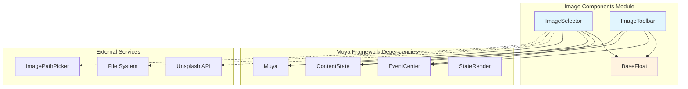
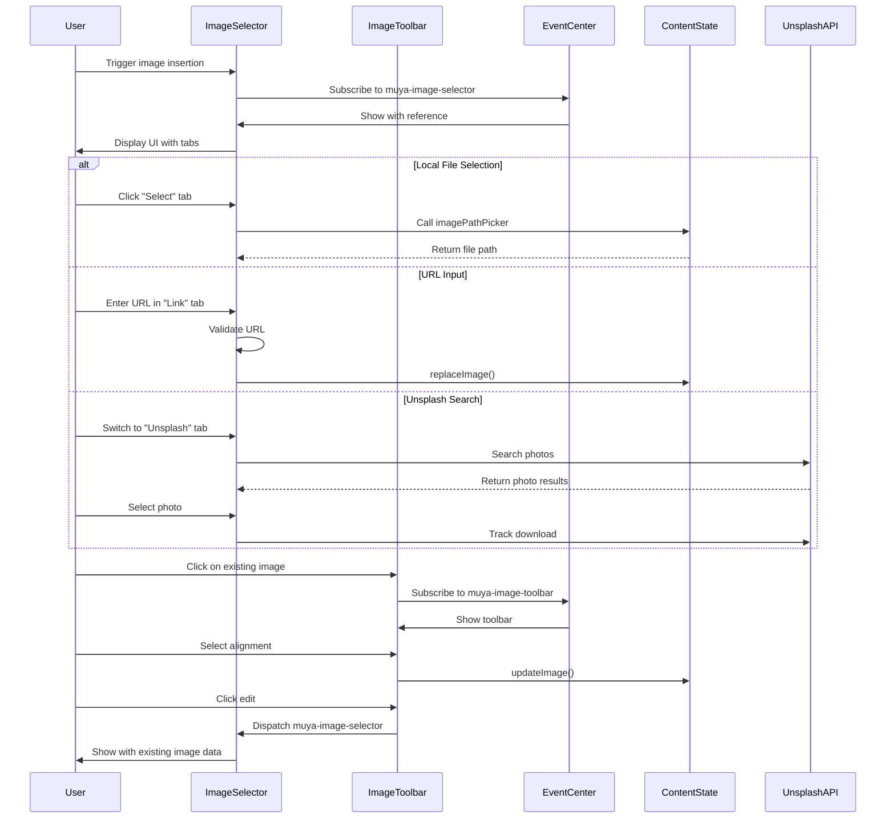
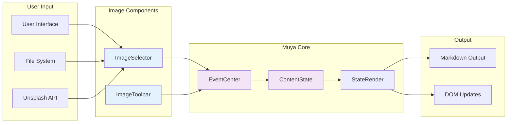

# Image Components Module Documentation

## Introduction

The image_components module is a specialized UI component system within the Muya framework that provides comprehensive image management functionality for markdown editing. This module handles image selection, insertion, editing, and formatting through two primary components: ImageSelector and ImageToolbar. It integrates with external services like Unsplash for stock photos and provides local file system integration for a complete image workflow solution.

## Architecture Overview

The image_components module operates as part of the larger Muya UI ecosystem, providing specialized image handling capabilities that integrate seamlessly with the content state management and event handling systems.



## Core Components

### ImageSelector

The ImageSelector is a floating UI component that provides a comprehensive interface for image selection and configuration. It extends the BaseFloat component and offers three distinct modes of operation:

- **Local File Selection**: Integration with file system APIs for selecting local images
- **URL/Link Input**: Manual entry of web image URLs with validation and autocomplete
- **Unsplash Integration**: Built-in stock photo search and selection from Unsplash API

#### Key Features

- **Multi-tab Interface**: Organized selection methods in separate tabs
- **Image Metadata Management**: Support for alt text, titles, and alignment settings
- **Path Autocompletion**: Intelligent local file path suggestions
- **Real-time Validation**: URL validation and image format checking
- **Loading States**: Asynchronous operation handling with visual feedback

#### State Management

The ImageSelector maintains several key state properties:

```javascript
{
  alt: '',      // Alternative text for accessibility
  src: '',      // Image source URL or path
  title: '',    // Image title attribute
  tab: 'link',  // Active selection mode
  isFullMode: false  // UI complexity toggle
}
```

### ImageToolbar

The ImageToolbar provides contextual image manipulation options when users interact with existing images in the document. It appears as a floating toolbar above selected images and offers quick access to common image operations.

#### Key Features

- **Alignment Control**: Inline, left, center, and right alignment options
- **Image Editing**: Quick access to ImageSelector for modifying image properties
- **Image Deletion**: Safe removal of images from content
- **Visual Feedback**: Active state indication for current alignment settings
- **Responsive Positioning**: Automatic positioning relative to image element

#### Toolbar Actions

The toolbar supports four primary actions through icon-based interface:

- **Delete**: Removes image from document content
- **Edit**: Opens ImageSelector for property modification
- **Alignment**: Sets image positioning (inline, left, center, right)

## Component Interactions



## Data Flow Architecture



## Integration Points

### Event System Integration

The image_components module heavily relies on the Muya event system for communication:

- **muya-image-selector**: Triggers ImageSelector display with image context
- **muya-image-toolbar**: Controls ImageToolbar visibility and positioning
- **muya-image-picker**: Manages path autocompletion dropdown
- **muya-transformer**: Coordinates with image transformation tools
- **stateChange**: Notifies content state modifications

### Content State Integration

Both components interact with the ContentState system for persistent image management:

- **replaceImage()**: Updates existing image tokens with new properties
- **deleteImage()**: Removes image tokens from document structure
- **updateImage()**: Modifies specific image attributes (alignment, etc.)

### External Service Integration

#### Unsplash API

The ImageSelector integrates with Unsplash for stock photography:

```javascript
// API client initialization
this.unsplash = createApi({
  accessKey: unsplashAccessKey
})

// Photo search and retrieval
this.unsplash.photos.list({ perPage: 40 })
this.unsplash.search.getPhotos({ query, page: 1, perPage: 40 })
```

#### File System Integration

Local image selection requires external file system APIs:

```javascript
// Path picker integration
if (this.muya.options.imagePathPicker) {
  const path = await this.muya.options.imagePathPicker()
}

// Path autocompletion
const list = await this.muya.options.imagePathAutoComplete(value)
```

## Configuration Options

The image_components module accepts several configuration options:

```javascript
{
  // Unsplash API access for stock photos
  unsplashAccessKey: string,
  
  // Custom photo creator click handler
  photoCreatorClick: function,
  
  // Image processing action (upload, copy, etc.)
  imageAction: async function(src, id, alt),
  
  // File system integration
  imagePathPicker: async function(),
  imagePathAutoComplete: async function(value)
}
```

## Styling and Theming

Both components include dedicated CSS files for visual styling:

- **ImageSelector**: `index.css` - Tabbed interface, photo grid, loading states
- **ImageToolbar**: `index.css` - Icon-based toolbar with hover states

The components integrate with the broader Muya theming system through CSS class inheritance and variable usage.

## Error Handling

The module implements comprehensive error handling:

- **API Failures**: Graceful degradation when Unsplash API is unavailable
- **Validation Errors**: URL validation and image format checking
- **File System Errors**: Handling of file picker cancellations and permissions
- **Async Operation Errors**: Try-catch blocks around image processing operations

## Performance Considerations

- **Lazy Loading**: Unsplash photos loaded only when tab is active
- **Debounced Search**: Keyup events debounced for search operations
- **Virtual Scrolling**: Efficient rendering of large photo lists
- **Memory Management**: Proper cleanup of event listeners and DOM references

## Dependencies

The image_components module depends on several other Muya modules:

- **[base_components](base_components.md)**: BaseFloat for floating UI behavior
- **[muya_content](muya_content.md)**: ContentState for image token management
- **[muya_events](muya_events.md)**: EventCenter for component communication
- **[muya_parser](muya_parser.md)**: Snabbdom for virtual DOM rendering
- **[muya_ui_components](muya_ui_components.md)**: ImagePathPicker for path completion

## Usage Examples

### Basic Image Insertion

```javascript
// Trigger image selector
muya.eventCenter.dispatch('muya-image-selector', {
  reference: element,
  imageInfo: null,
  cb: () => {}
})
```

### Image Toolbar Display

```javascript
// Show toolbar for existing image
muya.eventCenter.dispatch('muya-image-toolbar', {
  reference: imageElement,
  imageInfo: imageToken
})
```

### Configuration with Unsplash

```javascript
const muya = new Muya({
  unsplashAccessKey: 'your-access-key',
  imageAction: async (src, id, alt) => {
    // Process and return new image URL
    return processedImageUrl
  }
})
```

This comprehensive documentation provides developers with a complete understanding of the image_components module's architecture, functionality, and integration points within the broader Muya framework ecosystem.