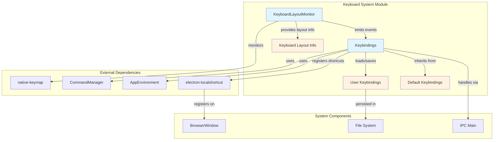
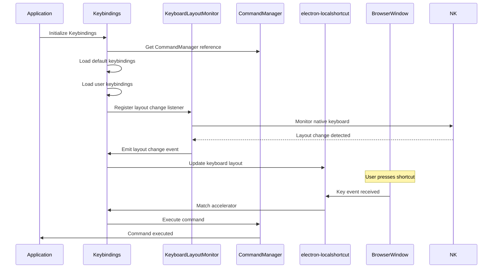
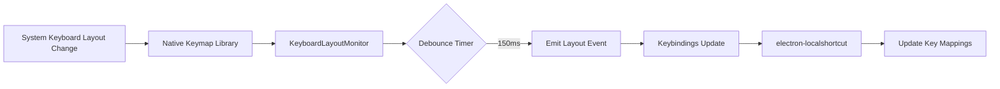
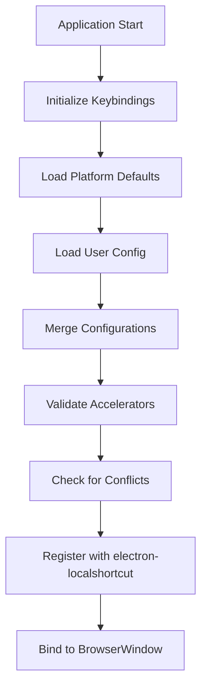
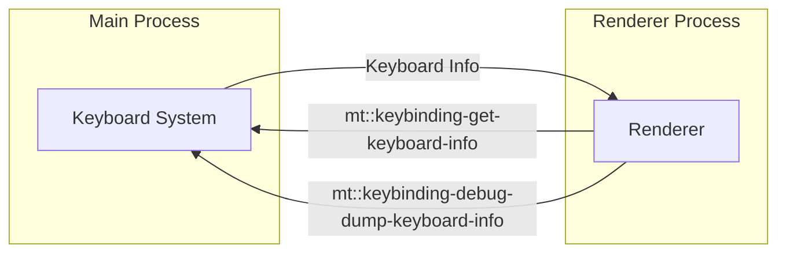

# Keyboard System Module

## Introduction

The keyboard_system module is a critical component of the MarkText application that manages keyboard input handling, keyboard layout monitoring, and shortcut keybinding management. It provides a comprehensive solution for cross-platform keyboard interaction, supporting dynamic keyboard layout changes and customizable user keybindings.

The module consists of two primary components: `KeyboardLayoutMonitor` for tracking system keyboard layout changes and `Keybindings` for managing application shortcuts and key mappings. Together, they ensure consistent keyboard behavior across different operating systems and keyboard configurations.

## Architecture Overview



## Core Components

### KeyboardLayoutMonitor

The `KeyboardLayoutMonitor` is a singleton service that monitors system-wide keyboard layout changes and provides real-time keyboard layout information to the application.

**Key Responsibilities:**
- Monitor system keyboard layout changes using the `native-keymap` library
- Provide current keyboard layout and key mapping information
- Emit events when keyboard layout changes occur
- Implement debouncing to handle multiple rapid layout change events

**Technical Implementation:**
```javascript
class KeyboardLayoutMonitor extends EventEmitter {
  constructor() {
    super()
    this._isSubscribed = false
    this._emitTimer = null
  }
  
  // Monitors keyboard layout changes with 150ms debouncing
  _ensureNativeListener() {
    onDidChangeKeyboardLayout(() => {
      clearTimeout(this._emitTimer)
      this._emitTimer = setTimeout(() => {
        this.emit(KEYBOARD_LAYOUT_MONITOR_CHANNEL_ID, loadKeyboardInfo())
      }, 150)
    })
  }
}
```

### Keybindings

The `Keybindings` class manages all application keyboard shortcuts, providing a flexible system for default and user-customizable keybindings across different platforms.

**Key Responsibilities:**
- Load and manage default platform-specific keybindings (Darwin/Linux/Windows)
- Load and apply user-defined keybindings from configuration files
- Register keyboard shortcuts with Electron's local shortcut system
- Handle keyboard layout changes and update key mappings accordingly
- Prevent conflicts between default and user-defined shortcuts

**Platform Support:**
- **macOS**: Uses `keybindingsDarwin` configuration
- **Linux**: Uses `keybindingsLinux` configuration  
- **Windows**: Uses `keybindingsWindows` configuration

## Data Flow Architecture



## Component Interactions

### Keyboard Layout Change Handling



### Shortcut Registration Process



## Configuration Management

### User Keybindings Configuration

The system supports user-defined keybindings through a JSON configuration file located at `{userDataPath}/keybindings.json`:

```json
{
  "file.save": "CmdOrCtrl+S",
  "file.save-as": "CmdOrCtrl+Shift+S",
  "edit.undo": "CmdOrCtrl+Z"
}
```

**Configuration Features:**
- **Override Defaults**: User keybindings override default shortcuts
- **Unset Bindings**: Empty strings disable specific shortcuts
- **Validation**: Invalid accelerators are rejected with warnings
- **Conflict Detection**: Duplicate shortcuts are detected and reported
- **Cross-Platform**: Uses Electron's `CmdOrCtrl` for platform compatibility

### Platform-Specific Default Keybindings

The system provides platform-optimized default keybindings:

- **macOS**: Uses Command key as primary modifier
- **Linux/Windows**: Uses Control key as primary modifier
- **Special Keys**: Platform-specific keys (e.g., Option vs Alt)

## IPC Communication

The keyboard system exposes several IPC channels for renderer process communication:



**Available IPC Methods:**
- `mt::keybinding-get-keyboard-info`: Retrieve current keyboard layout information
- `mt::keybinding-debug-dump-keyboard-info`: Export keyboard info to file for debugging

## Error Handling and Validation

### Accelerator Validation

The system validates all keyboard accelerators using Electron's validation rules:

```javascript
if (isValidElectronAccelerator(value)) {
  userAccelerators.set(key, value)
} else {
  console.error(`[WARNING] "${value}" is not a valid accelerator.`)
}
```

### Conflict Resolution

The system implements sophisticated conflict detection:

1. **User-User Conflicts**: Detects duplicate shortcuts within user configuration
2. **User-Default Conflicts**: Resolves conflicts between user and default bindings
3. **Cross-Reference Updates**: Updates related bindings when conflicts are resolved

### Error Recovery

- **Invalid Configuration**: Falls back to default keybindings
- **File System Errors**: Gracefully handles missing or corrupted config files
- **Safe Mode**: Disables custom keybindings in safe mode

## Integration with Other Modules

### Command System Integration

The keyboard system integrates closely with the [command_system](command_system.md) module:

```javascript
// Register key handler that executes commands
this.registerAccelerator(win, accelerator, () => {
  this.commandManager.execute(id, win)
})
```

### Window Management Integration

Keyboard shortcuts are registered per-window through the [window_management](window_management.md) system, ensuring that shortcuts are active only for focused windows.

### Preferences Integration

User keybindings are managed through the [preferences](preferences.md) system, allowing users to customize shortcuts through the application's settings interface.

## Performance Considerations

### Debouncing Strategy

Keyboard layout changes are debounced with a 150ms timer to prevent excessive updates:

```javascript
clearTimeout(this._emitTimer)
this._emitTimer = setTimeout(() => {
  this.emit(KEYBOARD_LAYOUT_MONITOR_CHANNEL_ID, loadKeyboardInfo())
}, 150)
```

### Memory Management

- **Singleton Pattern**: KeyboardLayoutMonitor uses singleton pattern to prevent multiple instances
- **Event Cleanup**: Proper cleanup of event listeners on window close
- **Lazy Loading**: Keyboard information is loaded on-demand

### Cross-Platform Optimization

- **Platform Detection**: Uses platform-specific optimizations
- **Native Integration**: Leverages native libraries for optimal performance
- **Caching**: Caches keyboard layout information to reduce system calls

## Security Considerations

### Input Validation

All user input is validated before processing:
- Accelerator strings are validated against Electron's format
- File paths are sanitized before file operations
- JSON parsing includes error handling

### Safe Mode Support

The system respects application safe mode settings:
```javascript
if (global.MARKTEXT_SAFE_MODE || !isFile2(this.configPath)) {
  return // Skip loading user keybindings in safe mode
}
```

## Testing and Debugging

### Debug Features

The system includes comprehensive debugging capabilities:
- Keyboard information export for troubleshooting
- Console warnings for invalid configurations
- Detailed error logging for file operations

### Development Mode

In development mode, the system provides additional validation:
```javascript
if (appEnvironment.isDevMode) {
  for (const [id, accelerator] of this.keys) {
    if (!commandManager.has(id)) {
      console.error(`[DEBUG] Command with id="${id}" isn't available for accelerator="${accelerator}".`)
    }
  }
}
```

This comprehensive debugging helps developers identify missing commands and invalid configurations during development.