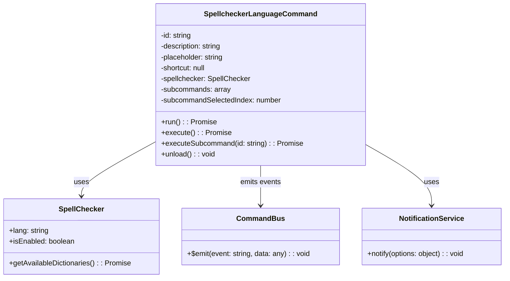
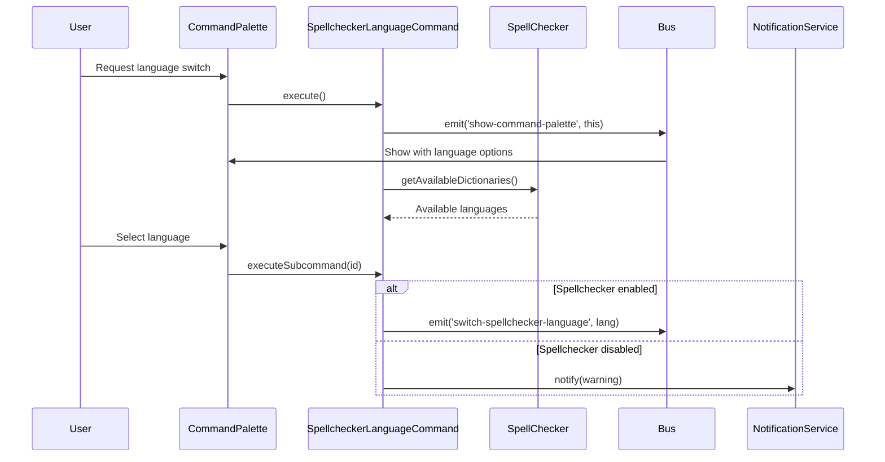
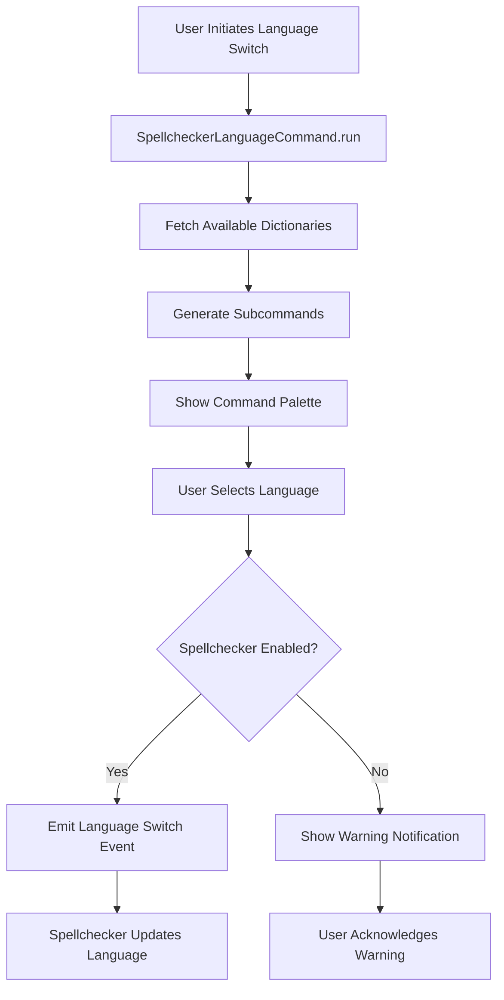

# Language Tools Module Documentation

## Introduction

The language_tools module provides spellchecking functionality for the application, enabling users to switch between different spellchecker languages. It integrates with the command system to provide a user-friendly interface for language selection and management.

## Core Architecture

### Primary Component

The module centers around the `SpellcheckerLanguageCommand` class, which implements a command-based interface for spellchecker language switching. This component bridges the command system with the spellchecker service, providing both programmatic and user-interactive language management.

## Component Relationships

### Integration with Command System

The language_tools module integrates with the broader command system through event-based communication:

### Data Flow Architecture

## Key Features

### 1. Dynamic Language Discovery
The module dynamically discovers available spellchecker dictionaries at runtime, ensuring the language list is always current and accurate.

### 2. Command Palette Integration
Seamlessly integrates with the application's command palette system, providing a consistent user experience for language selection.

### 3. State-Aware Operations
Checks spellchecker state before attempting language switches, preventing errors and providing user feedback when operations cannot be completed.

### 4. Language Name Mapping
Utilizes a language mapping service to display user-friendly language names instead of technical language codes.

## Dependencies

### Internal Dependencies
- **SpellChecker Service**: [renderer_spellchecker.md](renderer_spellchecker.md) - Provides spellchecking functionality and language management
- **Command System**: [command_system.md](command_system.md) - Integrates with the application's command infrastructure
- **Notification Service**: Part of the renderer services for user notifications

### External Dependencies
- **Event Bus**: Application-wide event system for component communication
- **Language Mapping**: Utility for converting language codes to display names

## Usage Patterns

### Command Execution Flow
1. **Initialization**: The command is instantiated with a reference to the spellchecker service
2. **Language Discovery**: When invoked, it fetches available dictionaries from the spellchecker
3. **UI Presentation**: Generates subcommands for each available language
4. **User Selection**: Presents options through the command palette
5. **State Validation**: Checks if spellchecker is enabled before processing
6. **Language Switch**: Emits event to update spellchecker language or shows warning

### Error Handling
- **Disabled Spellchecker**: Shows warning notification when attempting to switch languages while spellchecker is disabled
- **Invalid Selection**: Gracefully handles missing or invalid subcommand selections
- **Async Operations**: Uses delays to prevent UI timing issues during command palette transitions

## Integration Points

### Event System Integration
The module communicates through the application's event bus:
- `show-command-palette`: Requests display of command palette with language options
- `switch-spellchecker-language`: Requests spellchecker language change

### Service Integration
- **SpellChecker**: Direct integration for language management and state checking
- **Notification Service**: User feedback for operation results
- **Command System**: Standard command interface implementation

## Configuration

### Command Properties
- **ID**: `spellchecker.switch-language`
- **Description**: "Spelling: Switch language"
- **Placeholder**: "Select a language to switch to"
- **Shortcut**: None (accessed through command palette)

### Runtime Configuration
- Language list is dynamically generated based on available dictionaries
- Current language selection is maintained by the spellchecker service
- Subcommand highlighting indicates the currently active language

## Performance Considerations

### Async Operations
- Language discovery is performed asynchronously to avoid blocking the UI
- Command palette operations include timing delays to prevent race conditions

### Memory Management
- Subcommands are cleared on unload to prevent memory leaks
- Language list is regenerated on each invocation to reflect system changes

## Security Considerations

### Input Validation
- Subcommand IDs are validated before execution
- Language codes are sanitized through the spellchecker service

### State Management
- Spellchecker state is checked before operations to prevent inconsistent behavior
- User notifications provide clear feedback about operation success/failure

## Future Enhancements

### Potential Improvements
1. **Language Auto-Detection**: Automatic language detection based on document content
2. **Custom Dictionary Management**: Interface for managing user-defined dictionaries
3. **Language-Specific Settings**: Per-language spellchecker configuration options
4. **Performance Optimization**: Caching of available dictionaries to reduce API calls

### Extension Points
- Plugin system for custom language providers
- Integration with external spellchecking services
- Multi-language document support

---

*This documentation covers the language_tools module's core functionality and integration points. For information about the spellchecker service itself, refer to [renderer_spellchecker.md](renderer_spellchecker.md). For command system details, see [command_system.md](command_system.md).*