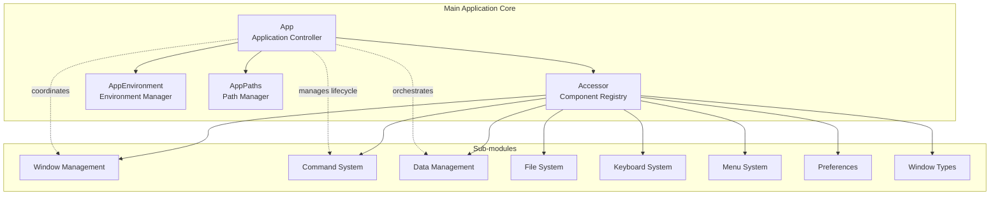
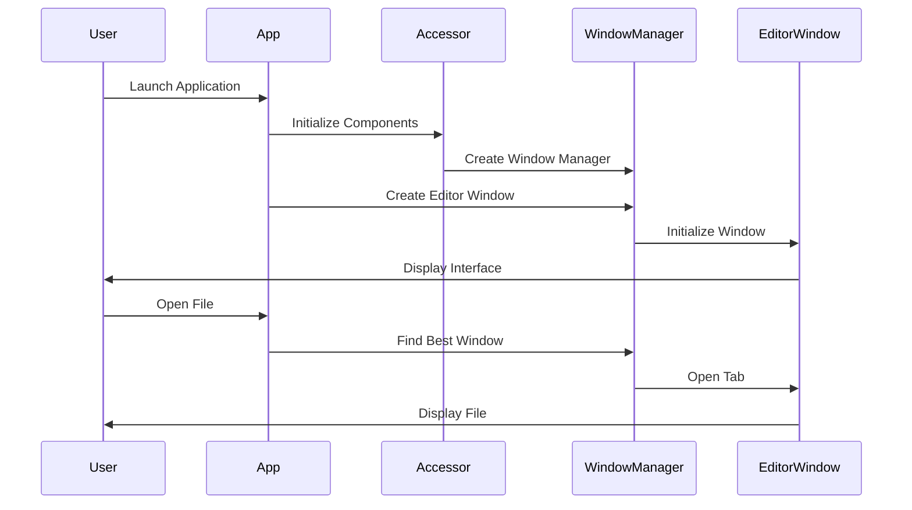

# Main Application Core Module

## Overview

The `main_app_core` module serves as the central orchestrator for the MarkText application, providing the foundational architecture that manages application lifecycle, window management, data persistence, and cross-component communication. This module acts as the primary entry point and coordination hub for all application functionality.

## Architecture

## Core Components

### 1. App (src.main.app.index.App)
The main application controller that manages the entire application lifecycle, window creation, file opening, and inter-process communication. It serves as the primary orchestrator for all application events and user interactions.

**Key Responsibilities:**
- Application initialization and lifecycle management
- Window creation and management coordination
- File opening and path resolution
- IPC (Inter-Process Communication) handling
- Theme and appearance management
- Screenshot functionality (macOS)

### 2. Accessor (src.main.app.accessor.Accessor)
A centralized registry that provides access to all major application components and services. It acts as a dependency injection container, ensuring proper component initialization and inter-component communication.

**Key Responsibilities:**
- Component lifecycle management
- Service coordination
- Command loading and registration
- Menu and keybinding initialization

### 3. AppEnvironment (src.main.app.env.AppEnvironment)
Manages the application environment configuration, including development mode settings, debug flags, and platform-specific configurations. It provides a unified interface for accessing environment-specific information.

**Key Responsibilities:**
- Environment configuration management
- Development mode detection
- Debug and verbose logging setup
- Safe mode operation
- Platform-specific path configuration

### 4. AppPaths (src.main.app.paths.AppPaths)
Handles all application path management, including user data directories, log files, and configuration storage locations. It ensures proper directory structure and file organization.

**Key Responsibilities:**
- User data path management
- Application directory structure
- Path validation and creation
- Cross-platform path handling

## Sub-modules Integration

The main_app_core module integrates with several specialized sub-modules:

### [Window Management](window_management.md)
Manages all application windows, including editor windows and settings dialogs. Coordinates window lifecycle, focus management, and inter-window communication. Provides window activity tracking and intelligent window selection for file operations.

### [Command System](command_system.md)
Implements the command pattern for handling user actions, menu items, and keyboard shortcuts. Provides a unified interface for executing application commands with support for custom commands and dynamic command loading.

### [Data Management](data_management.md)
Handles application data persistence, including user preferences, recent files, and application state. Manages data storage and retrieval operations with support for multiple data formats and secure storage.

### [File System](file_system.md)
Provides file system monitoring and change detection capabilities. Watches for file modifications and updates the application state accordingly. Includes support for file watching, change notifications, and path resolution.

### [Keyboard System](keyboard_system.md)
Manages keyboard input handling, including shortcut processing and keybinding configuration. Provides customizable keyboard interaction capabilities with support for complex key combinations and platform-specific shortcuts.

### [Menu System](menu_system.md)
Handles application menu creation and management. Provides dynamic menu updates based on application state and context. Supports platform-specific menu layouts and custom menu items.

### [Preferences](preferences.md)
Manages user preferences and settings. Provides a centralized interface for storing and retrieving user configuration options with support for default values, validation, and real-time updates.

### [Window Types](window_types.md)
Defines different window types and their specific behaviors. Includes editor windows for document editing, settings windows for configuration, and base window functionality for common window operations.

## Data Flow

## Key Features

### Multi-Window Support
The application supports multiple editor windows with intelligent file distribution. Files can be opened in new windows or existing ones based on user preferences and context.

### Cross-Platform Compatibility
Handles platform-specific behaviors for Windows, macOS, and Linux, including native theme integration, dock menus, and jump lists.

### Theme Management
Dynamic theme switching with automatic detection of system theme changes. Supports both light and dark themes with real-time updates.

### File Association
Comprehensive file association handling for markdown files, including drag-and-drop support and command-line file opening.

### IPC Communication
Robust inter-process communication system for coordinating between main and renderer processes, ensuring smooth user experience.

## Configuration

The module supports various configuration options through command-line arguments and environment variables:

- `--debug`: Enable debug mode
- `--verbose`: Enable verbose logging
- `--safe`: Run in safe mode
- `--user-data-dir`: Custom user data directory
- `--disable-spellcheck`: Disable spell checking
- `--new-window`: Force new window creation

## Dependencies

The main_app_core module depends on several external libraries and internal modules:

- **Electron**: Core application framework
- **electron-log**: Logging functionality
- **dayjs**: Date and time manipulation
- **Internal Modules**: All sub-modules listed in the module tree

## Error Handling

The module implements comprehensive error handling for:
- File system operations
- Window creation failures
- IPC communication errors
- Theme switching issues
- Platform-specific operations

All errors are properly logged and appropriate user feedback is provided when necessary.