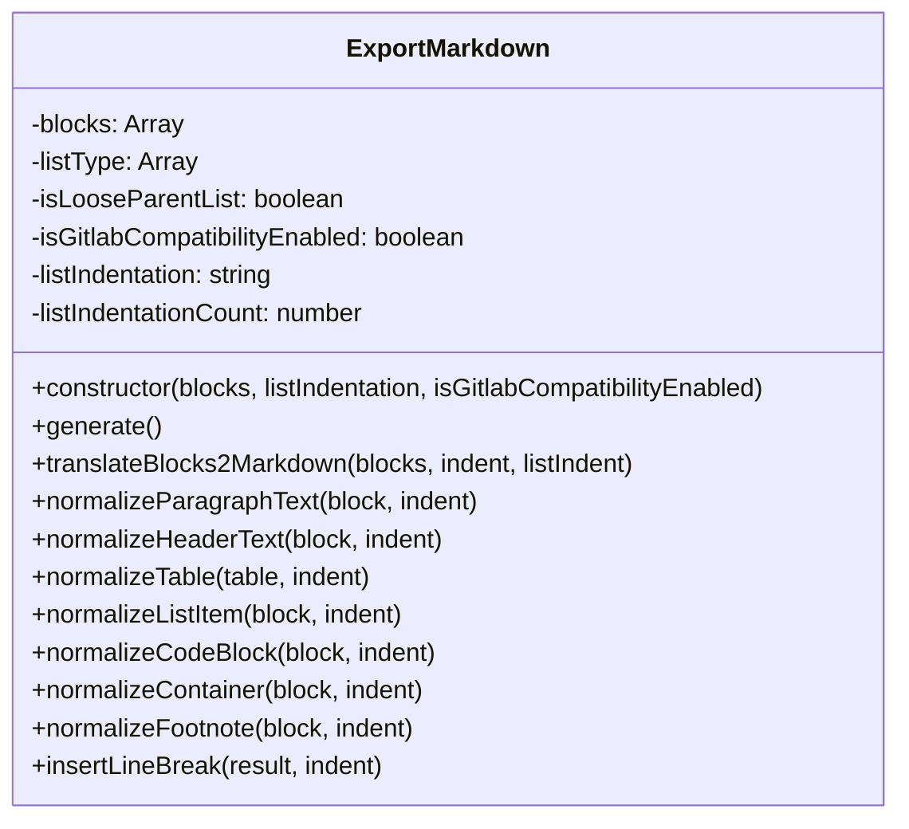
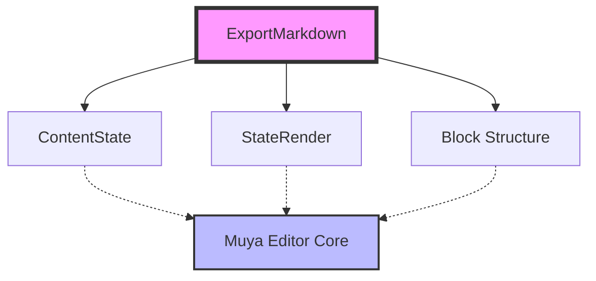
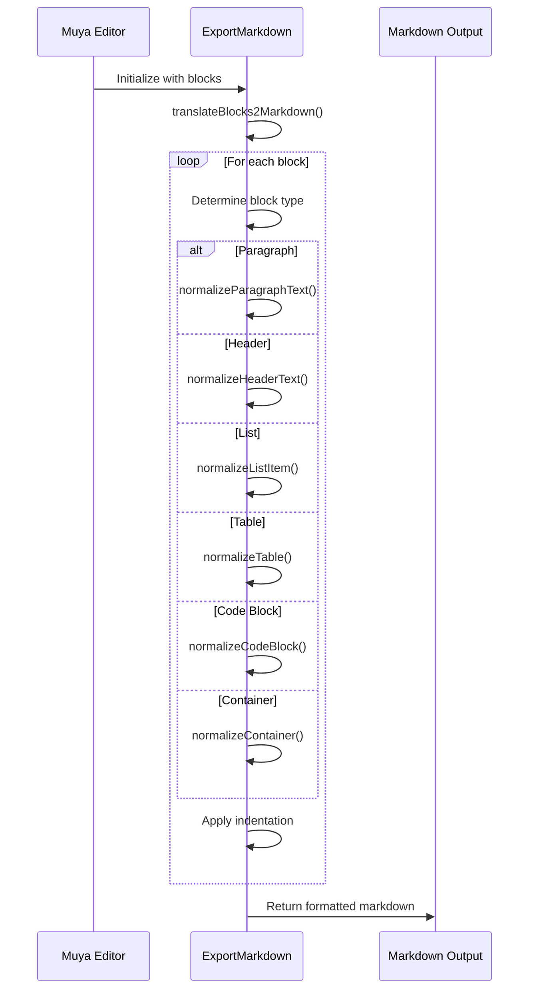
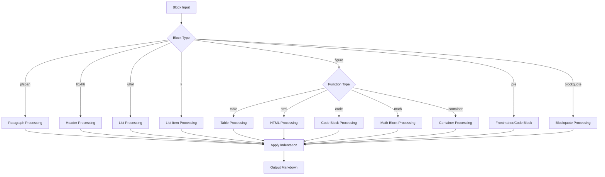
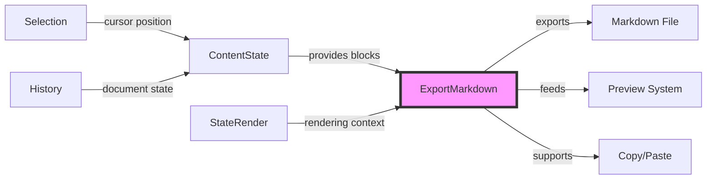

# Markdown Export Module Documentation

## Introduction

The Markdown Export module is a core component of the Muya Editor I/O system, responsible for converting the editor's internal block-based document structure into valid Markdown syntax. This module ensures that exported Markdown complies with multiple industry standards including CommonMark, GitHub Flavored Markdown (GFM), and Pandoc Markdown specifications.

## Overview

The `ExportMarkdown` class serves as the primary export engine that transforms rich text content from the Muya editor's internal representation into properly formatted Markdown text. It handles complex formatting scenarios including nested lists, tables, code blocks, mathematical expressions, and various container elements while maintaining compatibility with different Markdown flavors.

## Architecture

### Core Component Structure



### Module Dependencies



## Component Details

### ExportMarkdown Class

The `ExportMarkdown` class is the main export engine that orchestrates the conversion process. It maintains state information about the current export context, including list types, indentation settings, and compatibility flags.

#### Key Properties

- **blocks**: The document structure represented as an array of block objects
- **listType**: Stack tracking nested list contexts (unordered/ordered)
- **isLooseParentList**: Flag indicating if the parent list is loose (has blank lines between items)
- **isGitlabCompatibilityEnabled**: Flag for GitLab-specific math block formatting
- **listIndentation**: Configuration for list indentation style ('dfm', 'number', or default)
- **listIndentationCount**: Numeric value for indentation spaces (1-4)

#### Constructor Parameters

```javascript
constructor(blocks, listIndentation = 1, isGitlabCompatibilityEnabled = false)
```

- **blocks**: Array of document block objects from the editor
- **listIndentation**: Indentation style configuration
- **isGitlabCompatibilityEnabled**: Enable GitLab math block compatibility

## Data Flow

### Export Process Flow



### Block Type Processing



## Supported Markdown Elements

### Text Formatting

- **Paragraphs**: Basic text blocks with proper line breaks
- **Headers**: ATX style (#) and Setext style (underline) support
- **Blockquotes**: Nested blockquote support with proper indentation

### Lists

- **Unordered Lists**: Bullet marker customization (-, *, +)
- **Ordered Lists**: Numbered lists with custom delimiters
- **Task Lists**: Checkbox support for task items
- **Nested Lists**: Multi-level list support with configurable indentation
- **Loose/Tight Lists**: Proper spacing based on list item content

### Code Elements

- **Fenced Code Blocks**: Language-specific syntax highlighting
- **Indented Code Blocks**: Four-space indentation support
- **Frontmatter**: YAML, TOML, and JSON frontmatter support

### Tables

- **GitHub Flavored Tables**: Pipe-delimited table format
- **Column Alignment**: Left, center, right alignment support
- **Text Escaping**: Proper pipe character escaping

### Special Containers

- **Mathematical Expressions**: LaTeX math block support with GitLab compatibility
- **Diagrams**: Mermaid, Flowchart, Sequence, PlantUML, Vega-Lite support
- **HTML Blocks**: Raw HTML content preservation
- **Footnotes**: Reference-style footnote support

## Configuration Options

### List Indentation Styles

1. **Default**: Single space indentation
2. **Number**: Configurable 1-4 spaces
3. **DFM (Daring Fireball Markdown)**: 4-space indentation

### Compatibility Modes

- **GitLab Math**: Enables GitLab-style math block formatting (```math)
- **CommonMark**: Standard CommonMark compliance
- **GitHub Flavored Markdown**: GFM specification compliance

## Integration with Muya Editor

The ExportMarkdown module integrates with the broader Muya editor ecosystem:



## Usage Examples

### Basic Export

```javascript
const blocks = contentState.getBlocks()
const exporter = new ExportMarkdown(blocks, 2, false)
const markdown = exporter.generate()
```

### GitLab Compatibility

```javascript
const exporter = new ExportMarkdown(blocks, 'dfm', true)
const markdown = exporter.generate()
```

## Error Handling

The module includes basic error handling for unknown block types:

```javascript
default: {
  console.warn('translateBlocks2Markdown: Unknown block type:', block.type)
  break
}
```

## Standards Compliance

The module adheres to multiple Markdown specifications:

- **CommonMark Spec 0.29**: Base Markdown standard
- **GitHub Flavored Markdown**: Extended syntax support
- **Pandoc Markdown**: Additional formatting options

## Related Documentation

- [Muya Editor Core](muya_editor_core.md) - Core editor functionality
- [ContentState Management](contentstate_management.md) - Document state handling
- [StateRender System](staterender_system.md) - Rendering engine
- [HTML Export](html_export.md) - HTML export functionality

## Performance Considerations

The export process is optimized for:

- **Memory Efficiency**: Streaming block processing
- **Indentation Management**: Minimal string operations
- **List State Tracking**: Efficient stack-based list context management
- **Text Escaping**: Targeted escaping only when necessary

## Future Enhancements

Potential areas for improvement:

- **Plugin Architecture**: Extensible block type support
- **Custom Renderers**: User-defined formatting rules
- **Performance Metrics**: Export timing and optimization
- **Validation**: Output validation against Markdown specifications