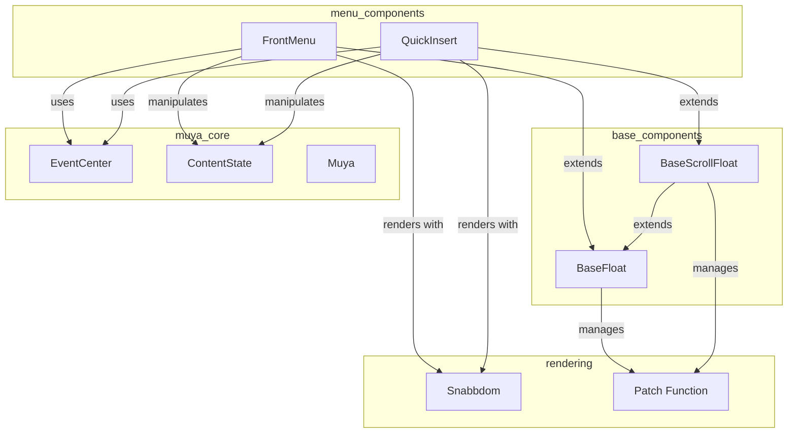
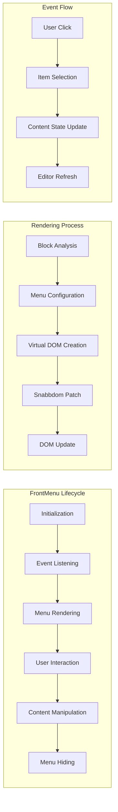
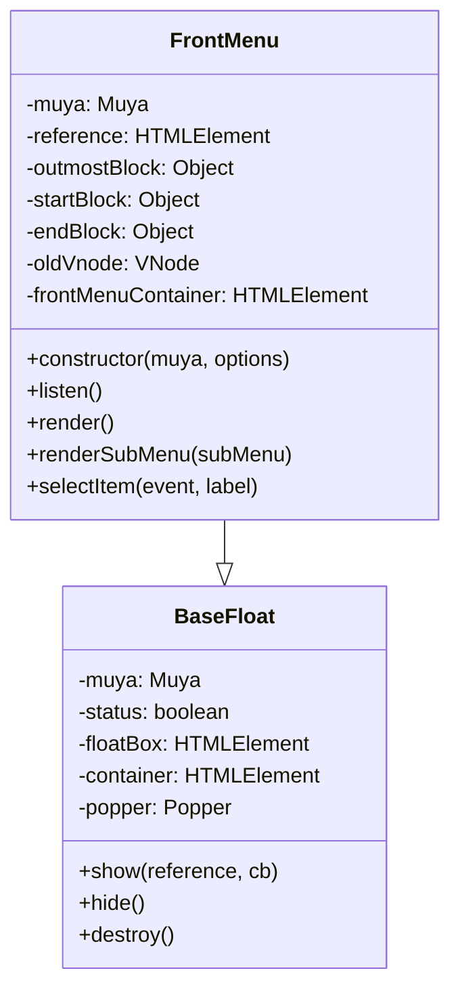
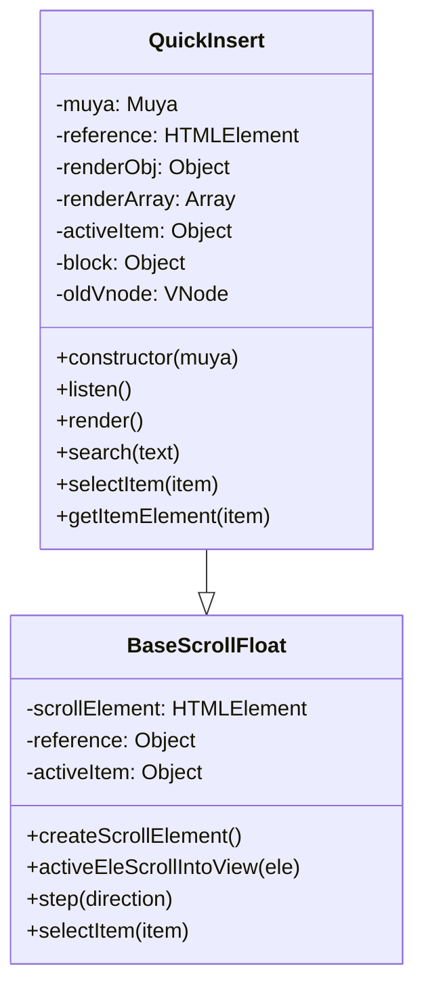
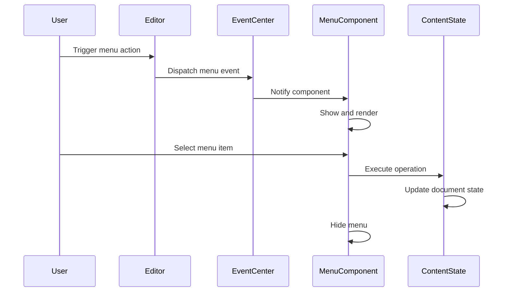
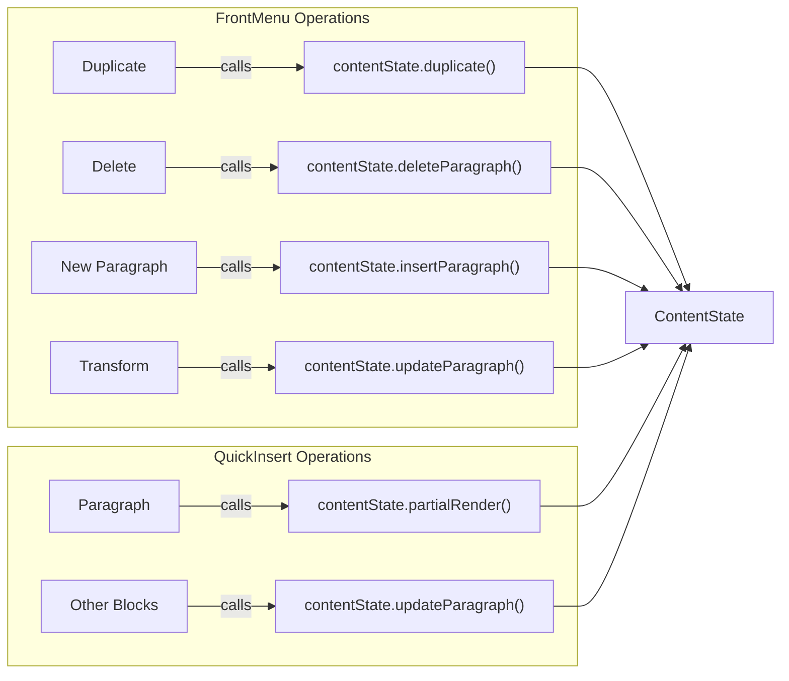
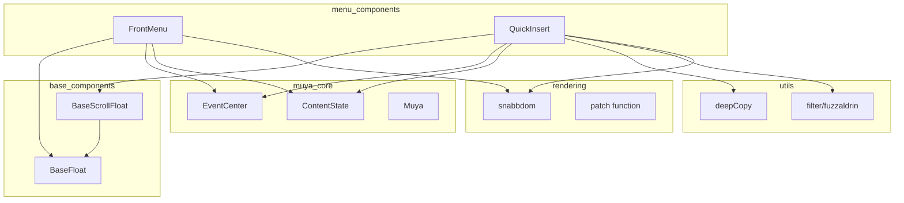

```mermaid
graph TD
    subgraph "QuickInsert Flow"
        A["@ Character Detection"] --> B[Component Activation]
        B --> C[Content Analysis]
        C --> D[Initial Rendering]
        D --> E[User Input Processing]
        E --> F[Fuzzy Search]
        F --> G[Results Filtering]
        G --> H[UI Update]
        H --> I[Item Selection]
        I --> J[Content Insertion]
    end
    
    subgraph "Search Mechanism"
        K[Input Text] --> L[Remove @ Symbol]
        L --> M[Fuzzaldrin Filter]
        M --> N[Category Filtering]
        N --> O[Result Sorting]
    end
```

# Menu Components Module Documentation

## Overview

The `menu_components` module provides interactive menu interfaces for the Muya editor framework. It contains two primary components: `FrontMenu` and `QuickInsert`, which offer contextual menu options and quick content insertion capabilities respectively. These components enhance the user experience by providing intuitive access to common editing operations and content creation tools.

## Module Architecture



## Core Components

### FrontMenu Component

The `FrontMenu` component provides a contextual floating menu that appears when users interact with content blocks. It offers block-level operations such as duplication, deletion, transformation, and new paragraph insertion.

#### Key Features
- **Contextual Display**: Shows relevant menu options based on the selected content block
- **Block Operations**: Provides duplicate, delete, and transform operations
- **Submenu Support**: Includes expandable submenus for block type transformations
- **Keyboard Navigation**: Supports keyboard interaction and shortcuts
- **Smart Positioning**: Automatically adjusts position based on available screen space

#### Architecture



#### Component Structure



### QuickInsert Component

The `QuickInsert` component provides a searchable interface for quickly inserting various content types into the editor. It appears when users type the `@` character and offers filtered suggestions based on user input.

#### Key Features
- **Fuzzy Search**: Uses fuzzaldrin for intelligent content filtering
- **Categorized Content**: Organizes insertable items by categories (basic blocks, advanced blocks, etc.)
- **Keyboard Navigation**: Supports arrow keys, tab, and enter for navigation
- **Real-time Filtering**: Updates suggestions as users type
- **Context Awareness**: Adapts available options based on current document state

#### Architecture



#### Component Structure



## Data Flow and Interactions

### Event System Integration



### Content Manipulation Flow



## Configuration and Customization

### Menu Configuration Structure

Both components rely on configuration objects that define available menu items and their properties:

```javascript
// FrontMenu configuration includes:
{
  icon: "path/to/icon",
  label: "unique-identifier",
  text: "Display Text",
  shortCut: "Keyboard Shortcut"
}

// QuickInsert configuration includes:
{
  title: "Main Title",
  subTitle: "Description",
  label: "block-type",
  icon: "path/to/icon",
  shortCut: "Keyboard Shortcut"
}
```

### Styling and Theming

The components use CSS classes for styling:
- `.ag-front-menu` - FrontMenu container styling
- `.ag-quick-insert` - QuickInsert container styling
- `.item` - Menu item styling
- `.active` - Active/highlighted item styling
- `.disabled` - Disabled item styling

## Integration with Other Modules

### Dependencies



### Related Modules

- **[base_components](base_components.md)**: Provides the foundational floating and scrollable UI components
- **[muya_content](muya_content.md)**: Contains the ContentState class that handles document manipulation
- **[muya_events](muya_events.md)**: Manages the event system for component communication
- **[muya_framework](muya_framework.md)**: Core Muya framework that hosts these components

## Usage Patterns

### FrontMenu Usage

The FrontMenu is typically triggered by:
- Right-clicking on content blocks
- Keyboard shortcuts
- Touch gestures on mobile devices

### QuickInsert Usage

The QuickInsert is activated by:
- Typing `@` character in the editor
- Selecting from the insert menu
- Using keyboard shortcuts

## Performance Considerations

### Rendering Optimization
- Uses virtual DOM (Snabbdom) for efficient updates
- Implements smart re-rendering only when necessary
- Caches virtual nodes to minimize DOM operations

### Memory Management
- Properly cleans up event listeners on component destruction
- Removes DOM elements when components are hidden
- Manages popper instances to prevent memory leaks

### Search Performance
- QuickInsert uses efficient fuzzy search algorithms
- Implements debouncing for search input
- Limits result sets for better performance

## Error Handling and Edge Cases

### FrontMenu Edge Cases
- Handles disabled menu items (e.g., frontmatter duplication)
- Manages edge positioning near screen boundaries
- Gracefully handles missing block references

### QuickInsert Edge Cases
- Handles empty search results
- Manages frontmatter insertion restrictions
- Provides fallback for missing configuration items

## Future Enhancements

### Potential Improvements
- **Accessibility**: Enhanced ARIA support and keyboard navigation
- **Internationalization**: Multi-language support for menu items
- **Customization**: User-configurable menu items and shortcuts
- **Performance**: Virtual scrolling for large menu lists
- **Mobile Optimization**: Touch-friendly interactions and gestures