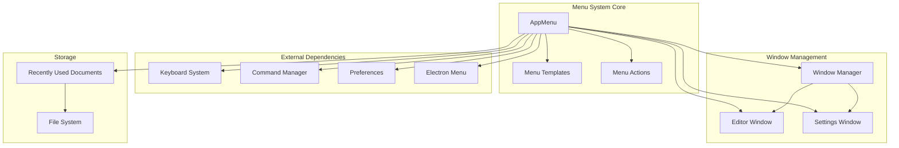
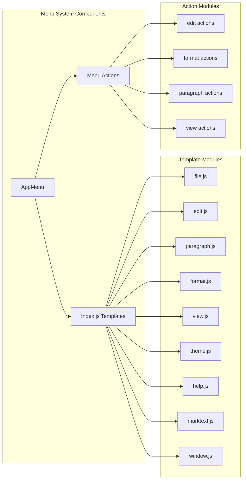
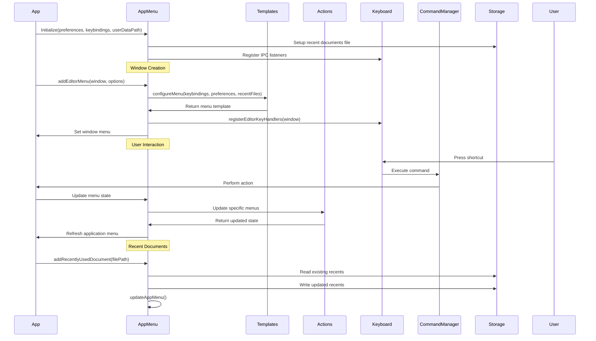
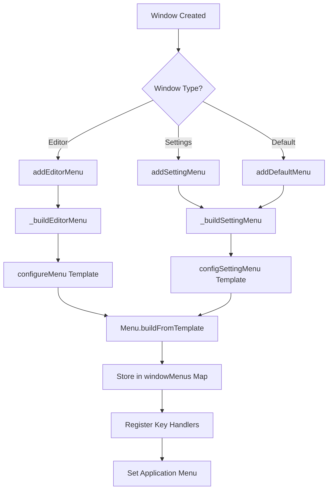
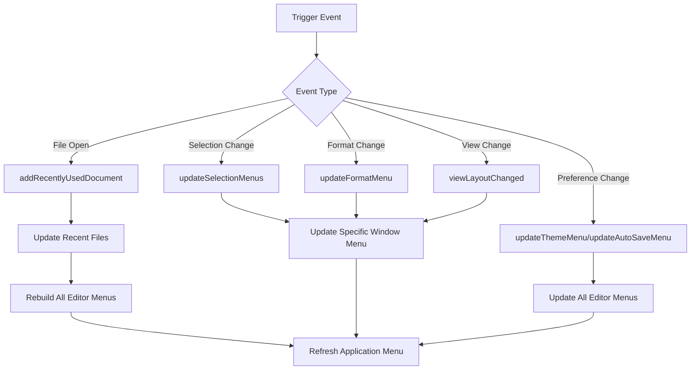

# Menu System Module Documentation

## Introduction

The menu_system module is a core component of the MarkText application that manages the application's menu system across different window types and platforms. It provides a comprehensive menu management solution that handles menu creation, updates, keyboard shortcuts, and recently used documents tracking. The module ensures consistent menu behavior across editor windows, settings windows, and platform-specific requirements.

## Core Architecture

### Main Component: AppMenu

The `AppMenu` class serves as the central orchestrator for all menu-related operations. It manages multiple window-specific menus, handles menu state synchronization, and coordinates with other system components like keyboard shortcuts and command execution.

### Key Features

- **Multi-window menu management**: Each window can have its own menu configuration
- **Platform-specific menu handling**: Different menu structures for macOS, Windows, and Linux
- **Recently used documents tracking**: Persistent storage and management of recent files
- **Dynamic menu updates**: Real-time menu item state updates based on application context
- **Keyboard shortcut integration**: Seamless integration with the keyboard system
- **Menu type differentiation**: Separate menu configurations for editor and settings windows

## Architecture Overview



## Component Relationships



## Data Flow Architecture



## Process Flow Diagrams

### Menu Creation Process



### Menu Update Process



## Core Functionality

### Menu Types

The menu system supports three distinct menu types:

1. **Editor Menu** (`MenuType.EDITOR`): Full-featured menu for editor windows with file operations, editing tools, formatting options, and view controls
2. **Settings Menu** (`MenuType.SETTINGS`): Simplified menu for settings windows, primarily on macOS
3. **Default Menu** (`MenuType.DEFAULT`): Fallback menu configuration

### Recently Used Documents Management

The system maintains a persistent list of recently used documents with the following features:

- **Cross-platform support**: Uses native OS APIs on macOS/Windows, custom JSON storage on Linux
- **Automatic deduplication**: Prevents duplicate entries in the recent list
- **File validation**: Filters out non-existent files and directories
- **Size limiting**: Maintains maximum of 12 recent documents
- **Persistent storage**: Saves to `recently-used-documents.json` in user data directory

### Dynamic Menu Updates

The menu system provides real-time updates for various application states:

- **Selection-based updates**: Enables/disables menu items based on text selection
- **Format state updates**: Reflects current formatting options (bold, italic, etc.)
- **View layout updates**: Updates menu items based on sidebar, tab bar, and panel visibility
- **Theme updates**: Synchronizes theme selection across all editor windows
- **Auto-save updates**: Reflects auto-save preference state
- **Line ending updates**: Shows current line ending format (LF/CRLF)

### Keyboard Shortcut Integration

The menu system integrates seamlessly with the keyboard system:

- **Automatic registration**: Registers all keyboard shortcuts when creating editor menus
- **Platform-specific handling**: Different shortcut configurations for different operating systems
- **User customization**: Supports user-defined keybindings via `keybindings.json`
- **Conflict resolution**: Handles duplicate shortcuts and validates accelerators

## IPC Communication

The menu system listens for various IPC events to update menu states:

```javascript
// Document management
'mt::add-recently-used-document'
'menu-add-recently-used'
'menu-clear-recently-used'

// Editor state updates
'mt::update-format-menu'
'mt::update-sidebar-menu'
'mt::view-layout-changed'
'mt::editor-selection-changed'
'mt::update-line-ending-menu'

// Preference updates
'broadcast-preferences-changed'
```

## Platform-Specific Considerations

### macOS
- Uses native recent documents API (`app.addRecentDocument`)
- Includes application menu (`marktext.js` template)
- Supports dock menu

### Windows
- Uses native recent documents API
- Requires special handling for Alt+F4 shortcut
- Different menu structure compared to macOS

### Linux
- Uses custom JSON storage for recent documents
- Cannot hide application menu (Electron limitation)
- Uses dummy menu when no menu is needed

## Error Handling

The menu system implements comprehensive error handling:

- **File system errors**: Graceful handling of corrupted recent documents file
- **Menu access errors**: Proper error messages when window menus are not found
- **IPC communication errors**: Logging of failed menu update attempts
- **Keyboard shortcut errors**: Validation of accelerators and conflict detection

## Dependencies

### Internal Dependencies
- **[keyboard_system](keyboard_system.md)**: Provides keyboard shortcut management and keybinding configuration
- **[command_system](command_system.md)**: Executes commands triggered by menu items and keyboard shortcuts
- **[preferences](preferences.md)**: Provides user preferences for menu configuration and theme settings
- **[main_app_core](main_app_core.md)**: Core application services and environment configuration

### External Dependencies
- **Electron Menu API**: Native menu creation and management
- **electron-localshortcut**: Custom keyboard shortcut handling
- **electron-log**: Logging functionality

## Configuration

### Menu Templates
Menu templates are defined in separate modules for each menu category:
- File operations (`file.js`)
- Edit operations (`edit.js`)
- Paragraph formatting (`paragraph.js`)
- Text formatting (`format.js`)
- View controls (`view.js`)
- Theme selection (`theme.js`)
- Window management (`window.js`)
- Application menu (`marktext.js`)
- Help menu (`help.js`)

### Keybindings Configuration
The system supports user-defined keybindings through `keybindings.json` in the user data directory, allowing customization of menu shortcuts.

## Performance Considerations

- **Menu caching**: Menus are rebuilt only when necessary to avoid performance overhead
- **Selective updates**: Only affected menu items are updated instead of rebuilding entire menus
- **Window-specific management**: Each window maintains its own menu instance to reduce conflicts
- **Efficient storage**: Recent documents are stored in a compact JSON format with automatic cleanup

## Security Considerations

- **File path validation**: All file paths in recent documents are validated before use
- **Menu item validation**: Menu item IDs and states are validated before updates
- **IPC message validation**: Incoming IPC messages are validated before processing
- **User data protection**: Recent documents file is stored in the user data directory with appropriate permissions