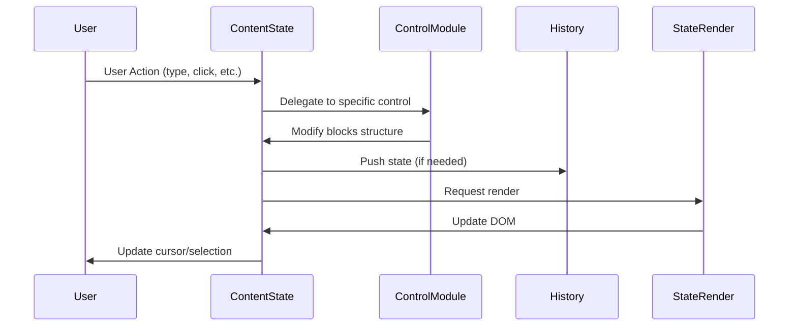

# Muya Content Module Documentation

## Overview

The `muya_content` module is a core component of the Muya framework that manages the content state and editing operations for a markdown editor. It provides comprehensive functionality for handling text content, block structures, history management, and various editing operations including table manipulation, code block handling, and rich text formatting.

## Architecture

```mermaid
graph TB
    subgraph "Muya Content Module"
        CS[ContentState]
        H[History]
        
        CS --> H
        CS --> SR[StateRender]
        CS --> SC[Selection/Cursor]
        CS --> MU[Muya Utils]
        
        subgraph "Control Modules"
            CE[enterCtrl]
            CU[updateCtrl]
            CB[backspaceCtrl]
            CD[deleteCtrl]
            CC[codeBlockCtrl]
            CT[tableBlockCtrl]
            CA[arrowCtrl]
            CP[pasteCtrl]
            CCP[copyCutCtrl]
            CF[formatCtrl]
            CS[searchCtrl]
            CCO[containerCtrl]
            CH[htmlBlockCtrl]
            CCL[clickCtrl]
            CI[inputCtrl]
            CTOC[tocCtrl]
            CE[emojiCtrl]
            CI[imageCtrl]
            CL[linkCtrl]
            CDD[dragDropCtrl]
            CFN[footnoteCtrl]
        end
        
        CS --> CE
        CS --> CU
        CS --> CB
        CS --> CD
        CS --> CC
        CS --> CT
        CS --> CA
        CS --> CP
        CS --> CCP
        CS --> CF
        CS --> CS
        CS --> CCO
        CS --> CH
        CS --> CCL
        CS --> CI
        CS --> CTOC
        CS --> CE
        CS --> CI
        CS --> CL
        CS --> CDD
        CS --> CFN
    end
    
    subgraph "External Dependencies"
        MU[Muya Framework]
        SR[StateRender]
        IM[ImportMarkdown]
    end
    
    CS -.-> MU
    CS -.-> SR
    CS -.-> IM
```



## Core Components

### ContentState (`src.muya.lib.contentState.index.ContentState`)

The main content management class that orchestrates all content-related operations. It maintains the document structure, handles cursor positioning, manages rendering, and coordinates with various control modules.

**Key Responsibilities:**
- Document block structure management
- Cursor and selection handling
- Content rendering coordination
- History management integration
- Search functionality
- Import/export operations

### History (`src.muya.lib.contentState.history.History`)

Manages undo/redo functionality with a stack-based approach. Provides intelligent history tracking that captures document state changes while optimizing memory usage.

**Key Features:**
- Stack-based undo/redo system
- Configurable undo depth
- Pending state management for optimization
- Automatic state serialization

## Sub-modules

The muya_content module integrates with numerous control sub-modules, each handling specific editing operations:

### Content Manipulation
- **[Content Manipulation](content_manipulation.md)**: Comprehensive handling of enter key operations, text updates, backspace deletion, and forward deletion

### Advanced Features
- **[Advanced Features](advanced_features.md)**: Code block management, table structure operations, text formatting, and search functionality

### Content Types
- **[Content Types](content_types.md)**: Image insertion and properties, hyperlink management, footnote references, and emoji handling

### Navigation and Input
- **[Navigation and Input](navigation_input.md)**: Cursor navigation, mouse interactions, text input processing, and clipboard operations

### Document Structure
- **[Document Structure](document_structure.md)**: Container element management, HTML content blocks, and table of contents generation

## Data Flow



## Integration Points

### With Muya Framework
The ContentState class receives the Muya instance during construction and uses it for:
- Configuration options access
- Container element reference
- Event coordination
- Utility function access

### With StateRender
Coordinates with the StateRender module for:
- Token caching and management
- Partial and full rendering operations
- Search highlight rendering
- Label collection for cross-references

### With Selection Module
Integrates with selection utilities for:
- Cursor positioning
- Range selection handling
- Coordinate calculation for UI positioning

## Key Features

### Block-Based Architecture
The module uses a hierarchical block system where:
- Each block has a unique key
- Blocks can contain child blocks
- Parent-child relationships are maintained
- Sibling ordering is preserved

### Intelligent History Management
- Automatic history pushing on cursor changes
- Delayed history commits for typing operations
- Configurable undo depth limits
- Pending state optimization

### Flexible Rendering
- Full document rendering
- Partial rendering for performance
- Single block rendering for targeted updates
- Cache management for optimization

### Rich Content Support
- Tables with cell selection and drag operations
- Code blocks with syntax highlighting
- Images with selection and toolbar support
- Footnotes and cross-references
- HTML blocks for custom content

## Usage Patterns

### Content Creation
```javascript
const contentState = new ContentState(muya, options)
contentState.createBlock('p', { text: 'Hello World' })
```

### History Operations
```javascript
contentState.history.undo()
contentState.history.redo()
```

### Block Manipulation
```javascript
const block = contentState.getBlock(key)
contentState.insertAfter(newBlock, existingBlock)
contentState.removeBlock(block)
```

## Performance Considerations

- **Partial Rendering**: Only renders changed sections for better performance
- **Token Caching**: Caches rendered tokens to avoid redundant processing
- **History Optimization**: Uses pending states to reduce memory usage
- **Event Debouncing**: Delays history commits during rapid typing

## Dependencies

- [Muya Framework](muya_framework.md): Core framework integration
- [StateRender](muya_parser.md): Rendering engine coordination
- [Selection](muya_selection.md): Cursor and selection management
- [Import Utilities](muya_parser.md): Markdown import functionality