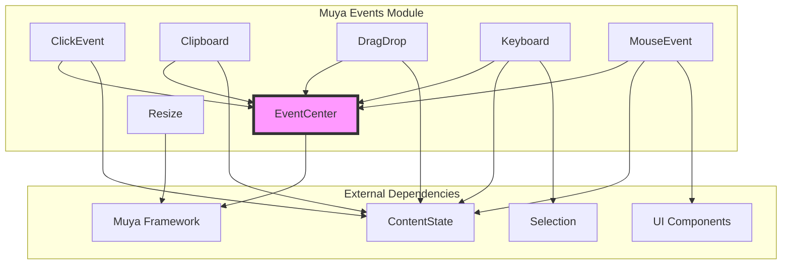
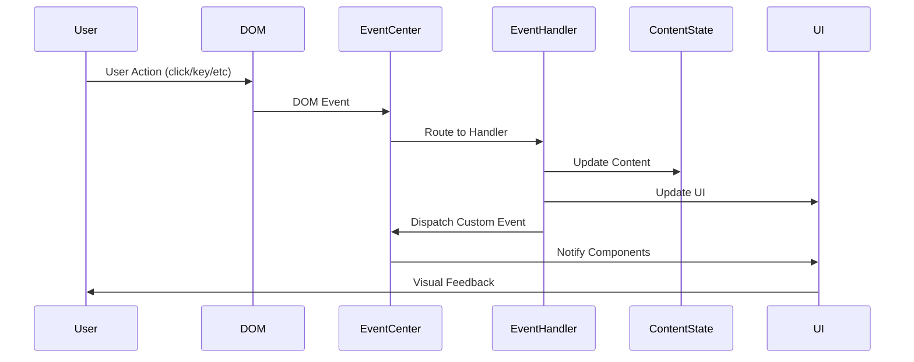

# Muya Events Module Documentation

## Overview

The `muya_events` module is a comprehensive event handling system for the Muya editor framework. It provides centralized event management, user interaction handling, and input processing capabilities that form the backbone of the editor's interactive functionality.

## Purpose

This module serves as the primary interface between user actions and the editor's content state, managing:
- DOM event binding and lifecycle management
- Keyboard input processing and shortcuts
- Mouse interactions and click handling
- Clipboard operations (copy, cut, paste)
- Drag and drop functionality
- Window resize events
- Custom event dispatching

## Architecture



## Core Components

### EventCenter
The central event management system that handles both DOM events and custom events. It provides:
- Event registration and deregistration with unique IDs
- Custom event subscription and dispatching
- Event deduplication and lifecycle management
- Clean separation between DOM and application events

**Detailed documentation**: [EventCenter Documentation](event_center.md)

### ClickEvent
Handles all click-related interactions including:
- Context menu management
- Image selection and manipulation
- Table interactions
- Link and footnote navigation
- Container block editing
- Todo list checkbox handling

**Detailed documentation**: [ClickEvent Documentation](click_event_handler.md)

### Clipboard
Manages clipboard operations with support for:
- Copy/cut/paste operations
- Multiple copy formats (Markdown, HTML, plain text)
- Document-level and container-level clipboard handling
- Integration with content state for data consistency

**Detailed documentation**: [Clipboard Documentation](clipboard_manager.md)

### DragDrop
Provides drag and drop functionality for:
- Element dragging prevention for images
- Content reordering
- File dropping
- Drag state management

### Keyboard
Comprehensive keyboard input handling including:
- Key event processing (keydown, keyup, input)
- Composition event handling for international input
- Shortcut and hotkey management
- Float tool interaction
- Cursor and selection management

**Detailed documentation**: [Keyboard Documentation](keyboard_input_handler.md)

### MouseEvent
Handles mouse interactions for:
- Link preview on hover
- Footnote tooltips
- Drag handle interactions
- Cell selection in tables

### Resize
Manages window resize events (currently disabled for performance reasons)

## Event Flow Architecture



## Integration with Other Modules

The muya_events module integrates closely with:

- **[muya_framework](muya_framework.md)**: Provides the core Muya instance and configuration
- **[muya_content](muya_content.md)**: Updates content state based on user interactions
- **[muya_ui_components](muya_ui_components.md)**: Triggers UI component visibility and updates
- **[muya_selection](muya_selection.md)**: Manages cursor and selection states

## Key Features

### 1. Centralized Event Management
All events flow through the EventCenter, providing consistent handling and preventing event conflicts.

### 2. Modular Event Handlers
Each type of interaction (keyboard, mouse, clipboard, etc.) has its own dedicated handler for maintainability.

### 3. Content State Synchronization
Event handlers work directly with ContentState to ensure data consistency across the editor.

### 4. UI Component Integration
Events trigger appropriate UI components like toolbars, pickers, and menus based on context.

### 5. Performance Optimization
- Event deduplication prevents redundant bindings
- Throttled resize handling
- Selective event propagation

## Usage Patterns

### Event Registration
```javascript
// DOM event registration
const eventId = eventCenter.attachDOMEvent(target, event, listener, capture)

// Custom event subscription
eventCenter.subscribe('custom-event', handler)

// Event dispatching
eventCenter.dispatch('custom-event', data)
```

### Handler Lifecycle
1. Event handlers are initialized during Muya instance creation
2. DOM events are automatically bound to their respective handlers
3. Custom events are dispatched as needed throughout the application
4. All events are properly cleaned up on destruction

## Error Handling

The module implements several error handling strategies:
- Event binding validation to prevent duplicate registrations
- Graceful handling of missing DOM elements
- Fallback behaviors for unsupported operations
- Event cleanup on handler destruction

## Performance Considerations

- Event handlers use delegation where possible to minimize DOM bindings
- Throttling is applied to high-frequency events like resize
- Event deduplication prevents redundant processing
- Selective event propagation reduces unnecessary updates

## Future Enhancements

Potential areas for improvement include:
- Enhanced touch event support
- More granular event throttling
- Advanced gesture recognition
- Improved accessibility event handling