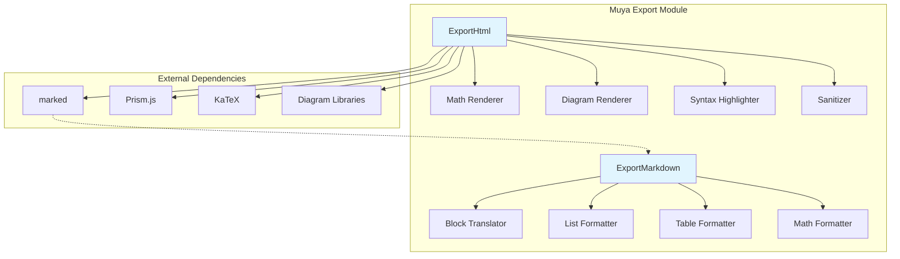
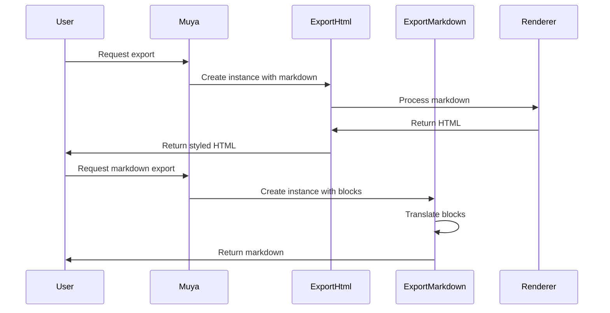
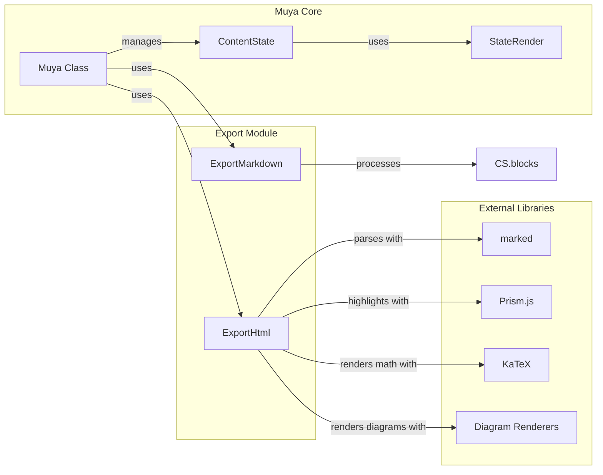
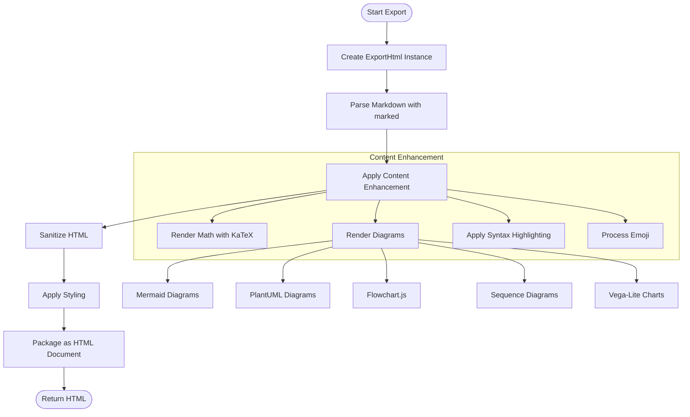
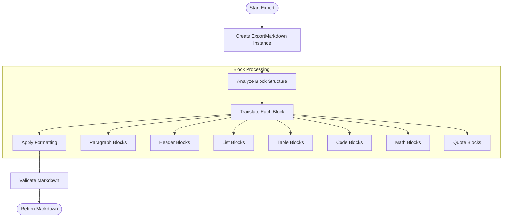
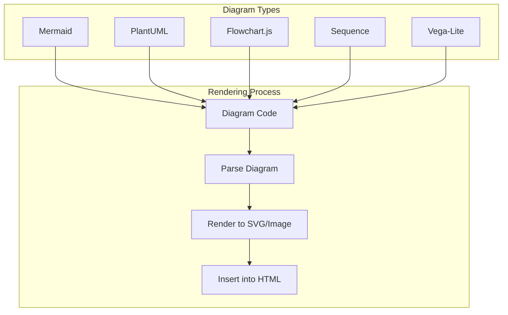
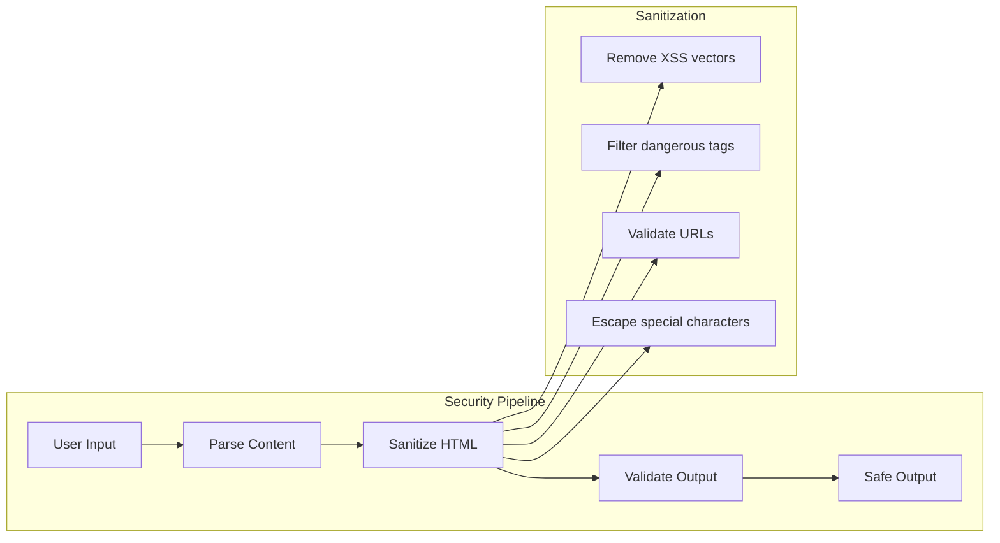

# Muya Export Module Documentation

## Overview

The `muya_export` module provides comprehensive export functionality for the Muya markdown editor framework. It enables users to convert markdown content into various formats, primarily HTML and Markdown, with support for advanced features like diagrams, mathematical expressions, and syntax highlighting.

## Purpose

This module serves as the export engine for the Muya editor, handling:
- **HTML Export**: Converts markdown to styled HTML with full support for diagrams, math, and syntax highlighting
- **Markdown Export**: Converts internal document representation back to clean markdown format
- **Document Formatting**: Applies consistent styling and layout for exported documents
- **Advanced Content Support**: Handles complex elements like mermaid diagrams, PlantUML, KaTeX math, and code blocks

## Architecture



## Core Components

### ExportHtml Class
- **Location**: `src/muya/lib/utils/exportHtml.js`
- **Purpose**: Converts markdown content to styled HTML with full feature support
- **Key Features**:
  - Diagram rendering (Mermaid, PlantUML, Flowchart, Sequence, Vega-Lite)
  - Mathematical expression rendering via KaTeX
  - Syntax highlighting with Prism.js
  - HTML sanitization for security
  - Customizable styling and themes
  - Header/footer support for document formatting

### ExportMarkdown Class
- **Location**: `src/muya/lib/utils/exportMarkdown.js`
- **Purpose**: Converts internal document blocks back to markdown format
- **Key Features**:
  - CommonMark and GitHub Flavored Markdown compliance
  - Support for various list indentation styles
  - Table formatting with alignment
  - Mathematical expression export
  - Footnote handling
  - Code block preservation

## Data Flow



## Integration with Muya Framework

The export module integrates with several other Muya components:

- **[muya_parser](muya_parser.md)**: Uses the StateRender component for markdown parsing
- **[muya_content](muya_content.md)**: Works with ContentState for document structure
- **[muya_ui_components](muya_ui_components.md)**: Leverages UI components for emoji validation
- **[muya_framework](muya_framework.md)**: Integrates with the core Muya class for configuration

### Key Dependencies



### Integration Points

1. **Muya Class Integration**: The main Muya class provides direct access to export functionality through:
   - `exportStyledHTML(options)`: Exports styled HTML with full feature support
   - `exportHtml()`: Exports basic HTML without additional styling
   - `getMarkdown()`: Retrieves current markdown content

2. **ContentState Integration**: ExportMarkdown works directly with ContentState's block structure:
   - Processes `blocks` array from ContentState
   - Respects `listIndentation` and `isGitlabCompatibilityEnabled` settings
   - Maintains document structure and formatting

3. **StateRender Integration**: ExportHtml leverages StateRender's parsing capabilities:
   - Uses marked library configuration from StateRender
   - Applies consistent syntax highlighting
   - Maintains diagram rendering compatibility

## Export Process

### HTML Export Process



1. **Markdown Parsing**: Uses marked library to convert markdown to HTML
2. **Content Enhancement**: Applies syntax highlighting, math rendering, and diagram processing
3. **Sanitization**: Cleans HTML using DOMPurify configuration
4. **Styling**: Applies GitHub markdown CSS and custom styles
5. **Packaging**: Wraps content in complete HTML document with headers/footers

### Markdown Export Process



1. **Block Analysis**: Processes internal document block structure
2. **Content Translation**: Converts each block type to appropriate markdown syntax
3. **Formatting**: Applies consistent indentation and spacing
4. **Special Handling**: Manages complex elements like tables, lists, and math

## Advanced Features

### Diagram Support

The export module provides comprehensive diagram rendering support:



- **Mermaid**: Flowcharts, sequence diagrams, Gantt charts
- **PlantUML**: UML diagrams with image generation
- **Flowchart.js**: Programmatic flowcharts
- **Sequence**: Sequence diagrams with customizable themes
- **Vega-Lite**: Statistical charts and visualizations

### Mathematical Expressions

KaTeX integration provides:
- Inline math expressions: `$...$`
- Block math expressions: `$$...$$`
- GitLab compatibility mode for fenced math blocks
- Error handling for invalid expressions
- Automatic font and styling integration

### Security Features



- **DOMPurify Configuration**: Custom sanitization rules for export
- **HTML Escaping**: Proper escaping of user-generated content
- **URL Validation**: Safe handling of links and image sources
- **Content Filtering**: Removal of potentially dangerous elements

## Error Handling

### ExportHtml Error Handling

```javascript
// Math rendering error handling
try {
  return katex.renderToString(math, { displayMode })
} catch (err) {
  return displayMode
    ? `<pre class="multiple-math invalid">\n${math}</pre>\n`
    : `<span class="inline-math invalid" title="invalid math">${math}</span>`
}

// Diagram rendering error handling
try {
  if (functionType === 'flowchart' || functionType === 'sequence') {
    const diagram = render.parse(rawCode)
    diagramContainer.innerHTML = ''
    diagram.drawSVG(diagramContainer, options)
  }
  // ... other diagram types
} catch (err) {
  diagramContainer.innerHTML = '< Invalid Diagram >'
}
```

### ExportMarkdown Error Handling

- **Block Type Validation**: Graceful handling of unknown block types
- **Text Normalization**: Safe processing of special characters
- **List Indentation**: Validation of indentation settings
- **Table Formatting**: Error recovery for malformed tables

## Performance Optimization

### Lazy Loading
- Diagram renderers loaded only when needed
- KaTeX CSS included only when math is present
- Efficient batch processing for large documents

### Caching Strategies
- Token caching for repeated content
- Image loading optimization
- Diagram rendering cache

### Memory Management
- Temporary DOM elements properly cleaned up
- Event listener management
- Resource cleanup after export

## Configuration Options

### HTML Export Options
- `title`: Document title
- `extraCss`: Additional CSS styles
- `header/footer`: Document headers and footers
- `printOptimization`: Optimize for printing
- `toc`: Table of contents

### Markdown Export Options
- `listIndentation`: List indentation style ('dfm', 'number', or custom)
- `isGitlabCompatibilityEnabled`: GitLab compatibility mode

## API Reference

### ExportHtml Class

#### Constructor
```javascript
new ExportHtml(markdown, muya)
```
- `markdown`: Source markdown content
- `muya`: Muya instance for configuration

#### Methods

##### `renderHtml(toc)`
Renders markdown to HTML with full feature support.
- `toc`: Optional table of contents HTML
- Returns: Promise resolving to HTML string

##### `generate(options)`
Generates complete HTML document with styling.
- `options`: Export configuration object
- Returns: Promise resolving to complete HTML document

### ExportMarkdown Class

#### Constructor
```javascript
new ExportMarkdown(blocks, listIndentation, isGitlabCompatibilityEnabled)
```
- `blocks`: Document block array from ContentState
- `listIndentation`: List indentation setting
- `isGitlabCompatibilityEnabled`: GitLab compatibility flag

#### Methods

##### `generate()`
Converts blocks to markdown format.
- Returns: Markdown string

## Usage Examples

### Basic HTML Export
```javascript
const muya = new Muya(container, options)
const html = await muya.exportStyledHTML({
  title: 'My Document',
  extraCss: 'body { font-family: Arial; }'
})
```

### Markdown Export
```javascript
const muya = new Muya(container, options)
const markdown = muya.getMarkdown()
```

### Advanced HTML Export with Headers/Footers
```javascript
const options = {
  title: 'Professional Document',
  header: {
    left: 'Company Name',
    center: 'Document Title',
    right: 'Date'
  },
  footer: {
    left: 'Confidential',
    center: 'Page {page}',
    right: 'Version 1.0'
  },
  printOptimization: true
}
const html = await muya.exportStyledHTML(options)
```

## Security Considerations

- HTML sanitization using DOMPurify configuration
- Safe handling of user-generated content
- Protection against XSS attacks in exported HTML
- Validation of external URLs and resources

## Performance Features

- Lazy loading of diagram renderers
- Efficient batch processing for large documents
- Memory-conscious DOM manipulation
- Optimized CSS inclusion based on content requirements

## Browser Compatibility

The export module is designed to work across modern browsers:
- Chrome/Chromium 60+
- Firefox 55+
- Safari 11+
- Edge 79+

## Troubleshooting

### Common Issues

1. **Diagrams not rendering**: Ensure diagram libraries are properly loaded
2. **Math expressions failing**: Check KaTeX installation and configuration
3. **Styling issues**: Verify CSS paths and loading order
4. **Export timeouts**: Consider breaking large documents into smaller sections

### Debug Mode

Enable debug logging to troubleshoot export issues:
```javascript
const muya = new Muya(container, {
  debug: true,
  // ... other options
})
```

## Contributing

When contributing to the export module:

1. Maintain compatibility with CommonMark and GitHub Flavored Markdown
2. Ensure proper error handling for all edge cases
3. Add comprehensive tests for new features
4. Update documentation for any API changes
5. Consider performance implications of new features

## Future Enhancements

Potential areas for improvement:
- Additional output formats (PDF, Word, etc.)
- Enhanced theming system
- Plugin architecture for custom exporters
- Batch export capabilities
- Cloud storage integration
- Protection against XSS attacks in exported HTML

## Performance Features

- Lazy loading of diagram renderers
- Efficient batch processing for large documents
- Memory-conscious DOM manipulation
- Optimized CSS inclusion based on content requirements

## Usage Examples

The export module is typically used through the main Muya class, which provides a unified interface for all export operations. Users can export documents in various formats while maintaining consistent styling and feature support across all output types.