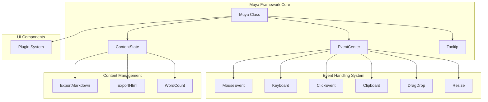
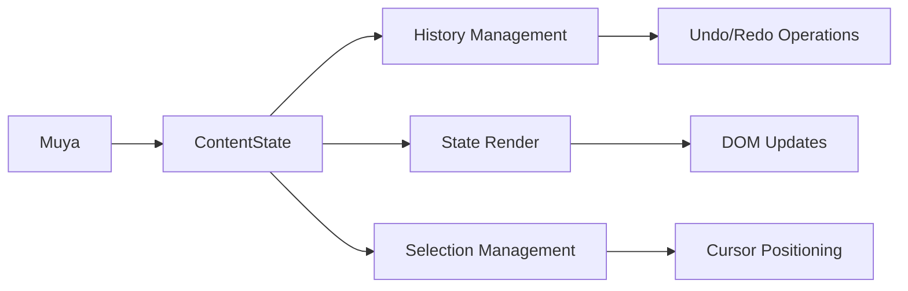
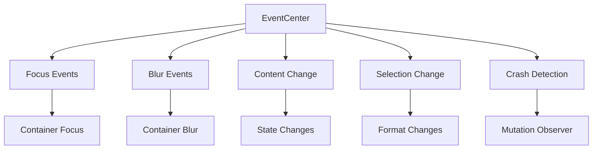
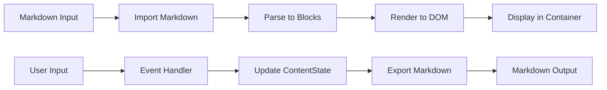
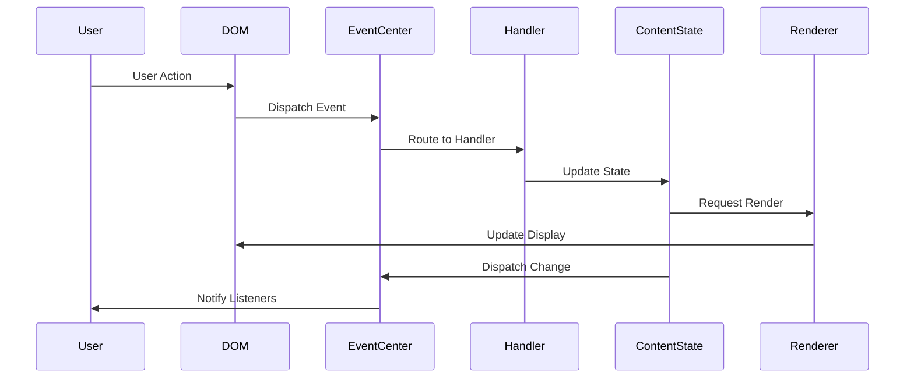

# Muya Framework Documentation

## Introduction

The Muya Framework is a sophisticated markdown editor engine that serves as the core text editing and rendering component within the application. Built as a standalone library, Muya provides a comprehensive set of features for markdown editing, content management, and user interaction handling. It operates as an independent module that can be integrated into various applications while maintaining its own ecosystem of content state management, event handling, and UI components.

## Architecture Overview

The Muya Framework follows a modular architecture centered around the main `Muya` class that orchestrates various subsystems. The framework is designed with a clear separation of concerns, where each module handles specific aspects of the editor functionality.



## Core Components

### Main Muya Class

The `Muya` class serves as the primary entry point and orchestrator for the entire framework. It manages the lifecycle of the editor, coordinates between different subsystems, and provides a unified API for external integration.

**Key Responsibilities:**
- Container management and DOM manipulation
- Plugin system initialization and management
- Content state coordination
- Event system setup and management
- Public API exposure

**Core Dependencies:**
- [ContentState](muya_content.md) - Manages the document content and state
- [EventCenter](muya_events.md) - Handles event distribution and management
- [Tooltip](muya_ui_components.md) - Provides tooltip functionality
- Various event handlers for user interaction

### Content State Management

The framework integrates with the ContentState system to manage document content, history, and rendering. This separation allows for complex content operations while maintaining a clean interface.



### Event System Architecture

Muya implements a comprehensive event system that handles all user interactions and system events. The EventCenter acts as the central hub for event distribution.



## Data Flow

### Content Processing Pipeline

The framework processes content through a well-defined pipeline that ensures consistency and proper rendering.



### Event Handling Flow

User interactions are processed through a sophisticated event handling system that ensures proper response and state management.



## Key Features

### Plugin System

Muya supports a plugin architecture that allows extending functionality without modifying the core framework. Plugins are registered statically and instantiated during Muya initialization.

```javascript
// Plugin registration
Muya.use(MyPlugin, options)

// Plugin usage during initialization
if (Muya.plugins.length) {
  for (const { plugin: Plugin, options: opts } of Muya.plugins) {
    this[Plugin.pluginName] = new Plugin(this, opts)
  }
}
```

### Content Export Capabilities

The framework provides multiple export formats for content, supporting various use cases and integration requirements.

- **Markdown Export**: Converts internal state back to markdown format
- **HTML Export**: Generates styled HTML output for presentation
- **Word Count**: Provides document statistics

### Crash Detection and Recovery

Muya implements a mutation observer system to detect when the editor enters an inconsistent state, particularly during table operations or when the editor becomes unresponsive.

```javascript
// Mutation observer setup
const observer = new MutationObserver(callback)
observer.observe(container, { childList: true, subtree: true })

// Crash detection logic
if (removedNodes && removedNodes.length) {
  const hasTable = Array.from(removedNodes).some(node => 
    node.nodeType === 1 && node.closest('table.ag-paragraph')
  )
  if (hasTable) {
    eventCenter.dispatch('crashed')
  }
}
```

## Integration Points

### Main Application Integration

The Muya Framework integrates with the main application through the [App](main_app_core.md) component, which manages the overall application lifecycle and coordinates between different subsystems.

### UI Component Integration

Muya works closely with various UI components from the [muya_ui_components](muya_ui_components.md) module to provide rich editing features like pickers, toolbars, and floating interfaces.

### Event System Integration

The framework's event system connects with the broader application event handling through the [EventCenter](muya_events.md), ensuring consistent event management across the application.

## Configuration and Options

Muya supports extensive configuration options that control editor behavior, appearance, and functionality. Key configuration areas include:

- **Focus Mode**: Enables distraction-free editing
- **Font Settings**: Controls typography and spacing
- **Tab Size**: Configures indentation behavior
- **List Indentation**: Manages list formatting
- **Spellcheck**: Controls browser spellcheck integration
- **Quick Insert**: Manages insertion hints

## API Reference

### Core Methods

- `setMarkdown(markdown, cursor, isRenderCursor)`: Sets editor content
- `getMarkdown()`: Retrieves current content as markdown
- `getHistory()`: Gets document history
- `undo()`: Performs undo operation
- `redo()`: Performs redo operation
- `focus()`: Sets focus to editor
- `blur()`: Removes focus from editor

### Content Manipulation

- `format(type)`: Applies formatting to selection
- `insertImage(imageInfo)`: Inserts image
- `createTable(tableChecker)`: Creates table
- `search(value, opt)`: Searches content
- `replace(value, opt)`: Replaces content

### Event Management

- `on(event, listener)`: Subscribes to events
- `off(event, listener)`: Unsubscribes from events
- `once(event, listener)`: One-time event subscription

## Error Handling

The framework implements comprehensive error handling and crash detection mechanisms. When critical errors are detected, the system dispatches crash events that can be handled by the integrating application for recovery or user notification.

## Performance Considerations

Muya is designed with performance in mind, implementing:

- Efficient DOM mutation observation
- Optimized rendering pipelines
- Debounced change notifications
- Memory-efficient state management
- Plugin lazy loading

## Dependencies

The Muya Framework has dependencies on several other modules within the system:

- [muya_content](muya_content.md) - Content state and history management
- [muya_events](muya_events.md) - Event handling and distribution
- [muya_ui_components](muya_ui_components.md) - UI component library
- [muya_parser](muya_parser.md) - Content parsing and rendering
- [muya_selection](muya_selection.md) - Text selection and cursor management
- [muya_export](muya_export.md) - Content export utilities

This modular design ensures that Muya can be maintained and extended independently while providing a rich set of features for markdown editing and content management.