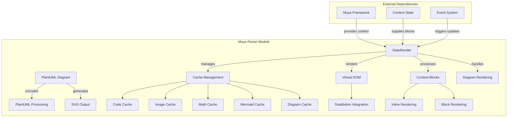
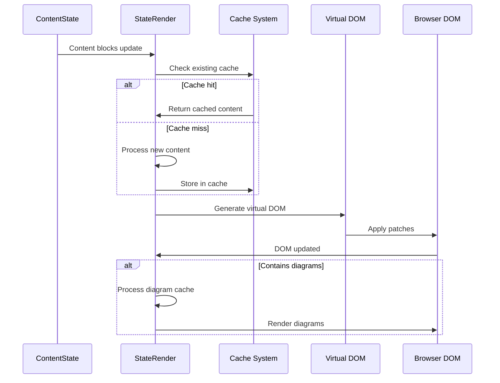

# Muya Parser Module Documentation

## Overview

The **muya_parser** module is a core component of the Muya editor framework responsible for parsing and rendering markdown content into interactive HTML representations. It serves as the bridge between the abstract content state and the visual representation users interact with in the editor.

## Purpose

The parser module transforms markdown content into a virtual DOM structure that can be efficiently updated and rendered in the browser. It handles complex rendering scenarios including:

- **Markdown parsing and tokenization**
- **Virtual DOM management** using Snabbdom
- **Diagram rendering** (Mermaid, PlantUML, Flowchart, Sequence diagrams)
- **Code syntax highlighting and caching**
- **Image and media loading optimization**
- **Incremental rendering for performance**

## Architecture

## Core Components

### StateRender (`src.muya.lib.parser.render.index.StateRender`)

The main rendering engine that orchestrates the transformation of content blocks into visual representations. For detailed information, see [StateRender Documentation](state_render.md).

Key responsibilities include:
- **Full rendering**: Complete document rendering from scratch
- **Partial rendering**: Efficient updates of modified content sections
- **Single block rendering**: Targeted updates for individual blocks
- **Cache management**: Optimized storage and retrieval of rendered content
- **Diagram processing**: Integration with various diagram rendering libraries

### PlantUML Diagram (`src.muya.lib.parser.render.plantuml.Diagram`)

Specialized component for handling PlantUML diagram encoding and rendering. For detailed information, see [PlantUML Diagram Documentation](plantuml_diagram.md).

Key features:
- **Text encoding**: UTF-8 compression and ASCII transformation
- **URL generation**: PlantUML service integration
- **SVG rendering**: Image element creation and insertion

## Rendering Pipeline

## Cache Management

The parser implements a sophisticated caching system to optimize performance:

### Cache Types:
- **Code Cache**: Syntax highlighted code blocks
- **Image Cache**: Loaded images with timestamp tracking
- **Math Cache**: Mathematical expressions
- **Mermaid Cache**: Mermaid diagram processing results
- **Diagram Cache**: Other diagram formats (PlantUML, Flowchart, etc.)
- **Token Cache**: Parsed markdown tokens
- **Label Cache**: Link reference definitions

### Cache Invalidation:
- Image cache supports touch-based invalidation
- Diagram caches are cleared after each render cycle
- Code cache is cleared on content updates

## Integration Points

### Dependencies:
- **[Muya Framework](muya_framework.md)**: Core editor context and configuration
- **[Muya Content](muya_content.md)**: Content state management and block structure
- **[Muya Events](muya_events.md)**: Event system for triggering renders
- **[Muya UI Components](muya_ui_components.md)**: UI elements that may be rendered

### Related Modules:
- **[Muya Selection](muya_selection.md)**: Cursor and selection state for conflict detection
- **[Muya Export](muya_export.md)**: Export functionality that may use parser output

## Performance Optimizations

1. **Incremental Rendering**: Only updates changed portions of the document
2. **Virtual DOM**: Minimizes actual DOM manipulations
3. **Multi-level Caching**: Reduces redundant processing
4. **Async Diagram Loading**: Non-blocking diagram rendering
5. **Selective Updates**: Targeted single-block rendering capability

## Error Handling

The parser includes robust error handling for:
- Invalid diagram syntax
- Malformed markdown
- Missing dependencies
- Rendering failures

Error states are visually indicated in the editor with appropriate CSS classes and user-friendly messages.