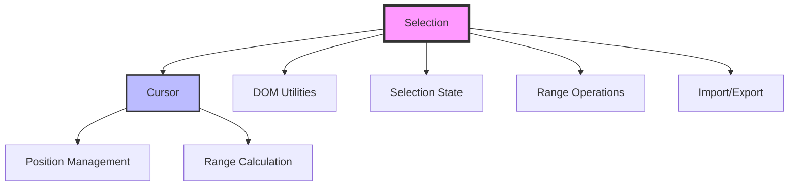

# Muya Selection Module Documentation

## Overview

The `muya_selection` module is a critical component of the Muya editor framework that handles text selection, cursor management, and range operations within the editor. This module provides sophisticated selection management capabilities that are essential for rich text editing functionality.

## Purpose

The selection module serves as the foundation for:
- **Text Selection Management**: Handling user text selections across different content types
- **Cursor Positioning**: Precise cursor placement and movement within the editor
- **Range Operations**: Creating, modifying, and restoring text ranges
- **Selection State Persistence**: Saving and restoring selection states during content manipulation
- **Cross-browser Compatibility**: Ensuring consistent selection behavior across different browsers

## Architecture



## Core Components

### 1. Selection Core ([Detailed Documentation](selection_core.md))

The main selection class that provides comprehensive selection management functionality. Adapted from the medium-editor project and customized for specialized use in the Muya editor.

**Key Responsibilities:**
- Selection state management and manipulation
- Range creation, modification, and restoration
- Cursor positioning and movement
- Selection import/export for persistence
- Cross-browser compatibility handling

For detailed implementation details, methods, and advanced features, see the [Selection Core Documentation](selection_core.md).

### 2. Cursor Management ([Detailed Documentation](cursor_management.md))

A specialized class for managing cursor positions and ranges within the editor content.

**Key Responsibilities:**
- Cursor position representation (anchor, focus, start, end)
- Paragraph-based cursor tracking
- Direction-aware range calculation
- History tracking for undo/redo operations

For detailed cursor positioning algorithms and range calculations, see the [Cursor Management Documentation](cursor_management.md).

## Key Features

### Selection State Management
The module provides sophisticated selection state management that can:
- Save and restore complete selection states
- Handle complex selection scenarios (images, empty blocks, anchor tags)
- Manage selection across different content types
- Handle edge cases like selections at element boundaries

### Cursor Positioning
Advanced cursor positioning capabilities include:
- Precise cursor placement within paragraphs
- Image-aware cursor positioning
- Multi-paragraph selection support
- Coordinate-based cursor positioning

### Range Operations
Comprehensive range operation support:
- Range creation and manipulation
- Selection import/export functionality
- Cross-browser range compatibility
- Complex range restoration scenarios

## Dependencies

The selection module integrates with several other Muya modules:

- **[muya_content](muya_content.md)**: Provides content state management and history tracking
- **[muya_events](muya_events.md)**: Handles user interactions that trigger selection changes
- **[muya_ui_components](muya_ui_components.md)**: Manages UI components that may affect selection
- **[muya_parser](muya_parser.md)**: Provides rendering context for selection operations

## Usage Patterns

### Basic Selection Operations
```javascript
// Get current selection
const selection = Selection.getSelectionRange()

// Set cursor position
Selection.moveCursor(node, offset)

// Get cursor coordinates
const coords = Selection.getCursorCoords()
```

### Advanced Selection Management
```javascript
// Import selection state
Selection.importSelection(selectionState, rootElement)

// Get cursor range with paragraph information
const cursorRange = Selection.getCursorRange()

// Set cursor range across paragraphs
Selection.setCursorRange(cursorRange)
```

## Browser Compatibility

The selection module includes specific handling for:
- Chrome's text node counting behavior
- Firefox's range calculation differences
- Safari's selection boundary handling
- Edge's anchor tag positioning quirks

## Performance Considerations

- Efficient DOM traversal algorithms for large documents
- Minimal reflow operations during selection changes
- Cached calculations for repeated operations
- Optimized tree walking for selection restoration

## Error Handling

The module includes robust error handling for:
- Invalid selection states
- Missing DOM elements
- Cross-browser inconsistencies
- Edge case scenarios (empty selections, invalid ranges)

## Future Enhancements

Potential areas for improvement:
- Touch device selection support
- Multi-cursor editing capabilities
- Enhanced accessibility features
- Performance optimizations for very large documents