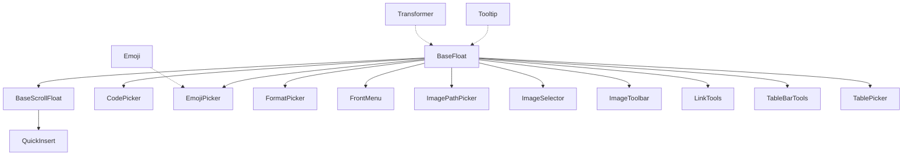
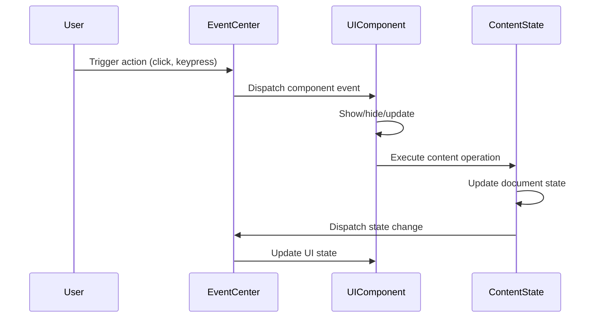

# Muya UI Components Module Documentation

## Overview

The `muya_ui_components` module provides a comprehensive set of user interface components for the Muya markdown editor framework. These components handle various interactive elements including floating panels, pickers, toolbars, and contextual menus that enhance the editing experience.

## Architecture

The module follows a hierarchical component architecture with base classes providing common functionality and specialized components extending these bases:



## Core Components

### Base Classes

#### BaseFloat
The foundational floating component class that provides:
- Popper.js integration for positioning
- Event handling and lifecycle management
- Show/hide functionality with animations
- Scroll detection and auto-hide behavior
- Arrow rendering and styling options

*Detailed documentation: [Base Components](base_components.md)*

#### BaseScrollFloat
Extends BaseFloat to add scrollable list functionality:
- Keyboard navigation (arrow keys, tab, enter)
- Item selection and highlighting
- Auto-scroll to active items
- Search and filtering capabilities

*Detailed documentation: [Base Components](base_components.md)*

### UI Components

#### CodePicker
Language selection dropdown for code blocks with:
- Syntax highlighting language search
- File icon integration
- Fuzzy search using Prism.js

#### EmojiPicker
Emoji selection interface featuring:
- Categorized emoji display
- Fuzzy search functionality
- Integration with emoji database

#### FormatPicker
Text formatting toolbar providing:
- Inline formatting options (bold, italic, etc.)
- Active state indication
- Keyboard shortcut display

*Detailed documentation: [Picker Components](picker_components.md)*

#### FrontMenu
Contextual block manipulation menu with:
- Block transformation options
- Paragraph operations (duplicate, delete, new)
- Dynamic submenu generation
- Keyboard shortcuts

#### QuickInsert
Block insertion palette with fuzzy search and categorized content types.

*Detailed documentation: [Menu Components](menu_components.md)*

#### Image Components
- **ImagePathPicker**: Local file path selection
- **ImageSelector**: Comprehensive image insertion dialog
- **ImageToolbar**: Image manipulation toolbar

*Detailed documentation: [Image Components](image_components.md)*

#### Table Components
- **TablePicker**: Interactive table dimension selector
- **TableBarTools**: Table editing toolbar

#### LinkTools
Link manipulation toolbar with unlink and navigation options.

*Detailed documentation: [Tool Components](tool_components.md)*

#### Tooltip
Simple tooltip system using data attributes.

#### Transformer
Image resize handles for visual dimension adjustment.

*Detailed documentation: [Utility Components](utility_components.md)*

## Component Interactions



## Event System

All components integrate with Muya's event center for:
- Component lifecycle events (`muya-float`)
- User interaction events
- Content state changes
- Cross-component communication

## Styling and Theming

Components use CSS classes following the `ag-` prefix convention:
- `ag-float-container`: Main floating container
- `ag-float-wrapper`: Wrapper with arrow
- `ag-popper-arrow`: Positioning arrow
- Component-specific classes (e.g., `ag-emoji-picker`, `ag-format-picker`)

## Dependencies

- **Popper.js**: Positioning engine for floating elements
- **Snabbdom**: Virtual DOM for efficient rendering
- **Fuzzaldrin**: Fuzzy search functionality
- **Element Resize Detector**: Container size monitoring

## Integration Points

The module integrates with:
- [muya_content.md](muya_content.md): Content state management
- [muya_events.md](muya_events.md): Event handling system
- [muya_framework.md](muya_framework.md): Core Muya framework

## Usage Patterns

### Component Registration
```javascript
// Components register with Muya instance
const codePicker = new CodePicker(muya, options)
const emojiPicker = new EmojiPicker(muya)
```

### Event Subscription
```javascript
// Components listen for specific events
eventCenter.subscribe('muya-code-picker', ({reference, lang, cb}) => {
  // Handle code picker activation
})
```

### Content Manipulation
```javascript
// Components trigger content state changes
contentState.format(item.type)
contentState.replaceImage(imageInfo, attributes)
```

## Performance Considerations

- Virtual DOM rendering for efficient updates
- Event delegation for reduced memory usage
- Lazy loading of component data (emojis, search results)
- Resize detection with scroll-based polling fallback
- Auto-hide on scroll to reduce visual clutter

## Extensibility

The modular architecture allows for:
- Custom picker implementations extending BaseScrollFloat
- New toolbar types extending BaseFloat
- Plugin registration through static `pluginName` property
- Configuration options for positioning and behavior

## Error Handling

Components implement defensive programming:
- Null checks for references and data
- Graceful degradation when dependencies unavailable
- User feedback for invalid operations
- Console warnings for configuration issues