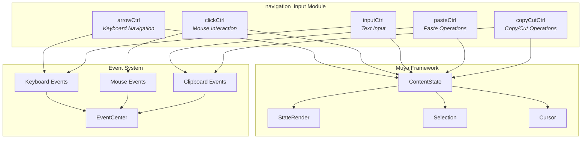
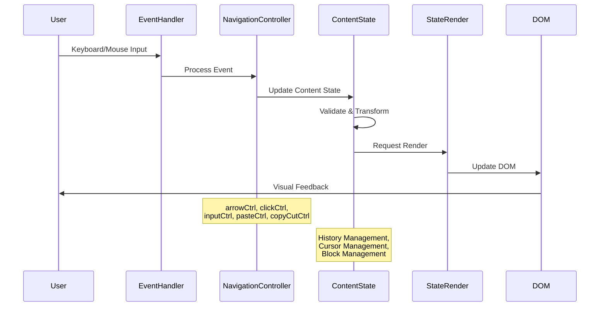
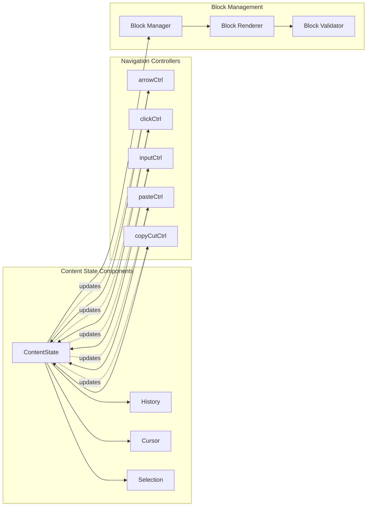
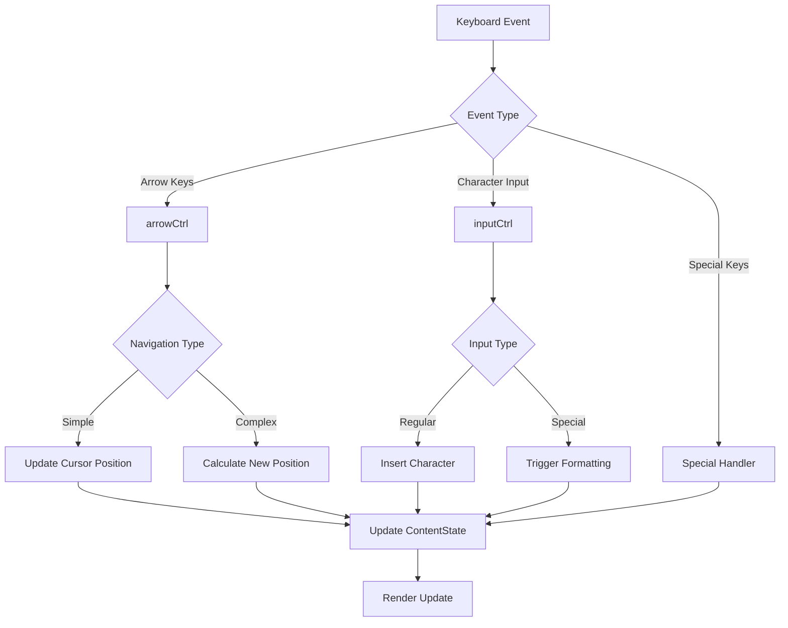
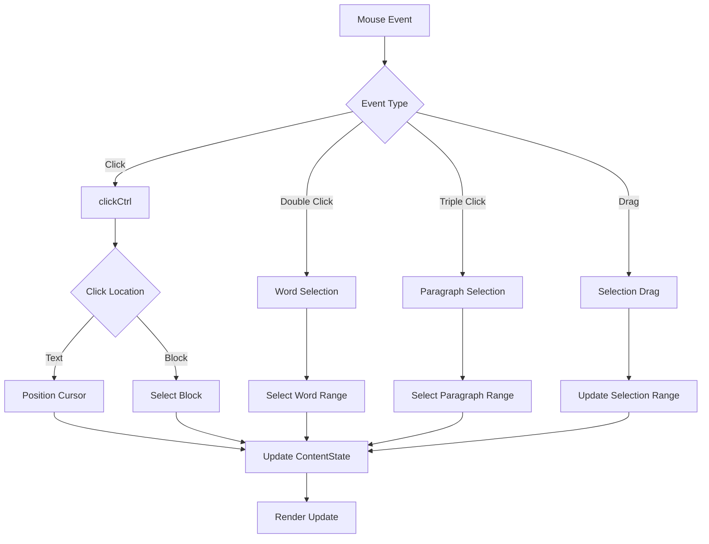
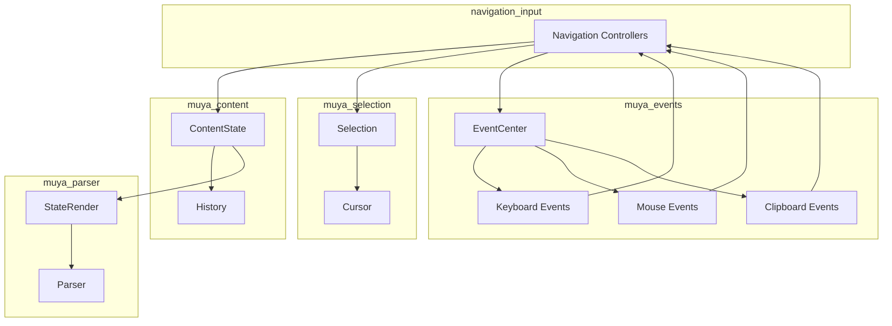

# Navigation Input Module Documentation

## Introduction

The navigation_input module is a critical component of the Muya framework that handles user input interactions for navigation and text manipulation within the markdown editor. This module provides the core functionality for cursor movement, text input, clipboard operations, and click interactions, serving as the primary interface between user actions and content state management.

## Module Overview

The navigation_input module operates as a specialized controller system within the Muya content management ecosystem. It processes various user inputs including keyboard navigation (arrow keys), mouse interactions (clicks), text input, and clipboard operations (copy, cut, paste). These controllers work in concert to provide seamless text editing and navigation capabilities within the markdown editor environment.

## Architecture

### Component Structure

### Data Flow Architecture

## Core Components

### arrowCtrl - Keyboard Navigation Controller

The arrowCtrl component manages all keyboard navigation operations within the editor. It handles cursor movement using arrow keys, including complex navigation scenarios such as moving between table cells, navigating within code blocks, and handling multi-line selections. The controller maintains awareness of the current cursor position and calculates appropriate movement based on the document structure.

Key responsibilities include:
- Arrow key navigation (up, down, left, right)
- Word-by-word navigation (Ctrl+arrow combinations)
- Line and paragraph navigation
- Table cell navigation
- Code block navigation
- Selection extension during navigation

### clickCtrl - Mouse Interaction Controller

The clickCtrl component processes all mouse interaction events within the editor interface. It handles single clicks, double clicks, triple clicks, and drag operations for text selection. The controller is responsible for determining the appropriate cursor position based on click coordinates and managing selection states across different block types.

Key responsibilities include:
- Single click cursor positioning
- Double-click word selection
- Triple-click paragraph selection
- Drag selection operations
- Multi-cursor support
- Block-specific click handling

### inputCtrl - Text Input Controller

The inputCtrl component manages all text input operations within the editor. It processes character input, handles special key combinations, and manages the transformation of raw input into structured content blocks. The controller works closely with the content state to ensure proper text formatting and block management.

Key responsibilities include:
- Character input processing
- Special character handling
- Auto-formatting triggers
- Block creation and modification
- Text transformation rules
- Input validation

### pasteCtrl - Paste Operations Controller

The pasteCtrl component handles all paste operations within the editor, managing the transformation of clipboard content into appropriate markdown structures. It processes various content types including plain text, HTML, and rich content, ensuring proper formatting and block creation based on the pasted content.

Key responsibilities include:
- Clipboard content parsing
- HTML to Markdown conversion
- Plain text processing
- Image paste handling
- Table paste operations
- Code block paste handling

### copyCutCtrl - Copy and Cut Operations Controller

The copyCutCtrl component manages copy and cut operations within the editor, handling the extraction of content from the current selection and preparing it for clipboard operations. The controller ensures proper formatting of copied content and manages the removal of content during cut operations.

Key responsibilities include:
- Selection content extraction
- Markdown formatting preservation
- HTML format generation
- Plain text format generation
- Cut operation content removal
- Multi-format clipboard support

## Integration with Content State

### Content State Management

### History Integration

The navigation_input module integrates deeply with the ContentState's history management system. Each navigation or input operation that modifies the content state automatically triggers history recording, enabling comprehensive undo/redo functionality. The history system captures cursor positions, content changes, and selection states to provide accurate restoration points.

### Cursor and Selection Management

All navigation controllers work with the centralized cursor and selection management system. The ContentState maintains the current cursor position and selection ranges, while navigation controllers update these values based on user interactions. This centralized approach ensures consistency across all input methods and enables complex selection operations.

## Event Processing Flow

### Keyboard Event Processing

### Mouse Event Processing

## Dependencies and Relationships

### Internal Dependencies

The navigation_input module depends on several core components within the Muya framework:

- **[ContentState](../muya_content.md)**: Central content management and state persistence
- **[Selection](../muya_selection.md)**: Cursor positioning and selection range management
- **[EventCenter](../muya_events.md)**: Event handling and distribution system
- **[StateRender](../muya_parser.md)**: Content rendering and DOM update coordination

### External Dependencies

The module interfaces with browser APIs and external systems:

- **Clipboard API**: For copy, cut, and paste operations
- **Selection API**: For text selection and range management
- **Keyboard Events**: For input processing and navigation
- **Mouse Events**: For click and drag interactions

### Module Interactions

## Usage Patterns

### Basic Navigation

The navigation_input module handles fundamental text navigation operations that users expect in any text editor. Arrow key navigation works seamlessly across different block types, maintaining appropriate cursor positioning and handling edge cases such as moving between paragraphs, table cells, and code blocks.

### Advanced Selection

Complex selection operations are managed through coordinated interaction between clickCtrl and the selection system. Users can perform word selection through double-clicking, paragraph selection through triple-clicking, and custom range selection through drag operations. The module ensures that selections are properly bounded and formatted.

### Content Input

Text input is processed through inputCtrl, which handles both regular character input and special formatting triggers. The controller recognizes markdown syntax patterns and can automatically format content as users type, providing real-time feedback and maintaining document structure.

### Clipboard Operations

Copy, cut, and paste operations are handled by dedicated controllers that ensure content is properly formatted for clipboard operations. The module supports multiple clipboard formats and can intelligently convert between different content types during paste operations.

## Error Handling and Edge Cases

### Input Validation

The navigation_input module implements comprehensive input validation to prevent invalid content states. All user inputs are validated against the current document structure, and inappropriate operations are either prevented or transformed into valid alternatives.

### Recovery Mechanisms

When errors occur during navigation or input operations, the module implements recovery mechanisms that restore the editor to a stable state. This includes cursor position validation, selection range correction, and content state rollback for failed operations.

### Browser Compatibility

The module includes browser-specific handling for different event models and API implementations. This ensures consistent behavior across different browsers and handles variations in keyboard event handling, clipboard API support, and selection management.

## Performance Considerations

### Event Debouncing

Input events are debounced to prevent excessive processing and rendering updates. This is particularly important for rapid keyboard input and mouse movements, where processing every individual event would create performance bottlenecks.

### Selective Rendering

The module works with the rendering system to ensure that only necessary DOM updates are performed. When navigation or input operations affect only small portions of the document, selective rendering is used to minimize performance impact.

### Memory Management

Event handlers and temporary data structures are properly managed to prevent memory leaks. The module implements cleanup procedures for long-running operations and ensures that references are properly released when no longer needed.

## Testing and Validation

### Unit Testing

Individual controllers within the navigation_input module are designed for testability, with clear separation of concerns and minimal external dependencies. This enables comprehensive unit testing of navigation logic, input processing, and clipboard operations.

### Integration Testing

The module's integration with other system components is validated through integration testing that verifies proper coordination between navigation controllers, content state management, and rendering systems.

### User Experience Testing

Navigation and input behaviors are validated against user expectations and common text editing patterns. This includes testing for intuitive behavior, consistent responses, and appropriate feedback for user actions.

## Future Enhancements

### Advanced Navigation Features

Potential enhancements include support for more sophisticated navigation patterns, such as structural navigation (moving by headings, paragraphs, or blocks), bookmark navigation, and search-based navigation.

### Enhanced Input Processing

Future improvements may include more intelligent text processing, such as automatic formatting detection, smart punctuation handling, and context-aware input suggestions.

### Accessibility Improvements

The module can be enhanced with better accessibility support, including screen reader compatibility, keyboard navigation improvements, and assistive technology integration.

## Conclusion

The navigation_input module serves as the primary interface between user interactions and content management within the Muya framework. Through its comprehensive set of controllers for navigation, input, and clipboard operations, it provides the foundation for intuitive and efficient text editing experiences. The module's integration with the broader Muya ecosystem ensures consistent behavior, proper state management, and reliable performance across all user interactions.