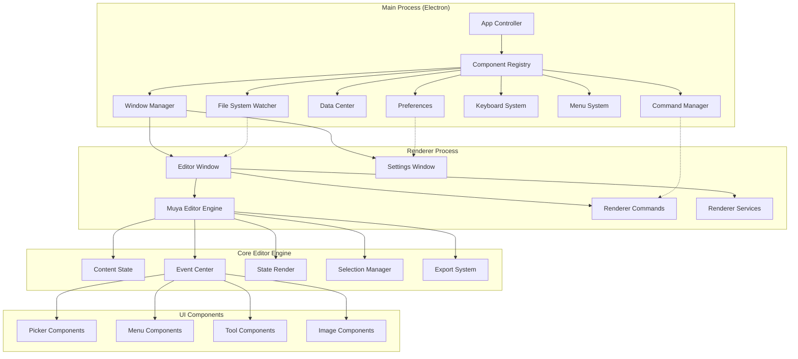

# MarkText Repository Overview

## Purpose

MarkText is a sophisticated, cross-platform markdown editor built with Electron that provides a seamless writing experience with real-time preview, extensive customization options, and powerful editing capabilities. The application serves as a modern alternative to traditional markdown editors, offering features like live preview, multiple themes, plugin support, and comprehensive file management.

## End-to-End Architecture

## Core Module References

### Main Application Core
- **[main_app_core](main_app_core.md)**: Central orchestrator managing application lifecycle, window management, and component coordination
- **[window_management](window_management.md)**: Multi-window coordination with intelligent file distribution and activity tracking
- **[command_system](command_system.md)**: Unified command execution framework for user actions and keyboard shortcuts
- **[data_management](data_management.md)**: Centralized data persistence with encrypted storage for sensitive information
- **[file_system](file_system.md)**: Real-time file monitoring and change detection with cross-platform compatibility
- **[keyboard_system](keyboard_system.md)**: Cross-platform keyboard input handling with dynamic layout support
- **[menu_system](menu_system.md)**: Dynamic menu management with platform-specific adaptations
- **[preferences](preferences.md)**: User settings management with schema validation and real-time synchronization
- **[window_types](window_types.md)**: Specialized window implementations for editing and settings

### Muya Editor Framework
- **[muya_framework](muya_framework.md)**: Core editor engine providing markdown editing capabilities
- **[muya_content](muya_content.md)**: Content state management with block-based architecture and history tracking
- **[muya_events](muya_events.md)**: Comprehensive event handling system for user interactions
- **[muya_ui_components](muya_ui_components.md)**: Rich UI component library with floating panels and pickers
- **[muya_parser](muya_parser.md)**: Markdown parsing and rendering with virtual DOM optimization
- **[muya_selection](muya_selection.md)**: Advanced text selection and cursor management
- **[muya_export](muya_export.md)**: Multi-format export system with diagram and math support

### Renderer Process Components
- **[renderer_commands](renderer_commands.md)**: Command execution layer for renderer-side operations
- **[renderer_services](renderer_services.md)**: Document export and print preparation services
- **[renderer_spellchecker](renderer_spellchecker.md)**: Cross-platform spell checking with language switching
- **[renderer_node](renderer_node.md)**: File system search capabilities using ripgrep
- **[renderer_preferences](renderer_preferences.md)**: UI for keyboard shortcut customization

### Shared Utilities
- **[common_utils](common_utils.md)**: Path management and environment utilities
- **[renderer_utilities](renderer_utilities.md)**: Tree structure manipulation for hierarchical data

## Key Features

- **Multi-Window Support**: Intelligent window management with file distribution
- **Real-time Preview**: Live markdown rendering with syntax highlighting
- **Extensive Customization**: Themes, keybindings, and editor preferences
- **Advanced Editing**: Tables, diagrams, math expressions, and code blocks
- **Cross-Platform**: Consistent experience on Windows, macOS, and Linux
- **Plugin Architecture**: Extensible design for custom functionality
- **Export Capabilities**: HTML, PDF, and various markdown formats
- **File System Integration**: Real-time file watching and project management
- **Search Functionality**: Full-text search with ripgrep integration
- **Spell Checking**: Multi-language support with platform-specific optimizations

## Technology Stack

- **Electron**: Cross-platform desktop application framework
- **Node.js**: Server-side JavaScript runtime
- **Snabbdom**: Virtual DOM library for efficient rendering
- **marked**: Markdown parser and compiler
- **KaTeX**: Math expression rendering
- **Prism.js**: Syntax highlighting engine
- **chokidar**: File system watcher
- **ripgrep**: Fast text search utility
- **Popper.js**: Positioning engine for UI components