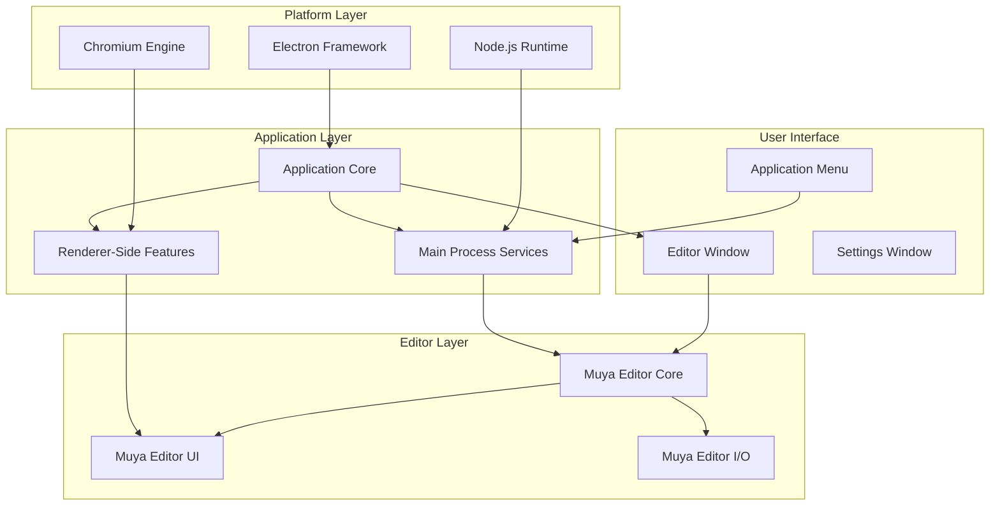
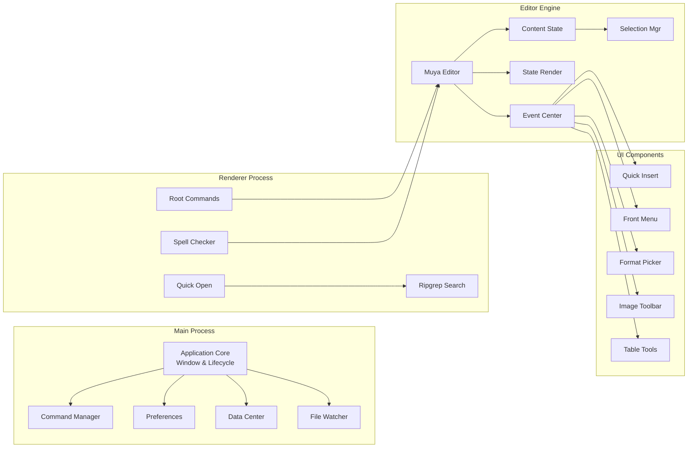

# MarkText Repository Overview

MarkText is a **simple and elegant open-source markdown editor** that focuses on speed and usability. It provides a seamless WYSIWYG editing experience with real-time preview, making markdown writing intuitive and efficient.

## Purpose

MarkText aims to be a **next-generation markdown editor** that removes the friction between writing and previewing markdown. It offers:
- Real-time rendering of markdown syntax
- Clean, distraction-free writing interface
- Extensible architecture for custom functionality
- Cross-platform support (Windows, macOS, Linux)
- GitHub Flavored Markdown support with extensions

## End-to-End Architecture

```mermaid
graph TB
    subgraph "Application Layer"
        App[Application Core]
        MPS[Main Process Services]
        Renderer[Renderer-Side Features]
    end
    
    subgraph "Editor Layer"
        MuyaCore[Muya Editor Core]
        MuyaUI[Muya Editor UI]
        MuyaIO[Muya Editor I/O]
    end
    
    subgraph "Platform Layer"
        Electron[Electron Framework]
        Node[Node.js Runtime]
        Chromium[Chromium Engine]
    end
    
    subgraph "User Interface"
        EditorWindow[Editor Window]
        SettingsWindow[Settings Window]
        MenuBar[Application Menu]
    end
    
    App --> MPS
    App --> Renderer
    App --> EditorWindow
    
    MPS --> MuyaCore
    Renderer --> MuyaUI
    
    MuyaCore --> MuyaUI
    MuyaCore --> MuyaIO
    
    Electron --> App
    Chromium --> Renderer
    Node --> MPS
    
    EditorWindow --> MuyaCore
    MenuBar --> MPS
```

## Core Module Architecture

```mermaid
graph LR
    subgraph "Main Process"
        AC[Application Core<br/>Window & Lifecycle]
        CM[Command Manager]
        Pref[Preferences]
        DC[Data Center]
        FW[File Watcher]
    end
    
    subgraph "Renderer Process"
        RC[Root Commands]
        QO[Quick Open]
        SC[Spell Checker]
        RS[Ripgrep Search]
    end
    
    subgraph "Editor Engine"
        ME[Muya Editor]
        CS[Content State]
        SR[State Render]
        EC[Event Center]
        SM[Selection Mgr]
    end
    
    subgraph "UI Components"
        QI[Quick Insert]
        FM[Front Menu]
        FP[Format Picker]
        IT[Image Toolbar]
        TT[Table Tools]
    end
    
    AC --> CM
    AC --> Pref
    AC --> DC
    AC --> FW
    
    RC --> ME
    QO --> RS
    SC --> ME
    
    ME --> CS
    ME --> SR
    ME --> EC
    CS --> SM
    
    EC --> QI
    EC --> FM
    EC --> FP
    EC --> IT
    EC --> TT
```

## Repository Structure

The repository is organized into four main architectural layers:

### 1. Application Core (`src/main/app`)
Central application controller managing:
- **Window Management**: Creation and lifecycle of editor windows
- **Environment Setup**: Platform-specific configurations
- **IPC Communication**: Main-renderer process bridge
- **File Operations**: Opening, saving, and file associations

### 2. Main Process Services (`src/main`)
System-level services providing:
- **Command Management**: Centralized command execution
- **User Preferences**: Settings storage and validation
- **Data Persistence**: Encrypted credential storage
- **File System Watching**: Real-time file change detection
- **Application Menu**: Dynamic menu management
- **Keyboard Shortcuts**: Customizable key bindings

### 3. Muya Editor Core (`src/muya/lib`)
The markdown editing engine featuring:
- **Content State Management**: Block-based content representation
- **Real-time Rendering**: Instant markdown to HTML conversion
- **Event Handling**: Centralized event management
- **Selection Management**: Precise cursor and text selection
- **History Management**: Undo/redo functionality

### 4. Muya Editor UI (`src/muya/lib/ui`)
User interface components including:
- **Quick Insert**: @ command for content insertion
- **Context Menus**: Block-level operations
- **Format Toolbar**: Text formatting options
- **Image Tools**: Image manipulation controls
- **Table Tools**: Table editing functionality

### 5. Renderer-Side Features (`src/renderer`)
Client-side functionality providing:
- **Command System**: User-facing commands and actions
- **Quick File Access**: Fast file navigation
- **Advanced Search**: Ripgrep-powered text search
- **Spell Checking**: Integrated spell checking

## Key Features

- **Real-time Preview**: Instant markdown rendering as you type
- **WYSIWYG Editing**: Visual editing without markdown syntax visibility
- **Block-based Architecture**: Content organized as manipulatable blocks
- **Extensible Plugin System**: Custom functionality through plugins
- **Cross-platform Support**: Consistent experience across operating systems
- **GitHub Flavored Markdown**: Full GFM support with extensions
- **Advanced Features**: Tables, diagrams, mathematical expressions
- **File System Integration**: Real-time file watching and project management

## Documentation References

For detailed information about each module, refer to:
- [Application Core Documentation](Application%20Core.md) - Window management and application lifecycle
- [Main Process Services Documentation](Main%20Process%20Services.md) - System services and preferences
- [Muya Editor Core Documentation](Muya%20Editor%20Core.md) - Editor engine and content management
- [Muya Editor UI Documentation](Muya%20Editor%20UI.md) - User interface components
- [Renderer-Side Features Documentation](Renderer-Side%20Features.md) - Client-side commands and functionality