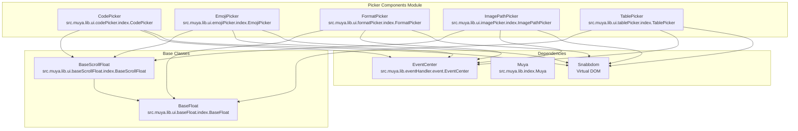
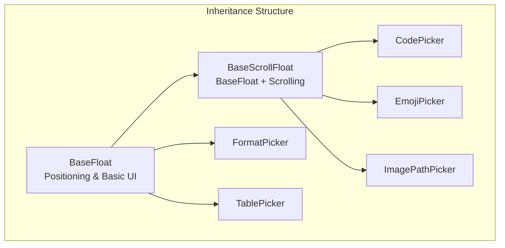
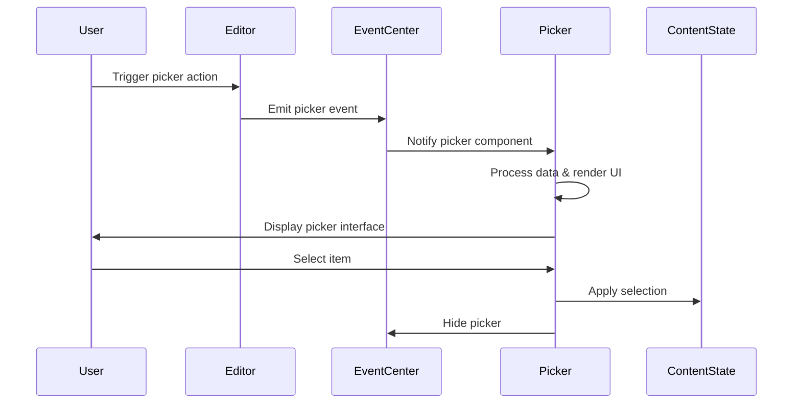
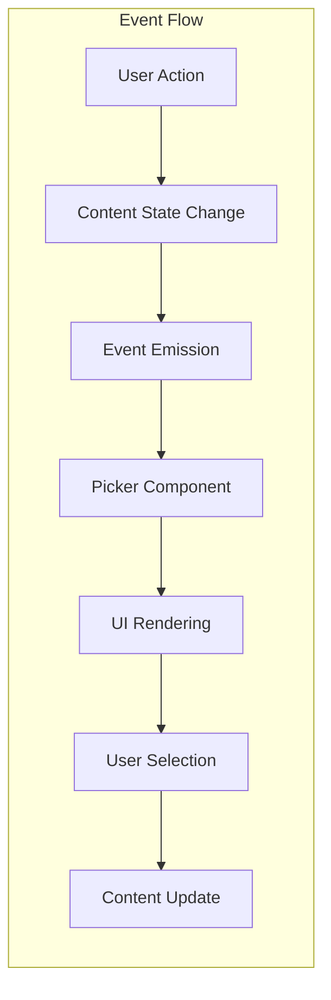

# Picker Components Module Documentation

## Introduction

The picker_components module is a specialized UI component collection within the Muya framework that provides interactive selection interfaces for various content types. These components are designed as floating UI elements that appear contextually to help users select and insert different types of content into the editor, including code languages, emojis, formatting options, images, and table structures.

## Module Architecture

### Core Components

The picker_components module consists of five main picker components, each serving a specific content selection purpose:



### Component Hierarchy



## Component Details

### CodePicker

**Purpose**: Provides language selection for code blocks with syntax highlighting support.

**Key Features**:
- Integrates with Prism.js for language detection and syntax highlighting
- Displays file type icons for each programming language
- Supports fuzzy search through language modes
- Shows "No result" when no matches are found

**Event Handling**:
- Listens to `muya-code-picker` events
- Accepts reference element, language search term, and callback function
- Automatically filters and displays matching language modes

**Dependencies**:
- [BaseScrollFloat](muya_ui_components.md#base-components)
- [Prism.js integration](muya_parser.md)
- File icon system for language visualization

### EmojiPicker

**Purpose**: Enables emoji selection and insertion with search functionality.

**Key Features**:
- Categorized emoji display (smileys, animals, food, etc.)
- Real-time search through emoji aliases and descriptions
- Visual emoji grid with hover effects
- Automatic scroll to active item

**Event Handling**:
- Subscribes to `muya-emoji-picker` events
- Processes emoji node content for search terms
- Integrates with content state for emoji insertion

**Dependencies**:
- [BaseScrollFloat](muya_ui_components.md#base-components)
- [Emoji utility component](muya_ui_components.md#utility-components)
- ContentState for emoji management

### FormatPicker

**Purpose**: Provides inline text formatting options (bold, italic, links, etc.).

**Key Features**:
- Displays formatting options as icon toolbar
- Shows active state for currently applied formats
- Supports both inline and block-level formatting
- Dynamic updates based on current selection

**Event Handling**:
- Listens to `muya-format-picker` events
- Handles format toggling and application
- Updates UI based on current selection formats

**Dependencies**:
- [BaseFloat](muya_ui_components.md#base-components)
- Format configuration and icons
- ContentState for format application

### ImagePathPicker

**Purpose**: Facilitates image selection from various sources (local files, URLs, etc.).

**Key Features**:
- Multiple image source options
- SVG icon integration for visual clarity
- File path validation and handling
- Upload capability support

**Event Handling**:
- Processes `muya-image-picker` events
- Manages image list and selection callbacks
- Handles different image source types

**Dependencies**:
- [BaseScrollFloat](muya_ui_components.md#base-components)
- SVG asset management
- File system integration

### TablePicker

**Purpose**: Interactive table creation with customizable dimensions.

**Key Features**:
- Visual grid selector for table dimensions
- Real-time preview of selected table size
- Manual input for precise dimension control
- Keyboard navigation support

**Event Handling**:
- Subscribes to `muya-table-picker` events
- Manages mouse hover and click interactions
- Handles keyboard input for dimension adjustment

**Dependencies**:
- [BaseFloat](muya_ui_components.md#base-components)
- Event key configuration for keyboard handling

## Data Flow Architecture



## Integration with Muya Framework

### Event System Integration

All picker components integrate with the Muya event system through the EventCenter:



### Content State Management

Picker components interact with the ContentState to apply user selections:

- **CodePicker**: Sets code block language
- **EmojiPicker**: Inserts selected emoji
- **FormatPicker**: Applies text formatting
- **ImagePathPicker**: Inserts image references
- **TablePicker**: Creates table structures

## Styling and Theming

Each picker component includes its own CSS file for styling:
- `codePicker/index.css` - Language list styling
- `emojiPicker/index.css` - Emoji grid layout
- `formatPicker/index.css` - Toolbar button styling
- `imagePicker/index.css` - Image option styling
- `tablePicker/index.css` - Grid selector styling

## Usage Patterns

### Common Implementation Pattern

All picker components follow a similar implementation pattern:

1. **Initialization**: Extend base class, set up DOM elements
2. **Event Subscription**: Listen for specific picker events
3. **Data Processing**: Handle incoming data and prepare for display
4. **Rendering**: Use Snabbdom virtual DOM for efficient updates
5. **User Interaction**: Handle selection and trigger callbacks
6. **Cleanup**: Hide picker and clean up resources

### Virtual DOM Integration

All components use Snabbdom for efficient rendering:

```javascript
// Common rendering pattern
const vnode = h('element', properties, children)
if (oldVnode) {
  patch(oldVnode, vnode)
} else {
  patch(container, vnode)
}
this.oldVnode = vnode
```

## Error Handling

Each picker component includes basic error handling:
- Empty result sets display "No result" messages
- Invalid references prevent picker display
- Missing data gracefully degrades functionality
- Event cleanup prevents memory leaks

## Performance Considerations

- **Virtual DOM**: Efficient updates using Snabbdom
- **Lazy Loading**: Components render only when needed
- **Event Cleanup**: Proper subscription management
- **Memory Management**: Component destruction includes cleanup

## Related Documentation

- [Muya UI Components](muya_ui_components.md) - Base component classes and other UI elements
- [Muya Events](muya_events.md) - Event system and event handling patterns
- [Muya Content Management](muya_content.md) - ContentState and content manipulation
- [Muya Parser](muya_parser.md) - Rendering and syntax highlighting systems