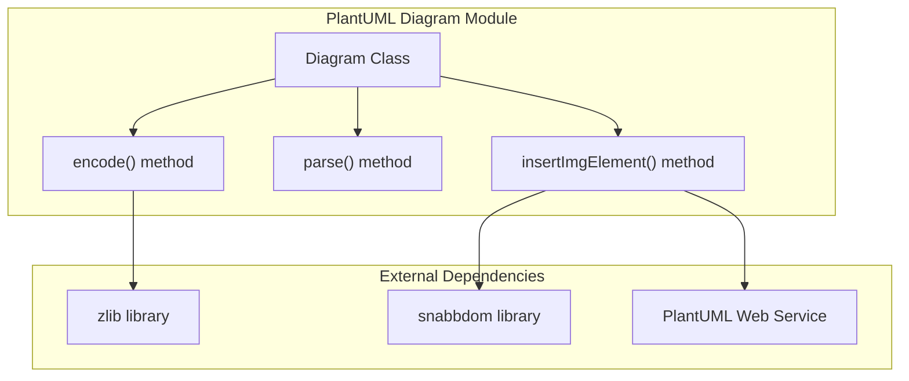
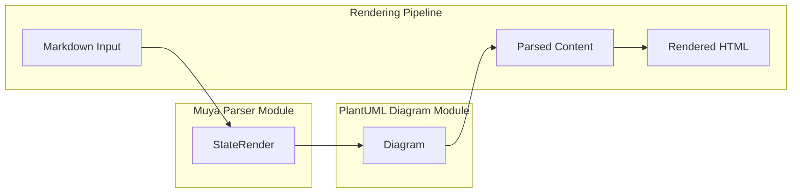
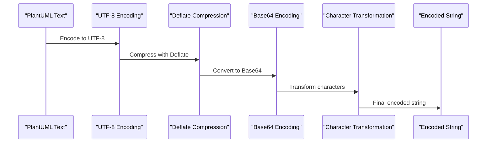
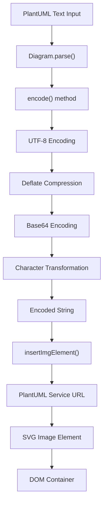

# PlantUML Diagram Module Documentation

## Introduction

The PlantUML Diagram module is a specialized component within the Muya framework that handles the encoding and rendering of PlantUML diagrams. It provides functionality to convert PlantUML text descriptions into encoded URLs that can be rendered as SVG images by the PlantUML web service. This module is essential for applications that need to display UML diagrams, flowcharts, sequence diagrams, and other technical diagrams within a markdown or rich text environment.

## Core Functionality

The module's primary purpose is to:
- Encode PlantUML diagram descriptions according to PlantUML specifications
- Generate valid URLs for PlantUML web service rendering
- Insert rendered diagram images into DOM containers
- Handle the complex text encoding and compression required by PlantUML

## Architecture Overview

### Component Structure



### Integration with Muya Framework



## Detailed Component Analysis

### Diagram Class

The `Diagram` class is the core component of this module, providing static methods for creating and managing PlantUML diagrams.

#### Key Methods:

1. **parse(input)**
   - Static factory method that creates a new Diagram instance
   - Takes PlantUML text input and encodes it
   - Returns a Diagram object ready for rendering

2. **encode(value)**
   - Implements PlantUML's specific encoding algorithm
   - Performs UTF-8 encoding, Deflate compression, and custom base64 transformation
   - Returns the encoded string required for PlantUML URLs

3. **insertImgElement(container)**
   - Inserts the rendered diagram as an image element into a DOM container
   - Uses snabbdom for virtual DOM manipulation
   - Constructs the PlantUML service URL with the encoded diagram

### Encoding Process

The encoding process follows PlantUML's official specifications:



### Character Transformation

The module implements a specific character transformation required by PlantUML:

- **Input characters**: `ABCDEFGHIJKLMNOPQRSTUVWXYZabcdefghijklmnopqrstuvwxyz0123456789+/`
- **Output characters**: `0123456789ABCDEFGHIJKLMNOPQRSTUVWXYZabcdefghijklmnopqrstuvwxyz-_`

This transformation ensures compatibility with PlantUML's URL encoding scheme.

## Data Flow



## Dependencies

### Internal Dependencies
- **StateRender**: The PlantUML Diagram module is used within the Muya parser's rendering pipeline

### External Dependencies
- **zlib**: Node.js built-in compression library for Deflate algorithm
- **snabbdom**: Virtual DOM library for efficient DOM manipulation
- **PlantUML Web Service**: External service for diagram rendering (https://www.plantuml.com/plantuml)

## Usage Patterns

### Basic Usage
```javascript
// Parse PlantUML text
const diagram = Diagram.parse(`@startuml
Alice -> Bob: Hello
Bob -> Alice: Hi!
@enduml`);

// Insert into DOM container
diagram.insertImgElement('diagram-container');
```

### Integration with Rendering Pipeline
The Diagram class is typically used within the Muya framework's StateRender component to process PlantUML code blocks during markdown parsing and rendering.

## Error Handling

The module includes basic error handling for invalid containers in the `insertImgElement` method, throwing an error if the provided container is invalid or doesn't exist in the DOM.

## Performance Considerations

- **Compression Level**: Uses compression level 3 for a balance between speed and compression ratio
- **Virtual DOM**: Utilizes snabbdom for efficient DOM updates
- **External Service**: Relies on PlantUML web service for rendering, which may have network latency

## Security Considerations

- **External Service Dependency**: The module relies on an external web service for diagram rendering
- **URL Construction**: Properly encodes diagram content to prevent URL injection issues
- **DOM Manipulation**: Uses virtual DOM to minimize direct DOM manipulation risks

## Related Modules

- **[muya_parser](muya_parser.md)**: Parent module that contains the StateRender component
- **[muya_framework](muya_framework.md)**: Core Muya framework that utilizes this module
- **[muya_content](muya_content.md)**: Content management module that may trigger diagram rendering

## Future Enhancements

Potential improvements could include:
- Local PlantUML server support for offline usage
- Caching mechanism for frequently used diagrams
- Error handling for network failures
- Support for different PlantUML output formats (PNG, PDF)
- Custom styling options for rendered diagrams