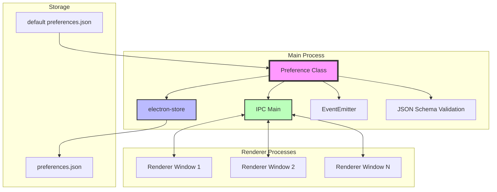
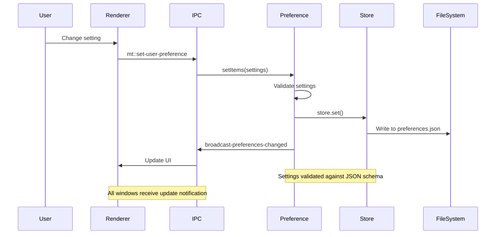
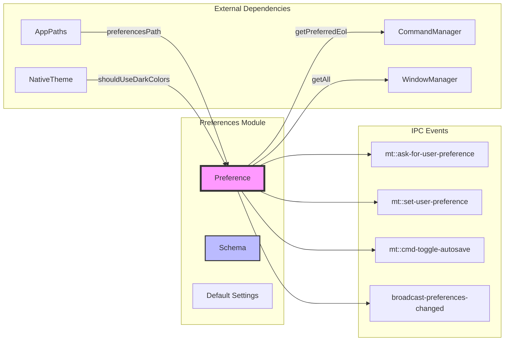
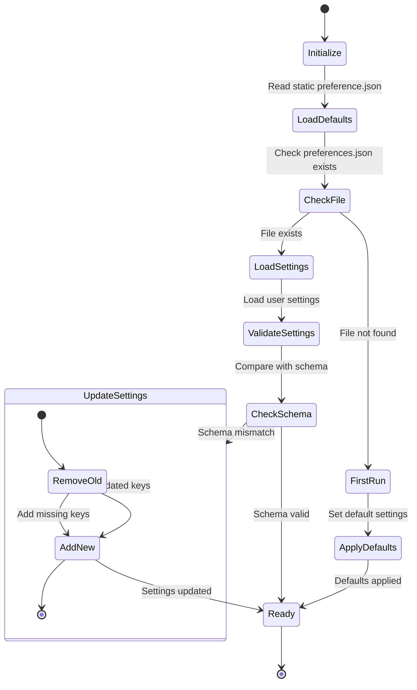

# Preferences Module Documentation

## Introduction

The preferences module is a core component of the application that manages user settings and configuration. It provides a centralized system for storing, retrieving, and updating application preferences with built-in validation, schema enforcement, and real-time synchronization across application windows.

## Architecture Overview

The preferences module follows a singleton pattern with event-driven architecture, utilizing Electron's IPC (Inter-Process Communication) system to synchronize settings across renderer processes.



## Core Components

### Preference Class

The `Preference` class is the central component that extends EventEmitter and manages all preference operations:

- **Location**: `src/main/preferences/index.js`
- **Type**: Main process singleton
- **Extends**: EventEmitter
- **Dependencies**: electron-store, electron IPC, JSON schema

#### Key Responsibilities:

1. **Settings Management**: Load, validate, and persist user preferences
2. **Schema Validation**: Ensure all settings conform to predefined schema
3. **Cross-Window Synchronization**: Broadcast preference changes to all renderer windows
4. **Default Settings**: Apply system-appropriate defaults (e.g., dark theme detection)
5. **Settings Migration**: Handle outdated settings during updates

## Data Flow



## Component Interactions



## Settings Lifecycle



## Key Features

### 1. Schema Validation
- All settings are validated against a predefined JSON schema
- Prevents invalid or corrupted settings from being stored
- Located in `src/main/preferences/schema.js`

### 2. Automatic Theme Detection
- On first application start, detects system theme preference
- Sets appropriate default theme (dark/light) based on `nativeTheme.shouldUseDarkColors`

### 3. Settings Migration
- Automatically removes outdated settings keys
- Adds new settings with appropriate defaults
- Ensures compatibility across application updates

### 4. Cross-Window Synchronization
- Uses IPC events to notify all renderer windows of preference changes
- Ensures consistent user experience across multiple windows
- Real-time updates without requiring window refresh

### 5. Platform-Specific Defaults
- Automatically detects platform (Windows, macOS, Linux)
- Sets appropriate line ending preferences based on OS

## IPC Communication

The preferences module handles several IPC events:

| Event | Direction | Purpose |
|-------|-----------|---------|
| `mt::ask-for-user-preference` | Renderer → Main | Request current preferences |
| `mt::set-user-preference` | Renderer → Main | Update preferences |
| `mt::cmd-toggle-autosave` | Renderer → Main | Toggle auto-save setting |
| `mt::user-preference` | Main → Renderer | Send preferences to renderer |
| `broadcast-preferences-changed` | Main → Renderer | Notify preference changes |

## Integration with Other Modules

### Window Management
- Provides settings to [window management](window_management.md) for window state persistence
- Coordinates with WindowManager for multi-window synchronization

### Command System
- Supplies line ending preferences to [command system](command_system.md)
- Integrates with CommandManager for settings-related commands

### Data Management
- Works with [data management](data_management.md) for settings persistence
- Coordinates with DataCenter for backup and recovery operations

### File System
- Utilizes [file system](file_system.md) watcher for settings file monitoring
- Integrates with file system operations for import/export functionality

## Error Handling

The preferences module implements robust error handling:

1. **File System Errors**: Graceful handling of missing preference files
2. **JSON Parsing**: Safe parsing with fallback to defaults
3. **Schema Validation**: Prevents invalid settings from being stored
4. **IPC Communication**: Error-safe IPC event handling

## Performance Considerations

- Uses `electron-store` for efficient settings storage
- Implements lazy loading of default settings
- Minimizes file I/O operations through caching
- Batches multiple setting changes for efficiency

## Future Enhancements

Based on the TODO comments in the code:

1. **Safe Mode Support**: Skip preference loading when `global.MARKTEXT_SAFE_MODE` is set
2. **Import/Export**: Implement JSON import/export functionality
3. **Performance Optimization**: Replace `electron-store` with more efficient storage solution

## API Reference

### Constructor
```javascript
constructor(paths: AppPaths)
```

### Methods
- `getAll(): Object` - Get all preferences
- `getItem(key: string): any` - Get specific preference value
- `setItem(key: string, value: any): void` - Set single preference
- `setItems(settings: Object): void` - Set multiple preferences
- `getPreferredEol(): string` - Get preferred line ending

### Events
- `preferences-changed` - Emitted when preferences are updated