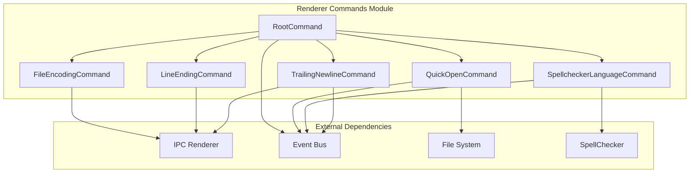
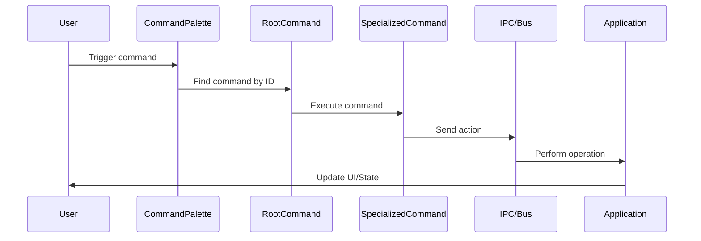

# Renderer Commands Module

## Overview

The `renderer_commands` module serves as the command execution layer for the MarkText editor's renderer process. It provides a comprehensive command system that handles user actions, file operations, editing commands, and application state management. This module acts as the bridge between user interactions and the underlying application functionality.

## Architecture

## Core Components

### RootCommand
The `RootCommand` class serves as the base command structure and command registry. It maintains a comprehensive list of static commands that are loaded into the command center, organized by functional categories:

- **File Operations**: New tabs, open/save files, import/export
- **Edit Operations**: Undo/redo, find/replace, paragraph manipulation
- **Format Operations**: Text formatting, links, images
- **View Operations**: Theme switching, layout toggles
- **Window Management**: Minimize, fullscreen, zoom controls

### Specialized Commands

#### File Operations Commands
The file operations group includes commands for managing file properties and settings:
- **FileEncodingCommand**: Handles file encoding selection and management
- **LineEndingCommand**: Manages line ending preferences (CRLF vs LF)
- **TrailingNewlineCommand**: Controls trailing newline behavior

For detailed documentation, see [file operations](file_operations.md).

#### Search and Navigation Commands
- **QuickOpenCommand**: Implements fuzzy file search functionality across opened tabs and project directories with real-time search and cancellation capabilities

For detailed documentation, see [search navigation](search_navigation.md).

#### Language Tools Commands
- **SpellcheckerLanguageCommand**: Provides language switching functionality for the spellchecker with dynamic language detection and user notifications

For detailed documentation, see [language tools](language_tools.md).

## Command Execution Flow

## Integration Points

The renderer_commands module integrates with several other system modules:

- **[main_app_core](main_app_core.md)**: Receives IPC messages for file operations and window management
- **[muya_framework](muya_framework.md)**: Sends editor commands via event bus for content manipulation
- **[renderer_spellchecker](renderer_spellchecker.md)**: Interfaces with spellchecker for language management
- **[renderer_node](renderer_node.md)**: Utilizes file search capabilities for quick open functionality

## Command Categories

### File Commands
- File creation, opening, saving operations
- Import/export functionality
- Print and close operations
- Auto-save toggling

### Edit Commands
- Undo/redo operations
- Find and replace functionality
- Paragraph creation and deletion
- Text duplication

### Format Commands
- Text styling (bold, italic, underline)
- Code and math formatting
- Link and image insertion
- Format clearing

### View Commands
- Source code mode toggling
- Typewriter and focus modes
- Sidebar and tab bar visibility
- Text direction settings

### Window Commands
- Minimization and fullscreen
- Theme switching
- Zoom level control
- Always-on-top toggling

## Error Handling

The module implements robust error handling with:
- Command validation and existence checks
- Graceful fallbacks for unsupported operations
- User notification for disabled features (e.g., spellchecker language change when disabled)
- Cancellation support for long-running operations like file search

## Performance Considerations

- **Lazy Loading**: Commands are loaded statically but executed on-demand
- **Search Optimization**: QuickOpen implements debounced search with cancellation
- **Memory Management**: Proper cleanup of command instances and event listeners
- **IPC Optimization**: Batched operations where possible to reduce IPC overhead