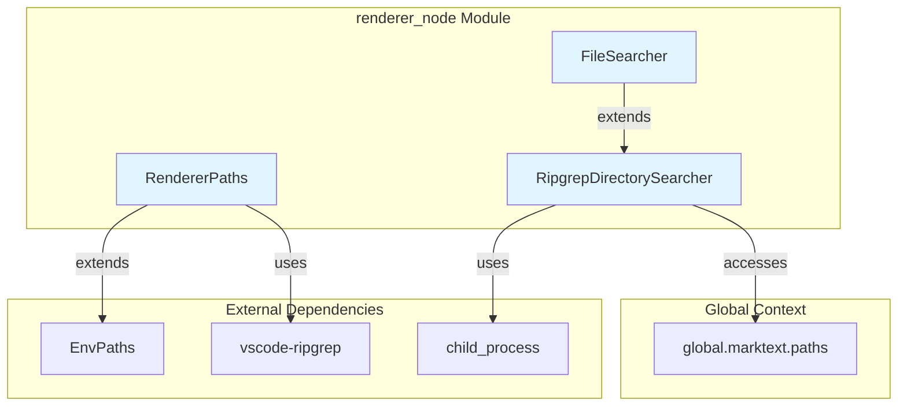
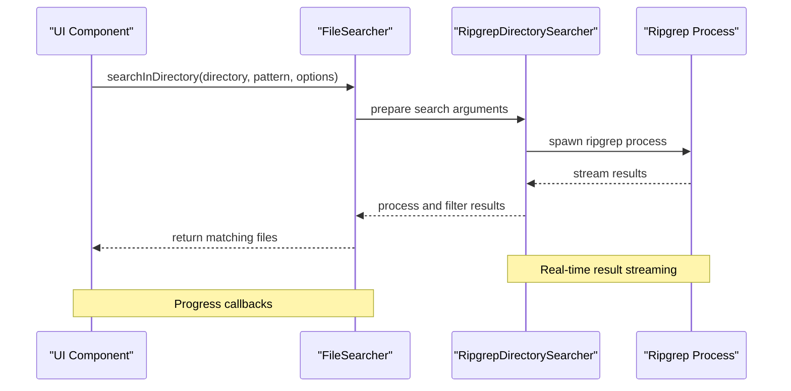
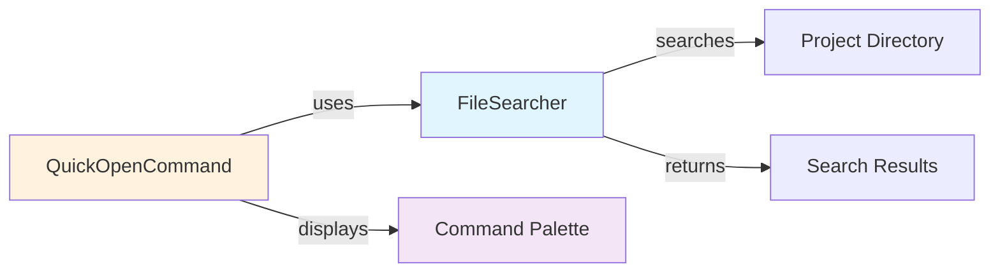
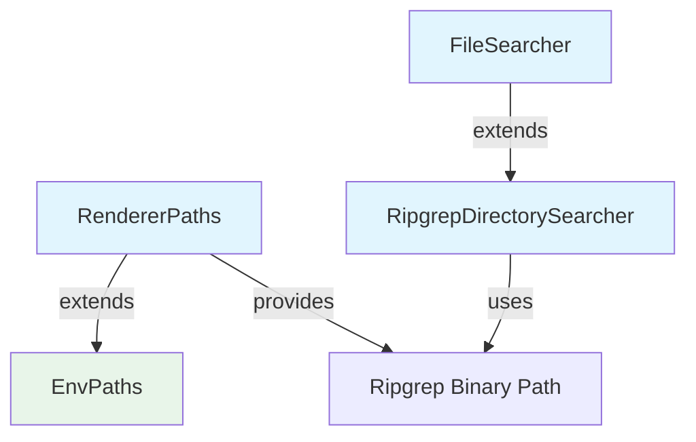

# Renderer Node Module

## Overview

The `renderer_node` module provides essential file system search and path management capabilities for the renderer process. It serves as a bridge between the application's UI layer and the underlying file system, enabling efficient text search operations and path resolution functionality.

## Purpose

This module is responsible for:
- **File System Search**: Implementing fast, pattern-based file searching using ripgrep
- **Path Management**: Managing application paths and binary locations
- **Search Operations**: Providing both file name and content search capabilities
- **Cross-platform Compatibility**: Ensuring consistent behavior across different operating systems

## Architecture



## Core Components

### 1. FileSearcher
- **Location**: `src/renderer/node/fileSearcher.js`
- **Purpose**: Specialized file search implementation for finding files by name patterns
- **Key Features**:
  - Extends `RipgrepDirectorySearcher` for file-specific operations
  - Supports glob patterns, hidden files, and symlink following
  - Provides real-time search progress feedback
  - Implements cancellable search operations

### 2. RendererPaths
- **Location**: `src/renderer/node/paths.js`
- **Purpose**: Manages application paths and ripgrep binary location
- **Key Features**:
  - Extends `EnvPaths` for base path management
  - Handles ripgrep binary path resolution
  - Supports custom ripgrep binary via environment variable
  - Manages asar unpacking for binary access

### 3. RipgrepDirectorySearcher
- **Location**: `src/renderer/node/ripgrepSearcher.js`
- **Purpose**: Core text search implementation using ripgrep
- **Key Features**:
  - Full-text search with regex and literal pattern support
  - Multi-line search capabilities
  - Context line support (leading/trailing)
  - Unicode character handling
  - Real-time result streaming

## Data Flow



## Integration with Other Modules

The `renderer_node` module integrates with several other system components:

### [main_app_core](main_app_core.md)
Provides file search capabilities for the main application window management and file system operations.

### [renderer_commands](renderer_commands.md)
The `QuickOpenCommand` directly uses `FileSearcher` to implement quick file navigation:
- Searches for files in the current project directory
- Filters results based on user query
- Supports both opened tabs and project files
- Implements search result limiting for performance

### [common_utils](common_utils.md)
`RendererPaths` extends `EnvPaths` to inherit base path management functionality while adding renderer-specific path handling for the ripgrep binary.

## Key Integration Points

### Quick Open Integration


### Path Resolution Chain


## Usage Patterns

### File Search
```javascript
const fileSearcher = new FileSearcher()
const results = await fileSearcher.searchInDirectory(
  '/project/path',
  '*.js',
  {
    includeHidden: true,
    followSymlinks: false,
    didMatch: (filePath) => console.log('Found:', filePath),
    didSearchPaths: (count) => console.log('Searched', count, 'paths')
  }
)
```

### Text Search
```javascript
const searcher = new RipgrepDirectorySearcher()
const results = await searcher.search(
  ['/project/path'],
  'search pattern',
  {
    isRegexp: true,
    isCaseSensitive: false,
    includeHidden: false,
    didMatch: (result) => console.log('Match:', result)
  }
)
```

## Performance Considerations

- **Streaming Results**: Results are processed and returned in real-time to minimize memory usage
- **Cancellable Operations**: Long-running searches can be cancelled to free resources
- **Binary Efficiency**: Uses native ripgrep binary for optimal performance
- **Unicode Support**: Proper handling of multi-byte characters without performance degradation

## Error Handling

The module implements comprehensive error handling:
- Process spawn failures are caught and propagated
- Ripgrep error output is captured and reported
- Invalid patterns or paths result in meaningful error messages
- Graceful handling of permission issues and inaccessible files

## Configuration

### Environment Variables
- `MARKTEXT_RIPGREP_PATH`: Override the default ripgrep binary path

### Search Options
- **Pattern Types**: Support for both literal strings and regular expressions
- **File Filtering**: Inclusion/exclusion glob patterns
- **Search Scope**: Hidden files, symlinks, and ignore file handling
- **Context Control**: Leading and trailing context line configuration

This module provides the foundation for all file system search operations in the application, ensuring fast and reliable access to file content across the entire project structure.