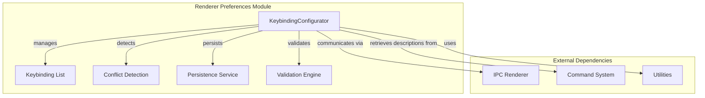
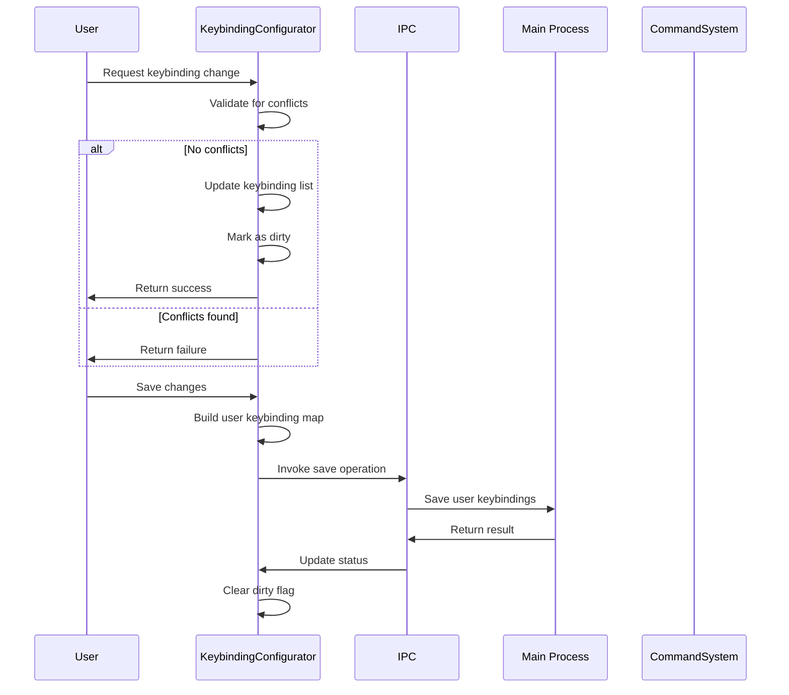
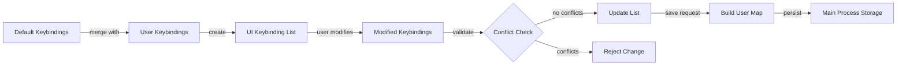
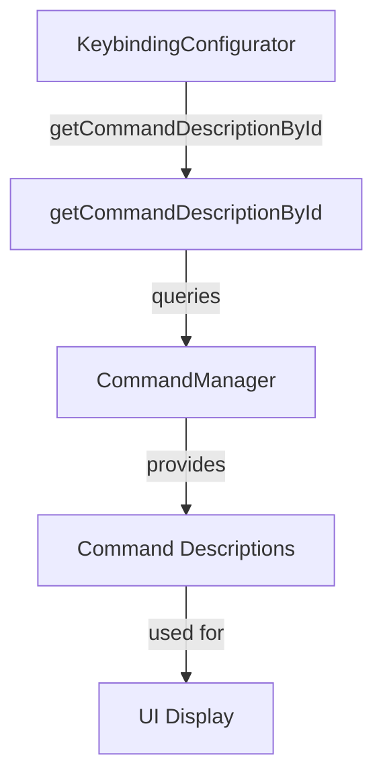

# Renderer Preferences Module Documentation

## Introduction

The renderer_preferences module provides user interface configuration capabilities for the MarkText application, with a primary focus on keyboard shortcut customization. This module enables users to personalize their editing experience by modifying keybindings, managing conflicts, and maintaining consistency across the application.

## Architecture Overview

The renderer_preferences module is built around a single core component that manages the keybinding configuration system:

- **KeybindingConfigurator**: A centralized class that handles all aspects of keyboard shortcut management, including user customization, conflict detection, and persistence.



## Core Components

### KeybindingConfigurator

The `KeybindingConfigurator` class serves as the central orchestrator for all keybinding-related operations within the renderer process. It provides a comprehensive API for managing keyboard shortcuts with the following key responsibilities:

#### Key Features

1. **Dual Keybinding Management**: Maintains both default system keybindings and user-customized keybindings
2. **Conflict Detection**: Prevents duplicate key combinations from being assigned
3. **Dirty State Tracking**: Monitors changes to determine when persistence is required
4. **Cross-Platform Compatibility**: Handles platform-specific keybindings (e.g., macOS-only shortcuts)

#### Architecture Integration



## Data Flow

### Keybinding Management Flow



### State Management

The module maintains several critical states:

1. **Default Keybindings**: Immutable system defaults loaded during initialization
2. **User Keybindings**: Custom user modifications stored persistently
3. **UI Keybinding List**: Combined view for user interface presentation
4. **Dirty State**: Tracks whether unsaved changes exist

## Component Interactions

### Integration with Command System

The renderer_preferences module relies heavily on the [command_system](command_system.md) for retrieving command descriptions and maintaining consistency with the application's command structure.



### IPC Communication

The module communicates with the main process through Electron's IPC mechanism:

- **Save Operation**: `mt::keybinding-save-user-keybindings` - Persists user keybindings
- **Load Operation**: Implicit loading through constructor parameters

## Keybinding Types

The module recognizes two distinct types of keybindings:

1. **Default Keybindings** (`SHORTCUT_TYPE_DEFAULT = 0`): System-defined shortcuts
2. **User Keybindings** (`SHORTCUT_TYPE_USER = 1`): Custom user modifications

This distinction enables:
- Easy reset to defaults
- Selective persistence of only user changes
- Clear identification of customizations

## Validation and Error Handling

### Conflict Detection

The module implements robust conflict detection using the `isEqualAccelerator` utility function from the common utilities. This ensures that no two commands can share the same key combination.

### Platform Compatibility

Special handling for platform-specific keybindings:
- macOS-only shortcuts (prefixed with `mt.`) are excluded on non-macOS platforms
- Ensures consistent user experience across different operating systems

## API Reference

### Constructor

```javascript
constructor(defaultKeybindings, userKeybindings)
```

Initializes the configurator with system defaults and user customizations.

### Key Methods

- `getKeybindings()`: Returns the complete keybinding list for UI display
- `save()`: Persists user modifications to the main process
- `change(id, accelerator)`: Updates a specific keybinding
- `unbind(id)`: Removes a keybinding (sets to empty)
- `resetToDefault(id)`: Resets a specific keybinding to system default
- `resetAll()`: Resets all keybindings to system defaults

## Dependencies

### Internal Dependencies

- **Common Utilities**: Uses `isEqualAccelerator` for conflict detection
- **Command System**: Retrieves command descriptions for UI display
- **Platform Utilities**: Uses `isOsx` for platform-specific logic

### External Dependencies

- **Electron IPC**: Communicates with main process for persistence
- **Command Descriptions**: Maps command IDs to human-readable descriptions

## Usage Patterns

### Initialization

The configurator is typically initialized with both default and user keybindings, creating a unified view for the preferences interface.

### Modification Flow

1. User requests a keybinding change through the UI
2. Configurator validates the change for conflicts
3. If valid, updates the internal state and marks as dirty
4. User saves changes, triggering persistence to main process

### Reset Operations

Supports both individual keybinding resets and complete reset to system defaults, providing flexibility in user customization management.

## Integration Points

### Preferences Window

The module integrates with the [window_types](window_types.md) system, specifically the SettingWindow, to provide the keybinding configuration interface.

### Keyboard System

Changes made through this module directly affect the [keyboard_system](keyboard_system.md), updating the active keybinding configuration used throughout the application.

## Performance Considerations

- **Lazy Loading**: Keybinding list is built only during initialization
- **Efficient Conflict Detection**: Uses optimized comparison algorithms
- **Selective Persistence**: Only user modifications are saved, reducing storage overhead

## Future Enhancements

Potential areas for expansion:
- Export/import keybinding configurations
- Keybinding profiles for different workflows
- Visual keybinding editor with keyboard visualization
- Conflict resolution suggestions
- Keybinding usage analytics

This module provides a solid foundation for user customization while maintaining system integrity and providing a smooth user experience for keyboard shortcut management in the MarkText application.