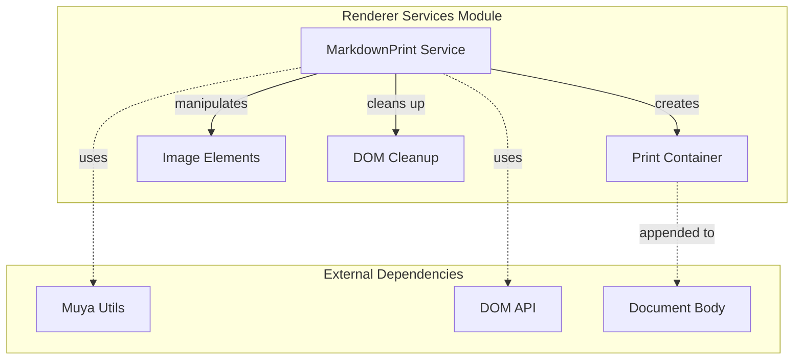
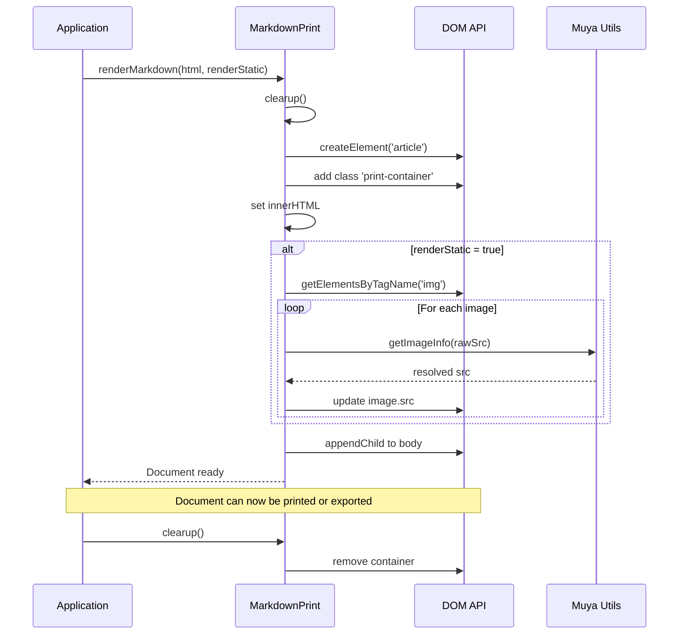
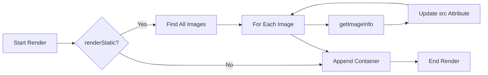
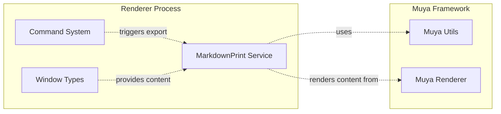

# Renderer Services Module Documentation

## Introduction

The renderer_services module provides specialized services for the renderer process, focusing on document preparation and export functionality. The primary component, `MarkdownPrint`, handles the rendering and preparation of markdown documents for printing and static file generation (PDF, etc.). This module serves as a bridge between the markdown content and the final output format, ensuring proper image handling and document formatting.

## Architecture Overview

The renderer_services module is designed with a single-responsibility approach, providing a clean interface for document export operations. The architecture follows a service-oriented pattern where the `MarkdownPrint` class encapsulates all print-related functionality.



## Core Components

### MarkdownPrint Service

The `MarkdownPrint` class is the sole component of this module, providing a streamlined interface for markdown document preparation and export.

**Key Responsibilities:**
- Document container creation and management
- HTML content rendering
- Image source resolution for static exports
- DOM cleanup operations

**Class Structure:**
```javascript
class MarkdownPrint {
  - container: HTMLElement
  + renderMarkdown(html: string, renderStatic: boolean): void
  + clearup(): void
}
```

## Data Flow

### Document Export Process



### Image Processing Flow



## Dependencies

### Internal Dependencies
- None (standalone service module)

### External Dependencies

#### Muya Framework
- **muya/lib/utils**: Provides the `getImageInfo` utility function for image source resolution
  - Used for converting relative image paths to absolute paths during static rendering
  - See [muya_framework.md](muya_framework.md) for more details

#### Browser APIs
- **DOM API**: Used for creating and manipulating HTML elements
- **Document Object**: Used for appending and removing print containers

## Component Interactions

### Service Integration



## Process Flows

### Print Preparation Workflow

1. **Initialization**: Application calls `renderMarkdown()` with HTML content and optional static flag
2. **Cleanup**: Any existing print containers are removed
3. **Container Creation**: New print container element is created with appropriate CSS classes
4. **Content Injection**: HTML content is injected into the container
5. **Image Processing** (if static rendering):
   - All image elements are located
   - Each image source is processed through `getImageInfo()`
   - Image sources are updated with resolved paths
6. **DOM Attachment**: Container is appended to document body
7. **Ready State**: Document is ready for printing or PDF generation

### Cleanup Workflow

1. **Container Check**: Verify if print container exists
2. **DOM Removal**: Remove container from document body
3. **State Reset**: Clear internal container reference

## Usage Patterns

### Basic Document Export
```javascript
const printService = new MarkdownPrint()
printService.renderMarkdown(htmlContent)
// Document is now ready for printing
printService.clearup() // Clean up when done
```

### Static Export (PDF)
```javascript
const printService = new MarkdownPrint()
printService.renderMarkdown(htmlContent, true)
// Images are processed for static export
// Document ready for PDF generation
printService.clearup()
```

## Error Handling

The module implements defensive programming practices:
- **Container Existence Check**: `clearup()` only removes container if it exists
- **Image Processing Safety**: Image updates only occur when `renderStatic` is true
- **DOM Operation Safety**: All DOM operations are performed on verified elements

## Performance Considerations

- **Efficient Cleanup**: Single operation to remove entire container
- **Selective Processing**: Image processing only when necessary (static exports)
- **Minimal DOM Manipulation**: Direct element creation and single append operation

## Integration Points

### Command System Integration
The print service is typically triggered by the [command_system](command_system.md) when users request document export or print operations.

### Window Types Integration
Receives HTML content from [window_types](window_types.md), particularly from EditorWindow instances that contain the markdown content to be exported.

### Muya Framework Integration
Utilizes the [muya_framework](muya_framework.md) utilities for image processing and content resolution, ensuring consistent behavior across the application.

## Future Considerations

The module's focused design allows for easy extension:
- Additional export formats can be added to the service
- Image processing logic can be enhanced for other media types
- Print styling can be customized through CSS class modifications