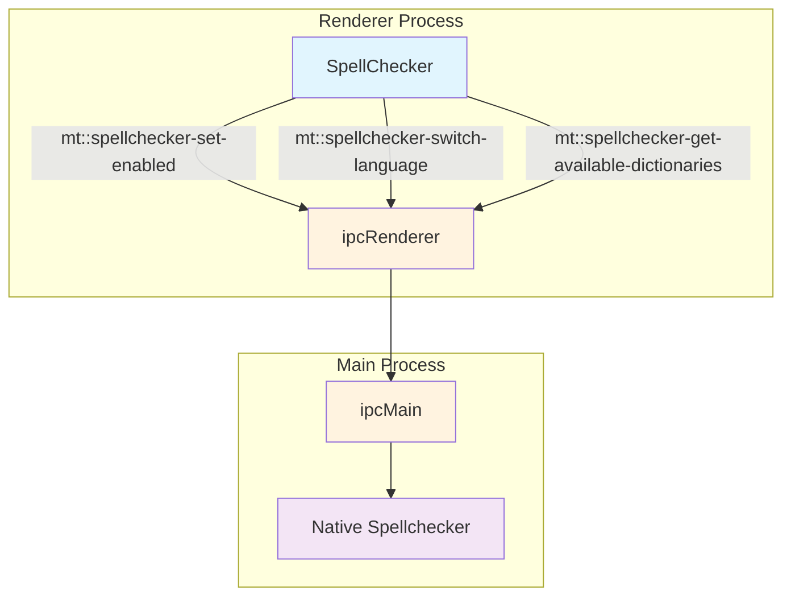
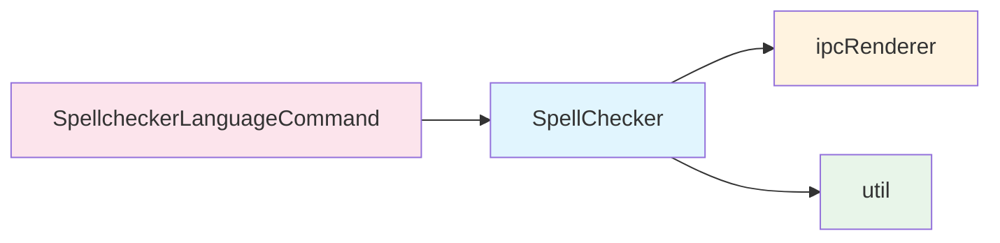
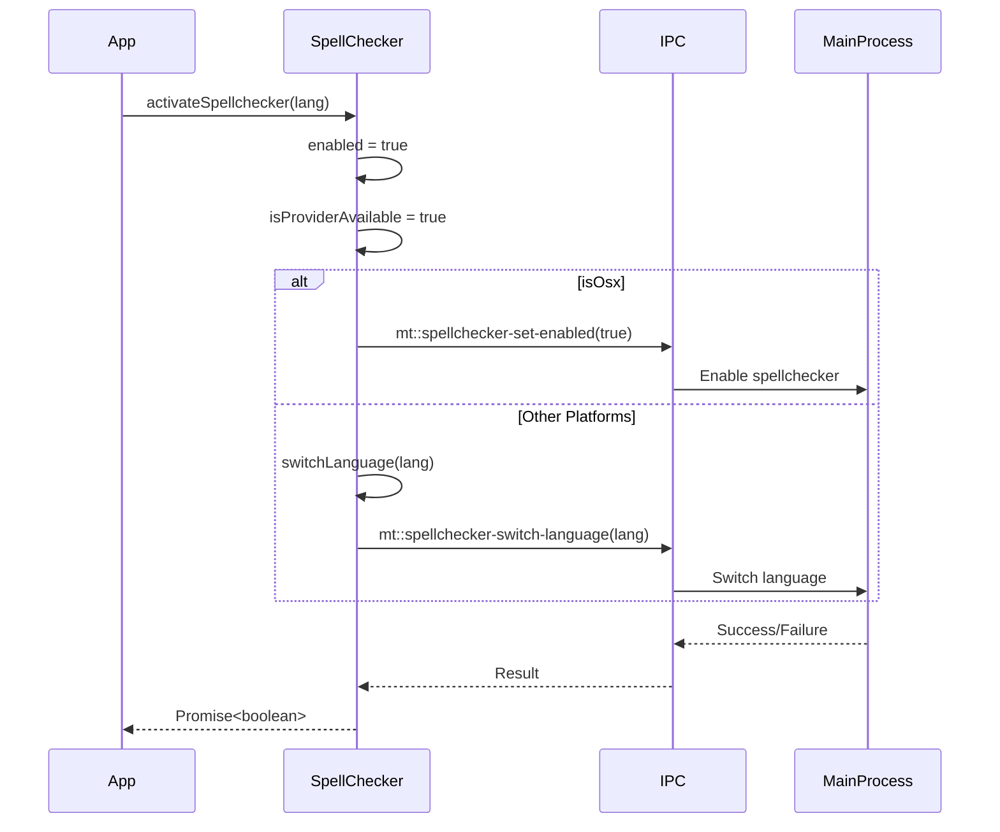
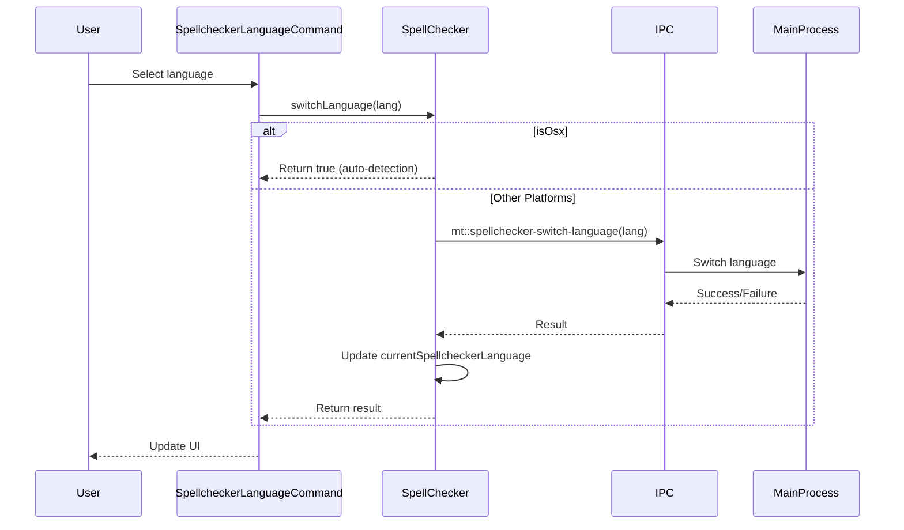

# Renderer Spellchecker Module Documentation

## Introduction

The renderer_spellchecker module provides spell checking functionality for the MarkText application. It serves as a high-level API wrapper around Chromium's built-in spell checker, offering language switching capabilities and cross-platform compatibility (Windows, Linux, and macOS). The module integrates with the main application through IPC (Inter-Process Communication) to coordinate spell checking operations between the renderer and main processes.

## Architecture Overview

### Core Component Structure



### Module Dependencies



## Core Components

### SpellChecker Class

The `SpellChecker` class is the primary component of this module, providing a unified interface for spell checking operations across different platforms.

#### Key Properties

- `enabled`: Boolean flag indicating whether spell checking is enabled in settings
- `currentSpellcheckerLanguage`: Current language code for spell checking
- `isProviderAvailable`: Helper flag to control spell checker availability regardless of settings

#### Core Methods

| Method | Description | Platform Behavior |
|--------|-------------|-------------------|
| `activateSpellchecker(lang)` | Enables spell checking with specified language | macOS: No language needed, auto-detection; Others: Requires language parameter |
| `deactivateSpellchecker()` | Disables spell checking | Cross-platform |
| `switchLanguage(lang)` | Changes spell checking language | macOS: Auto-detection; Others: Explicit language switching |
| `getAvailableDictionaries()` | Returns available dictionary languages | macOS: Returns empty array; Others: Returns available languages |

## Data Flow

### Spell Check Activation Flow



### Language Switching Flow



## Platform-Specific Behavior

### macOS
- Uses the native macOS spell checker
- Automatic language detection (no explicit language switching required)
- `getAvailableDictionaries()` returns empty array
- Language parameter ignored in `activateSpellchecker()`

### Windows/Linux
- Uses Chromium's built-in spell checker
- Requires explicit language specification
- Supports multiple dictionaries
- Language switching is explicit and required

## Integration Points

### Command System Integration
The spell checker integrates with the [renderer_commands](renderer_commands.md) module through the `SpellcheckerLanguageCommand` component, allowing users to:
- Select spell checking languages from the UI
- Toggle spell checking on/off
- View available dictionaries

### Preference System Integration
Spell checking settings are managed through the [preferences](preferences.md) module, including:
- Enable/disable spell checking
- Default language selection
- Language-specific settings

## Error Handling

The module implements robust error handling:

1. **Provider Availability**: If spell checker creation fails, `isProviderAvailable` is set to false
2. **Language Switching**: Throws error if language is empty on non-macOS platforms
3. **Activation Failures**: Deactivates spell checker if activation fails
4. **IPC Communication**: Errors are propagated through the promise chain

## Usage Examples

### Basic Activation
```javascript
const spellChecker = new SpellChecker(true, 'en-US')
await spellChecker.activateSpellchecker('en-US')
```

### Language Switching
```javascript
// Switch to Spanish
await spellChecker.switchLanguage('es-ES')
```

### Checking Availability
```javascript
if (spellChecker.isEnabled) {
    console.log(`Current language: ${spellChecker.lang}`)
}
```

### Getting Available Languages
```javascript
const languages = await SpellChecker.getAvailableDictionaries()
console.log('Available languages:', languages)
```

## Performance Considerations

1. **Lazy Loading**: Spell checker is only activated when needed
2. **Platform Optimization**: macOS uses native APIs for better performance
3. **Language Caching**: Current language is cached to avoid unnecessary switches
4. **IPC Minimization**: Reduces IPC calls by handling platform differences locally

## Security Considerations

1. **IPC Validation**: All IPC communications are handled through secure channels
2. **Language Validation**: Language codes are validated before switching
3. **Provider Isolation**: Uses Chromium's sandboxed spell checker
4. **No Persistent Storage**: No sensitive data is stored by the spell checker

## Future Enhancements

Potential improvements for the spell checker module:

1. **Custom Dictionary Support**: Allow user-defined dictionaries
2. **Multi-language Support**: Enable spell checking in multiple languages simultaneously
3. **Performance Metrics**: Add spell checking performance monitoring
4. **Suggestion API**: Provide spelling suggestions through the API
5. **Context-aware Checking**: Improve accuracy with context-aware algorithms

## Related Documentation

- [Renderer Commands](renderer_commands.md) - For command integration details
- [Preferences](preferences.md) - For settings management
- [Main App Core](main_app_core.md) - For IPC communication patterns
- [Common Utils](common_utils.md) - For utility functions like `isOsx`