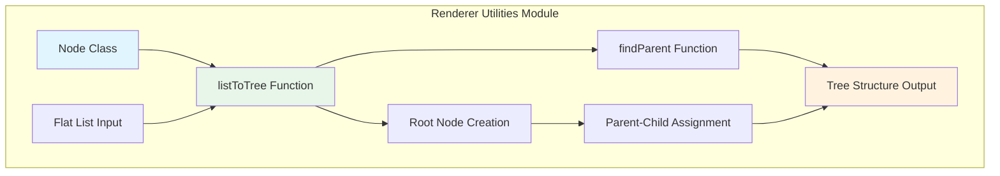
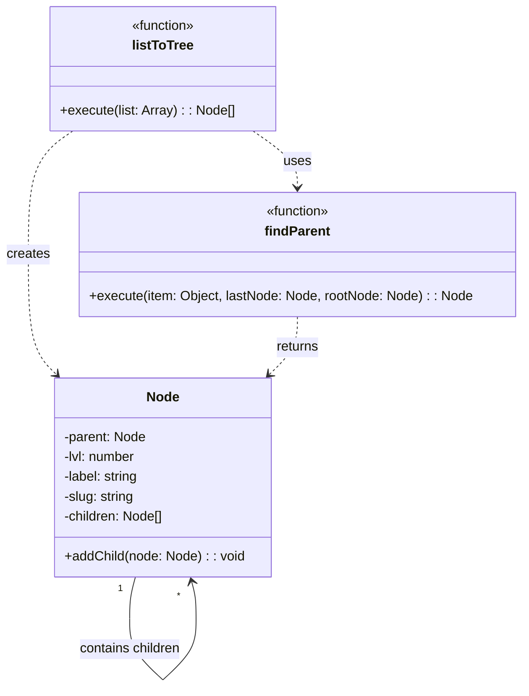
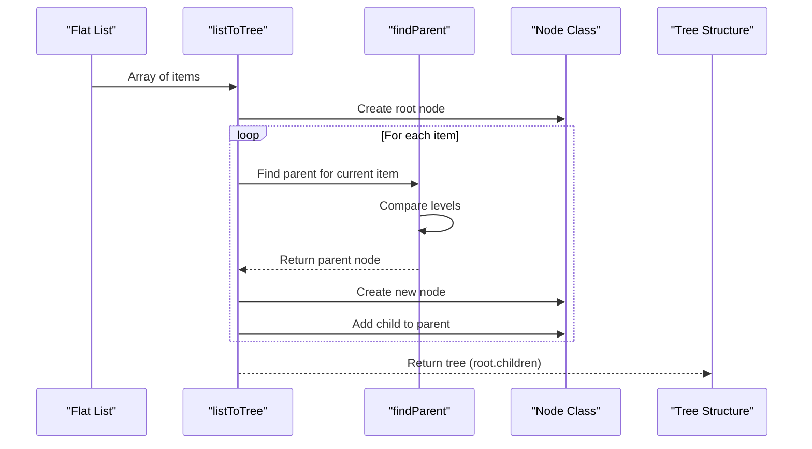
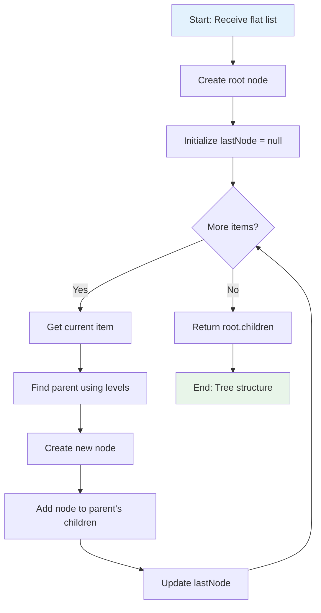

# Renderer Utilities Module Documentation

## Introduction

The renderer_utilities module provides essential utility functions for the renderer process, primarily focused on hierarchical data structure manipulation. The module's core functionality centers around converting flat lists into tree structures, which is particularly useful for organizing and displaying nested content like table of contents, file hierarchies, or any structured data that requires parent-child relationships.

## Core Functionality

### Node Class

The `Node` class serves as the fundamental building block for creating tree structures from flat data. Each node represents an item in the hierarchy with the following properties:

- **parent**: Reference to the parent node
- **lvl**: Hierarchy level (depth) of the node
- **label**: Display content of the node
- **slug**: Unique identifier for the node
- **children**: Array containing child nodes

### Tree Construction Algorithm

The module implements a sophisticated algorithm that transforms a flat list of items into a hierarchical tree structure. The algorithm uses level-based positioning to determine parent-child relationships, making it ideal for converting linear data structures (like markdown headings) into navigable tree structures.

## Architecture



## Component Relationships



## Data Flow



## Process Flow



## Key Features

### 1. Level-Based Hierarchy
The algorithm uses a level-based approach where each item's `lvl` property determines its position in the hierarchy. Lower level numbers indicate higher positions in the tree structure.

### 2. Recursive Parent Finding
The `findParent` function uses recursion to traverse up the tree structure until it finds the appropriate parent node based on level comparisons.

### 3. Memory Efficient
The implementation creates nodes only when needed and maintains references to parent nodes, ensuring efficient memory usage for large datasets.

## Usage Patterns

### Typical Use Cases
- **Table of Contents Generation**: Converting markdown headings into navigable tree structures
- **File System Representation**: Organizing file paths into directory trees
- **Menu Structure Creation**: Building hierarchical menu systems
- **Document Outline**: Creating structured outlines from document sections

### Integration Points
The module is designed to work independently and can be integrated with:
- [muya_content](muya_content.md) module for content organization
- [muya_ui_components](muya_ui_components.md) for tree-based UI components
- [renderer_commands](renderer_commands.md) for command structure organization

## Dependencies

### Internal Dependencies
- **None**: The module is self-contained with no external dependencies

### External Dependencies
- **None**: Pure JavaScript implementation with no external libraries

## API Reference

### Node Class
```javascript
class Node {
  constructor(item)
  addChild(node)
}
```

### listToTree Function
```javascript
function listToTree(list)
// Returns: Array of Node objects (root.children)
```

### findParent Function
```javascript
function findParent(item, lastNode, rootNode)
// Returns: Node object (parent node)
```

## Performance Considerations

### Time Complexity
- **Best Case**: O(n) where n is the number of items in the list
- **Worst Case**: O(n * d) where d is the maximum depth of the tree

### Space Complexity
- **O(n)** for storing the tree structure where n is the number of nodes

### Optimization Notes
- The recursive parent finding is optimized for typical use cases where level differences are small
- Memory usage is minimized by only storing necessary references

## Error Handling

The module includes implicit error handling through:
- **Null Checks**: Handles cases where `lastNode` is null
- **Root Node Fallback**: Always returns to root node when no appropriate parent is found
- **Level Validation**: Assumes valid level values in the input data

## Future Enhancements

Potential improvements could include:
- **Validation**: Input validation for list items
- **Error Recovery**: Better handling of malformed input data
- **Performance**: Iterative alternatives to recursive functions for very deep trees
- **Flexibility**: Support for different hierarchy determination methods

## Related Documentation

For related functionality, see:
- [muya_content](muya_content.md) - Content state management
- [muya_ui_components](muya_ui_components.md) - UI components that may use tree structures
- [renderer_commands](renderer_commands.md) - Command organization structures