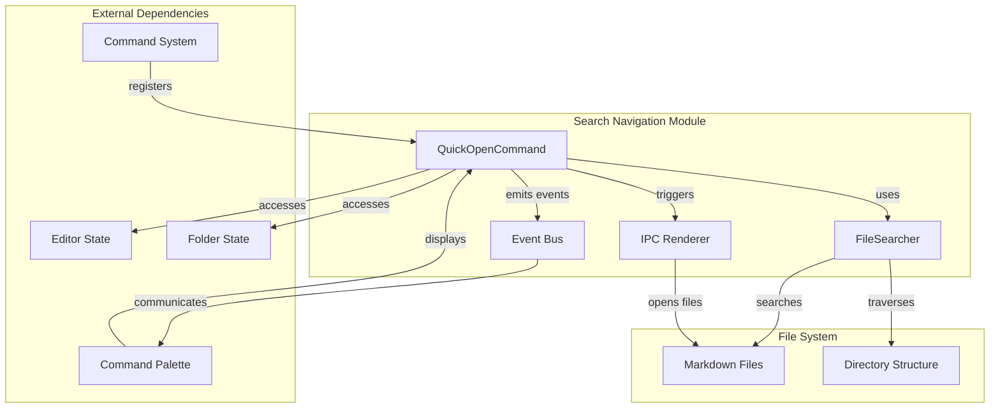
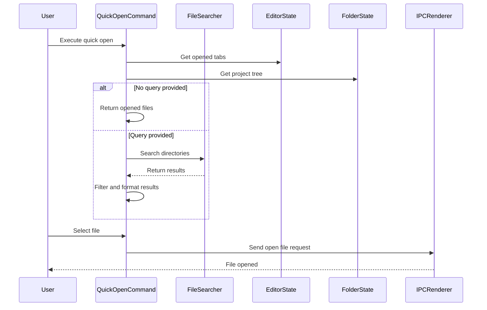
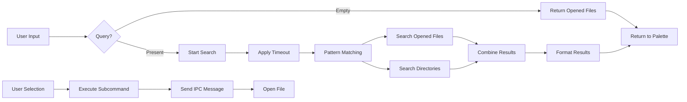

# Search Navigation Module Documentation

## Introduction

The search_navigation module provides quick file search and navigation capabilities within the application. It implements a command-based interface that allows users to quickly find and open files through a fuzzy search mechanism. The module is built around the `QuickOpenCommand` class, which integrates with the application's command palette system to provide seamless file discovery and navigation.

## Architecture Overview

The search_navigation module is designed as a command-based component that integrates with the broader command system architecture. It provides asynchronous file searching capabilities with support for both currently opened files and project directory traversal.

## Core Components

### QuickOpenCommand

The `QuickOpenCommand` class is the primary component of the search_navigation module. It implements a comprehensive file search and navigation system with the following key features:

- **Asynchronous Search**: Supports cancellable search operations with timeout handling
- **Dual Search Modes**: Searches both currently opened files and project directories
- **Fuzzy Matching**: Implements regex-based pattern matching for flexible file discovery
- **Markdown Focus**: Optimized for searching markdown files with specific inclusion patterns
- **Integration**: Seamlessly integrates with the application's command palette and IPC system

#### Key Properties

- `id`: 'file.quick-open' - Unique identifier for the command
- `description`: 'File: Quick Open' - Human-readable command description
- `placeholder`: 'Search file to open' - Placeholder text for search input
- `shortcut`: null - No default keyboard shortcut assigned
- `subcommands`: Array of search results displayed as selectable items
- `subcommandSelectedIndex`: Currently selected search result index

#### Search Strategy

The search implementation follows a multi-tiered approach:

1. **Empty Query Handling**: Returns currently opened files when no search query is provided
2. **Opened Files Search**: Searches through active editor tabs using regex pattern matching
3. **Directory Traversal**: Uses FileSearcher to scan project directories for matching files
4. **Result Limiting**: Automatically cancels searches when more than 30 results are found
5. **Markdown Optimization**: Applies specific inclusion patterns for markdown file extensions

## Data Flow

### Search Request Flow

1. **Command Execution**: User triggers quick open command through command palette
2. **State Initialization**: Command accesses current editor and folder state
3. **Search Initialization**: If no query provided, returns list of opened files
4. **Async Search**: For queries, initiates cancellable search operation with 300ms timeout
5. **Pattern Matching**: Converts query to regex pattern with special character handling
6. **File Discovery**: Searches both opened files and project directories
7. **Result Formatting**: Formats results with relative paths and descriptions
8. **Display**: Returns formatted results to command palette for display

### File Opening Flow

1. **User Selection**: User selects file from search results
2. **Command Execution**: `executeSubcommand` method called with file path
3. **IPC Communication**: Sends 'mt::open-file-by-window-id' message to main process
4. **File Loading**: Main process handles actual file opening in editor

## Integration Points

### Command System Integration

The QuickOpenCommand integrates with the [command_system](command_system.md) through the standard command interface, providing:

- Command registration with unique ID and description
- Search functionality exposed through the command palette
- Subcommand execution for file opening

### State Management Integration

The module depends on application state from:

- **[data_management](data_management.md)**: Accesses editor state for opened tabs
- **[main_app_core](main_app_core.md)**: Accesses project state for directory information

### File System Integration

Utilizes the [file_system](file_system.md) capabilities through:

- FileSearcher utility for directory traversal
- Path utilities for file extension checking and relative path calculation
- Directory relationship checking for filtering results

### IPC Communication

Integrates with the application's IPC system to:

- Send file open requests to the main process
- Handle window-specific file opening operations
- Coordinate between renderer and main processes

## Configuration and Usage

### Search Configuration

The module automatically configures search parameters based on:

- **Markdown Extensions**: Uses `MARKDOWN_INCLUSIONS` constant for file type filtering
- **Special Character Handling**: Escapes regex special characters in search queries
- **Search Limits**: Automatically cancels searches exceeding 30 results
- **Timeout Handling**: Implements 300ms delay before initiating searches

### Result Formatting

Search results are formatted with:

- **Relative Paths**: Shows paths relative to project root when applicable
- **Full Paths**: Displays absolute paths for files outside project root
- **Title and Description**: Provides both short and detailed file information
- **Path Truncation**: Uses full path as title when relative path exceeds 50 characters

## Error Handling

The module implements several error handling mechanisms:

- **Cancellation Support**: Allows search operations to be cancelled
- **Timeout Management**: Prevents hanging searches with automatic timeouts
- **Promise Rejection**: Properly handles and propagates search errors
- **State Validation**: Validates editor and folder state before operations

## Performance Considerations

### Search Optimization

- **Incremental Search**: Implements debounced search with 300ms delay
- **Result Limiting**: Automatically limits results to prevent UI overload
- **Cancellation**: Supports cancelling long-running search operations
- **Regex Compilation**: Efficiently compiles search patterns with special character handling

### Memory Management

- **State Cleanup**: Clears subcommands array when command is unloaded
- **Cancellation Cleanup**: Properly cleans up cancellation functions
- **Promise Management**: Handles promise rejection and resolution appropriately

## Dependencies

### Runtime Dependencies

- **electron**: Uses `ipcRenderer` for inter-process communication
- **path**: Node.js path module for file path operations
- **FileSearcher**: Custom utility for directory searching operations
- **bus**: Event bus for command palette communication

### Module Dependencies

- **[common_utils](common_utils.md)**: File system path utilities and constants
- **[renderer_node](renderer_node.md)**: FileSearcher implementation for directory traversal
- **[command_system](command_system.md)**: Base command infrastructure and registration
- **[main_app_core](main_app_core.md)**: Application state management (editor and project state)

## Extension Points

The module can be extended through:

- **Search Providers**: Additional search strategies can be implemented
- **Result Formatters**: Custom result formatting for different file types
- **Filter Functions**: Additional filtering criteria for search results
- **Shortcut Integration**: Keyboard shortcuts can be assigned to the command

## Security Considerations

- **Path Validation**: Validates file paths before opening to prevent directory traversal attacks
- **IPC Sanitization**: Ensures file paths are properly sanitized before IPC communication
- **Search Scope**: Limits search to configured directories and file types
- **User Permissions**: Respects file system permissions during search operations