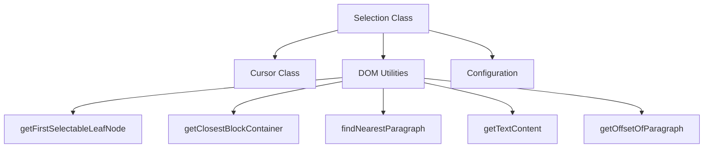
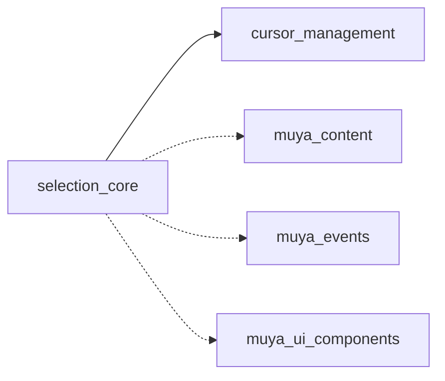
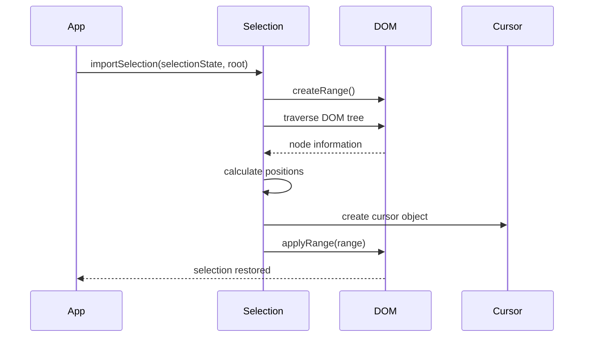
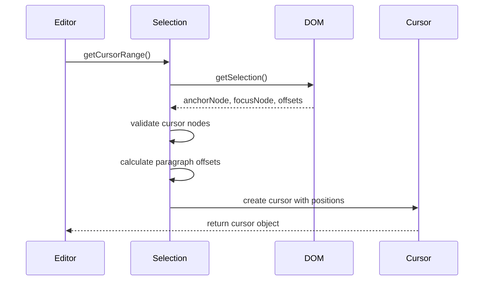

# Selection Core Module Documentation

## Introduction

The selection_core module is a fundamental component of the Muya editor framework that provides comprehensive text selection and cursor management capabilities. Adapted from the medium-editor project, this module handles all aspects of text selection, cursor positioning, and range manipulation within the editor's content area.

## Core Functionality

The Selection class serves as the primary interface for managing text selections and cursor positions within the Muya editor. It provides methods for:

- **Selection Import/Export**: Preserving and restoring selection states across DOM modifications
- **Cursor Management**: Precise cursor positioning and movement within complex document structures
- **Range Manipulation**: Creating, modifying, and applying selection ranges
- **Coordinate Tracking**: Getting cursor coordinates for UI positioning
- **HTML Extraction**: Retrieving selected HTML content

## Architecture

### Component Structure



### Module Dependencies



## Key Components

### Selection Class

The main Selection class provides a comprehensive API for text selection management:

#### Selection State Management
- `importSelection()`: Restores selection state after DOM modifications
- `getSelectionRange()`: Retrieves current selection range
- `selectRange()`: Applies a range to the document selection

#### Cursor Operations
- `getCursorRange()`: Gets current cursor position with paragraph context
- `setCursorRange()`: Sets cursor position based on paragraph and offset
- `getCursorCoords()`: Retrieves screen coordinates of cursor
- `getCursorYOffset()`: Calculates cursor position relative to paragraph lines

#### Content Manipulation
- `getSelectionHtml()`: Extracts HTML content of current selection
- `chopHtmlByCursor()`: Splits content at cursor position for inline editing

## Data Flow

### Selection Import Process



### Cursor Position Tracking



## Advanced Features

### Complex Selection Scenarios

The module handles several edge cases for selection management:

1. **Image Handling**: Special logic for cursor positioning around inline images
2. **Empty Blocks**: Proper cursor placement in empty paragraphs
3. **Anchor Tags**: Cursor positioning at the edge of links
4. **Marked Text**: Handling selections within formatted text segments

### Coordinate Calculation

The selection module provides precise cursor coordinates for UI components:

```javascript
// Get cursor screen position
const { x, y, width } = selection.getCursorCoords()

// Get cursor position within paragraph
const { topOffset, bottomOffset } = selection.getCursorYOffset(paragraph)
```

## Integration with Other Modules

### Content State Management
The selection module works closely with [muya_content](muya_content.md) to maintain cursor position during content updates and ensure selection integrity across document modifications.

### Event Handling
Integration with [muya_events](muya_events.md) ensures proper selection updates during user interactions like clicks, keyboard input, and drag operations.

### UI Components
[UI components](muya_ui_components.md) rely on selection coordinates for positioning tooltips, menus, and other contextual elements relative to the cursor.

## Usage Examples

### Basic Selection Operations

```javascript
// Get current selection
const range = selection.getSelectionRange()

// Set selection to specific element
selection.selectNode(element)

// Move cursor to specific position
selection.moveCursor(node, offset)
```

### Advanced Cursor Management

```javascript
// Get cursor with paragraph context
const cursor = selection.getCursorRange()

// Set cursor from saved state
selection.setCursorRange(cursor)

// Get cursor coordinates for UI positioning
const coords = selection.getCursorCoords()
```

## Performance Considerations

The selection module is optimized for performance through:

- **Efficient DOM Traversal**: Uses TreeWalker API for large document navigation
- **Caching Strategies**: Minimizes repeated DOM queries
- **Event Debouncing**: Prevents excessive selection updates during rapid changes

## Error Handling

The module includes comprehensive validation:

- **Node Validation**: Ensures cursor nodes are within valid editor boundaries
- **Range Validation**: Verifies selection ranges are within document bounds
- **Fallback Mechanisms**: Provides default behavior for edge cases

## Browser Compatibility

The selection module handles cross-browser differences in:

- Selection API implementations
- Range behavior variations
- Coordinate calculation differences
- Event handling inconsistencies

This ensures consistent selection behavior across different environments and platforms.