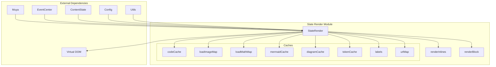
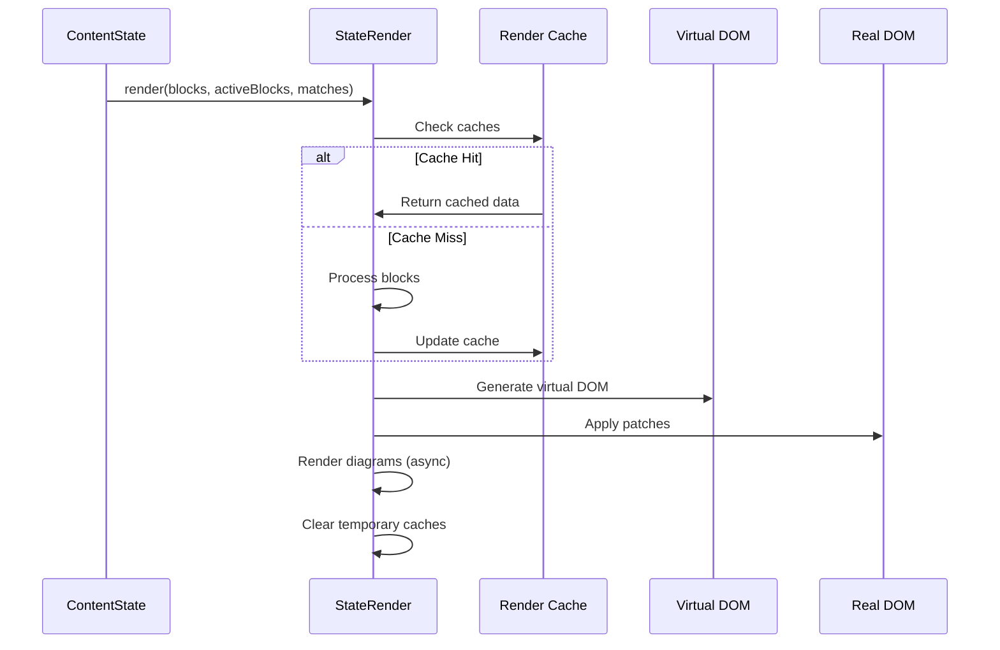
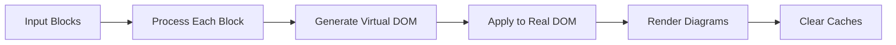
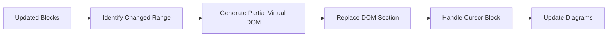
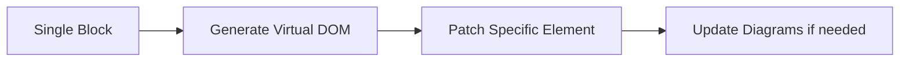
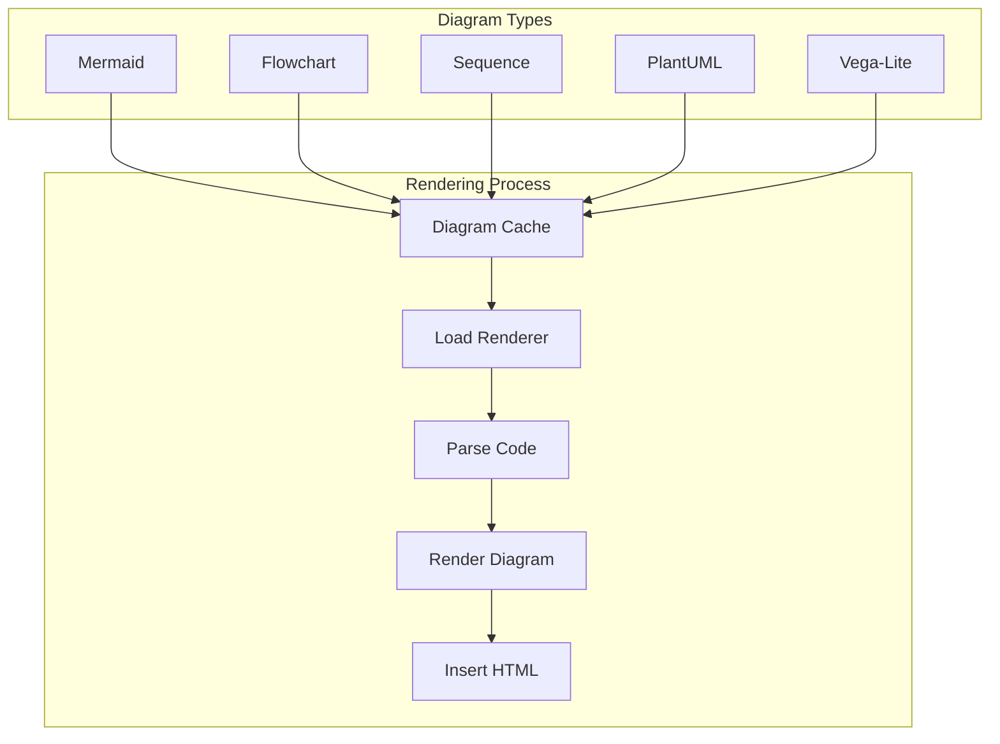
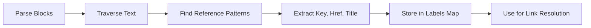
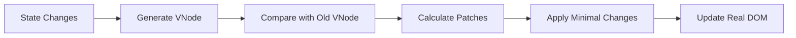

# State Render Module Documentation

## Introduction

The state_render module is a core component of the Muya framework responsible for rendering markdown content from state to the DOM. It serves as the bridge between the abstract content state and the visual representation in the editor, handling both static rendering and dynamic updates through a virtual DOM approach.

## Architecture Overview

The StateRender class is the central component that orchestrates the rendering process. It manages multiple caches for performance optimization and handles various content types including code blocks, images, mathematical expressions, mermaid diagrams, and other diagram types.



## Core Components

### StateRender Class

The StateRender class is the main renderer that converts markdown blocks into DOM elements. It implements several rendering strategies:

- **Full Render**: Complete re-render of all blocks
- **Partial Render**: Selective rendering of updated blocks only
- **Single Render**: Rendering of individual blocks

#### Key Properties

| Property | Type | Purpose |
|----------|------|---------|
| `muya` | Muya | Reference to the main Muya instance |
| `eventCenter` | EventCenter | Event handling system |
| `container` | HTMLElement | DOM container for rendering |
| `codeCache` | Map | Cache for code block rendering |
| `loadImageMap` | Map | Cache for image loading states |
| `loadMathMap` | Map | Cache for mathematical expressions |
| `mermaidCache` | Map | Cache for mermaid diagrams |
| `diagramCache` | Map | Cache for various diagram types |
| `tokenCache` | Map | Cache for parsed tokens |
| `labels` | Map | Link reference definitions |
| `urlMap` | Map | URL mapping for resources |

## Rendering Process Flow



## Content Rendering Strategies

### 1. Full Rendering

The complete rendering process that updates the entire editor content:



### 2. Partial Rendering

Optimized rendering that only updates changed blocks:



### 3. Single Block Rendering

Targeted rendering for individual block updates:



## Specialized Content Rendering

### Diagram Rendering

The module supports multiple diagram types with dedicated rendering logic:



### Link Reference Collection

The module automatically collects link reference definitions from the content:



## Performance Optimizations

### Caching Strategy

The StateRender implements multiple levels of caching to optimize performance:

1. **Code Cache**: Stores processed code blocks
2. **Image Cache**: Tracks image loading states with timestamps
3. **Math Cache**: Caches mathematical expression rendering
4. **Diagram Cache**: Stores diagram rendering results
5. **Token Cache**: Caches parsed markdown tokens
6. **Label Cache**: Stores link reference definitions

### Virtual DOM Integration

The module uses Snabbdom for efficient DOM updates:



## Integration with Other Modules

### Dependencies

- **[muya_framework](muya_framework.md)**: Core Muya instance that provides content state and configuration
- **[muya_events](muya_events.md)**: Event system for handling user interactions
- **[muya_content](muya_content.md)**: Content state management for cursor and selection information
- **[common_utils](common_utils.md)**: Utility functions for string manipulation and sanitization

### Related Components

- **[muya_parser](muya_parser.md)**: Parent module containing the StateRender component
- **[muya_content](muya_content.md)**: Provides the content state that gets rendered
- **[muya_ui_components](muya_ui_components.md)**: UI components that may be rendered within content

## API Reference

### Constructor

```javascript
new StateRender(muya)
```

- **muya**: Muya instance reference

### Key Methods

#### `setContainer(container)`
Sets the DOM container for rendering.

#### `render(blocks, activeBlocks, matches)`
Renders all blocks to the DOM.

#### `partialRender(blocks, activeBlocks, matches, startKey, endKey)`
Renders only specified block range.

#### `singleRender(block, activeBlocks, matches)`
Renders a single block.

#### `collectLabels(blocks)`
Collects link reference definitions from blocks.

#### `invalidateImageCache()`
Invalidates the image loading cache.

## Error Handling

The module includes error handling for various rendering scenarios:

- **Invalid Diagram Codes**: Displays error messages for malformed diagram syntax
- **Missing Targets**: Gracefully handles missing DOM elements
- **Renderer Loading**: Manages asynchronous loading of external renderers

## Configuration

The rendering behavior is controlled through:

- **Muya Options**: Theme settings for different diagram types
- **CSS Classes**: Visual styling through predefined class names
- **Sanitization**: Content security through DOMPurify configuration

## Best Practices

1. **Use Partial Rendering**: When possible, use partial rendering for better performance
2. **Cache Management**: Understand cache invalidation patterns for dynamic content
3. **Async Rendering**: Handle diagram rendering asynchronously to avoid blocking
4. **Error Boundaries**: Implement proper error handling for user-generated content

## Future Considerations

The module is designed to be extensible for:

- Additional diagram types
- Custom rendering plugins
- Performance optimizations
- Accessibility improvements