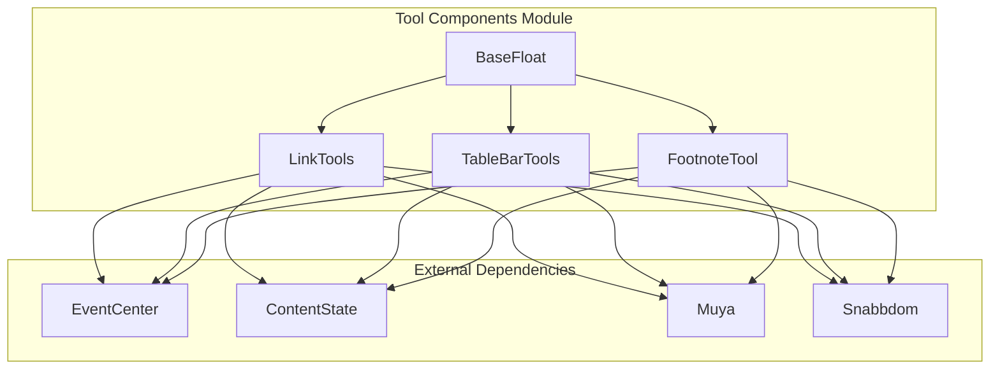
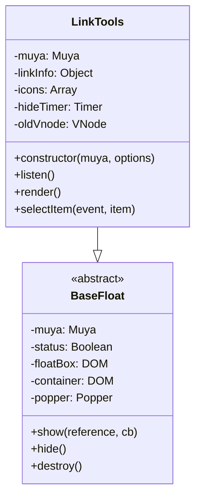
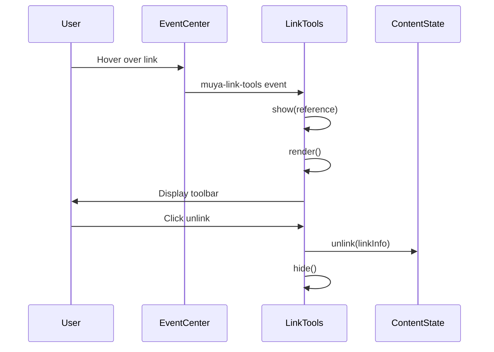
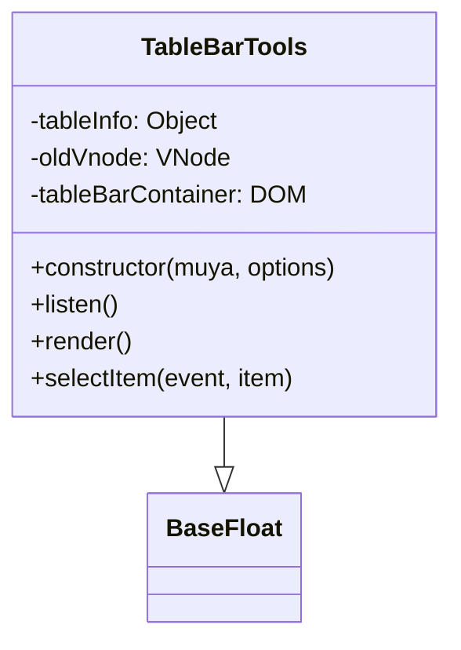
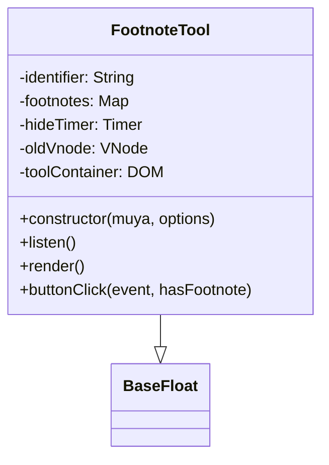
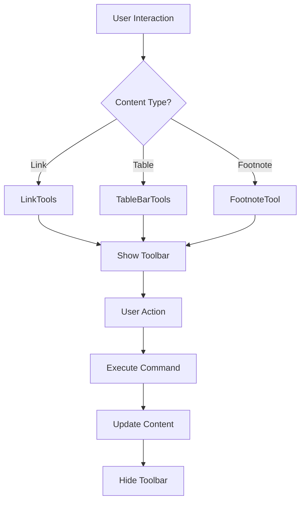
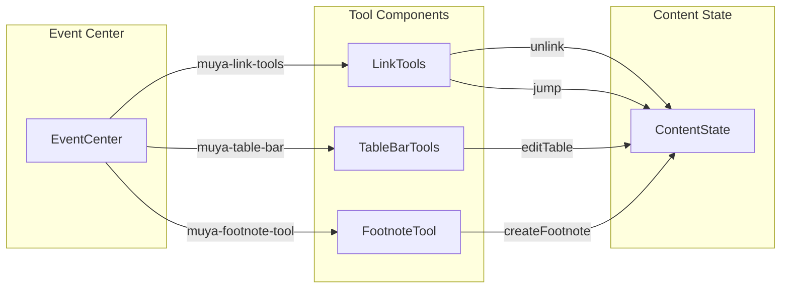
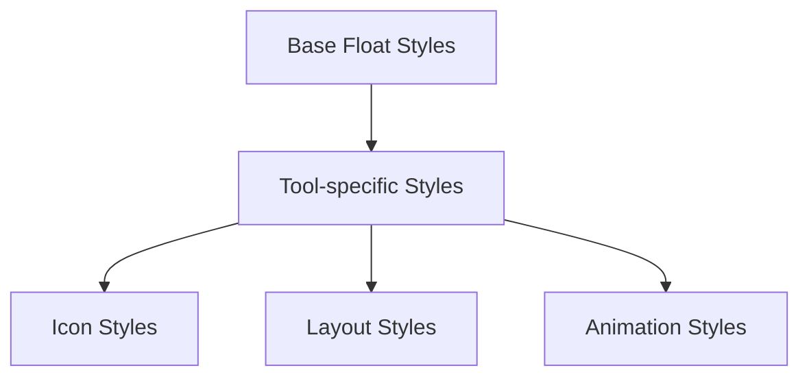

# Tool Components Module Documentation

## Introduction

The `tool_components` module provides floating UI tools for interactive content manipulation within the Muya editor framework. This module specializes in context-sensitive toolbars and utilities that appear when users interact with specific content elements like links, tables, and footnotes. These tools enhance the editing experience by providing quick access to relevant actions without cluttering the main interface.

## Module Architecture

The tool_components module is built on a foundation of floating UI components that inherit from a common base class. Each tool is designed to be lightweight, responsive, and seamlessly integrated with the Muya event system.



## Core Components

### LinkTools

**Purpose**: Provides contextual tools for link manipulation including unlinking and navigation actions.

**Key Features**:
- Floating toolbar that appears when hovering over links
- Two primary actions: unlink and jump to link destination
- Configurable positioning and styling
- Auto-hide functionality with delay

**Component Architecture**:


**Event Flow**:


### TableBarTools

**Purpose**: Provides table manipulation tools for inserting/removing rows and columns based on cursor position.

**Key Features**:
- Context-sensitive toolbar for table editing
- Row operations (insert above/below, remove)
- Column operations (insert left/right, remove)
- Position-aware placement (left or bottom toolbar)

**Configuration**:
- `left`: Row manipulation tools
- `bottom`: Column manipulation tools

**Component Architecture**:


### FootnoteTool

**Purpose**: Manages footnote creation and navigation, providing warnings for undefined footnotes.

**Key Features**:
- Footnote validation and warning system
- Quick navigation to existing footnotes
- One-click footnote creation for undefined references
- Visual feedback with warning icons

**Component Architecture**:


## Data Flow and Interactions

### Tool Activation Flow


### Event System Integration


## Configuration and Customization

### Default Options
All tool components inherit common floating behavior options:
- **placement**: Toolbar positioning relative to reference element
- **modifiers**: Popper.js modifiers for fine-tuned positioning
- **showArrow**: Whether to display arrow pointer
- **offset**: Distance from reference element

### Icon Configuration
LinkTools uses a configurable icon system defined in `config.js`:
- Unlink icon for removing links
- Jump icon for navigation actions

### Table Tool Configuration
TableBarTools uses action-based configuration supporting:
- Insert operations (rows/columns)
- Remove operations
- Position-aware actions (previous, next, left, right)

## Integration with Muya Framework

### Content State Integration
All tools interact with the ContentState system for persistent content manipulation:
- LinkTools: `contentState.unlink()`
- TableBarTools: `contentState.editTable()`
- FootnoteTool: `contentState.createFootnote()`

### Event System
Tools integrate with Muya's centralized event system:
- Subscribe to specific tool events
- Handle DOM events through event center
- Coordinate with other UI components

### Rendering System
Tools use Snabbdom virtual DOM for efficient rendering:
- Minimal DOM updates
- Icon and styling management
- Responsive layout handling

## Styling and Theming

### CSS Architecture
Each tool component includes dedicated CSS files:
- `index.css`: Component-specific styles
- Inheritance from base float styles
- Theme-aware styling support

### Visual Hierarchy


## Usage Patterns

### LinkTools Usage
```javascript
// Automatic activation through event system
eventCenter.subscribe('muya-link-tools', ({ reference, linkInfo }) => {
  // Tool automatically shows/hides based on reference
})
```

### TableBarTools Usage
```javascript
// Triggered by table interaction
eventCenter.subscribe('muya-table-bar', ({ reference, tableInfo }) => {
  // Tool renders appropriate actions based on barType
})
```

### FootnoteTool Usage
```javascript
// Activated for footnote references
eventCenter.subscribe('muya-footnote-tool', ({ reference, identifier, footnotes }) => {
  // Tool validates footnote existence and provides actions
})
```

## Dependencies

### Internal Dependencies
- **[baseFloat](muya_ui_components.md)**: Base floating UI component
- **[EventCenter](muya_events.md)**: Event management system
- **[ContentState](muya_content.md)**: Content manipulation API

### External Dependencies
- **Popper.js**: Positioning engine for floating elements
- **Snabbdom**: Virtual DOM library for efficient rendering

## Best Practices

### Performance Considerations
- Virtual DOM rendering minimizes DOM manipulation
- Event delegation reduces listener overhead
- Auto-hide functionality prevents UI clutter

### User Experience
- Context-sensitive tool appearance
- Consistent interaction patterns across tools
- Visual feedback for all actions
- Accessible keyboard navigation support

### Development Guidelines
- Extend BaseFloat for new tool components
- Use configuration files for tool definitions
- Implement proper cleanup in destroy methods
- Follow event naming conventions

## Related Documentation
- [Muya UI Components](muya_ui_components.md) - Base floating components and UI framework
- [Muya Events](muya_events.md) - Event system integration
- [Muya Content](muya_content.md) - Content manipulation APIs
- [Main App Core](main_app_core.md) - Application-level integration