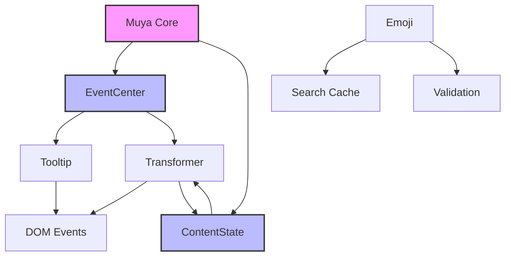
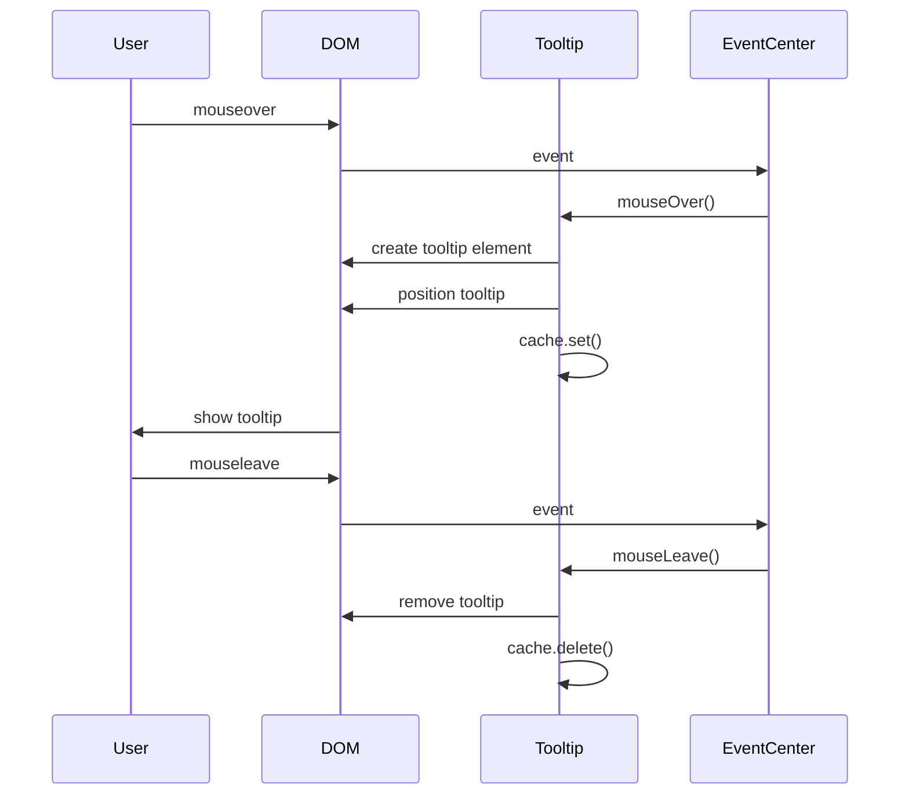
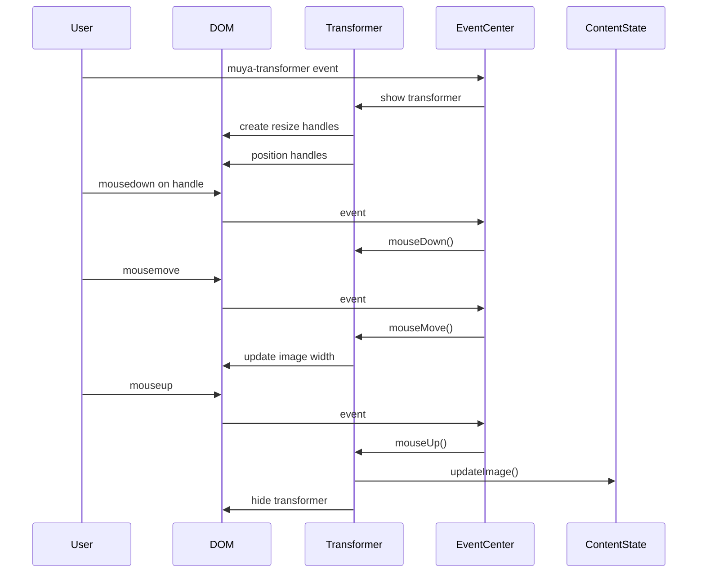
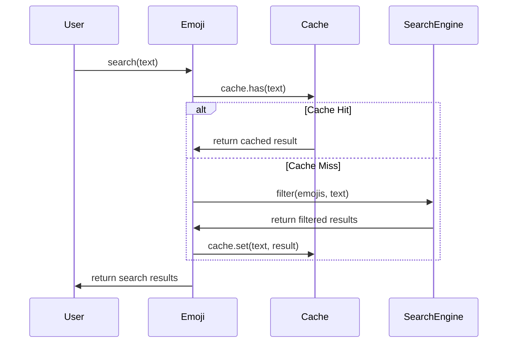

# Utility Components Module

## Introduction

The utility_components module provides essential UI utilities for the Muya editor framework. This module contains three core components: Tooltip, Transformer, and Emoji, which serve as foundational building blocks for user interface interactions and content manipulation within the editor.

## Module Overview

The utility_components module is part of the larger Muya UI framework and provides specialized UI utilities that enhance the editing experience. These components are designed to be lightweight, focused, and easily integrated into the broader editor ecosystem.

## Core Components

### 1. Tooltip Component

**Purpose**: Provides contextual tooltip functionality for UI elements

**Location**: `src.muya.lib.ui.tooltip.index.Tooltip`

**Key Features**:
- Dynamic tooltip positioning based on target element
- WeakMap-based caching system for performance optimization
- Automatic cleanup when target elements are removed from DOM
- Smooth fade-in animations
- Event-driven architecture using EventCenter

**Architecture**:
```
┌─────────────────┐
│   Tooltip       │
├─────────────────┤
│ - muya          │
│ - cache         │
│ - eventCenter   │
└─────────────────┘
         │
         ▼
┌─────────────────┐
│  Event System   │
├─────────────────┤
│ mouseover       │
│ mouseleave      │
│ positioning     │
└─────────────────┘
```

**Usage Flow**:
1. Component listens for `mouseover` events on container
2. Detects elements with `data-tooltip` attribute
3. Creates and positions tooltip element
4. Manages tooltip lifecycle and cleanup

### 2. Transformer Component

**Purpose**: Provides interactive image transformation controls

**Location**: `src.muya.lib.ui.transformer.index.Transformer`

**Key Features**:
- Visual resize handles for image manipulation
- Real-time width adjustment with minimum constraints (50px)
- Scroll-aware behavior (hides on significant scroll)
- Click-outside-to-close functionality
- Integration with content state for persistent changes

**Architecture**:
```
┌─────────────────┐
│  Transformer    │
├─────────────────┤
│ - muya          │
│ - reference     │
│ - imageInfo     │
│ - status        │
│ - eventId[]     │
└─────────────────┘
         │
         ▼
┌─────────────────┐
│  Resize System  │
├─────────────────┤
│ mouse events    │
│ drag handling   │
│ width updates   │
│ content sync    │
└─────────────────┘
```

**Resize Handle System**:
- Four corner handles: top-left, top-right, bottom-left, bottom-right
- Dynamic width calculation based on mouse position
- Minimum width constraint enforcement
- Real-time visual feedback

### 3. Emoji Component

**Purpose**: Provides emoji search and validation functionality

**Location**: `src.muya.lib.ui.emojis.index.Emoji`

**Key Features**:
- Fuzzy search using fuzzaldrin algorithm
- Categorized emoji organization
- Cache-based performance optimization
- Emoji validation and alias matching
- Search result categorization

**Architecture**:
```
┌─────────────────┐
│     Emoji       │
├─────────────────┤
│ - cache         │
│ - emojis        │
│ - search data   │
└─────────────────┘
         │
         ▼
┌─────────────────┐
│  Search System  │
├─────────────────┤
│ fuzzy matching  │
│ categorization  │
│ validation      │
│ caching         │
└─────────────────┘
```

**Data Structure**:
- Emojis organized by category
- Search index combining aliases and tags
- WeakMap-based result caching
- Real-time search with fuzzy matching

## Component Relationships



## Data Flow

### Tooltip Data Flow


### Transformer Data Flow


### Emoji Search Flow


## Integration Points

### Event System Integration
All utility components integrate with the [EventCenter](muya_events.md) for:
- DOM event management
- Custom event dispatching
- Event lifecycle management
- Cross-component communication

### Content State Integration
The Transformer component integrates with [ContentState](muya_content.md) for:
- Persistent image width updates
- Content synchronization
- Undo/redo support
- State management

### UI Framework Integration
Components integrate with the broader [Muya UI framework](muya_ui_components.md) through:
- Consistent styling patterns
- Shared positioning utilities
- Common interaction patterns
- Unified event handling

## Performance Considerations

### Tooltip Performance
- WeakMap caching prevents memory leaks
- Automatic cleanup on element removal
- Efficient positioning calculations
- Minimal DOM manipulation

### Transformer Performance
- Event ID tracking for proper cleanup
- Scroll-aware behavior to reduce unnecessary updates
- Efficient resize calculations
- Optimized DOM updates

### Emoji Performance
- Search result caching
- Fuzzy search algorithm optimization
- Lazy loading of emoji data
- Memory-efficient data structures

## Usage Examples

### Tooltip Usage
```javascript
// Automatic via data attribute
<div data-tooltip="Helpful information">Hover me</div>

// Component handles all positioning and lifecycle
```

### Transformer Usage
```javascript
// Triggered via event system
eventCenter.dispatch('muya-transformer', {
  reference: imageElement,
  imageInfo: imageData
})
```

### Emoji Usage
```javascript
// Search for emojis
const results = emoji.search('smile')
// Returns categorized results with fuzzy matching

// Validate emoji
const emojiData = validEmoji(':smile:')
// Returns emoji object or undefined
```

## Dependencies

### Internal Dependencies
- [EventCenter](muya_events.md): Event management system
- [ContentState](muya_content.md): Content state management
- [Muya Core](muya_framework.md): Core framework functionality

### External Dependencies
- `fuzzaldrin`: Fuzzy search algorithm for emoji search
- CSS modules: Component-specific styling

## Future Enhancements

### Tooltip Enhancements
- Custom positioning strategies
- Rich content support (HTML, images)
- Accessibility improvements
- Animation customization

### Transformer Enhancements
- Additional transformation types (rotation, crop)
- Multi-image selection
- Keyboard shortcuts
- Preset aspect ratios

### Emoji Enhancements
- Custom emoji support
- Recent emoji tracking
- Skin tone variations
- Emoji picker integration

## Conclusion

The utility_components module provides essential UI utilities that enhance the user experience in the Muya editor. These components are designed with performance, accessibility, and extensibility in mind, serving as building blocks for more complex UI interactions. Their integration with the broader Muya ecosystem ensures consistent behavior and reliable performance across the application.