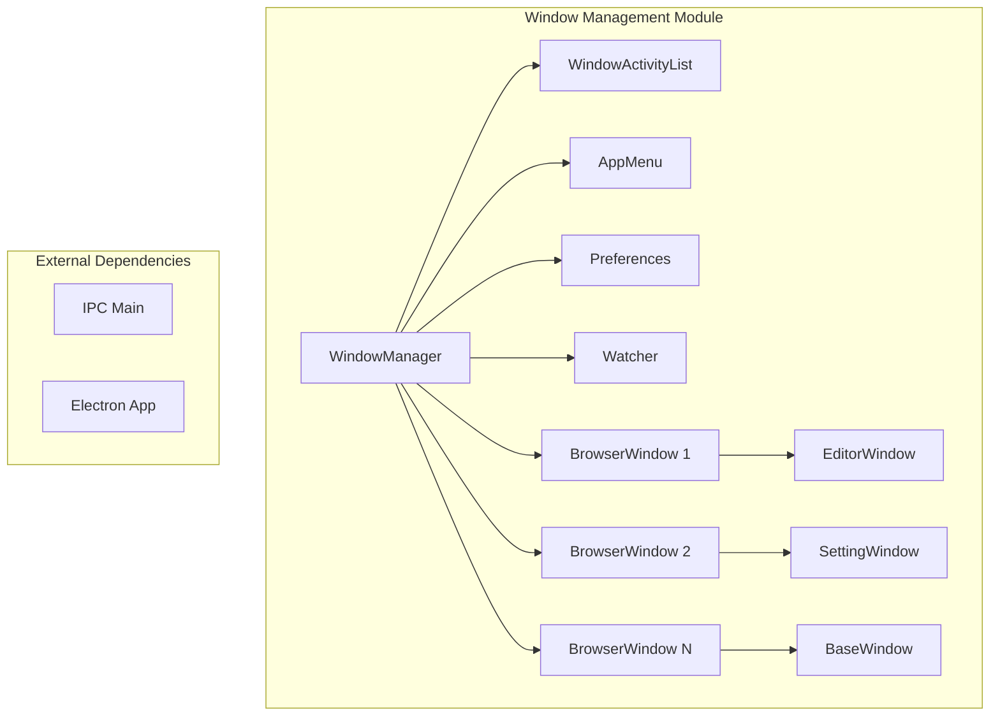
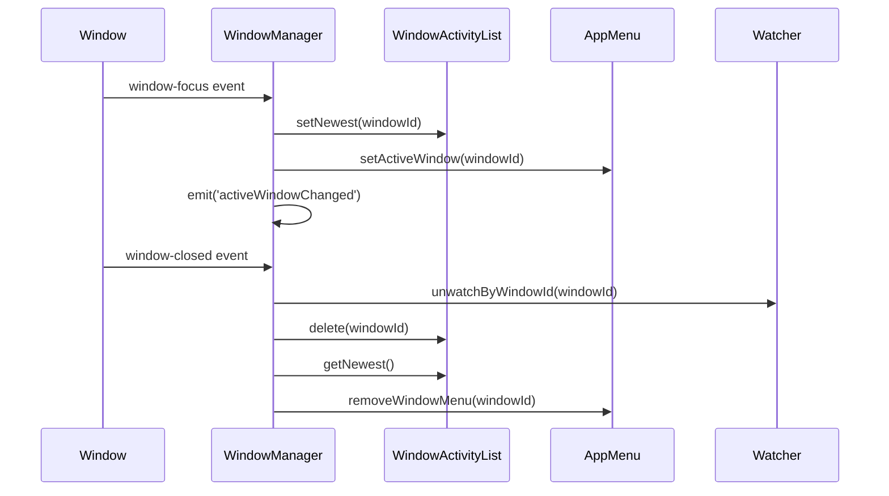
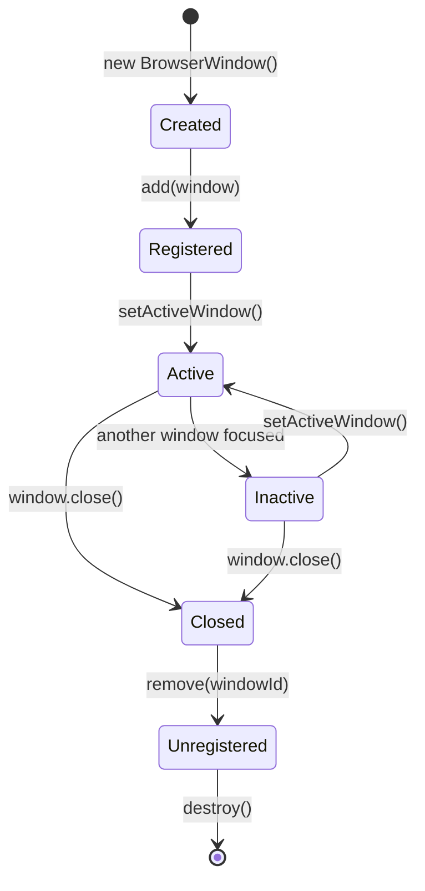
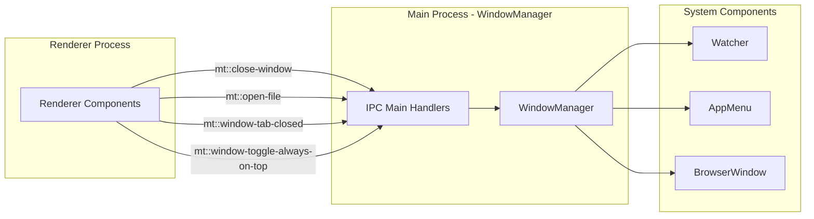
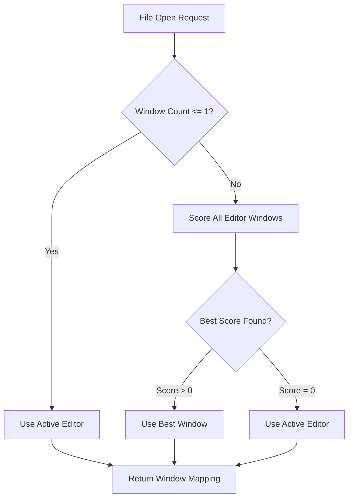

# Window Management Module

## Introduction

The Window Management module serves as the central coordinator for all application windows in the Electron-based application. It provides comprehensive window lifecycle management, activity tracking, and coordination between different window types. This module ensures proper window state management, handles window focus transitions, and manages file associations across multiple windows.

## Architecture Overview

The Window Management module consists of two primary components that work together to manage the application's window ecosystem:

### Core Components

1. **WindowManager** - The main orchestrator that manages all application windows
2. **WindowActivityList** - A specialized data structure for tracking window activity and focus history

## Component Details

### WindowManager

The `WindowManager` class extends `EventEmitter` and serves as the central hub for all window-related operations. It maintains a registry of all active windows, tracks window focus history, and coordinates interactions between windows and other system components.

#### Key Responsibilities:
- Window registration and lifecycle management
- Active window tracking and focus management
- File opening coordination across windows
- IPC event handling for window operations
- Integration with file system watcher
- Menu coordination with AppMenu

#### Constructor Dependencies:
- `AppMenu` - For managing application menus per window
- `Preference` - For accessing application preferences

### WindowActivityList

The `WindowActivityList` is a specialized data structure that maintains a chronological list of window IDs to track window focus history. It uses a simple array-based buffer to manage the most recently active windows.

#### Key Methods:
- `getNewest()` - Returns the most recently active window ID
- `getSecondNewest()` - Returns the second most recently active window ID
- `setNewest(id)` - Updates the activity list with a newly focused window
- `delete(id)` - Removes a window from the activity tracking

## Data Flow Architecture

## Window Lifecycle Management

## IPC Communication Flow

The WindowManager handles numerous IPC events to coordinate between renderer processes and the main process:

## File Opening Strategy

The `findBestWindowToOpenIn()` method implements an intelligent file opening strategy that considers:

1. **Single Window Scenario**: Opens files in the only available window
2. **Multi-Window Scenario**: Uses scoring algorithm to find best window
3. **Already Open Files**: Skips files that are already open
4. **Editor Window Preference**: Prioritizes editor windows for file operations

## Integration with Other Modules

### Menu System Integration
The WindowManager works closely with the [menu_system](menu_system.md) module to ensure proper menu state management across windows:
- Adds default menus to new windows
- Updates active window menu state
- Handles window-specific menu items

### File System Integration
Integration with the [file_system](file_system.md) module through the Watcher class:
- Manages file watching per window
- Handles file change notifications
- Coordinates file save events with watcher ignore logic

### Window Types Integration
Coordinates with the [window_types](window_types.md) module to manage different window types:
- Editor windows for file editing
- Settings windows for preferences
- Base windows for general functionality

## Event System

The WindowManager emits the following events:

- `activeWindowChanged` - Emitted when the active window changes
- `window-focus` - Forwarded from individual windows
- `window-closed` - Forwarded from individual windows

## Error Handling

The module includes comprehensive error handling for:
- Missing window references
- Invalid window operations
- IPC communication failures
- File system watcher errors

## Performance Considerations

- Uses efficient Map data structure for window storage
- Implements lazy window activity tracking
- Minimizes IPC communication overhead
- Optimizes file opening algorithms for multi-window scenarios

## Security Considerations

- Validates all IPC inputs before processing
- Ensures proper window cleanup to prevent memory leaks
- Manages window lifecycle to prevent unauthorized access
- Coordinates with file system watcher to prevent race conditions