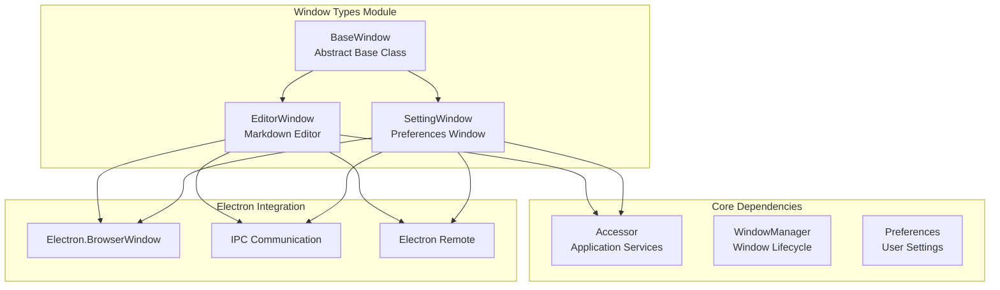
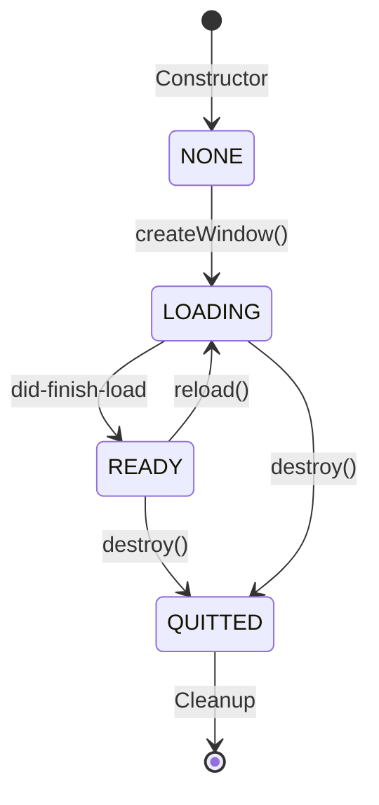
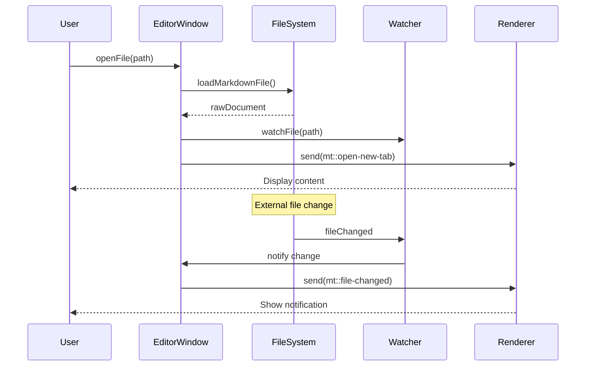
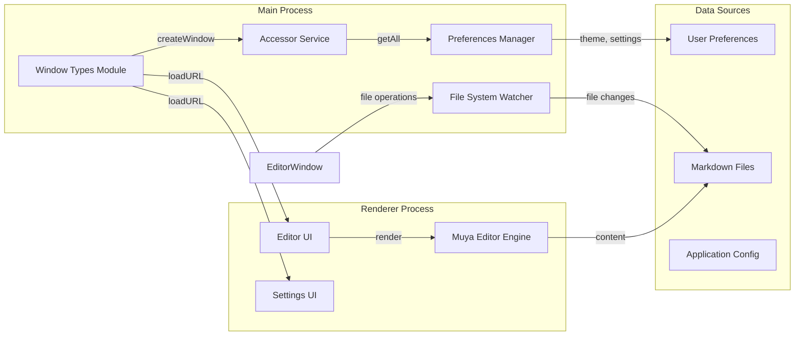
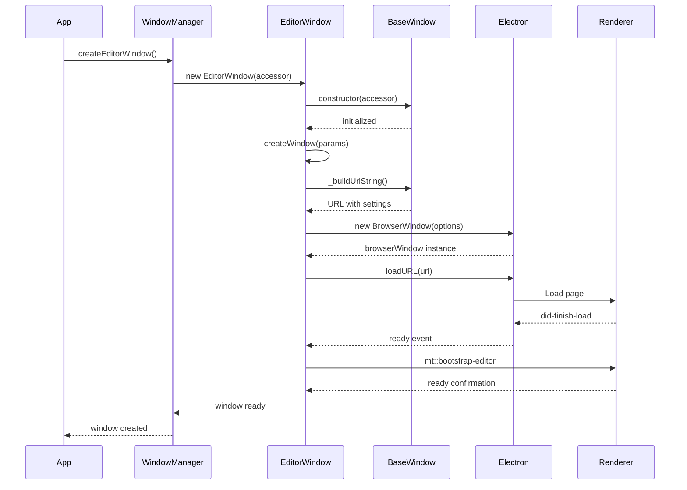

# Window Types Module Documentation

## Introduction

The `window_types` module is a core component of the MarkText application that defines and manages different types of application windows. It provides the foundational architecture for creating and managing editor windows and settings windows, serving as the primary interface between the main application and the user interface layer.

## Architecture Overview

The window_types module implements a hierarchical window management system with three main components:

1. **BaseWindow** - Abstract base class providing common window functionality
2. **EditorWindow** - Specialized window for markdown editing with file management capabilities
3. **SettingWindow** - Specialized window for application preferences and settings

## Component Details

### BaseWindow Class

The `BaseWindow` class serves as the abstract foundation for all window types in the application. It extends Node.js EventEmitter to provide event-driven window management capabilities.

**Key Responsibilities:**
- Window lifecycle management (NONE, LOADING, READY, QUITTED states)
- URL construction with user preferences and environment settings
- Theme-based background color management
- Common window operations (bringToFront, reload, destroy)

**Window Types:**
- `BASE` - Abstract base (should never be instantiated directly)
- `EDITOR` - Markdown editor windows
- `SETTINGS` - Preferences and settings windows

### EditorWindow Class

The `EditorWindow` class extends BaseWindow to provide comprehensive markdown editing capabilities with file system integration.

**Key Features:**
- Multi-tab markdown editing
- File system watching and synchronization
- Directory management with tree view
- Spell checking integration
- Context menu support
- Window state persistence
- File encoding and line ending management

**File Management Capabilities:**
- Open multiple files simultaneously
- Watch files for external changes
- Manage root directories with file tree
- Recently used documents tracking
- Untitled tab creation

### SettingWindow Class

The `SettingWindow` class provides a dedicated interface for application preferences and configuration management.

**Key Features:**
- Category-based settings navigation
- Real-time preference updates
- Keyboard shortcut integration
- Development tools support
- Theme-aware styling

## Data Flow Architecture

## Integration with Other Modules

### Window Management Integration

The window_types module integrates closely with the [window_management](window_management.md) module through the WindowManager, which handles:
- Window lifecycle coordination
- Window activity tracking
- Multi-window state management
- Window switching and focus management

### File System Integration

EditorWindow integrates with the [file_system](file_system.md) module through:
- File watching and change detection
- Markdown file loading and parsing
- Directory tree management
- File path normalization

### Preferences Integration

Both window types integrate with the [preferences](preferences.md) module for:
- Theme application
- Font settings
- Editor behavior configuration
- Spell checker settings

### Command System Integration

Windows communicate with the [command_system](command_system.md) through:
- Menu command handling
- Keyboard shortcut processing
- Action execution

## Event System

The window_types module implements a comprehensive event system for inter-component communication:

```mermaid
graph TD
    subgraph "Window Events"
        WE1[window-ready]
        WE2[window-focus]
        WE3[window-blur]
        WE4[window-close]
        WE5[window-closed]
    end
    
    subgraph "IPC Events"
        IPC1[mt::bootstrap-editor]
        IPC2[mt::open-new-tab]
        IPC3[mt::file-changed]
        IPC4[mt::window-active-status]
        IPC5[mt::ask-for-close]
    end
    
    subgraph "File System Events"
        FS1[watcher-watch-file]
        FS2[watcher-unwatch-file]
        FS3[watcher-watch-directory]
        FS4[watcher-unwatch-directory]
    end
    
    BaseWindow -->|emits| WE1
    BaseWindow -->|emits| WE2
    BaseWindow -->|emits| WE3
    BaseWindow -->|emits| WE4
    BaseWindow -->|emits| WE5
    
    EditorWindow -->|sends| IPC1
    EditorWindow -->|sends| IPC2
    EditorWindow -->|sends| IPC3
    EditorWindow -->|sends| IPC4
    EditorWindow -->|sends| IPC5
    
    EditorWindow -->|emits| FS1
    EditorWindow -->|emits| FS2
    EditorWindow -->|emits| FS3
    EditorWindow -->|emits| FS4
```

## Window Creation Process

## Error Handling and Recovery

The window_types module implements robust error handling for various scenarios:

**Renderer Process Crashes:**
- Detection of renderer process termination
- User notification with recovery options
- Automatic reload or graceful shutdown

**File Loading Errors:**
- File access permission issues
- Invalid markdown format handling
- Network file access problems
- User notification with detailed error messages

**Window State Corruption:**
- Window position validation
- Size constraint enforcement
- State restoration fallback mechanisms

## Security Considerations

The module implements several security measures:

- **Context Isolation:** WebPreferences configuration for secure renderer isolation
- **Remote Module:** Controlled enablement of Electron remote module
- **File Access:** Restricted file system access through controlled APIs
- **URL Construction:** Sanitized URL parameter handling
- **Menu Shortcuts:** Disabled default menu shortcuts to prevent conflicts

## Performance Optimizations

**Window Loading:**
- Delayed file loading after window creation
- Background color pre-configuration for faster visual feedback
- Minimal initial data transfer with delayed full settings loading

**Memory Management:**
- Proper cleanup of event listeners
- BrowserWindow reference management
- File watcher lifecycle management

**Resource Usage:**
- Window state persistence to avoid redundant operations
- Efficient file watching with selective monitoring
- Optimized URL construction with cached preferences

## Configuration and Customization

The module supports extensive customization through:

- **Theme Integration:** Dynamic theme application with background color optimization
- **Window Options:** Configurable BrowserWindow options per window type
- **Menu Customization:** Dynamic menu generation based on window type
- **Keyboard Shortcuts:** Integration with application-wide keybinding system
- **Development Tools:** Conditional development tools access

This architecture provides a solid foundation for the MarkText application's user interface layer, ensuring reliable window management, efficient file handling, and seamless integration with the broader application ecosystem.