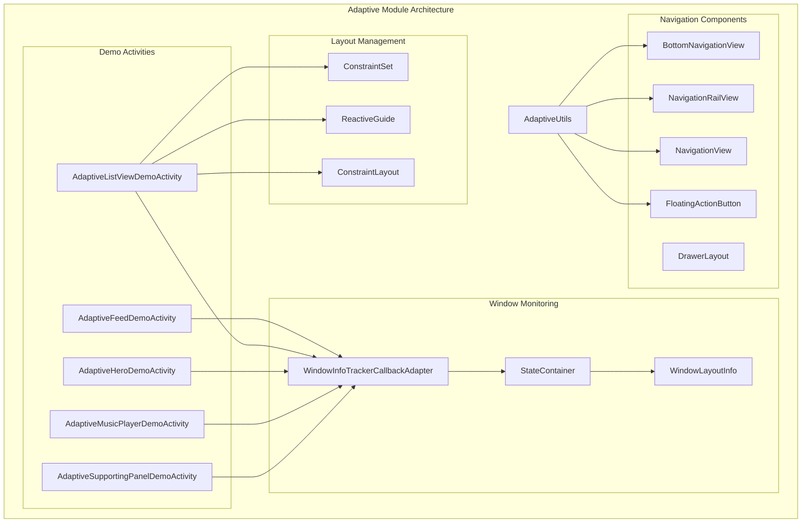
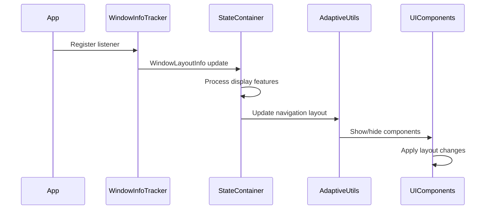
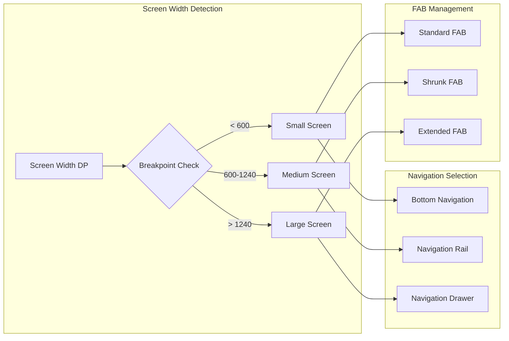
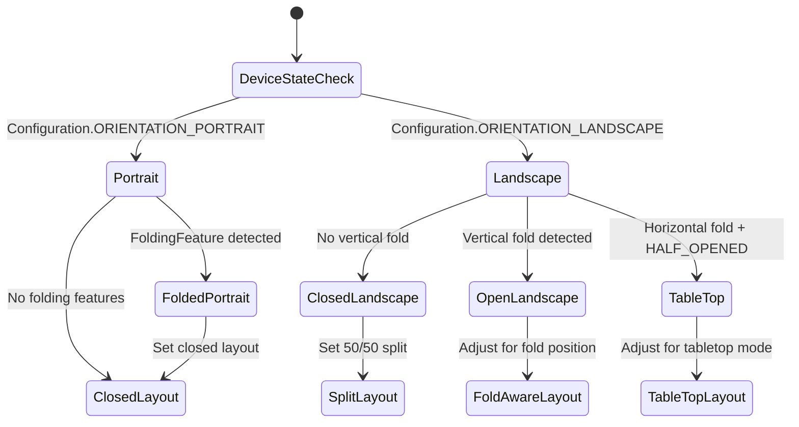
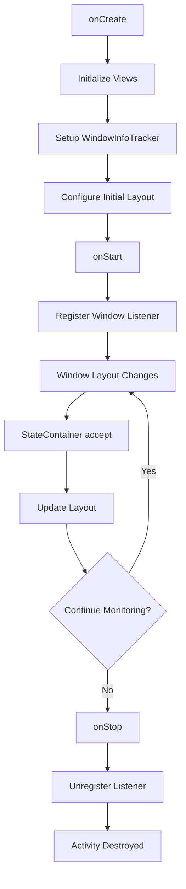
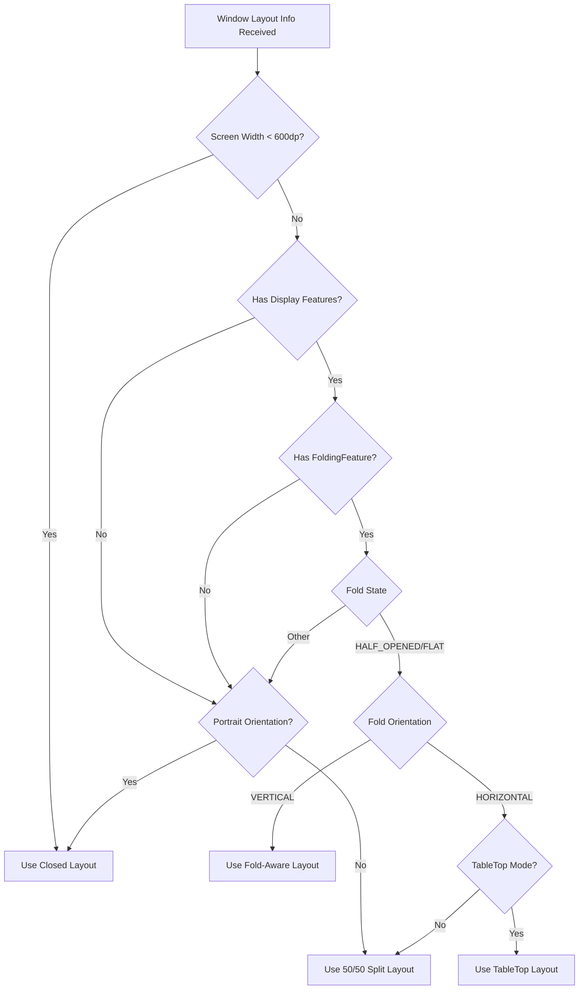

# Adaptive Module Documentation

## Introduction

The adaptive module is a comprehensive demonstration system within the Material Design Catalog that showcases responsive UI patterns for different screen sizes, device orientations, and foldable device configurations. It provides practical examples of how Material Design components adapt to various display scenarios, from small mobile screens to large tablets and foldable devices.

## Module Overview

The adaptive module serves as a showcase for Material Design's responsive design principles, demonstrating how applications can dynamically adjust their layout and navigation patterns based on screen characteristics. It includes multiple demo activities that illustrate different adaptive scenarios including feed layouts, list-detail views, hero sections, music player interfaces, and supporting panels.

## Core Architecture

### Component Structure

The adaptive module is built around several key architectural patterns:

1. **Window Layout Monitoring**: Uses AndroidX Window library to detect display features and folding states
2. **Dynamic Layout Management**: Adjusts UI components based on screen width breakpoints and device orientation
3. **Navigation Pattern Switching**: Transitions between different navigation paradigms (bottom navigation, navigation rail, navigation drawer)
4. **Fragment-based Architecture**: Utilizes fragments for modular, reusable UI components

### Key Components

#### AdaptiveUtils
The central utility class that manages navigation view layout transitions based on screen width breakpoints:
- **Small screens (< 600dp)**: Bottom navigation with optional FAB
- **Medium screens (600-1240dp)**: Navigation rail with FAB
- **Large screens (> 1240dp)**: Navigation drawer with extended FAB

#### Demo Activities
Each demo activity extends `DemoActivity` and implements adaptive behavior:
- `AdaptiveFeedDemoActivity`: Demonstrates adaptive feed layouts
- `AdaptiveListViewDemoActivity`: Shows list-detail view adaptation
- `AdaptiveHeroDemoActivity`: Displays hero section adaptation
- `AdaptiveMusicPlayerDemoActivity`: Music player interface adaptation
- `AdaptiveSupportingPanelDemoActivity`: Supporting panel layout adaptation

#### StateContainer Pattern
Internal classes that implement `Consumer<WindowLayoutInfo>` to handle window layout changes and trigger appropriate UI updates.

## Architecture Diagram



## Data Flow Architecture



## Component Interactions

### Navigation Adaptation Process



### Foldable Device Handling



## Process Flows

### Activity Lifecycle with Window Monitoring



### Layout Update Decision Tree



## Key Features

### 1. Responsive Navigation Patterns
The module demonstrates three primary navigation patterns that adapt based on screen width:
- **Bottom Navigation**: Optimized for one-handed mobile usage
- **Navigation Rail**: Efficient side navigation for tablets
- **Navigation Drawer**: Comprehensive navigation for large screens

### 2. Foldable Device Support
Advanced support for foldable devices including:
- **Vertical Fold Detection**: Splits content around vertical folds
- **TableTop Mode**: Optimizes layout for horizontal half-opened states
- **Fold-Aware Layouts**: Adjusts content positioning based on fold position and width

### 3. Dynamic Layout Transitions
Smooth transitions between different layout configurations:
- **ConstraintLayout Updates**: Dynamic guideline positioning
- **Fragment Transactions**: Seamless fragment replacements
- **Material Transitions**: Container transforms and fade-through animations

### 4. Window Layout Monitoring
Real-time monitoring of display characteristics:
- **Display Feature Detection**: Identifies folding features and display cutouts
- **Orientation Handling**: Responds to configuration changes
- **State Management**: Maintains UI state across layout transitions

## Integration with Material Components

The adaptive module integrates with various Material Design components:

### Navigation Components
- [Bottom Navigation](bottom-navigation.md): Responsive bottom navigation implementation
- [Navigation Rail](navigation.md): Side navigation for medium screens
- [Navigation Drawer](navigation.md): Drawer navigation for large screens

### Layout Components
- [ConstraintLayout](common-utils.md): Flexible layout management
- [CoordinatorLayout](appbar.md): Coordinated scrolling behaviors
- [DrawerLayout](navigation.md): Drawer navigation container

### Interactive Elements
- [Floating Action Button](fab.md): Adaptive FAB sizing and positioning
- [Material Transitions](transition.md): Smooth layout transitions
- [Bottom Sheet](bottom-sheet.md): Modal content presentation

## Best Practices

### 1. Breakpoint Management
Use consistent breakpoints across your application:
```java
static final int MEDIUM_SCREEN_WIDTH_SIZE = 600;
static final int LARGE_SCREEN_WIDTH_SIZE = 1240;
```

### 2. State Preservation
Maintain UI state during layout transitions:
- Use `SavedState` patterns for fragment state
- Implement proper lifecycle management
- Handle configuration changes gracefully

### 3. Performance Optimization
- Use `WindowInfoTracker` efficiently with proper listener management
- Implement view recycling for adaptive lists
- Minimize layout recalculations during transitions

### 4. Accessibility Considerations
- Ensure navigation patterns maintain accessibility standards
- Provide appropriate content descriptions for adaptive elements
- Test with screen readers across different layouts

## Dependencies

The adaptive module relies on several key dependencies:

### Core AndroidX Libraries
- `androidx.window:window`: Window layout information and folding feature detection
- `androidx.constraintlayout:constraintlayout`: Flexible layout management
- `androidx.drawerlayout:drawerlayout`: Drawer navigation support

### Material Components
- Material navigation components (bottom navigation, navigation rail, navigation drawer)
- Material transitions for smooth layout changes
- Material FAB implementations

### Catalog Dependencies
- [Common Utilities](common-utils.md): Shared utility functions
- [Feature Framework](catalog.md): Demo activity base classes
- [Music Player](catalog.md): Music player demo integration

## Usage Examples

### Implementing Adaptive Navigation
```java
// Update navigation based on screen width
AdaptiveUtils.updateNavigationViewLayout(
    screenWidth,
    drawerLayout,
    modalNavDrawer,
    fab,
    bottomNav,
    navRail,
    navDrawer,
    navFab
);
```

### Handling Window Layout Changes
```java
private class StateContainer implements Consumer<WindowLayoutInfo> {
    @Override
    public void accept(WindowLayoutInfo windowLayoutInfo) {
        List<DisplayFeature> displayFeatures = windowLayoutInfo.getDisplayFeatures();
        // Process display features and update layout
        updateLayoutBasedOnFeatures(displayFeatures);
    }
}
```

### Managing Foldable Device States
```java
for (DisplayFeature displayFeature : displayFeatures) {
    if (displayFeature instanceof FoldingFeature) {
        FoldingFeature foldingFeature = (FoldingFeature) displayFeature;
        if (foldingFeature.getOrientation() == Orientation.VERTICAL) {
            int foldPosition = foldingFeature.getBounds().left;
            int foldWidth = foldingFeature.getBounds().width();
            // Apply fold-aware layout
        }
    }
}
```

## Testing Considerations

### Device Categories
Test adaptive behaviors across different device categories:
- **Small phones**: < 600dp width
- **Large phones/tablets**: 600-1240dp width
- **Large tablets**: > 1240dp width
- **Foldable devices**: Various fold states and orientations

### Orientation Testing
Verify behavior in different orientations:
- Portrait mode on all device sizes
- Landscape mode adaptations
- Orientation change transitions

### Foldable Device Testing
Specific considerations for foldable devices:
- Vertical fold handling
- Horizontal fold (tabletop) mode
- Fold state transitions
- Content reflow around folds

## Future Enhancements

The adaptive module provides a foundation for responsive Material Design implementations. Future enhancements may include:

1. **Additional Layout Patterns**: More complex adaptive layouts for specific use cases
2. **Animation Improvements**: Enhanced transition animations between layouts
3. **Accessibility Enhancements**: Better support for accessibility across different layouts
4. **Performance Optimizations**: Reduced layout calculation overhead
5. **Extended Device Support**: Support for new device form factors and display technologies

## Conclusion

The adaptive module demonstrates Material Design's commitment to creating responsive, accessible, and beautiful user interfaces that work seamlessly across the full spectrum of Android devices. By providing concrete examples of adaptive patterns, it serves as both a showcase and a reference implementation for developers building responsive Material Design applications.