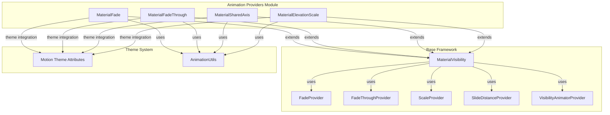
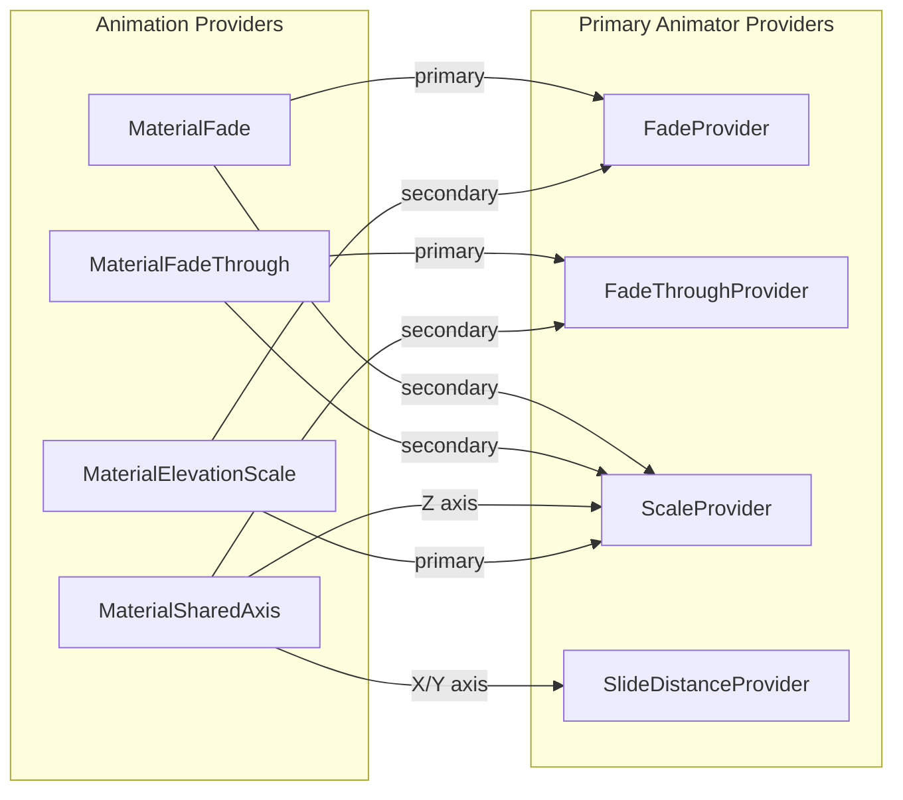
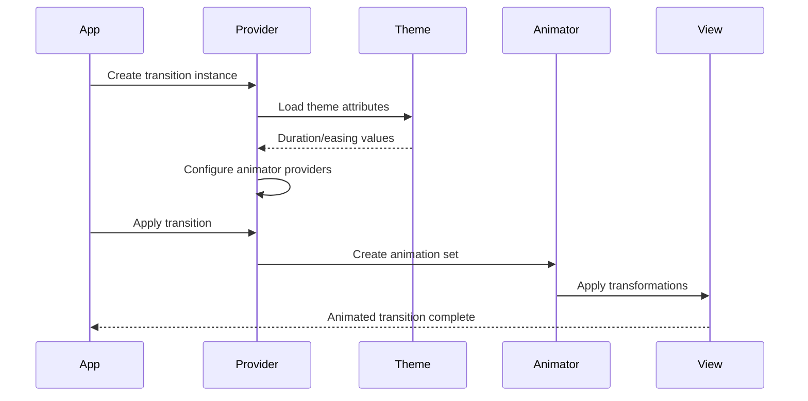
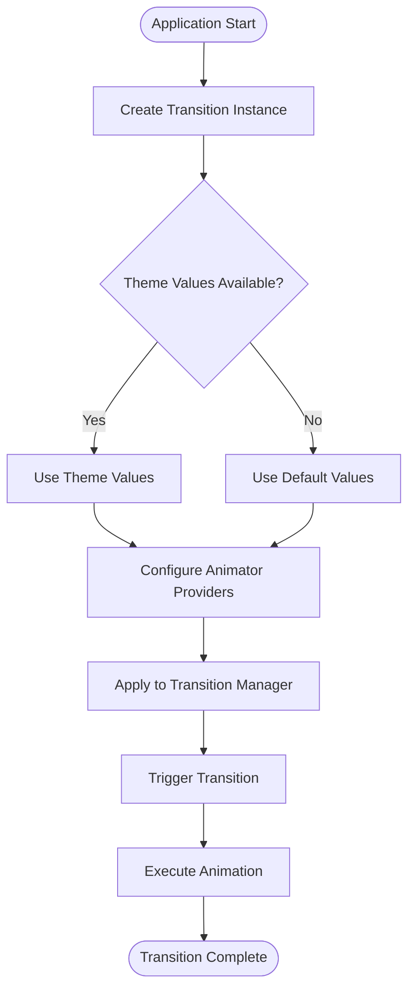

# Animation Providers Module

The animation-providers module is a specialized component within the Material Design transition system that provides high-level, theme-aware animation implementations for common UI transition patterns. This module serves as the primary interface for developers to implement Material Design motion guidelines in their applications.

## Overview

The animation-providers module encapsulates four fundamental Material Design transition patterns:
- **MaterialFade**: Composed fade and scale transitions for content appearance/disappearance
- **MaterialFadeThrough**: Smooth transitions between related UI elements
- **MaterialSharedAxis**: Directional motion along X, Y, or Z axes
- **MaterialElevationScale**: Elevation-based scaling transitions

These providers implement the Material Design motion system principles, including theme-based durations, easing curves, and coordinated animations that create meaningful spatial relationships between UI elements.

## Architecture

## Component Relationships

## Data Flow

## Core Components

### MaterialFade

**Purpose**: Provides a composed fade and scale transition for content appearance and disappearance.

**Key Features**:
- Combines fade and scale animations for incoming content
- Simple fade animation for outgoing content
- Theme-based duration and easing support
- Default start scale of 0.8f for subtle emphasis

**Theme Integration**:
- Uses `motionDurationMedium4` for incoming animations
- Uses `motionDurationShort3` for outgoing animations
- Applies `motionEasingEmphasizedDecelerateInterpolator` for incoming
- Applies `motionEasingEmphasizedAccelerateInterpolator` for outgoing

### MaterialFadeThrough

**Purpose**: Implements smooth transitions between related UI elements, commonly used for navigation changes.

**Key Features**:
- Fade through effect with coordinated scale animations
- Default start scale of 0.92f for gentle emphasis
- Consistent duration and easing for both directions
- Optimized for content replacement scenarios

**Theme Integration**:
- Uses `motionDurationLong1` for smooth transitions
- Applies `motionEasingEmphasizedInterpolator` for natural motion

### MaterialSharedAxis

**Purpose**: Provides directional motion along X, Y, or Z axes for creating spatial relationships between UI elements.

**Key Features**:
- Three axis options: X (horizontal), Y (vertical), Z (depth)
- Configurable forward/reverse direction
- Axis-specific animation providers:
  - X/Y: SlideDistanceProvider with gravity-based positioning
  - Z: ScaleProvider for depth effects
- Secondary fade through animation for smooth transitions

**Usage Patterns**:
- X-axis: Horizontal navigation transitions
- Y-axis: Vertical scrolling or modal presentations
- Z-axis: Elevation changes or hierarchical navigation

### MaterialElevationScale

**Purpose**: Emphasizes elevation changes through scaling transitions, particularly useful in conjunction with MaterialContainerTransform.

**Key Features**:
- Scales surface size to emphasize elevation
- Configurable growing/shrinking behavior
- Default scale factor of 0.85f for noticeable but subtle effect
- Secondary fade animation for smooth transitions

**Integration Pattern**:
- Commonly used as exit/reenter transition
- Pairs with MaterialContainerTransform for container transformations
- Emphasizes spatial relationships in elevation-based layouts

## Process Flow

## Theme Integration

The animation-providers module deeply integrates with the Material Design theme system, automatically loading motion attributes from the current theme context. This ensures consistent motion behavior across applications while allowing customization through theme overlays.

### Motion Attributes
- **Duration**: Controls animation timing
- **Easing**: Defines acceleration curves
- **Interpolators**: Custom animation curves for specific effects

### Theme Precedence
1. Explicitly set properties on transition instance
2. Theme attributes from SceneRoot context
3. Default values defined in provider classes

## Dependencies

The animation-providers module depends on several key components:

- **[MaterialVisibility](transition.md)**: Base class providing visibility transition framework
- **[Provider System](transition.md)**: Animator provider implementations (FadeProvider, ScaleProvider, etc.)
- **[Theme System](color.md)**: Motion theme attributes and AnimationUtils
- **[Android Transition Framework](https://developer.android.com/reference/androidx/transition/package-summary)**: Core transition infrastructure

## Usage Guidelines

### When to Use Each Provider

**MaterialFade**:
- Content appearance/disappearance
- Simple show/hide animations
- Subtle emphasis on new content

**MaterialFadeThrough**:
- Navigation between related screens
- Content replacement scenarios
- Maintaining context during transitions

**MaterialSharedAxis**:
- Directional navigation
- Creating spatial relationships
- Hierarchical transitions

**MaterialElevationScale**:
- Elevation changes
- Container transformations
- Emphasizing surface relationships

### Best Practices

1. **Consistency**: Use the same provider for similar transition patterns
2. **Theme Integration**: Leverage theme attributes for consistent motion
3. **Performance**: Avoid complex nested transitions
4. **Accessibility**: Consider reduced motion preferences
5. **Testing**: Verify transitions across different screen sizes and orientations

## Integration Examples

The animation-providers module serves as the primary interface for implementing Material Design motion. Each provider encapsulates complex animation logic while exposing simple, theme-aware APIs that ensure consistent behavior across applications.

For detailed implementation examples and advanced usage patterns, refer to the [Material Design Motion Guidelines](https://material.io/design/motion/) and the [container-transform-system](transition.md) documentation.