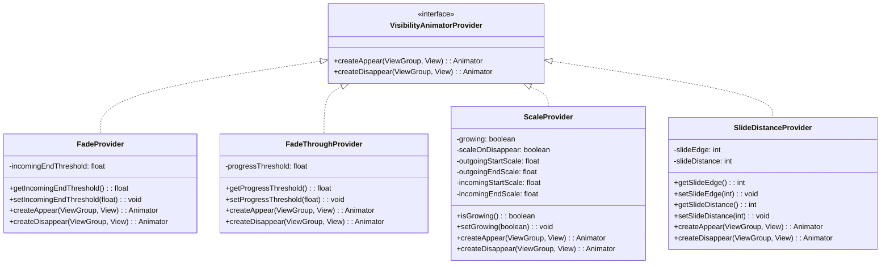
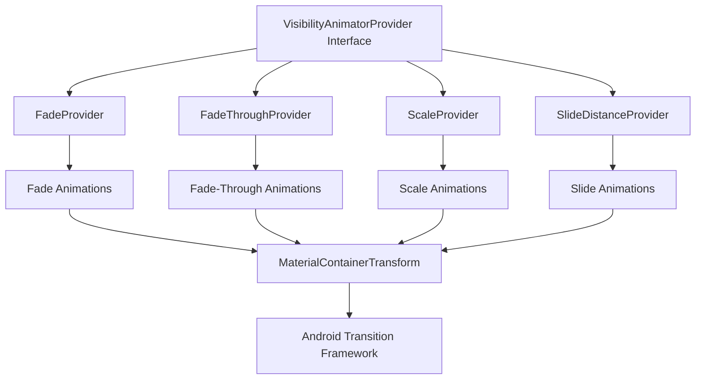
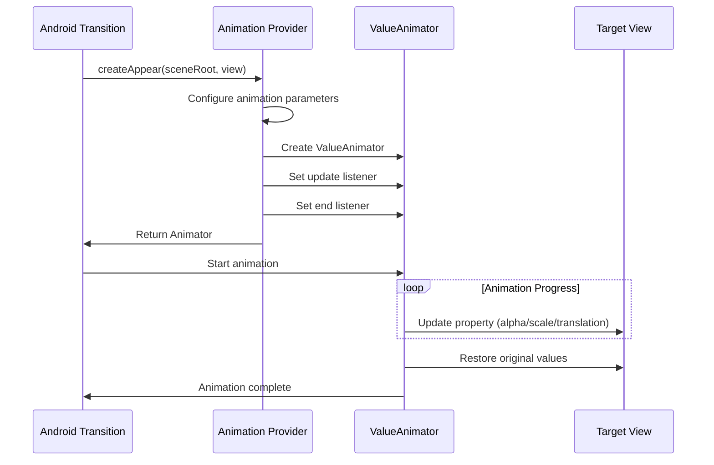
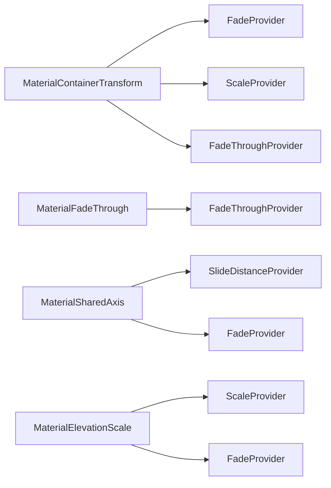
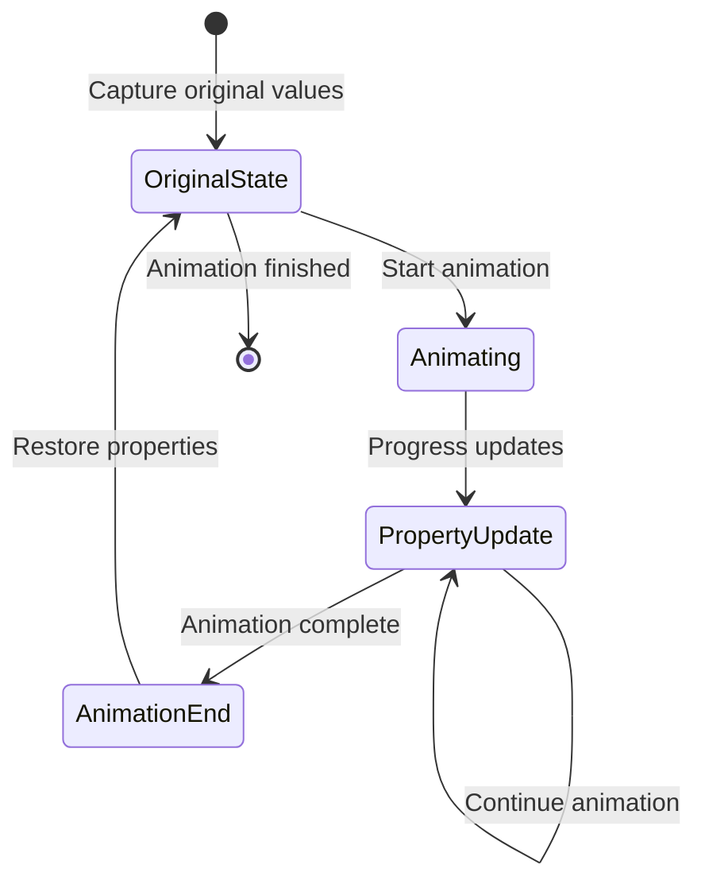

# Animation Providers Module

The animation-providers module is a core component of the Material Design transition system, providing specialized animation providers that create smooth, coordinated animations for view visibility changes. This module implements the `VisibilityAnimatorProvider` interface to deliver fade, scale, slide, and fade-through animations that work seamlessly with Android's transition framework.

## Overview

The animation-providers module serves as the foundation for creating sophisticated Material Design transitions by providing a set of reusable animation providers. These providers generate `Animator` instances that can be used within Android's `Visibility` transitions to create smooth, meaningful animations that enhance user experience and provide visual continuity between different states of the UI.

The module is designed around the principle of separation of concerns, where each provider specializes in a specific type of animation (fade, scale, slide, or fade-through), allowing developers to compose complex transitions by combining multiple providers. This modular approach ensures consistency across the application while maintaining flexibility for customization.

## Architecture

### Core Components

The animation-providers module is built around several key components that work together to provide a comprehensive animation system:


```mermaid
classDiagram
    class VisibilityAnimatorProvider {
        <<interface>>
        +createAppear(ViewGroup, View): Animator
        +createDisappear(ViewGroup, View): Animator
    }
    
    class FadeProvider {
        -incomingEndThreshold: float
        +getIncomingEndThreshold(): float
        +setIncomingEndThreshold(float): void
        +createAppear(ViewGroup, View): Animator
        +createDisappear(ViewGroup, View): Animator
    }
    
    class FadeThroughProvider {
        -progressThreshold: float
        +getProgressThreshold(): float
        +setProgressThreshold(float): void
        +createAppear(ViewGroup, View): Animator
        +createDisappear(ViewGroup, View): Animator
    }
    
    class ScaleProvider {
        -growing: boolean
        -scaleOnDisappear: boolean
        -outgoingStartScale: float
        -outgoingEndScale: float
        -incomingStartScale: float
        -incomingEndScale: float
        +isGrowing(): boolean
        +setGrowing(boolean): void
        +createAppear(ViewGroup, View): Animator
        +createDisappear(ViewGroup, View): Animator
    }
    
    class SlideDistanceProvider {
        -slideEdge: int
        -slideDistance: int
        +getSlideEdge(): int
        +setSlideEdge(int): void
        +getSlideDistance(): int
        +setSlideDistance(int): void
        +createAppear(ViewGroup, View): Animator
        +createDisappear(ViewGroup, View): Animator
    }
    
    VisibilityAnimatorProvider <|.. FadeProvider
    VisibilityAnimatorProvider <|.. FadeThroughProvider
    VisibilityAnimatorProvider <|.. ScaleProvider
    VisibilityAnimatorProvider <|.. SlideDistanceProvider
```

### Component Relationships

The module follows a clean interface-based design where all animation providers implement the `VisibilityAnimatorProvider` interface. This ensures consistency and allows for easy extensibility:


```mermaid
graph TD
    A[VisibilityAnimatorProvider Interface] --> B[FadeProvider]
    A --> C[FadeThroughProvider]
    A --> D[ScaleProvider]
    A --> E[SlideDistanceProvider]
    
    B --> F[Fade Animations]
    C --> G[Fade-Through Animations]
    D --> H[Scale Animations]
    E --> I[Slide Animations]
    
    F --> J[MaterialContainerTransform]
    G --> J
    H --> J
    I --> J
    
    J --> K[Android Transition Framework]
```

## Animation Providers

### FadeProvider

The `FadeProvider` creates smooth fade-in and fade-out animations with configurable timing. It supports custom incoming end thresholds, allowing developers to control when appearing animations complete within an `AnimatorSet`. This provider is essential for creating subtle transitions that maintain visual continuity.

Key features:
- Configurable incoming end threshold for timing control
- Automatic alpha value restoration after animation
- Support for both appear and disappear animations
- Integration with Material Design motion principles

### FadeThroughProvider

The `FadeThroughProvider` implements the Material Design fade-through pattern, where one view fades out completely before another begins to fade in. This creates a clear visual hierarchy and is particularly effective for content transitions where complete replacement is desired.

Key features:
- Configurable progress threshold (default: 0.35)
- Sequential fade-out and fade-in animations
- Maintains visual clarity during transitions
- Suitable for primary content changes

### ScaleProvider

The `ScaleProvider` creates scaling animations that can either grow or shrink views during transitions. It offers extensive customization options for scale values and supports both appearing and disappearing animations independently.

Key features:
- Growing or shrinking animation modes
- Independent scale values for different animation phases
- Optional scaling on disappear
- Property-based animations for smooth performance

### SlideDistanceProvider

The `SlideDistanceProvider` implements sliding animations with support for all gravity directions (left, top, right, bottom, start, end). It provides automatic RTL support and configurable slide distances, making it ideal for directional transitions.

Key features:
- Support for all gravity directions
- Automatic RTL layout support
- Configurable slide distances
- Default dimension resource integration
- Translation property restoration

## Data Flow

The animation providers follow a consistent data flow pattern that ensures smooth integration with Android's transition system:


```mermaid
sequenceDiagram
    participant Transition as Android Transition
    participant Provider as Animation Provider
    participant Animator as ValueAnimator
    participant View as Target View
    
    Transition->>Provider: createAppear(sceneRoot, view)
    Provider->>Provider: Configure animation parameters
    Provider->>Animator: Create ValueAnimator
    Provider->>Animator: Set update listener
    Provider->>Animator: Set end listener
    Provider->>Transition: Return Animator
    Transition->>Animator: Start animation
    loop Animation Progress
        Animator->>View: Update property (alpha/scale/translation)
    end
    Animator->>View: Restore original values
    Animator->>Transition: Animation complete
```

## Integration with Material Transitions

The animation providers are designed to work seamlessly with Material Design transition patterns:


```mermaid
graph LR
    A[MaterialContainerTransform] --> B[FadeProvider]
    A --> C[ScaleProvider]
    A --> D[FadeThroughProvider]
    
    E[MaterialFadeThrough] --> F[FadeThroughProvider]
    
    G[MaterialSharedAxis] --> H[SlideDistanceProvider]
    G --> I[FadeProvider]
    
    J[MaterialElevationScale] --> K[ScaleProvider]
    J --> L[FadeProvider]
```

## Process Flow

### Animation Creation Process

The animation providers follow a systematic approach to create animations:

1. **Parameter Configuration**: Each provider allows customization of animation parameters through setter methods
2. **Animator Creation**: The provider creates appropriate `Animator` instances based on the animation type
3. **Listener Setup**: Update listeners modify view properties during animation progress
4. **Cleanup Handling**: End listeners restore original view properties after animation completion
5. **Return to Transition**: The completed animator is returned to the calling transition

### Property Management

All providers ensure proper property management:


```mermaid
stateDiagram-v2
    [*] --> OriginalState: Capture original values
    OriginalState --> Animating: Start animation
    Animating --> PropertyUpdate: Progress updates
    PropertyUpdate --> PropertyUpdate: Continue animation
    PropertyUpdate --> AnimationEnd: Animation complete
    AnimationEnd --> OriginalState: Restore properties
    OriginalState --> [*]: Animation finished
```

## Dependencies

The animation-providers module has minimal external dependencies, focusing on core Android animation APIs:

- **Android Animation Framework**: Core `Animator`, `ValueAnimator`, and `ObjectAnimator` classes
- **Android View System**: `View` and `ViewGroup` for property manipulation
- **Material Resources**: Dimension resources for default slide distances
- **Transition Utilities**: Shared utility functions from the transition module

## Usage Patterns

### Basic Fade Animation

```java
FadeProvider fadeProvider = new FadeProvider();
fadeProvider.setIncomingEndThreshold(0.75f);
Animator appearAnimator = fadeProvider.createAppear(sceneRoot, view);
```

### Scale with Growth

```java
ScaleProvider scaleProvider = new ScaleProvider(true);
scaleProvider.setIncomingStartScale(0.8f);
scaleProvider.setIncomingEndScale(1.0f);
```

### Directional Slide

```java
SlideDistanceProvider slideProvider = new SlideDistanceProvider(Gravity.END);
slideProvider.setSlideDistance(200);
```

## Best Practices

1. **Property Restoration**: All providers automatically restore original property values after animation completion
2. **Performance**: Use property-based animations (`ObjectAnimator`) for better performance when possible
3. **Customization**: Leverage provider-specific parameters to fine-tune animations for your use case
4. **Composition**: Combine multiple providers to create complex, coordinated transitions
5. **Testing**: Test animations on different devices and configurations, especially with RTL layouts

## Related Documentation

- [Container Transforms](container-transforms.md) - For Material Design container transform patterns
- [Visibility Transitions](visibility-transitions.md) - For Material Design visibility transition implementations
- [Utilities and Helpers](utilities-helpers.md) - For shared transition utilities and helper functions