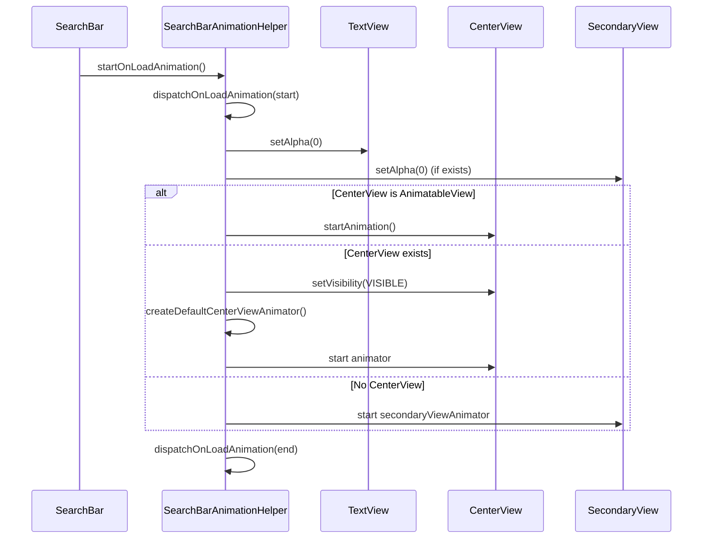
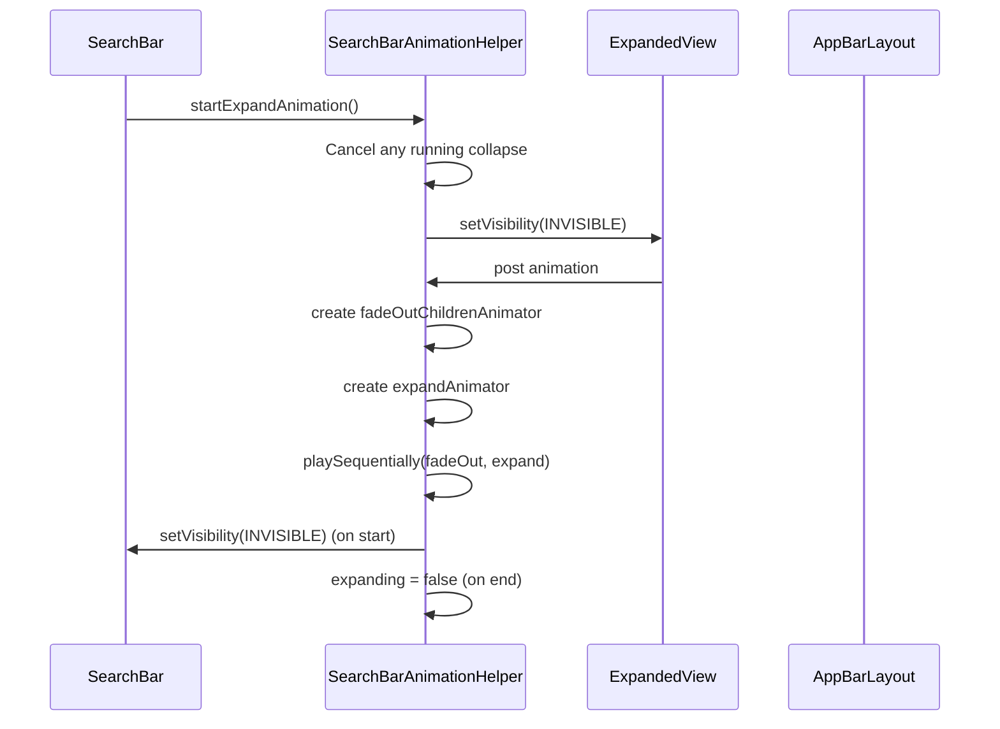
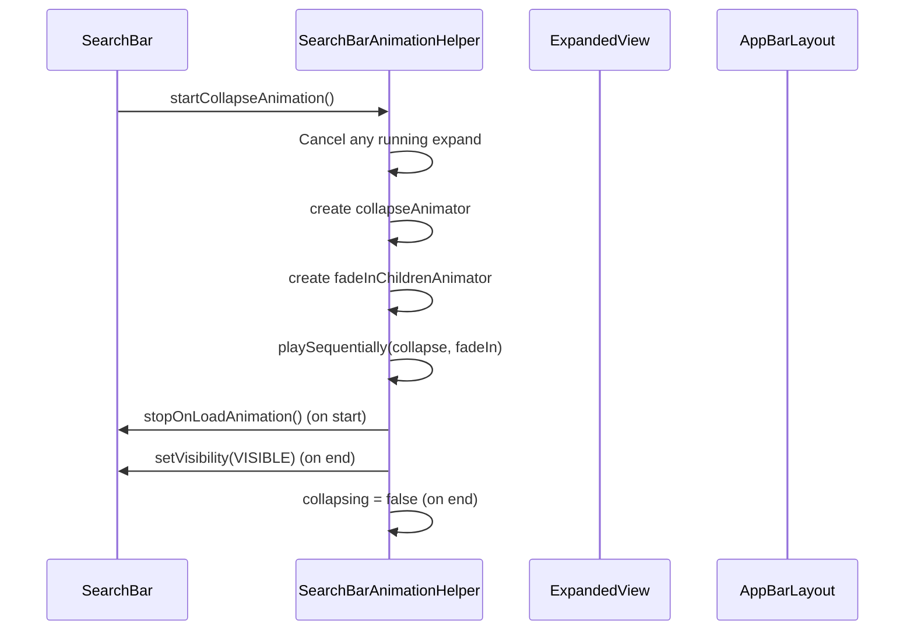
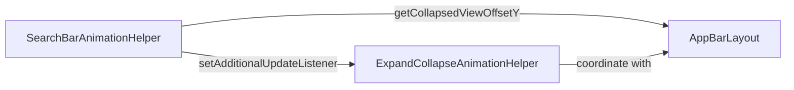
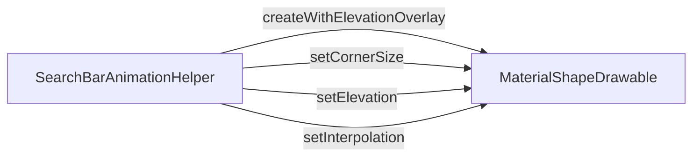
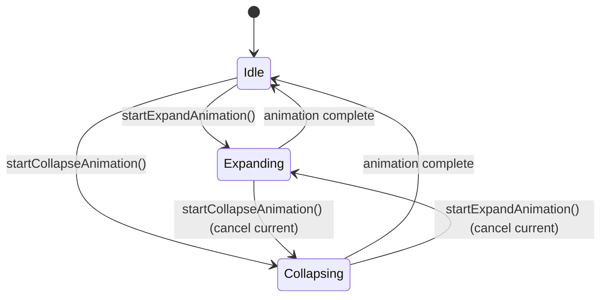

# Animation System Module

## Introduction

The animation-system module provides sophisticated animation capabilities for Material Design components, specifically focusing on search interface animations. It orchestrates complex transitions between collapsed and expanded states, manages load animations, and provides smooth visual feedback for user interactions within search components.

## Architecture Overview

The animation system is built around the `SearchBarAnimationHelper` class, which serves as the central coordinator for all search-related animations. The system integrates with multiple Material Design components to provide seamless visual transitions.

```mermaid
graph TB
    subgraph "Animation System Core"
        SAH[SearchBarAnimationHelper]
        OLI[OnLoadAnimationInvocation]
        ALA[AnimatorListenerAdapter]
        VS[ValueAnimator]
        AS[AnimatorSet]
    end
    
    subgraph "External Dependencies"
        SB[SearchBar]
        ABL[AppBarLayout]
        ECAH[ExpandCollapseAnimationHelper]
        MSD[MaterialShapeDrawable]
        MUL[MultiViewUpdateListener]
        AU[AnimationUtils]
    end
    
    subgraph "Animation Types"
        OLA[OnLoad Animation]
        EA[Expand Animation]
        CA[Collapse Animation]
        FA[Fade Animation]
    end
    
    SAH --> OLI
    SAH --> ALA
    SAH --> VS
    SAH --> AS
    
    SAH -.-> SB
    SAH -.-> ABL
    SAH -.-> ECAH
    SAH -.-> MSD
    SAH -.-> MUL
    SAH -.-> AU
    
    SAH --> OLA
    SAH --> EA
    SAH --> CA
    SAH --> FA
```



## Core Components

### SearchBarAnimationHelper

The primary orchestrator for all search bar animations, managing three main animation types:

1. **OnLoad Animations**: Initial fade-in effects when the search bar is first displayed
2. **Expand Animations**: Transitions from collapsed search bar to expanded search view
3. **Collapse Animations**: Transitions from expanded search view back to collapsed search bar

### OnLoadAnimationInvocation

A functional interface that defines the contract for invoking animation callbacks, enabling flexible callback dispatch mechanisms.

## Animation Types and Flows

### OnLoad Animation Flow



### Expand Animation Flow



### Collapse Animation Flow



## Animation Timing and Interpolation

### Timing Constants

| Animation Type | Duration | Start Delay | Interpolation |
|----------------|----------|-------------|---------------|
| OnLoad Center View Fade | 250ms | 500ms (in) / 750ms (out) | Linear |
| OnLoad Secondary | 250ms | 250ms | Linear |
| Expand | 300ms | - | Material Design easing |
| Expand Fade Children | 75ms | - | Linear |
| Collapse | 250ms | - | Material Design easing |
| Collapse Fade Children | 100ms | - | Linear |

## Integration with Other Modules

### AppBar Integration

The animation system integrates with the [appbar](appbar.md) module through `AppBarLayout` to handle offset calculations and coordinate animations with app bar scrolling behavior.



### Material Shape Integration

Animations incorporate [shape](shape.md) module components for smooth background transitions:



### Animation Utilities

The system leverages shared animation utilities from the Material Design library:

- **AnimationUtils**: Provides standard interpolators and animation helpers
- **MultiViewUpdateListener**: Manages simultaneous updates to multiple views
- **ExpandCollapseAnimationHelper**: Handles complex expand/collapse transformations

## State Management

### Animation State Tracking

The system maintains several state flags to prevent conflicts and ensure smooth transitions:



### Listener Management

The system supports multiple listener types for animation lifecycle events:

- **OnLoadAnimationCallback**: For load animation start/end events
- **AnimatorListenerAdapter**: For expand/collapse animation events
- **AnimatorUpdateListener**: For real-time animation progress updates

## Performance Considerations

### Animation Optimization

1. **View Recycling**: Animations properly manage view visibility and recycling
2. **Memory Management**: Animator instances are properly cleaned up after completion
3. **Batch Operations**: Multiple view updates are batched using `MultiViewUpdateListener`
4. **Conditional Animation**: Animations can be skipped for performance-critical scenarios

### Hardware Acceleration

The system leverages hardware acceleration through:
- Alpha-based animations (GPU-friendly)
- Elevation and shape transformations
- Background drawable updates

## Usage Patterns

### Basic Animation Setup

```java
SearchBarAnimationHelper animationHelper = new SearchBarAnimationHelper();

// Add listeners
animationHelper.addOnLoadAnimationCallback(callback);
animationHelper.addExpandAnimationListener(expandListener);
animationHelper.addCollapseAnimationListener(collapseListener);

// Start animations
animationHelper.startOnLoadAnimation(searchBar);
animationHelper.startExpandAnimation(searchBar, expandedView, appBarLayout, false);
```

### Animation Control

```java
// Stop running animations
animationHelper.stopOnLoadAnimation(searchBar);

// Configure animation behavior
animationHelper.setOnLoadAnimationFadeInEnabled(false);

// Check animation state
boolean isExpanding = animationHelper.isExpanding();
boolean isCollapsing = animationHelper.isCollapsing();
```

## Error Handling and Edge Cases

### Animation Interruption

The system handles animation interruption gracefully:
- Running animations are cancelled before starting new ones
- View states are properly reset on cancellation
- Memory leaks are prevented through proper listener cleanup

### View State Consistency

The system ensures view state consistency by:
- Managing visibility states throughout animations
- Properly handling alpha values and transformations
- Coordinating with parent layouts (AppBarLayout)

## Future Enhancements

### Potential Improvements

1. **Gesture Integration**: Support for gesture-driven animations
2. **Custom Interpolators**: Pluggable interpolation strategies
3. **Animation Chaining**: More complex animation sequences
4. **Performance Monitoring**: Built-in animation performance metrics
5. **Accessibility**: Enhanced accessibility support during animations

### Extension Points

The modular design allows for:
- Custom animation types through new listener interfaces
- Integration with additional Material Design components
- Platform-specific animation optimizations
- Third-party animation library integration