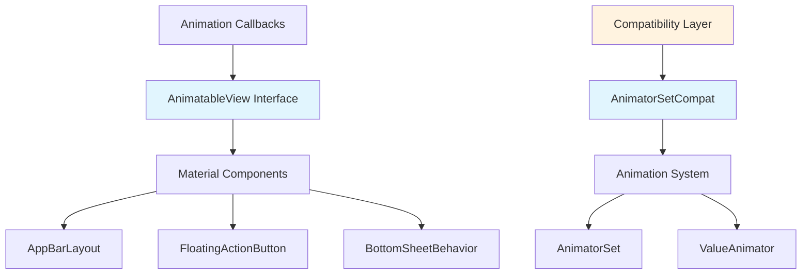
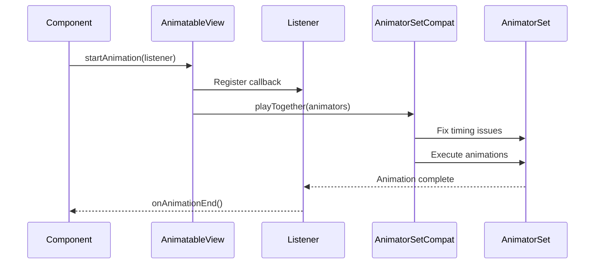
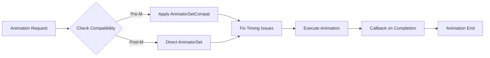
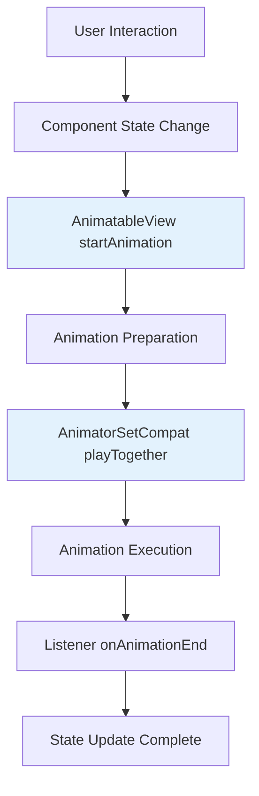

# Animation Utilities Module

The animation-utilities module provides core animation infrastructure and compatibility utilities for the Material Design Components library. It serves as the foundation for creating smooth, consistent animations across all Material Design components.

## Overview

This module contains essential animation utilities that enable:
- Standardized animation interfaces for Material components
- Compatibility fixes for different Android API levels
- Animation lifecycle management and callbacks
- Performance optimizations for complex animation sequences

## Core Components

### AnimatableView

The `AnimatableView` interface provides a standardized contract for views that support animation with lifecycle callbacks. This interface is crucial for components that need to coordinate animations with external listeners.

**Key Features:**
- Defines a contract for starting and stopping animations
- Provides animation completion callbacks through the Listener interface
- Enables external components to control animation lifecycle
- Ensures consistent animation behavior across Material components

**Usage Pattern:**
```java
public class MyAnimatedView extends View implements AnimatableView {
    @Override
    public void startAnimation(@NonNull Listener listener) {
        // Start animation and notify listener on completion
    }
    
    @Override
    public void stopAnimation() {
        // Stop animation immediately
    }
}
```

### AnimatorSetCompat

The `AnimatorSetCompat` class provides compatibility utilities for `AnimatorSet` to handle platform-specific bugs and inconsistencies, particularly for pre-Marshmallow Android versions.

**Key Features:**
- Fixes timing issues with animators that have start delays
- Ensures proper execution order in complex animation sequences
- Provides backward compatibility for older Android versions
- Optimizes animation performance by managing duration calculations

**Technical Implementation:**
The class addresses a specific bug where animators with start delays were not played correctly in an AnimatorSet on pre-Marshmallow devices. It works by:
1. Calculating the total duration of all animations
2. Adding a dummy animator to ensure proper timing
3. Managing the animation sequence to prevent timing conflicts

## Architecture

### Component Relationships



### Data Flow



## Integration with Material Components

The animation-utilities module serves as the foundation for animations throughout the Material Design system:

### App Bar Integration
- AppBarLayout behaviors use AnimatableView for scroll-based animations
- HeaderBehavior leverages AnimatorSetCompat for smooth header transitions
- ViewOffsetBehavior coordinates position changes with animation callbacks

### Floating Action Button Integration
- FloatingActionButton implements AnimatableView for morphing animations
- ExtendedFloatingActionButton uses animation utilities for size transitions
- Transformation behaviors rely on AnimatorSetCompat for complex sequences

### Bottom Sheet Integration
- BottomSheetBehavior coordinates state changes with animation callbacks
- SheetDialog manages show/hide animations through the animation utilities
- SideSheetBehavior extends these patterns for side navigation

## Process Flow

### Animation Lifecycle Management



### Component Animation Coordination



## Dependencies

The animation-utilities module has minimal external dependencies, making it a lightweight foundation for the Material Design animation system:

### Internal Dependencies
- Android Animation Framework (`android.animation.*`)
- Android View System (`android.view.View`)
- AndroidX Annotations (`androidx.annotation.*`)

### Module Relationships
- Used by [appbar](appbar.md) for scroll-based animations
- Integrated with [fab](fab.md) for transformation effects
- Supports [bottom-sheet](bottom-sheet.md) for state transitions
- Powers [transformation](transformation.md) behaviors

## Best Practices

### Implementing AnimatableView
1. Always notify the listener when animations complete
2. Handle stopAnimation() calls gracefully
3. Ensure animations are cancellable and clean up resources
4. Consider performance implications of long-running animations

### Using AnimatorSetCompat
1. Use for complex animation sequences with multiple animators
2. Apply when supporting pre-Marshmallow devices
3. Consider performance impact of the compatibility fix
4. Test animations on various Android versions

### Performance Considerations
1. Minimize the number of concurrent animations
2. Use hardware acceleration when available
3. Avoid animations during scroll or touch events
4. Consider using ViewPropertyAnimator for simple property animations

## Platform Compatibility

The module addresses several platform-specific considerations:

### Android Version Support
- **API 21+**: Full animation support with hardware acceleration
- **API 19-20**: Limited hardware acceleration, software fallback
- **Pre-API 19**: Software rendering, reduced animation complexity

### Device Performance
- Optimizes for low-end devices with reduced animation complexity
- Provides graceful degradation for devices with limited resources
- Implements animation skipping for accessibility preferences

## Future Considerations

The animation-utilities module is designed to be extensible and may evolve to support:
- Enhanced animation interpolation curves
- Spring-based animations
- Gesture-driven animations
- Advanced timing coordination
- Performance monitoring and optimization

## Related Documentation

- [App Bar Module](appbar.md) - Uses animation utilities for scroll behaviors
- [Floating Action Button Module](fab.md) - Implements AnimatableView for morphing
- [Bottom Sheet Module](bottom-sheet.md) - Coordinates animations with utilities
- [Transformation Module](transformation.md) - Complex animation sequences
- [Transition Module](transition.md) - Advanced transition animations