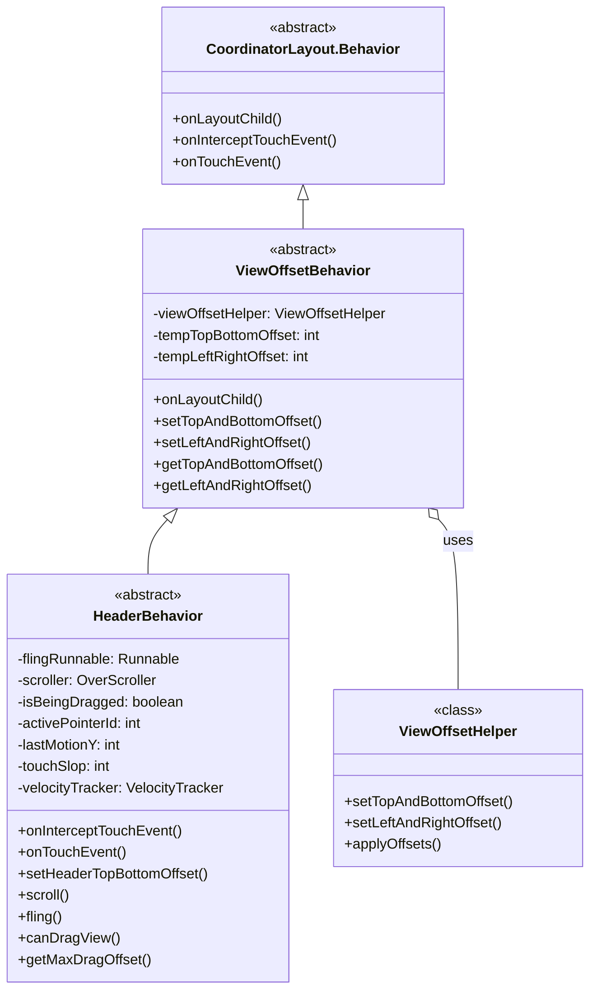
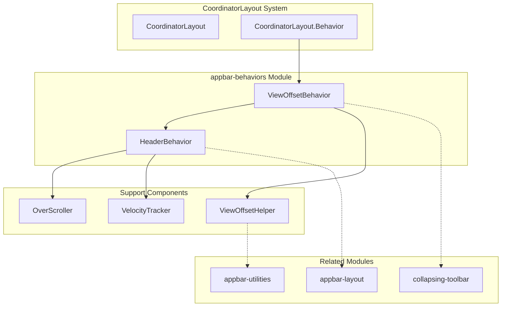
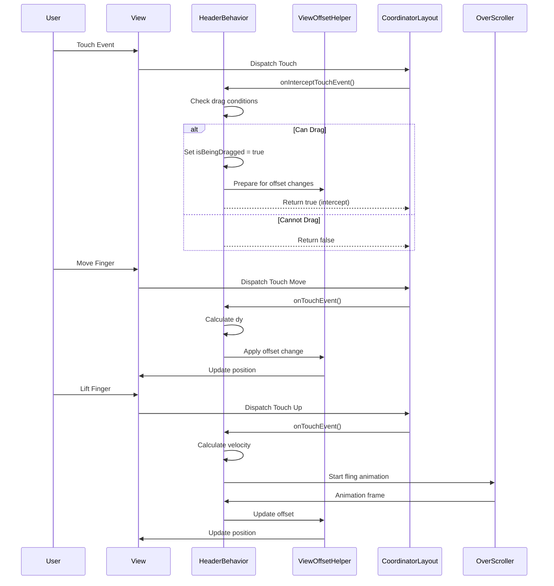
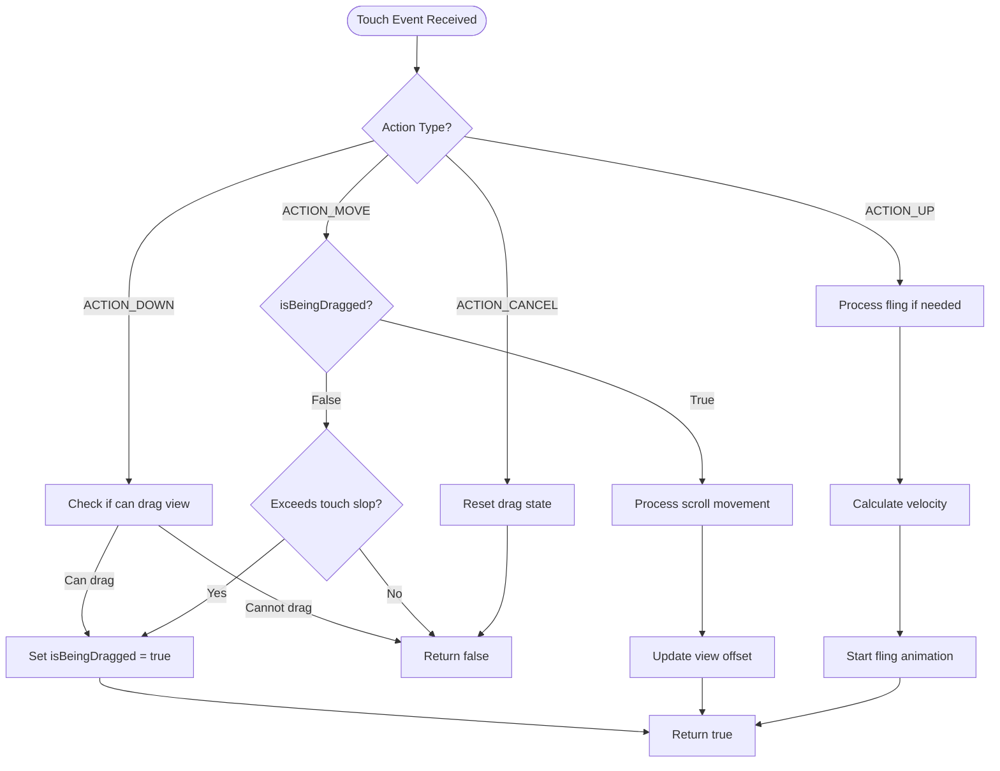
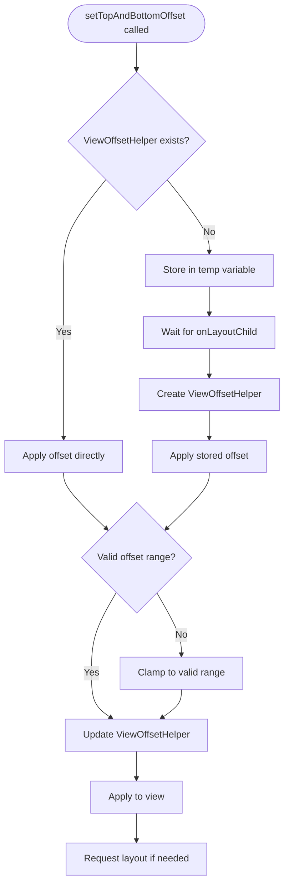

# AppBar Behaviors Module

## Overview

The appbar-behaviors module provides the foundational behavior classes for implementing Material Design AppBar scrolling and offset behaviors. This module contains the core infrastructure that enables AppBar components to respond to touch events, handle scrolling interactions, and manage view offsets within CoordinatorLayout hierarchies.

## Core Components

### HeaderBehavior

`HeaderBehavior<V extends View>` is an abstract base class that extends `ViewOffsetBehavior` to provide touch handling and scrolling capabilities for views that sit vertically above scrolling content. This behavior is designed to work with CoordinatorLayout and handles:

- **Touch Event Interception**: Detects and processes touch events to determine when dragging should begin
- **Scroll Management**: Handles vertical scrolling with configurable offset limits
- **Fling Animations**: Implements smooth fling animations with velocity tracking
- **Drag State Management**: Maintains drag state and pointer tracking for multi-touch scenarios

Key features:
- Configurable drag detection with touch slop tolerance
- Velocity-based fling animations using OverScroller
- Support for both drag and fling gestures
- Abstract methods for customization in subclasses

### ViewOffsetBehavior

`ViewOffsetBehavior<V extends View>` is a base behavior class that automatically sets up and manages ViewOffsetHelper instances for views within CoordinatorLayout. This behavior provides:

- **Offset Management**: Handles top/bottom and left/right offset applications
- **Layout Integration**: Seamlessly integrates with CoordinatorLayout's layout process
- **Deferred Offset Application**: Supports setting offsets before view layout completion
- **Offset State Tracking**: Maintains current offset values and enabled states

Key features:
- Automatic ViewOffsetHelper creation and management
- Support for both vertical and horizontal offsets
- Layout-safe offset application
- Configurable offset enablement

## Architecture



## Component Relationships



## Data Flow



## Process Flow

### Touch Event Handling Flow



### Offset Application Flow



## Integration with Other Modules

The appbar-behaviors module serves as the foundation for several related modules:

- **[appbar-layout](appbar-layout.md)**: Uses HeaderBehavior as the base for AppBarLayout.Behavior, providing scroll-aware app bar functionality
- **[collapsing-toolbar](collapsing-toolbar.md)**: Leverages ViewOffsetBehavior for managing toolbar collapse/expand animations
- **[appbar-utilities](appbar-utilities.md)**: Provides utility functions that support offset calculations used by ViewOffsetBehavior

## Usage Patterns

### Basic Implementation

```java
// Custom behavior extending HeaderBehavior
public class CustomHeaderBehavior extends HeaderBehavior<CustomView> {
    
    @Override
    boolean canDragView(CustomView view) {
        // Custom logic to determine if view can be dragged
        return view.isDragEnabled();
    }
    
    @Override
    int getMaxDragOffset(CustomView view) {
        // Custom maximum drag offset
        return -view.getHeight() / 2;
    }
}
```

### Offset Management

```java
// Using ViewOffsetBehavior for custom offset handling
public class CustomOffsetBehavior extends ViewOffsetBehavior<CustomView> {
    
    public void updateOffset(int offset) {
        setTopAndBottomOffset(offset);
        setLeftAndRightOffset(offset / 2);
    }
}
```

## Key Features

### Touch Responsiveness
- Configurable touch slop for drag detection
- Multi-touch pointer tracking
- Velocity-based gesture recognition
- Smooth animation interruption

### Offset Management
- Automatic ViewOffsetHelper integration
- Deferred offset application
- Bidirectional offset support (vertical/horizontal)
- Layout-safe offset operations

### Animation Support
- Built-in fling animation support
- OverScroller integration
- Animation state management
- Customizable animation callbacks

## Performance Considerations

- **View Recycling**: Proper cleanup of VelocityTracker and animation runnables
- **Layout Optimization**: Minimal layout requests during offset changes
- **Memory Management**: Efficient handling of temporary offset storage
- **Animation Efficiency**: Smart animation continuation and interruption

## Thread Safety

All behavior methods are designed to be called on the main UI thread. The internal state management ensures consistent behavior during rapid touch events and animations.

## Error Handling

- Graceful handling of invalid pointer indices
- Safe fallback for missing VelocityTracker instances
- Proper cleanup on touch cancellation
- Validation of offset ranges before application