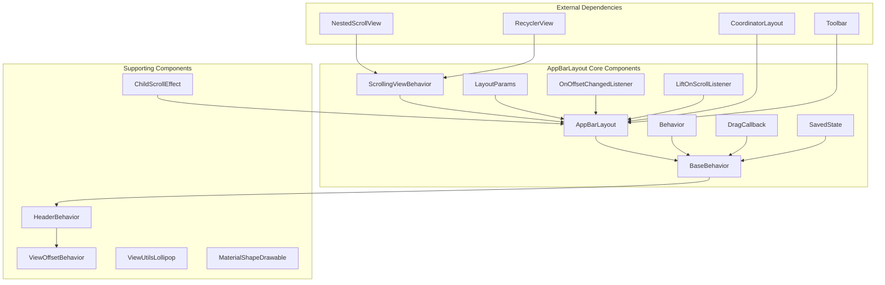
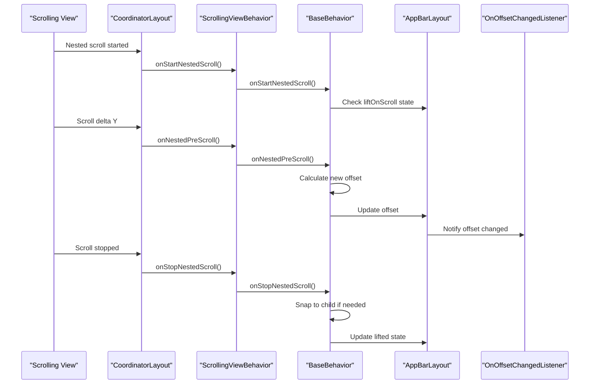
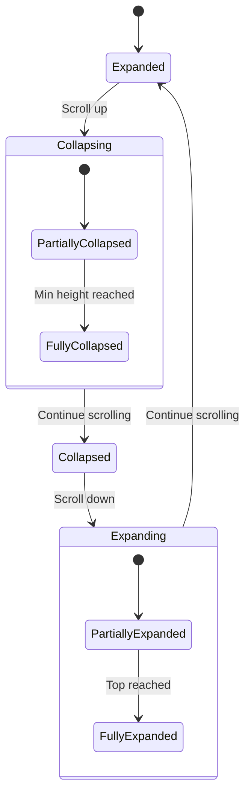
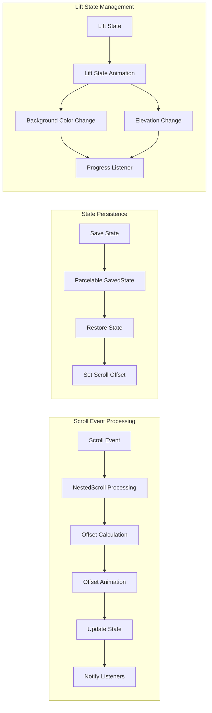
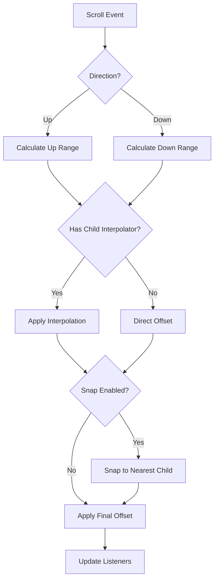

# AppBarLayout Module Documentation

## Overview

The AppBarLayout module provides the core implementation of Material Design's app bar concept, offering a vertical LinearLayout that implements sophisticated scrolling behaviors and elevation changes. This module is essential for creating responsive top app bars that react to scroll events and provide visual feedback through elevation and background color changes.

## Purpose and Core Functionality

The AppBarLayout serves as the foundation for Material Design top app bars, providing:

- **Scroll-responsive behavior**: Automatically responds to nested scroll events from sibling views
- **Elevation changes**: Implements "lift on scroll" functionality with animated elevation transitions
- **Flexible scrolling flags**: Supports various scroll behaviors like enterAlways, exitUntilCollapsed, and snap
- **CoordinatorLayout integration**: Works seamlessly with CoordinatorLayout for complex scrolling patterns
- **Accessibility support**: Includes proper accessibility features for screen readers and navigation
- **State persistence**: Maintains scroll state across configuration changes

## Architecture and Component Relationships

### Core Architecture



### Component Interaction Flow



## Key Components Deep Dive

### AppBarLayout Class

The main `AppBarLayout` class extends `LinearLayout` and implements `CoordinatorLayout.AttachedBehavior`. It provides the container for app bar content and manages the overall scrolling behavior.

**Key Features:**
- Vertical LinearLayout with specialized scroll handling
- Integrates with CoordinatorLayout for nested scrolling
- Supports lift-on-scroll functionality with animated elevation changes
- Manages status bar foreground drawable
- Provides accessibility support for screen readers

**Core State Management:**


### Behavior Classes

#### BaseBehavior<T extends AppBarLayout>
The core behavior implementation that handles nested scrolling logic:
- Manages offset calculations and animations
- Implements snap-to-child functionality
- Handles drag callbacks and fling gestures
- Provides accessibility integration
- Manages state persistence across configuration changes

#### Behavior
A concrete implementation of BaseBehavior specifically for AppBarLayout, providing the default behavior used when AppBarLayout is attached to a CoordinatorLayout.

#### ScrollingViewBehavior
Handles the relationship between scrolling views and AppBarLayout:
- Automatically offsets scrolling views based on AppBarLayout position
- Manages overlap calculations for visual effects
- Updates lifted state based on scroll position
- Supports rectangle-on-screen requests for accessibility

### LayoutParams
Custom layout parameters that control individual child view scrolling behavior:

**Scroll Flags:**
- `SCROLL_FLAG_SCROLL`: Enables scrolling behavior
- `SCROLL_FLAG_EXIT_UNTIL_COLLAPSED`: View collapses to minimum height
- `SCROLL_FLAG_ENTER_ALWAYS`: Quick return pattern
- `SCROLL_FLAG_ENTER_ALWAYS_COLLAPSED`: Enter in collapsed state first
- `SCROLL_FLAG_SNAP`: Snap to nearest edge when scrolling stops
- `SCROLL_FLAG_SNAP_MARGINS`: Snap based on margins instead of edges

**Scroll Effects:**
- `SCROLL_EFFECT_NONE`: No special effect (default)
- `SCROLL_EFFECT_COMPRESS`: Parallax compression effect as view hits scroll ceiling

### Listener Interfaces

#### OnOffsetChangedListener
Primary interface for monitoring AppBarLayout offset changes:
```java
public interface OnOffsetChangedListener {
    void onOffsetChanged(AppBarLayout appBarLayout, int verticalOffset);
}
```

#### LiftOnScrollListener (Deprecated)
Legacy interface for monitoring elevation and background color changes during lift-on-scroll.

#### LiftOnScrollProgressListener
Modern replacement for LiftOnScrollListener, providing progress information:
```java
public abstract void onUpdate(
    @Dimension float elevation, 
    @ColorInt int backgroundColor, 
    @FloatRange(from = 0.0f, to = 1.0f) float progress
);
```

## Data Flow and State Management

### Scroll State Management



### Offset Calculation Algorithm

The AppBarLayout uses a sophisticated offset calculation system that considers:

1. **Total Scroll Range**: Calculated based on child views with scroll flags
2. **Pre-scroll Ranges**: Separate calculations for up and down pre-scrolls
3. **Child Interpolation**: Individual interpolators per child view for smooth scrolling
4. **Snap Behavior**: Automatic snapping to child edges when scrolling stops



## Integration with Other Modules

### CoordinatorLayout Integration
AppBarLayout is designed to work exclusively within CoordinatorLayout, which provides:
- Nested scrolling coordination
- Dependency management between views
- Behavior system for custom interactions
- Window insets handling

### Related Module Dependencies

- **[appbar-behaviors](appbar-behaviors.md)**: Provides HeaderBehavior and ViewOffsetBehavior base classes
- **[appbar-utilities](appbar-utilities.md)**: Offers ViewUtilsLollipop for platform-specific functionality
- **[collapsing-toolbar](collapsing-toolbar.md)**: Extends AppBarLayout with collapsing toolbar functionality

### External Dependencies

- **Material Components**: Uses MaterialShapeDrawable, MaterialColors, and theme attributes
- **Animation System**: Integrates with ValueAnimator for smooth transitions
- **Accessibility**: Implements AccessibilityDelegateCompat for screen reader support

## Usage Patterns and Best Practices

### Basic Implementation
```xml
<androidx.coordinatorlayout.widget.CoordinatorLayout>
    <com.google.android.material.appbar.AppBarLayout
        android:layout_width="match_parent"
        android:layout_height="wrap_content">
        
        <androidx.appcompat.widget.Toolbar
            android:layout_width="match_parent"
            android:layout_height="?attr/actionBarSize"
            app:layout_scrollFlags="scroll|enterAlways" />
            
    </com.google.android.material.appbar.AppBarLayout>
    
    <androidx.core.widget.NestedScrollView
        android:layout_width="match_parent"
        android:layout_height="match_parent"
        app:layout_behavior="@string/appbar_scrolling_view_behavior">
        <!-- Content -->
    </androidx.core.widget.NestedScrollView>
</androidx.coordinatorlayout.widget.CoordinatorLayout>
```

### Advanced Configuration
```java
AppBarLayout appBarLayout = findViewById(R.id.app_bar);

// Set lift on scroll with custom color
appBarLayout.setLiftOnScroll(true);
appBarLayout.setLiftOnScrollColor(ColorStateList.valueOf(Color.WHITE));

// Add offset change listener
appBarLayout.addOnOffsetChangedListener((layout, offset) -> {
    // Handle offset changes
    float percentage = Math.abs(offset) / (float) layout.getTotalScrollRange();
    // Update UI based on scroll percentage
});

// Add lift progress listener
appBarLayout.addLiftOnScrollProgressListener(new AppBarLayout.LiftOnScrollProgressListener() {
    @Override
    public void onUpdate(float elevation, int backgroundColor, float progress) {
        // Handle lift progress changes
    }
});
```

## Performance Considerations

### Optimization Strategies
1. **Minimize Child Views**: Reduce the number of child views with scroll flags
2. **Use Appropriate Scroll Flags**: Choose flags that match your desired behavior
3. **Avoid Complex Interpolators**: Simple interpolators perform better
4. **Limit Listener Registrations**: Remove listeners when not needed
5. **Reuse LayoutParams**: Avoid creating new LayoutParams unnecessarily

### Memory Management
- Uses WeakReference for scrolling view references
- Properly cancels animations when views are detached
- Clears listener references in onDetachedFromWindow
- Efficient state persistence with minimal object creation

## Accessibility Features

### Screen Reader Support
- Implements proper AccessibilityNodeInfo with ScrollView class name
- Provides scroll actions (ACTION_SCROLL_FORWARD/ACTION_SCROLL_BACKWARD)
- Maintains proper focus handling during scroll animations
- Supports keyboard navigation with appropriate delegates

### Visual Accessibility
- Maintains proper contrast ratios during lift animations
- Supports high contrast mode with appropriate color adjustments
- Provides haptic feedback for scroll interactions when enabled

## Testing and Debugging

### Common Issues and Solutions

1. **AppBarLayout not scrolling**: Ensure it's a direct child of CoordinatorLayout
2. **Lift on scroll not working**: Verify scrolling view has ScrollingViewBehavior
3. **Snap behavior not working**: Check that child views have appropriate scroll flags
4. **State not restored**: Ensure proper SavedState implementation in parent

### Debugging Tools
- Use Layout Inspector to verify CoordinatorLayout hierarchy
- Enable "Show layout bounds" to visualize scroll ranges
- Log offset changes to understand scroll behavior
- Use systrace to analyze animation performance

## Migration and Compatibility

### Version Compatibility
- Minimum SDK: 14 (with some features requiring higher versions)
- Target SDK: Latest Android version
- Backward compatibility maintained through support libraries

### Migration from Support Library
- Update imports from `android.support.design.widget` to `com.google.android.material.appbar`
- Review behavior changes in scroll flag handling
- Update theme attributes to use Material Components themes

This documentation provides a comprehensive understanding of the AppBarLayout module, its architecture, and how to effectively use it in Material Design applications. For specific implementation details, refer to the individual component documentation and the Material Design guidelines.