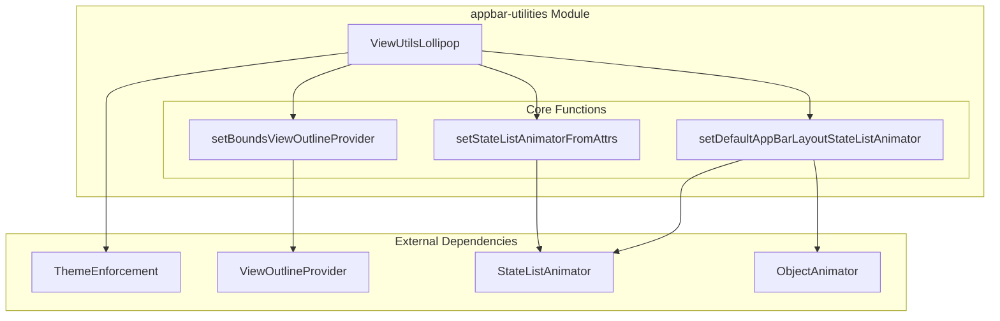
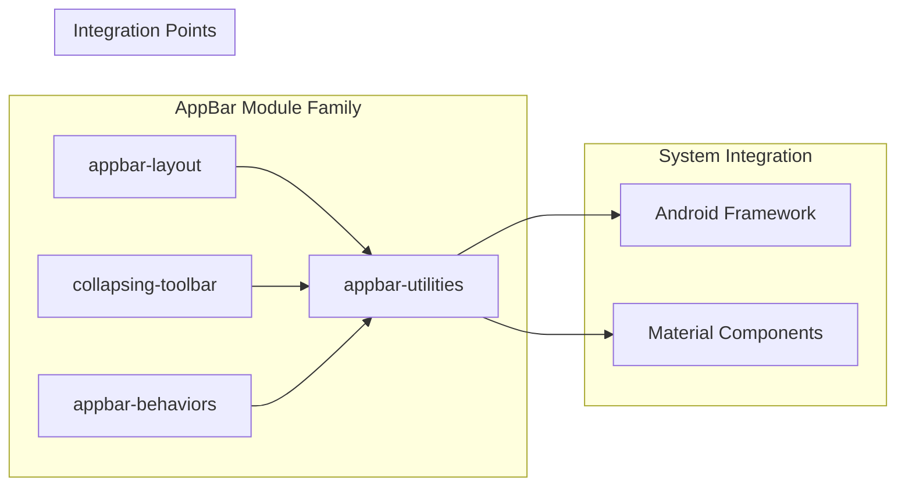
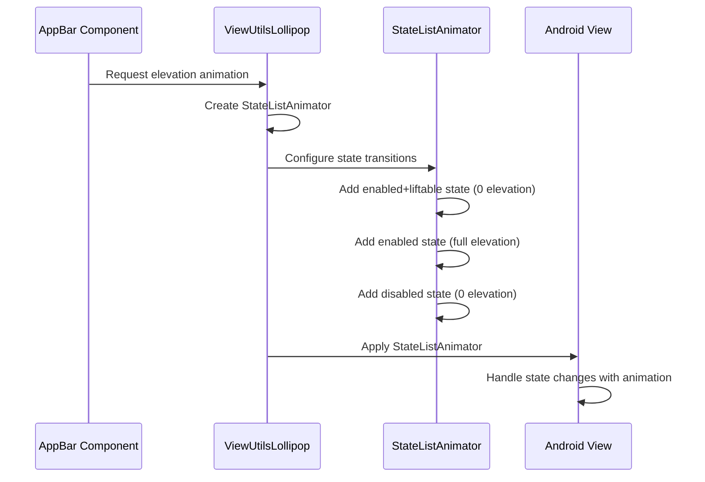
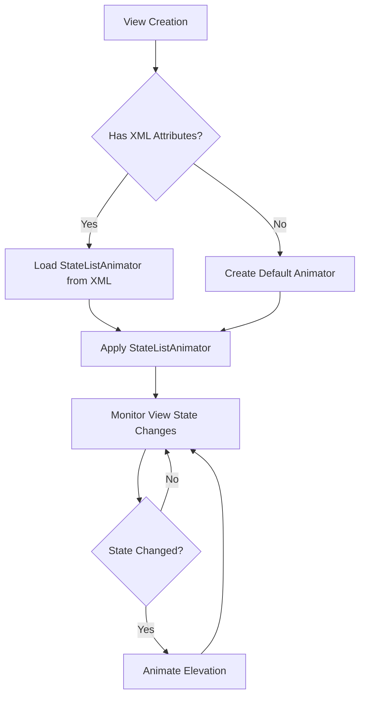
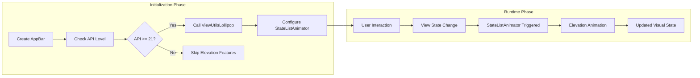
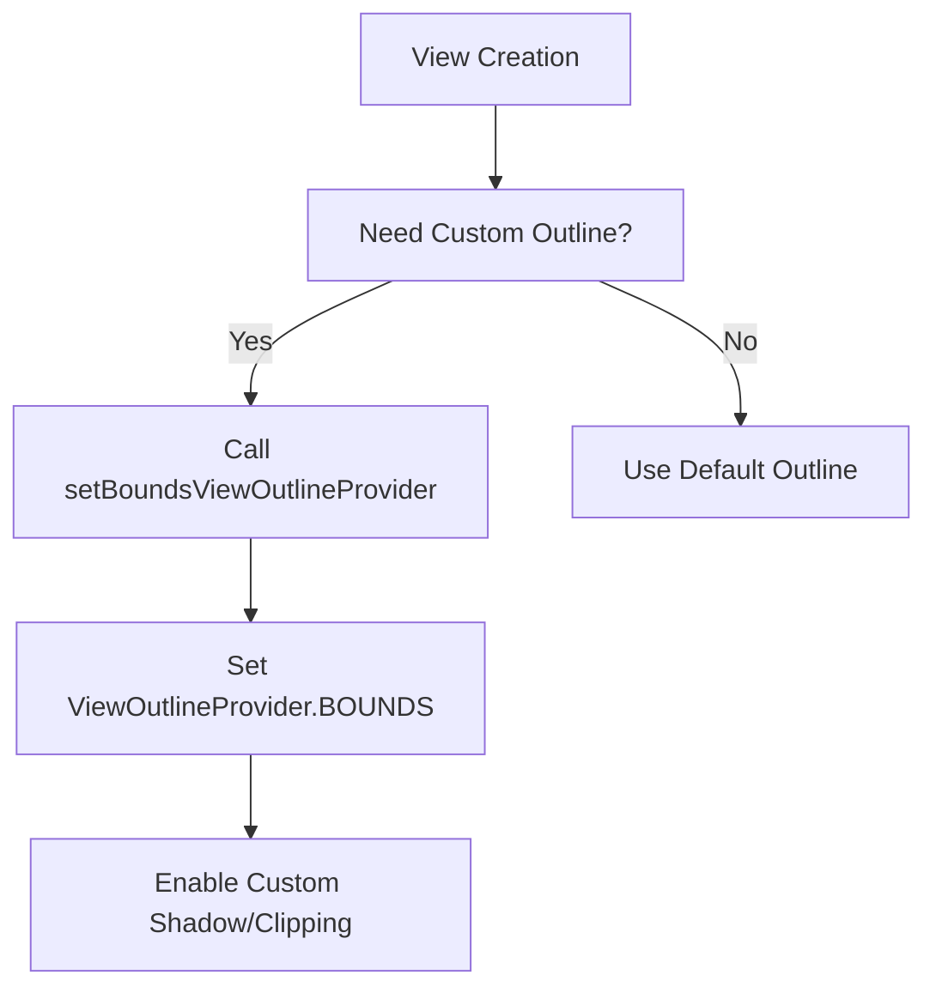

# AppBar Utilities Module Documentation

## Introduction

The appbar-utilities module provides essential utility functions and helper methods specifically designed for Android Lollipop (API 21+) AppBar functionality. This module serves as a compatibility layer and enhancement toolkit for Material Design AppBar components, focusing on elevation animations, state management, and view outline handling.

## Module Overview

The appbar-utilities module is a specialized utility module within the Material Design Components library that handles platform-specific AppBar behaviors for Android Lollipop and above. It provides critical functionality for elevation animations, state list animator management, and view outline configuration that are essential for modern Material Design AppBar implementations.

## Core Components

### ViewUtilsLollipop

The primary component of this module, `ViewUtilsLollipop`, is a utility class that encapsulates Android Lollipop-specific AppBar functionality. This class provides static methods for managing elevation animations, state list animators, and view outline providers that are crucial for Material Design AppBar behavior.

#### Key Responsibilities:
- **Elevation Animation Management**: Creates and manages elevation animations for AppBar components
- **State List Animator Configuration**: Handles state-dependent animations based on view states
- **View Outline Provider Setup**: Configures view outline providers for proper shadow rendering
- **Platform Compatibility**: Ensures proper functionality on Android Lollipop and above

## Architecture

### Module Architecture

### Component Relationships

## Data Flow

### Elevation Animation Flow

### State List Animator Configuration Flow

## Process Flows

### AppBar Elevation Management Process

### View Outline Configuration Process

## Key Functions

### setBoundsViewOutlineProvider(View view)
Configures a view to use bounds-based outline provider, enabling custom shadow rendering and clipping behavior essential for Material Design AppBar components.

### setStateListAnimatorFromAttrs(View, AttributeSet, int, int)
Loads and applies a StateListAnimator from XML attributes, allowing declarative animation configuration for elevation and other view properties based on view states.

### setDefaultAppBarLayoutStateListAnimator(View, float)
Creates and applies a default StateListAnimator specifically designed for AppBarLayout components, managing elevation transitions based on enabled, liftable, and lifted states.

## Integration with Other Modules

The appbar-utilities module serves as a foundational utility that supports other AppBar-related modules:

- **[appbar-layout](appbar-layout.md)**: Provides elevation animation utilities for AppBarLayout components
- **[collapsing-toolbar](collapsing-toolbar.md)**: Supports elevation management for collapsing toolbar implementations
- **[appbar-behaviors](appbar-behaviors.md)**: Offers view utilities for behavior implementations

## Platform Compatibility

This module specifically targets Android Lollipop (API 21+) and provides:
- **Elevation Support**: Full elevation animation support available from API 21
- **StateListAnimator Integration**: Leverages platform StateListAnimator for efficient state-based animations
- **ViewOutlineProvider Compatibility**: Utilizes enhanced outline provider capabilities

## Best Practices

### Usage Guidelines

1. **API Level Checking**: Always verify API level before calling ViewUtilsLollipop methods
2. **Resource Management**: Properly recycle TypedArray resources after use
3. **Animation Duration**: Use appropriate animation durations for smooth user experience
4. **State Management**: Ensure proper view state configuration for expected animation behavior

### Performance Considerations

- StateListAnimator instances are cached at the view level for optimal performance
- Animation durations are loaded from resources for consistency across the application
- View outline providers are set only when necessary to minimize overhead

## Error Handling

The module implements defensive programming practices:
- **Null Safety**: All public methods use @NonNull annotations
- **Resource Cleanup**: TypedArray resources are properly recycled in finally blocks
- **Graceful Degradation**: Functions fail gracefully on unsupported configurations

## Dependencies

### Internal Dependencies
- **ThemeEnforcement**: For proper theme attribute resolution
- **Material Resources**: Access to animation duration resources

### External Dependencies
- **Android Animation Framework**: StateListAnimator and ObjectAnimator
- **Android View System**: ViewOutlineProvider and view state management
- **Android Resource System**: TypedArray and attribute processing

## Conclusion

The appbar-utilities module provides essential functionality for Material Design AppBar components on Android Lollipop and above. Its focused scope on elevation animations, state management, and view outline configuration makes it a critical utility module that enables sophisticated AppBar behavior while maintaining platform compatibility and performance standards.