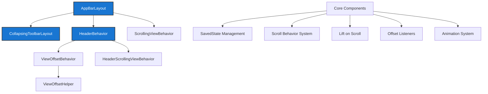

# AppBar Module Documentation

## Overview

The AppBar module provides Material Design app bar components for Android applications. It implements the collapsing app bar pattern with sophisticated scrolling behaviors, elevation changes, and visual effects. The module is built on top of CoordinatorLayout and provides seamless integration with scrolling content.

## Architecture



## Core Functionality

### AppBarLayout
The main container that implements the vertical LinearLayout with Material Design app bar features. It manages:
- **Scroll coordination** with nested scrolling children
- **Elevation changes** based on scroll position (lift on scroll)
- **State persistence** across configuration changes
- **Accessibility** support for screen readers

### CollapsingToolbarLayout
A specialized FrameLayout that provides collapsing title functionality:
- **Title animation** between expanded and collapsed states
- **Content scrims** for visual hierarchy
- **Parallax effects** for child views
- **Status bar integration** with scrim support

### Behavior System
CoordinatorLayout behaviors that enable complex interactions:
- **HeaderBehavior**: Base class for header view behaviors
- **ScrollingViewBehavior**: Coordinates scrolling between AppBarLayout and content
- **ViewOffsetBehavior**: Manages view offsetting and positioning

## Key Features

### 1. Scroll Flags System
AppBarLayout supports various scroll flags that control child view behavior:
- `scroll`: Basic scrolling behavior
- `exitUntilCollapsed`: View collapses until minimum height
- `enterAlways`: Quick return pattern
- `enterAlwaysCollapsed`: Enter in collapsed state
- `snap`: Snap to nearest edge
- `snapMargins`: Snap considering margins

### 2. Lift on Scroll
Automatic elevation and color changes based on scroll position:
- Configurable elevation values
- Custom color transitions
- Progress-based animations
- Target view specification

### 3. Title Collapse Modes
Two modes for title animation:
- **Scale mode**: Continuous scaling and translation
- **Fade mode**: Fade out/in with translation

### 4. Child Scroll Effects
Special effects for child views during scroll:
- **Compress effect**: Parallax compression animation
- Custom interpolator support
- Per-child configuration

## Integration Patterns

### Basic Setup
```xml
<androidx.coordinatorlayout.widget.CoordinatorLayout>
    <com.google.android.material.appbar.AppBarLayout>
        <com.google.android.material.appbar.CollapsingToolbarLayout>
            <androidx.appcompat.widget.Toolbar
                app:layout_scrollFlags="scroll|exitUntilCollapsed"/>
        </com.google.android.material.appbar.CollapsingToolbarLayout>
    </com.google.android.material.appbar.AppBarLayout>
    
    <NestedScrollView
        app:layout_behavior="@string/appbar_scrolling_view_behavior">
        <!-- Content -->
    </NestedScrollView>
</androidx.coordinatorlayout.widget.CoordinatorLayout>
```

### Advanced Configuration
- Custom scroll effects and interpolators
- Programmatic offset control
- State restoration and persistence
- Accessibility enhancements

## Dependencies

The AppBar module integrates with several other Material Design components:

- **[CoordinatorLayout](coordinatorlayout.md)**: Core dependency for behavior system
- **[Toolbar](toolbar.md)**: Content container within AppBarLayout
- **[Color System](color.md)**: For lift on scroll color transitions
- **[Animation System](animation.md)**: For smooth transitions and effects
- **[Shape System](shape.md)**: For Material shape theming

## Sub-modules

For detailed information about specific components, see:

- [AppBarLayout Core](appbarlayout-core.md) - Core AppBarLayout functionality including SavedState, scroll behaviors, lift on scroll listeners, and layout parameters
- [Collapsing Toolbar](collapsing-toolbar.md) - Collapsing title animations, scrim effects, and layout configurations
- [Behavior System](behavior-system.md) - HeaderBehavior and ViewOffsetBehavior implementations for scroll coordination
- [Utility Components](utility-components.md) - ViewUtilsLollipop for state list animations and outline providers

## Performance Considerations

- **View recycling**: Efficient handling of nested scrolling
- **Animation optimization**: Hardware acceleration for smooth transitions
- **Memory management**: Proper cleanup of listeners and references
- **State persistence**: Minimal overhead for configuration changes

## Accessibility

- Full screen reader support with proper content descriptions
- Keyboard navigation support
- Semantic role announcements
- High contrast mode compatibility
- Reduced motion support

## Version Compatibility

- Minimum SDK: 21 (Lollipop)
- Full feature support: SDK 23+
- Enhanced animations: SDK 24+
- Latest optimizations: SDK 26+