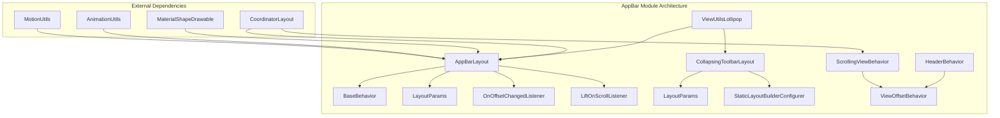

# AppBar Module Documentation

## Overview

The AppBar module is a core component of the Material Design Components library for Android, providing flexible and interactive app bar implementations. This module implements the Material Design app bar concept with advanced scrolling behaviors, elevation changes, and collapsing animations.

## Purpose

The AppBar module serves as the foundation for creating responsive, interactive top app bars that:
- Respond to scroll events with various scroll flags and effects
- Support collapsing and expanding animations
- Provide elevation changes based on scroll position
- Integrate seamlessly with CoordinatorLayout for complex scrolling patterns
- Support Material Design elevation and theming

## Architecture


```mermaid
graph TB
    subgraph "AppBar Module Architecture"
        A[AppBarLayout] --> B[BaseBehavior]
        A --> C[LayoutParams]
        A --> D[OnOffsetChangedListener]
        A --> E[LiftOnScrollListener]
        
        F[CollapsingToolbarLayout] --> G[LayoutParams]
        F --> H[StaticLayoutBuilderConfigurer]
        
        I[HeaderBehavior] --> J[ViewOffsetBehavior]
        K[ScrollingViewBehavior] --> J
        
        L[ViewUtilsLollipop] --> A
        L --> F
    end
    
    subgraph "External Dependencies"
        M[CoordinatorLayout] --> A
        M --> K
        N[MaterialShapeDrawable] --> A
        O[AnimationUtils] --> A
        P[MotionUtils] --> A
    end
```

## Core Components

### 1. AppBarLayout
The main container that implements a vertical LinearLayout with Material Design app bar features. It supports:
- **Scroll Flags**: Define how child views respond to scrolling (scroll, enterAlways, exitUntilCollapsed, snap, etc.)
- **Lift on Scroll**: Automatic elevation changes based on scroll position
- **Offset Management**: Tracks and manages vertical offset changes
- **State Management**: Handles expanded/collapsed states with animations

### 2. CollapsingToolbarLayout
A specialized FrameLayout that wraps Toolbar implementations to create collapsing app bar effects:
- **Collapsing Title**: Animated title that scales and translates between expanded and collapsed states
- **Content Scrims**: Background overlays that appear based on scroll position
- **Parallax Effects**: Child views can scroll with parallax multipliers
- **Pin Mode**: Child views can be pinned in place during collapse

### 3. Behavior Classes
- **BaseBehavior**: Core nested scrolling behavior for AppBarLayout
- **ScrollingViewBehavior**: Coordinates scrolling between AppBarLayout and content views
- **HeaderBehavior**: Abstract base for header behaviors with touch handling
- **ViewOffsetBehavior**: Base behavior for views that need offset management

### 4. Support Components
- **LayoutParams**: Custom layout parameters for scroll flags and collapse modes
- **ViewOffsetHelper**: Manages view offset animations and positioning
- **ViewUtilsLollipop**: API-specific utilities for state list animators and elevation

## Key Features

### Scroll Behaviors
The module supports various scroll flags that can be combined:
- `SCROLL_FLAG_SCROLL`: Basic scroll behavior
- `SCROLL_FLAG_ENTER_ALWAYS`: Quick return pattern
- `SCROLL_FLAG_EXIT_UNTIL_COLLAPSED`: Collapse until minimum height
- `SCROLL_FLAG_SNAP`: Snap to nearest edge when scrolling ends
- `SCROLL_FLAG_SNAP_MARGINS`: Snap considering margins

### Lift on Scroll
Automatic elevation changes based on content scroll position:
- Configurable elevation values and animation duration
- Support for custom colors or elevation-based lifting
- Progress listeners for custom lift animations

### Collapsing Effects
Advanced collapsing animations including:
- Title scaling and translation between states
- Content scrim visibility based on scroll progress
- Parallax scrolling for background content
- Pin behavior for fixed elements

## Integration

The AppBar module integrates with:
- **[CoordinatorLayout](../coordinatorlayout.md)**: For complex scrolling coordination
- **[Material Theme System](../theme.md)**: For consistent styling and elevation
- **[Animation System](../animation.md)**: For smooth transitions and interpolators
- **[Shape System](../shape.md)**: For Material shape and elevation effects

## Usage Patterns

### Basic App Bar with Scroll
```xml
<androidx.coordinatorlayout.widget.CoordinatorLayout>
    <com.google.android.material.appbar.AppBarLayout>
        <androidx.appcompat.widget.Toolbar
            app:layout_scrollFlags="scroll|enterAlways" />
    </com.google.android.material.appbar.AppBarLayout>
    
    <androidx.core.widget.NestedScrollView
        app:layout_behavior="@string/appbar_scrolling_view_behavior">
        <!-- Content -->
    </androidx.core.widget.NestedScrollView>
</androidx.coordinatorlayout.widget.CoordinatorLayout>
```

### Collapsing Toolbar
```xml
<androidx.coordinatorlayout.widget.CoordinatorLayout>
    <com.google.android.material.appbar.AppBarLayout>
        <com.google.android.material.appbar.CollapsingToolbarLayout
            app:layout_scrollFlags="scroll|exitUntilCollapsed">
            
            <ImageView
                app:layout_collapseMode="parallax"
                app:layout_collapseParallaxMultiplier="0.7" />
                
            <androidx.appcompat.widget.Toolbar
                app:layout_collapseMode="pin" />
                
        </com.google.android.material.appbar.CollapsingToolbarLayout>
    </com.google.android.material.appbar.AppBarLayout>
</androidx.coordinatorlayout.widget.CoordinatorLayout>
```

## Sub-modules

For detailed information about specific sub-modules, refer to:
- [AppBarLayout Core](appbar-layout.md) - Core AppBarLayout functionality including BaseBehavior, LayoutParams, scroll flags, and lift-on-scroll features
- [Collapsing Toolbar](collapsing-toolbar.md) - CollapsingToolbarLayout implementation with title animations, scrim effects, and parallax scrolling
- [Behaviors](appbar-behaviors.md) - HeaderBehavior and ViewOffsetBehavior classes for scroll coordination and view offset management
- [Utilities](appbar-utilities.md) - ViewUtilsLollipop and other utility classes for API-specific functionality

## Performance Considerations

- **Scroll Optimization**: The module uses nested scrolling APIs for efficient scroll handling
- **Animation Performance**: Hardware-accelerated animations with proper interpolators
- **Memory Management**: Efficient state management and view recycling
- **Accessibility**: Full accessibility support with proper announcements

## Version Compatibility

- **Minimum SDK**: Supports API 14+
- **Material Theming**: Full support for Material Design 3 theming
- **Elevation**: Proper elevation handling across different Android versions
- **State List Animators**: Enhanced animations on API 21+