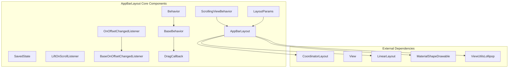
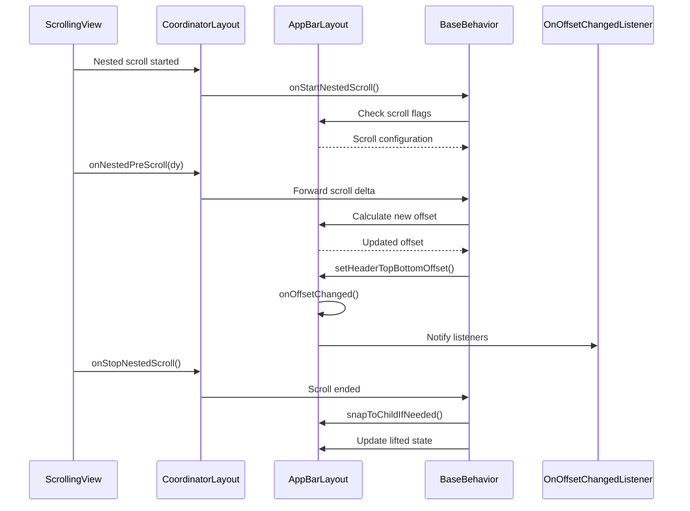
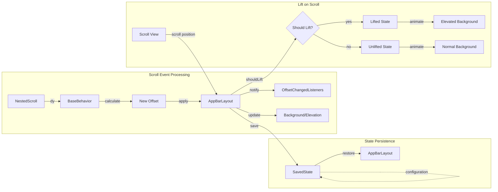
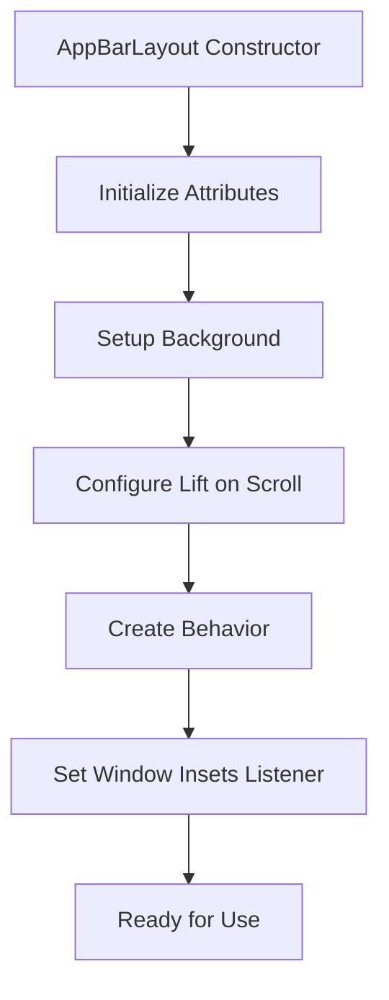
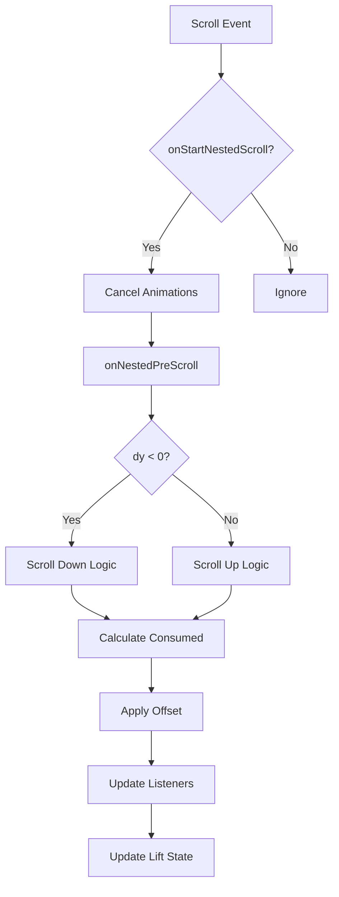
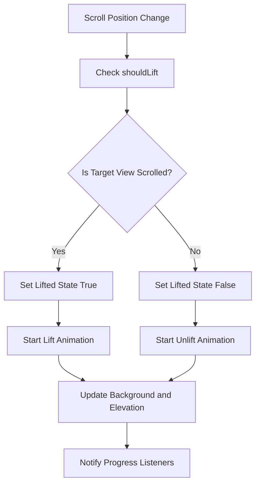

# AppBarLayout Core Module Documentation

## Introduction

The appbarlayout-core module provides the foundational components for implementing Material Design app bars in Android applications. This module contains the core `AppBarLayout` class and its associated behaviors, listeners, and utilities that enable sophisticated scrolling behaviors and visual effects for application headers.

The AppBarLayout is a vertical LinearLayout that implements material design app bar concepts, including scrolling gestures, elevation changes, and collapsible content. It serves as the primary container for app bar content and coordinates with scrolling views to create smooth, interactive header experiences.

## Architecture Overview



## Core Components

### AppBarLayout
The main class that extends LinearLayout to provide a vertical container with material design app bar functionality. It coordinates scrolling behaviors, manages elevation changes, and handles nested scrolling interactions.

### SavedState
Handles the persistence of AppBarLayout state across configuration changes and activity lifecycle events. Stores information about scroll position, expansion state, and visible child views.

### ScrollingViewBehavior
A CoordinatorLayout.Behavior that enables views to scroll in coordination with AppBarLayout. This behavior creates the connection between scrolling content and the app bar's response.

### LiftOnScrollListener
Interface for monitoring elevation and background color changes when the app bar lifts on scroll. Provides callbacks for visual state transitions.

### OnOffsetChangedListener / BaseOnOffsetChangedListener
Interfaces for receiving notifications about AppBarLayout's vertical offset changes. Used by child views and external components to react to scroll position changes.

### LayoutParams
Custom layout parameters that define scroll behavior flags for child views within AppBarLayout. Controls how each child responds to scrolling events.

### BaseBehavior / Behavior
Core behavior implementations that handle nested scrolling, touch interactions, and animation coordination. BaseBehavior provides the foundation, while Behavior offers the public API.

### DragCallback
Abstract callback interface that allows external control over AppBarLayout dragging behavior, enabling custom drag handling logic.

## Data Flow Architecture



## Component Interactions



## Process Flows

### Initialization Flow


### Scroll Handling Flow


### Lift State Management


## Key Features

### Scroll Coordination
- **Nested Scrolling Integration**: Seamlessly integrates with Android's nested scrolling system
- **Multiple Scroll Flags**: Supports various scroll behaviors (scroll, enterAlways, exitUntilCollapsed, snap)
- **Interpolator Support**: Allows custom scroll interpolators for smooth animations
- **Scroll Effects**: Implements compress effects for child views during scroll

### Visual State Management
- **Lift on Scroll**: Automatically elevates and changes background color when content scrolls beneath
- **Elevation Control**: Manages elevation changes through StateListAnimator
- **Background Transitions**: Smooth color and elevation transitions with customizable duration
- **Status Bar Integration**: Optional status bar foreground drawable support

### Accessibility
- **Accessibility Actions**: Provides expand/collapse actions for screen readers
- **Scroll Notifications**: Properly announces scroll state changes
- **Keyboard Navigation**: Supports keyboard navigation clusters

### State Persistence
- **Configuration Changes**: Maintains scroll position and expansion state
- **Process Death**: Saves and restores state across process termination
- **Activity Lifecycle**: Handles state during activity recreation

## Integration Patterns

### Basic Usage
```xml
<androidx.coordinatorlayout.widget.CoordinatorLayout>
    <com.google.android.material.appbar.AppBarLayout>
        <androidx.appcompat.widget.Toolbar
            app:layout_scrollFlags="scroll|enterAlways" />
    </com.google.android.material.appbar.AppBarLayout>
    
    <NestedScrollView
        app:layout_behavior="@string/appbar_scrolling_view_behavior">
        <!-- Content -->
    </NestedScrollView>
</androidx.coordinatorlayout.widget.CoordinatorLayout>
```

### Advanced Configuration
```xml
<com.google.android.material.appbar.AppBarLayout
    app:liftOnScroll="true"
    app:liftOnScrollTargetViewId="@id/content"
    app:statusBarForeground="@drawable/status_bar_scrim">
    
    <com.google.android.material.appbar.CollapsingToolbarLayout
        app:layout_scrollFlags="scroll|exitUntilCollapsed">
        <!-- Collapsing content -->
    </com.google.android.material.appbar.CollapsingToolbarLayout>
</com.google.android.material.appbar.AppBarLayout>
```

## Dependencies

### Internal Dependencies
- **[behavior-system](behavior-system.md)**: Provides HeaderBehavior and ViewOffsetBehavior base classes
- **[utility-components](utility-components.md)**: Supplies ViewUtilsLollipop for platform-specific functionality

### External Dependencies
- **CoordinatorLayout**: Required parent container for proper behavior
- **MaterialShapeDrawable**: Used for background and elevation effects
- **AnimationUtils**: Provides interpolation and animation utilities
- **MotionUtils**: Handles motion duration and interpolator resolution

## Performance Considerations

### Memory Management
- Uses WeakReference for scroll target views to prevent memory leaks
- Efficiently caches scroll range calculations
- Minimizes object allocation during scroll events

### Animation Optimization
- Cancels ongoing animations before starting new ones
- Uses hardware acceleration for smooth visual transitions
- Implements proper animation duration limits

### Scroll Performance
- Efficient nested scroll handling with minimal overhead
- Smart scroll range invalidation based on layout changes
- Optimized listener notification patterns

## Extension Points

### Custom Behaviors
Extend `BaseBehavior` to implement custom scroll handling logic:

```java
public class CustomAppBarBehavior extends AppBarLayout.BaseBehavior<AppBarLayout> {
    @Override
    public boolean onStartNestedScroll(...) {
        // Custom scroll start logic
        return super.onStartNestedScroll(...);
    }
}
```

### Custom Scroll Effects
Implement `ChildScrollEffect` to create custom visual effects:

```java
public class CustomScrollEffect extends AppBarLayout.ChildScrollEffect {
    @Override
    public void onOffsetChanged(AppBarLayout appBarLayout, View child, float offset) {
        // Custom effect implementation
    }
}
```

### Drag Callbacks
Use `DragCallback` to control drag behavior:

```java
appBarLayout.getBehavior().setDragCallback(new AppBarLayout.BaseBehavior.BaseDragCallback<AppBarLayout>() {
    @Override
    public boolean canDrag(AppBarLayout appBarLayout) {
        // Custom drag control logic
        return true;
    }
});
```

## Related Documentation
- [behavior-system](behavior-system.md) - Base behavior implementations
- [collapsing-toolbar](collapsing-toolbar.md) - Advanced collapsing toolbar functionality
- [utility-components](utility-components.md) - Supporting utilities and helpers