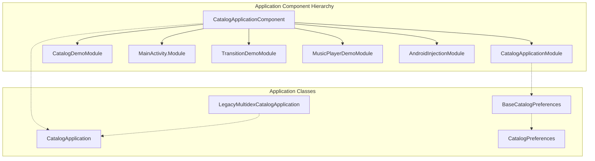
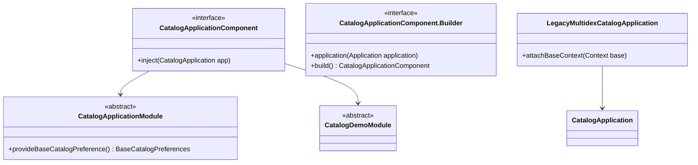
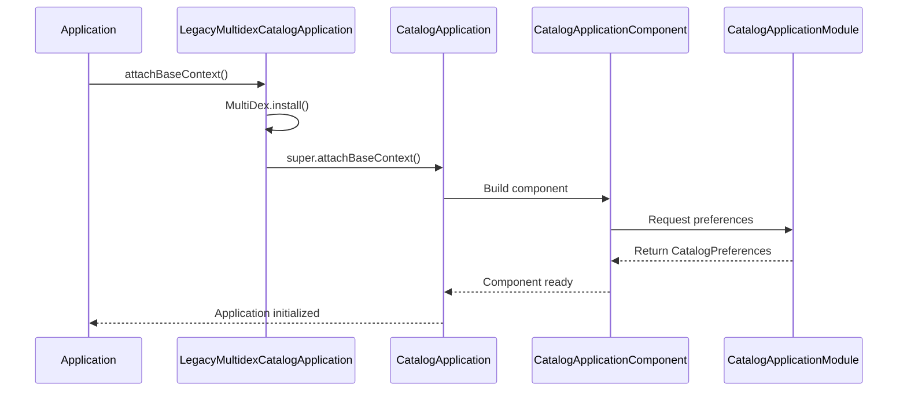
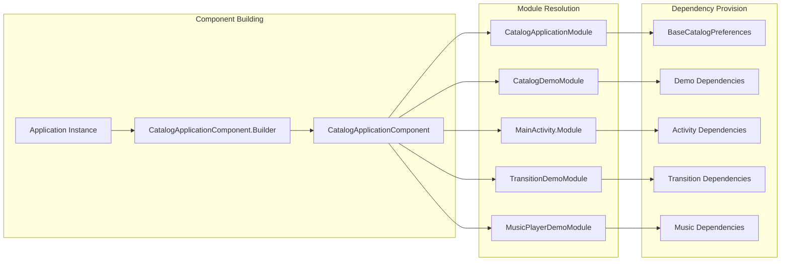

# Application Module Documentation

## Introduction

The Application module serves as the foundational layer of the Material Design Catalog application, providing dependency injection infrastructure, application-level configuration, and multi-dex support for development builds. This module establishes the core architectural patterns and dependency management that underpin the entire catalog application.

## Module Overview

The Application module is responsible for:
- **Dependency Injection Setup**: Configuring Dagger-based dependency injection across the application
- **Application Lifecycle Management**: Managing application-wide state and configuration
- **Multi-dex Support**: Providing legacy support for applications with multiple DEX files
- **Global Preferences**: Managing application-level preferences and settings
- **Component Integration**: Coordinating between various feature modules and demo components

## Core Architecture

### Dependency Injection Architecture

The Application module implements a comprehensive Dagger-based dependency injection system that provides:



### Component Structure



## Core Components

### CatalogApplicationComponent

The root Dagger component that provides application-wide dependencies and serves as the entry point for dependency injection.

**Key Features:**
- Singleton scope management across the application
- Integration with AndroidInjectionModule for Android-specific dependencies
- Coordination of multiple feature modules
- Application-level dependency provision

**Annotations:**
- `@Singleton`: Ensures single instance across application lifecycle
- `@ApplicationScope`: Custom scope for application-level dependencies
- `@Component`: Dagger component annotation with module dependencies

**Module Dependencies:**
- `AndroidInjectionModule`: Provides Android framework integration
- `CatalogApplicationModule`: Application-specific bindings
- `MainActivity.Module`: Main activity dependencies
- `CatalogDemoModule`: Demo-specific dependencies
- `TransitionDemoModule`: Transition animation dependencies
- `MusicPlayerDemoModule`: Music player demo dependencies

### CatalogApplicationModule

Provides application-level bindings and configuration, specifically managing global preferences.

**Responsibilities:**
- Provides `BaseCatalogPreferences` implementation via `CatalogPreferences`
- Manages application-wide preference settings
- Ensures preference accessibility across all application components

**Key Method:**
```java
@Provides
static BaseCatalogPreferences provideBaseCatalogPreference() {
    return new CatalogPreferences();
}
```

### CatalogDemoModule

A placeholder module for catalog demo dependencies, designed for extensibility.

**Purpose:**
- Provides a structured location for demo-specific dependencies
- Enables modular addition of demo features
- Maintains separation of concerns between core application and demo functionality

### LegacyMultidexCatalogApplication

Extends the base application to provide multi-dex support for development builds on older Android devices.

**Functionality:**
- Installs MultiDex support in `attachBaseContext()`
- Enables application to exceed 65K method limit
- Provides backward compatibility for older Android versions
- Inherits all functionality from `CatalogApplication`

## Data Flow Architecture

### Application Initialization Flow



### Dependency Injection Flow



## Integration with Other Modules

The Application module serves as the foundation for all other catalog modules:

### Direct Dependencies
- **[MainActivity](main.md)**: Primary activity module integrated via `MainActivity.Module`
- **[Transition](transition.md)**: Animation and transition support via `TransitionDemoModule`
- **[Music Player](musicplayer.md)**: Audio demo functionality via `MusicPlayerDemoModule`

### Indirect Dependencies
The Application module provides the dependency injection framework that enables:
- **[Adaptive](adaptive.md)**: Responsive layout demonstrations
- **[Theme Management](theme.md)**: Material theme integration
- **[All Feature Modules]**: Comprehensive component demonstrations

## Configuration and Usage

### Basic Setup
```java
// In AndroidManifest.xml
<application
    android:name=".application.legacymultidex.LegacyMultidexCatalogApplication"
    android:label="@string/app_name">
    <!-- Application configuration -->
</application>
```

### Component Access
```java
// Accessing preferences through the application module
BaseCatalogPreferences preferences = CatalogApplicationModule
    .provideBaseCatalogPreference();
```

### Extension Points
The modular design allows for easy extension:
- Add new feature modules by creating additional `@Module` classes
- Extend `CatalogApplicationModule` for additional application-level dependencies
- Create specialized application classes for different build variants

## Best Practices

### Dependency Management
- Use constructor injection where possible
- Leverage `@Singleton` for application-wide state
- Maintain clear module boundaries
- Document dependency relationships

### Module Organization
- Keep application modules focused and cohesive
- Separate concerns between configuration, preferences, and demo functionality
- Use abstract modules for flexibility
- Provide clear extension points

### Performance Considerations
- Minimize application startup time by lazy initialization
- Use static providers for lightweight dependencies
- Consider the impact of multi-dex on application size
- Profile dependency injection performance

## Error Handling and Debugging

### Common Issues
- **Multi-dex Configuration**: Ensure proper ProGuard rules for multi-dex builds
- **Dependency Resolution**: Verify all modules are properly declared in the component
- **Scope Conflicts**: Avoid mixing singleton and prototype scopes inappropriately

### Debugging Tools
- Use Dagger's generated code for dependency tracing
- Leverage Android Studio's dependency analysis tools
- Monitor application startup performance
- Validate preference persistence across application restarts

## Future Considerations

### Scalability
The Application module is designed to scale with:
- Additional feature modules
- Complex dependency graphs
- Multiple application variants
- Integration with external libraries

### Migration Path
The architecture supports migration to:
- Hilt for simplified dependency injection
- Kotlin for modern Android development
- Jetpack libraries for enhanced functionality
- Modular architecture for dynamic feature delivery

This documentation provides a comprehensive overview of the Application module's architecture, components, and integration patterns within the Material Design Catalog application.