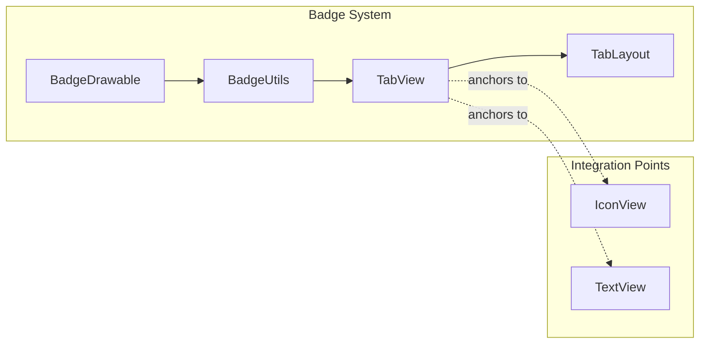

# Badge Module Documentation

## Overview

The Badge module provides notification indicators that can be attached to UI elements, particularly useful for displaying counts, alerts, or status indicators on tabs, navigation items, and other components.

## Core Components

### BadgeDrawable
The main drawable class responsible for rendering badge indicators with customizable appearance and behavior.

**Key Features:**
- Circular badge shape with customizable colors
- Text display for counts or labels
- Positioning and anchoring to parent views
- Animation support for showing/hiding
- Accessibility support

### BadgeUtils
Utility class providing helper methods for badge management and positioning.

**Key Features:**
- Badge attachment and detachment
- Position calculations
- Bounds management
- Integration with parent view layouts

## Integration with Tabs

The badge system integrates seamlessly with the Tabs module to provide notification indicators on individual tabs. This integration allows:

- Per-tab badge management
- Automatic positioning relative to tab content
- Dynamic badge updates
- Accessibility support for screen readers

## Usage

### Creating Badges
```java
BadgeDrawable badge = tab.getOrCreateBadge();
badge.setNumber(5);
badge.setVisible(true);
```

### Removing Badges
```java
tab.removeBadge();
```

## Architecture

