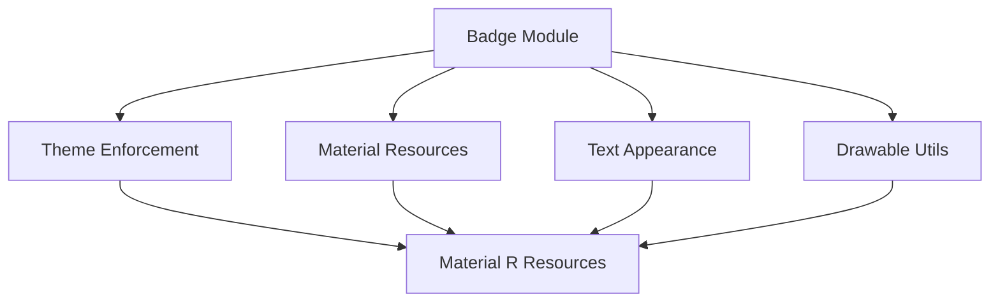
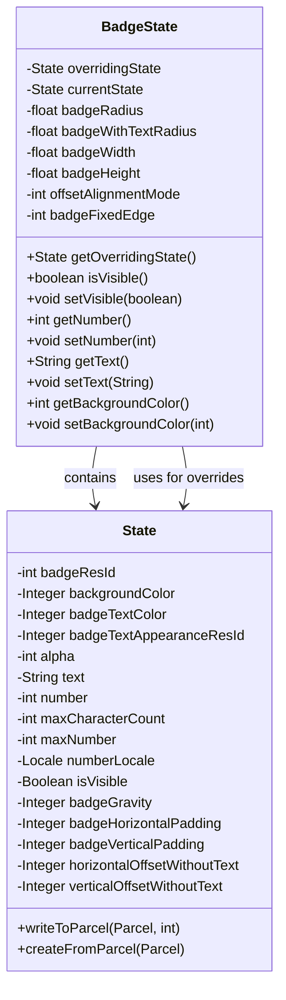
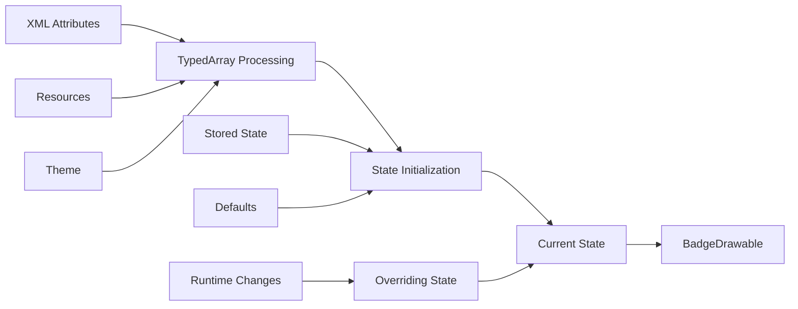
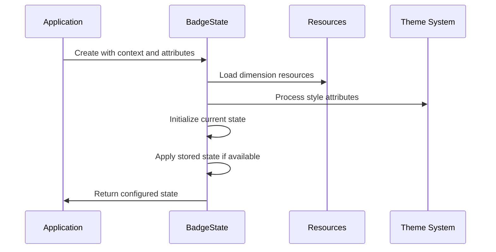
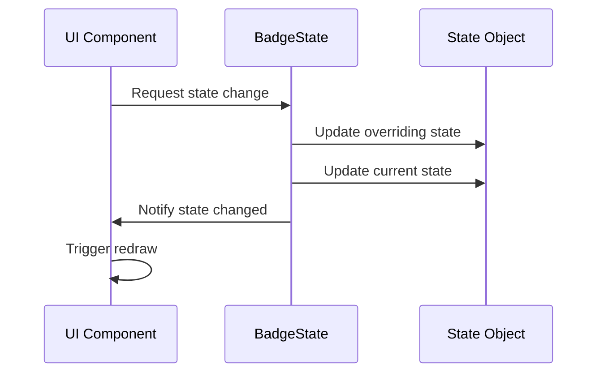

# Badge Module Documentation

## Overview

The Badge module provides a comprehensive system for displaying notification badges on UI elements in Android applications. It offers a flexible and customizable way to show numerical counts, text labels, or simple visual indicators to alert users about new content, updates, or important information.

## Purpose and Core Functionality

The badge system serves as a visual notification mechanism that can be attached to various UI components such as navigation items, buttons, tabs, and icons. The module provides:

- **Numerical Badges**: Display count information (e.g., unread messages, notifications)
- **Text Badges**: Show textual labels or status indicators
- **Shape Customization**: Flexible badge appearance with customizable shapes and colors
- **Accessibility Support**: Built-in content descriptions and accessibility features
- **State Management**: Comprehensive state preservation and restoration
- **Positioning Control**: Precise placement with offset and alignment options

## Architecture

### Core Components

The badge module is built around a state management pattern with the following key components:

#### BadgeState
The central state management class that handles all badge properties and configurations. It provides:
- State preservation and restoration via Parcelable implementation
- Default value management for all badge attributes
- Style attribute processing and resource loading
- Runtime state modifications

#### State Inner Class
A Parcelable implementation that encapsulates all badge properties including:
- Visual properties (colors, shapes, text appearance)
- Content properties (numbers, text, maximum limits)
- Layout properties (offsets, padding, gravity)
- Accessibility properties (content descriptions, locale settings)

### Module Dependencies


```mermaid
graph TD
    Badge[Badge Module] --> ThemeEnforcement[Theme Enforcement]
    Badge --> MaterialResources[Material Resources]
    Badge --> TextAppearance[Text Appearance]
    Badge --> DrawableUtils[Drawable Utils]
    
    ThemeEnforcement --> R[Material R Resources]
    MaterialResources --> R
    TextAppearance --> R
    DrawableUtils --> R
```

## Component Relationships

### State Management Architecture


```mermaid
classDiagram
    class BadgeState {
        -State overridingState
        -State currentState
        -float badgeRadius
        -float badgeWithTextRadius
        -float badgeWidth
        -float badgeHeight
        -int offsetAlignmentMode
        -int badgeFixedEdge
        +State getOverridingState()
        +boolean isVisible()
        +void setVisible(boolean)
        +int getNumber()
        +void setNumber(int)
        +String getText()
        +void setText(String)
        +int getBackgroundColor()
        +void setBackgroundColor(int)
    }
    
    class State {
        -int badgeResId
        -Integer backgroundColor
        -Integer badgeTextColor
        -Integer badgeTextAppearanceResId
        -int alpha
        -String text
        -int number
        -int maxCharacterCount
        -int maxNumber
        -Locale numberLocale
        -Boolean isVisible
        -Integer badgeGravity
        -Integer badgeHorizontalPadding
        -Integer badgeVerticalPadding
        -Integer horizontalOffsetWithoutText
        -Integer verticalOffsetWithoutText
        +writeToParcel(Parcel, int)
        +createFromParcel(Parcel)
    }
    
    BadgeState --> State : contains
    BadgeState --> State : uses for overrides
```

### Data Flow Architecture


```mermaid
flowchart LR
    A[XML Attributes] --> B[TypedArray Processing]
    B --> C[State Initialization]
    C --> D[Current State]
    
    E[Stored State] --> C
    F[Runtime Changes] --> G[Overriding State]
    G --> D
    
    D --> H[BadgeDrawable]
    
    I[Resources] --> B
    J[Theme] --> B
    K[Defaults] --> C
```

## Key Features and Capabilities

### 1. Flexible Content Types
- **Number Badges**: Support for numerical values with customizable maximum limits
- **Text Badges**: String content with automatic truncation based on character limits
- **Numberless Badges**: Simple visual indicators without content

### 2. Visual Customization
- **Shape Appearance**: Customizable shape resources for different badge types
- **Color Management**: Background and text color control with theme integration
- **Text Styling**: Full text appearance support including font, size, and color
- **Alpha Control**: Transparency settings for visual effects

### 3. Layout and Positioning
- **Gravity Control**: Nine-position gravity system (top-start, top, top-end, etc.)
- **Offset Management**: Separate offsets for badges with and without text
- **Padding Control**: Horizontal and vertical padding customization
- **Edge Alignment**: Fixed edge positioning for consistent layout

### 4. Accessibility Features
- **Content Descriptions**: Automatic and custom accessibility descriptions
- **Quantity Strings**: Pluralization support for screen readers
- **Locale Support**: Number formatting based on device locale
- **Text Descriptions**: Special handling for text-based badges

### 5. State Persistence
- **Parcelable Implementation**: Complete state preservation across configuration changes
- **Resource Integration**: XML attribute processing with style support
- **Default Management**: Comprehensive default value system
- **Override Mechanism**: Runtime state modification capabilities

## Integration with Material Design System

The badge module integrates seamlessly with the broader Material Design ecosystem:

### Theme Integration
- Material theme attribute processing
- Color resource loading with state list support
- Text appearance integration with Material typography
- Shape appearance support for Material shapes

### Resource Management
- Dimension resource utilization for consistent sizing
- Style resource inheritance and overlay support
- Color resource processing with theme awareness
- String resource integration for accessibility

## Usage Patterns

### Basic Badge Configuration
```xml
<badge
    app:badgeNumber="5"
    app:badgeBackgroundColor="@color/error"
    app:badgeTextColor="@color/on_error"
    app:badgeGravity="top_end" />
```

### Advanced Customization
```xml
<badge
    app:badgeText="NEW"
    app:badgeMaxCharacterCount="3"
    app:badgeShapeAppearance="@style/CustomBadgeShape"
    app:badgeTextAppearance="@style/CustomBadgeText"
    app:horizontalOffset="4dp"
    app:verticalOffset="4dp" />
```

## Process Flow

### Badge State Initialization


```mermaid
sequenceDiagram
    participant App as Application
    participant BadgeState as BadgeState
    participant Resources as Resources
    participant Theme as Theme System
    
    App->>BadgeState: Create with context and attributes
    BadgeState->>Resources: Load dimension resources
    BadgeState->>Theme: Process style attributes
    BadgeState->>BadgeState: Initialize current state
    BadgeState->>BadgeState: Apply stored state if available
    BadgeState->>App: Return configured state
```

### Runtime State Modification


```mermaid
sequenceDiagram
    participant UI as UI Component
    participant BadgeState as BadgeState
    participant State as State Object
    
    UI->>BadgeState: Request state change
    BadgeState->>State: Update overriding state
    BadgeState->>State: Update current state
    BadgeState->>UI: Notify state changed
    UI->>UI: Trigger redraw
```

## Related Modules

The badge module works in conjunction with several other Material Design modules:

- **[Bottom Navigation](bottom-navigation.md)**: Badges on navigation items
- **[Tabs](tabs.md)**: Notification badges on tab indicators
- **[App Bar](appbar.md)**: Badges on toolbar items
- **[Shape](shape.md)**: Custom badge shape definitions
- **[Theme](theme.md)**: Material theme integration

## Best Practices

### Performance Considerations
- Use appropriate maximum character counts to prevent layout issues
- Consider badge visibility impact on overall UI performance
- Leverage state persistence for configuration changes

### Accessibility Guidelines
- Provide meaningful content descriptions
- Use appropriate quantity strings for numerical badges
- Consider color contrast for badge visibility
- Test with screen readers and accessibility services

### Design Consistency
- Follow Material Design badge guidelines
- Maintain consistent positioning across similar components
- Use theme colors for brand consistency
- Consider badge overlap with other UI elements

## Technical Implementation Details

### State Management Strategy
The badge module employs a dual-state system with current and overriding states to handle both initial configuration and runtime modifications effectively.

### Resource Processing
Comprehensive attribute processing supports XML configuration, style inheritance, and programmatic modification while maintaining backward compatibility.

### Parcelable Implementation
Complete state serialization ensures proper restoration across configuration changes, process death, and navigation transitions.

This documentation provides a comprehensive overview of the badge module's architecture, capabilities, and integration patterns within the Material Design system.