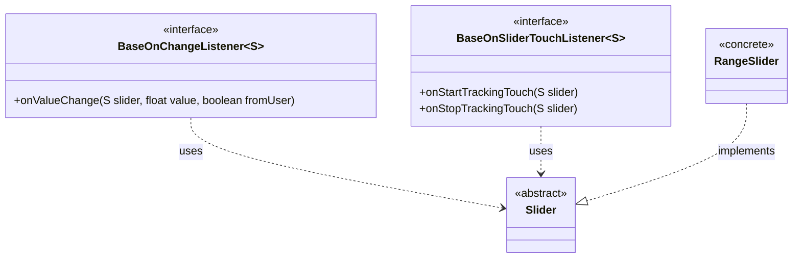
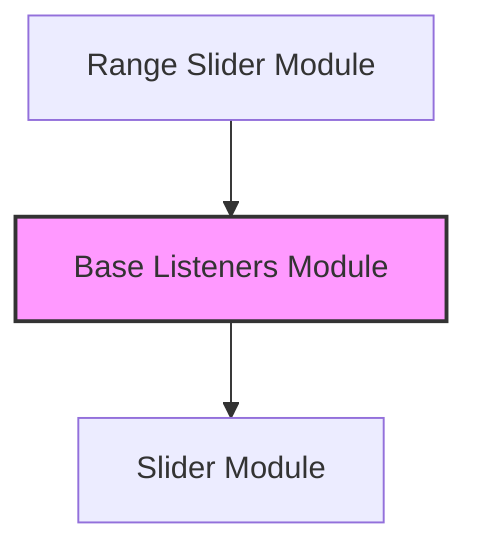
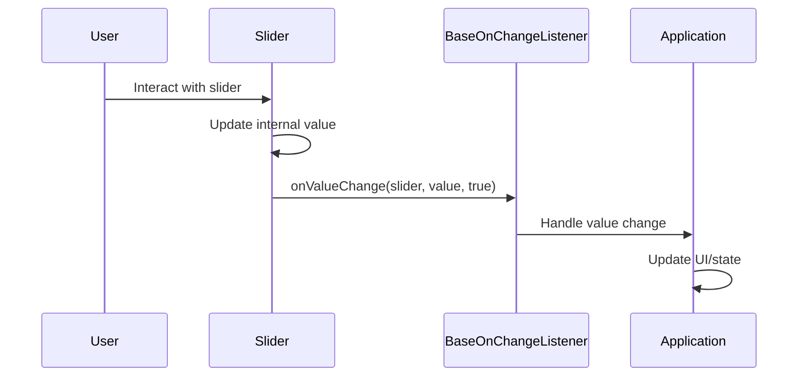
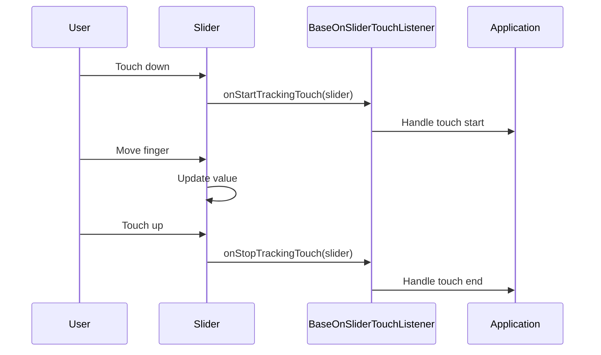
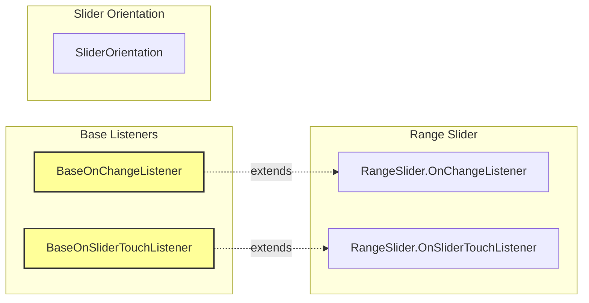

# Base Listeners Module

The base-listeners module provides foundational listener interfaces for Material Design slider components. These interfaces define the contract for handling user interactions with sliders, including value changes and touch events.

## Overview

The base-listeners module contains two core interfaces that serve as the foundation for slider event handling in the Material Design Components library:

- **BaseOnChangeListener**: Handles value change events when slider values are modified
- **BaseOnSliderTouchListener**: Manages touch interaction events (start/stop tracking)

These interfaces are designed as generic contracts that can be implemented by various slider types, providing a consistent API for handling user interactions across different slider implementations.

## Architecture

### Component Structure



### Module Dependencies



## Core Components

### BaseOnChangeListener

The `BaseOnChangeListener` interface defines the contract for handling value change events in slider components.

**Key Features:**
- Generic interface supporting any slider type
- Provides access to the slider instance, new value, and user interaction flag
- Restricted to library group usage (`@RestrictTo(Scope.LIBRARY_GROUP)`)

**Method:**
- `onValueChange(S slider, float value, boolean fromUser)`: Called when the slider's value changes
  - `slider`: The slider instance that triggered the event
  - `value`: The new value of the slider
  - `fromUser`: Indicates whether the change was initiated by user interaction

### BaseOnSliderTouchListener

The `BaseOnSliderTouchListener` interface manages touch interaction events for slider components.

**Key Features:**
- Handles the start and end of touch tracking sessions
- Generic design allows implementation across different slider types
- Library-restricted interface for internal use

**Methods:**
- `onStartTrackingTouch(S slider)`: Called when the user starts interacting with the slider
- `onStopTrackingTouch(S slider)`: Called when the user stops interacting with the slider

## Data Flow

### Value Change Event Flow



### Touch Event Flow



## Integration with Slider System

The base-listeners module serves as the foundation for the complete slider event handling system:



## Usage Patterns

### Implementation Example

```java
// Implementing a custom slider listener
public class CustomSliderListener implements BaseOnChangeListener<Slider> {
    @Override
    public void onValueChange(Slider slider, float value, boolean fromUser) {
        if (fromUser) {
            // Handle user-initiated changes
            updateDisplay(value);
        }
    }
}
```

### Event Handling Strategy

The base listeners provide a flexible foundation for implementing various event handling strategies:

1. **Immediate Response**: Update UI elements as the slider value changes
2. **Deferred Processing**: Collect changes and process them in batches
3. **Validation**: Validate values before applying changes
4. **Animation**: Trigger animations based on slider interactions

## Design Principles

### Generic Design

The interfaces use generic type parameters (`<S>`) to ensure they can work with any slider implementation, promoting code reuse and type safety.

### Library Restriction

Both interfaces are annotated with `@RestrictTo(Scope.LIBRARY_GROUP)`, indicating they are intended for internal library use and should not be used directly by application developers.

### Consistency

The interfaces provide consistent naming and parameter patterns, making them easy to implement and understand across different slider types.

## Related Modules

- [range-slider](range-slider.md): Extends base listeners for range-specific functionality
- [orientation](orientation.md): Provides orientation support for slider components
- [slider](slider.md): Main slider module that utilizes these base listeners

## Best Practices

### For Library Developers

1. **Extend, Don't Modify**: Extend these base interfaces rather than modifying them directly
2. **Maintain Consistency**: Follow the established parameter patterns when creating new listener interfaces
3. **Document Behavior**: Clearly document when and how listener methods are called

### For Application Developers

1. **Use Public APIs**: Use the public listener interfaces provided by specific slider implementations rather than these base interfaces
2. **Handle Events Efficiently**: Implement lightweight event handlers to maintain smooth UI performance
3. **Consider User Experience**: Provide appropriate feedback for both programmatic and user-initiated changes

## Future Considerations

The base-listeners module provides a solid foundation for slider event handling. Future enhancements might include:

- Additional event types for specialized slider interactions
- Support for multi-touch scenarios
- Enhanced metadata about the change context
- Integration with accessibility services