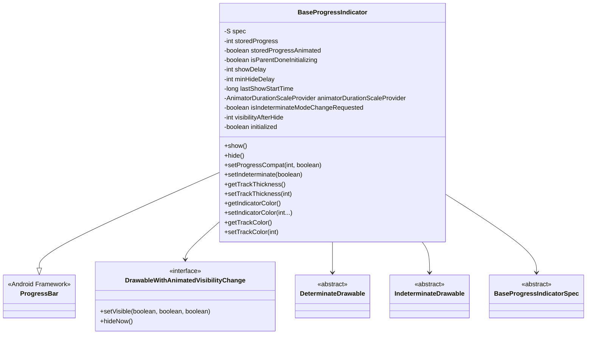
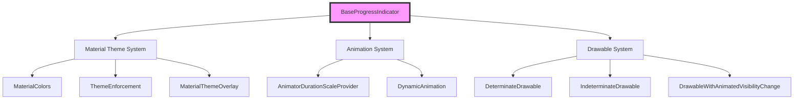
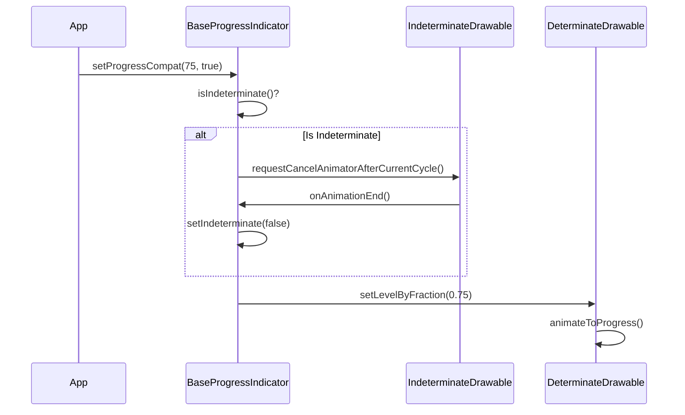
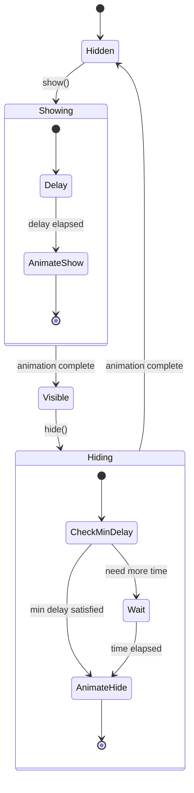
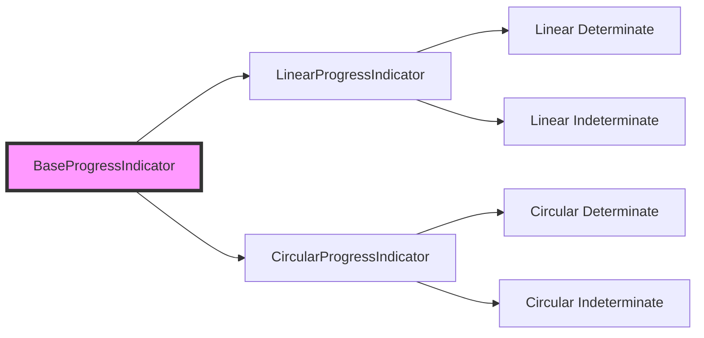

# Base Progress Indicator Module

## Introduction

The base-progress-indicator module provides the foundational functionality for Material Design progress indicators in the Material Components library. It serves as an abstract base class that encapsulates common behavior, animation logic, and visual customization options shared across different types of progress indicators.

## Overview

The `BaseProgressIndicator` class is the core component of this module, extending Android's standard `ProgressBar` to provide Material Design-compliant progress indicators with enhanced animation capabilities, customizable visual properties, and sophisticated visibility management.

## Architecture

### Core Component Structure



### Module Dependencies



## Core Functionality

### 1. Progress Management

The module provides sophisticated progress management capabilities:

- **Dual Mode Support**: Seamlessly switches between determinate and indeterminate progress modes
- **Progress Animation**: Smooth animated transitions when updating progress values
- **Mode Switching**: Intelligent handling of mode transitions with proper animation completion



### 2. Visibility Management

Advanced visibility control with animation support:

- **Delayed Show/Hide**: Configurable delays for showing and hiding animations
- **Animation Behaviors**: Multiple animation directions (inward, outward, escape, none)
- **Smart Visibility**: Tracks component visibility state across window attachments

### 3. Visual Customization

Comprehensive theming and styling options:

- **Track Properties**: Thickness, color, corner radius
- **Indicator Properties**: Colors, gap size, wave properties
- **Animation Properties**: Show/hide behaviors, duration scaling

## Key Features

### Animation System



### Indeterminate Mode Handling

The module provides sophisticated indeterminate mode management:

- **Seamless Transitions**: Smooth switching between indeterminate and determinate modes
- **Progress Preservation**: Stores and applies progress values during mode transitions
- **Animation Coordination**: Ensures proper animation lifecycle management

### Drawing and Layout

Custom drawing pipeline for optimal performance:

- **Canvas Optimization**: Efficient canvas transformations and clipping
- **Custom Measurement**: Supports unspecified drawable sizes
- **Path Invalidation**: Smart invalidation of cached drawing paths

## Component Relationships

### Integration with Progress Indicator Module



### Dependency on Loading Indicator

The base-progress-indicator module works in conjunction with the [loading-indicator](loading-indicator.md) module to provide comprehensive progress indication capabilities across the Material Components library.

## Usage Patterns

### Basic Implementation

```java
// Create a concrete implementation
LinearProgressIndicator progressIndicator = findViewById(R.id.progress_indicator);

// Configure appearance
progressIndicator.setTrackThickness(4);
progressIndicator.setIndicatorColor(Color.BLUE);
progressIndicator.setTrackColor(Color.GRAY);

// Control visibility with animation
progressIndicator.show();
progressIndicator.hide();

// Update progress with animation
progressIndicator.setProgressCompat(75, true);
```

### Advanced Configuration

```java
// Configure animation behaviors
progressIndicator.setShowAnimationBehavior(BaseProgressIndicator.SHOW_OUTWARD);
progressIndicator.setHideAnimationBehavior(BaseProgressIndicator.HIDE_INWARD);

// Set delays
progressIndicator.setShowDelay(500); // 500ms delay before showing
progressIndicator.setMinHideDelay(1000); // Minimum 1s visible time

// Wave properties (for wave-style indicators)
progressIndicator.setWaveAmplitude(8);
progressIndicator.setWavelengthDeterminate(16);
progressIndicator.setWaveSpeed(2);
```

## Technical Specifications

### Performance Considerations

- **Efficient Drawing**: Custom onDraw implementation avoids unnecessary ProgressBar overhead
- **Smart Invalidation**: Only invalidates when necessary, reducing redraw operations
- **Memory Management**: Proper cleanup of animations and callbacks

### Thread Safety

- **Synchronized Methods**: Critical sections are synchronized for thread safety
- **Main Thread Operations**: UI updates are properly scheduled on the main thread
- **Animation Coordination**: Proper handling of animation lifecycle across threads

### Accessibility

- **Standard ProgressBar**: Inherits all accessibility features from ProgressBar
- **Content Description**: Supports standard content description properties
- **Progress Announcements**: Leverages system progress announcement capabilities

## Integration Points

### Theme Integration

The module integrates with the Material theme system:

- **Theme Attributes**: Responds to theme-level color and dimension attributes
- **Style Inheritance**: Supports style inheritance from parent themes
- **Dynamic Colors**: Compatible with dynamic color systems

### Animation System Integration

- **Animator Duration Scale**: Respects system animator duration scale settings
- **Spring Animations**: Supports spring-based animations for natural motion
- **Transition Coordination**: Coordinates with other Material transition systems

## Error Handling

### Validation

- **Parameter Validation**: Validates input parameters for all public methods
- **State Validation**: Ensures proper state before performing operations
- **Drawable Validation**: Validates drawable types before assignment

### Exception Handling

- **IllegalArgumentException**: Thrown for invalid parameter values
- **IllegalStateException**: Thrown for invalid state transitions
- **Graceful Degradation**: Falls back to safe defaults when possible

## Testing Considerations

### Testability Features

- **VisibleForTesting**: Annotated methods for testing access
- **Mock Support**: Supports mock drawable and animation providers
- **State Inspection**: Provides methods to inspect internal state

### Performance Testing

- **Animation Performance**: Monitor animation frame rates and smoothness
- **Memory Usage**: Track memory allocation during animations
- **Layout Performance**: Measure layout calculation performance

## Future Considerations

### Extensibility

- **Abstract Design**: Designed for extension by concrete implementations
- **Spec Pattern**: Uses specification pattern for customizable behavior
- **Delegate Pattern**: Leverages drawing delegates for specialized rendering

### Compatibility

- **Backward Compatibility**: Maintains compatibility with existing ProgressBar usage
- **Framework Integration**: Designed to work seamlessly with Android framework
- **Material Evolution**: Structured to accommodate future Material Design updates