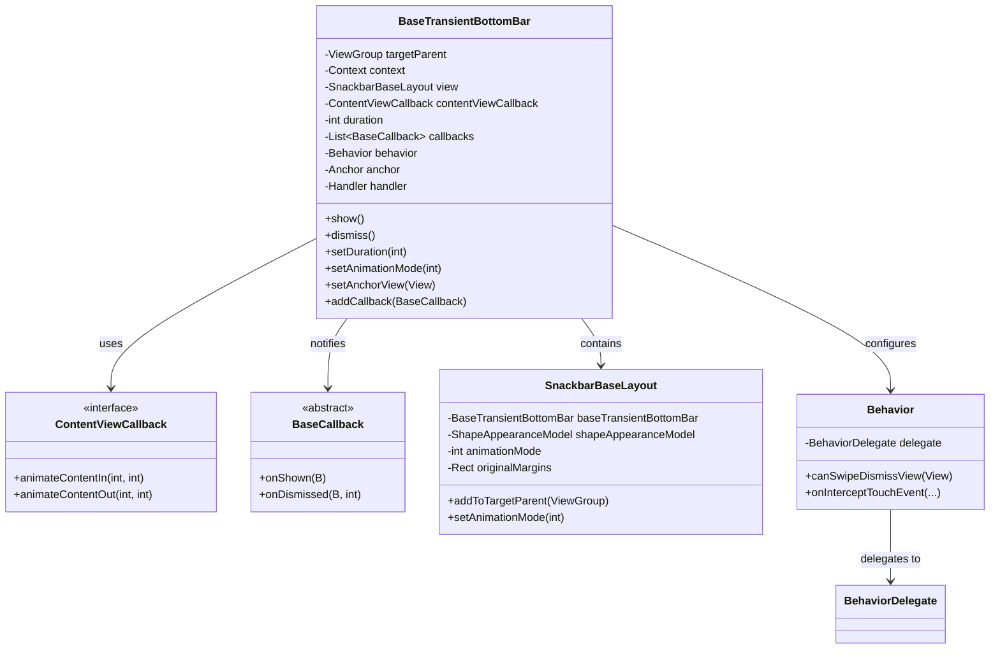
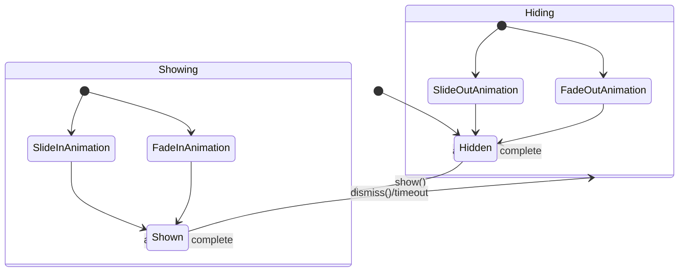
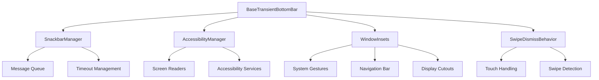
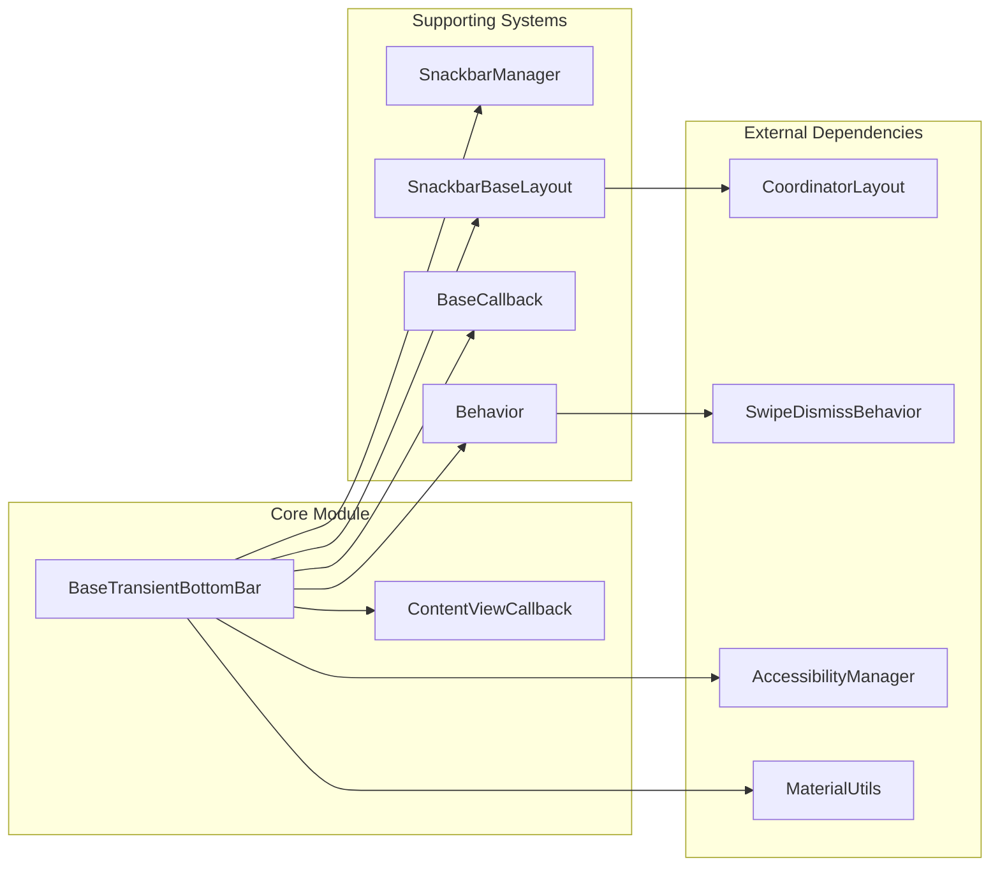
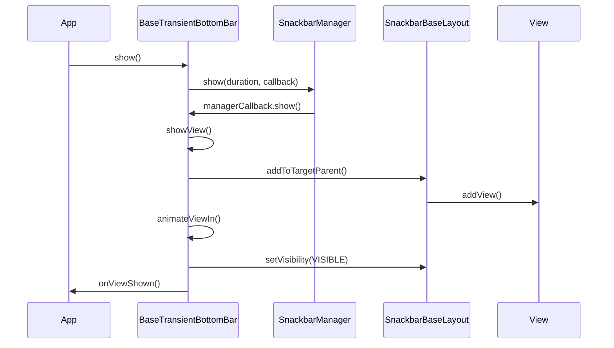
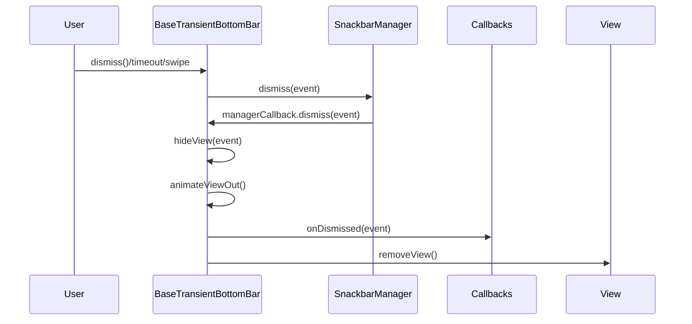

# Base Transient Bottom Bar Module

## Introduction

The `base-transient-bottom-bar` module provides the foundational framework for displaying lightweight transient notification bars along the bottom edge of the application window. This module serves as the abstract base class for Material Design snackbars and similar transient UI components, offering a robust architecture for managing display duration, animations, user interactions, and system integration.

## Core Architecture

### Primary Components



### Animation System



### System Integration Architecture



## Component Relationships

### Dependency Flow



## Key Features

### 1. Animation Management
- **Slide Animation**: Traditional bottom-up slide with content fade
- **Fade Animation**: Material Design 3 fade and scale animations
- **Configurable Duration**: Theme-based animation timing
- **Accessibility Aware**: Disables animations when accessibility services are active

### 2. Positioning System
- **Anchor View Support**: Position above specific UI elements
- **System Insets**: Automatic adjustment for navigation bars and display cutouts
- **Gesture Insets**: Android Q+ gesture area avoidance
- **Margin Management**: Dynamic margin calculation and updates

### 3. Interaction Handling
- **Swipe to Dismiss**: Integrated swipe dismiss behavior
- **Touch Handling**: Consumes touches to prevent background interaction
- **Timeout Management**: Automatic dismissal with pause/resume capability
- **Manual Control**: Programmatic show/dismiss with event tracking

### 4. Accessibility Integration
- **Screen Reader Support**: Proper accessibility announcements
- **Keyboard Navigation**: Dismiss action via accessibility services
- **Live Regions**: Appropriate content updates for assistive technologies
- **Focus Management**: Proper focus handling during show/hide transitions

## Data Flow

### Show Process Flow



### Dismiss Process Flow



## Integration Points

### CoordinatorLayout Integration
- **Behavior System**: Custom SwipeDismissBehavior implementation
- **Layout Parameters**: CoordinatorLayout.LayoutParams support
- **Inset Edges**: Proper inset edge configuration for dodging

### Theme Integration
- **Material Theming**: Automatic theme overlay application
- **Shape Appearance**: Support for Material shape theming
- **Color System**: Material Colors integration for backgrounds
- **Motion System**: Theme-based animation interpolators and durations

### Window Management
- **Insets Handling**: System window inset processing
- **Gesture Areas**: Android Q+ mandatory gesture inset handling
- **Multi-window**: Proper behavior in multi-window environments

## Configuration Options

### Animation Modes
- `ANIMATION_MODE_SLIDE`: Traditional slide animation (default)
- `ANIMATION_MODE_FADE`: Material Design 3 fade and scale animation

### Duration Constants
- `LENGTH_SHORT`: Short display duration
- `LENGTH_LONG`: Long display duration  
- `LENGTH_INDEFINITE`: Display until manually dismissed
- Custom duration in milliseconds

### Dismiss Events
- `DISMISS_EVENT_SWIPE`: User swiped the bar away
- `DISMISS_EVENT_ACTION`: User clicked action button
- `DISMISS_EVENT_TIMEOUT`: Duration expired
- `DISMISS_EVENT_MANUAL`: Programmatically dismissed
- `DISMISS_EVENT_CONSECUTIVE`: Replaced by new bar

## Related Modules

- [snackbar-implementation.md](snackbar-implementation.md) - Concrete Snackbar implementation
- [content-layout-system.md](content-layout-system.md) - Content layout management
- [behavior-system.md](behavior-system.md) - Swipe dismiss behavior framework
- [material-motion.md](material-motion.md) - Animation and motion system
- [accessibility-framework.md](accessibility-framework.md) - Accessibility integration

## Usage Patterns

### Basic Implementation
```java
// Extend BaseTransientBottomBar for custom implementation
public class CustomBottomBar extends BaseTransientBottomBar<CustomBottomBar> {
    
    protected CustomBottomBar(ViewGroup parent, View content, ContentViewCallback callback) {
        super(parent, content, callback);
    }
    
    // Custom configuration and behavior
}
```

### Content View Callback Implementation
```java
public class CustomContentCallback implements ContentViewCallback {
    @Override
    public void animateContentIn(int delay, int duration) {
        // Custom content entry animation
    }
    
    @Override
    public void animateContentOut(int delay, int duration) {
        // Custom content exit animation
    }
}
```

This module provides the essential foundation for creating consistent, accessible, and well-behaved transient notification components that integrate seamlessly with the Material Design system and Android platform features.